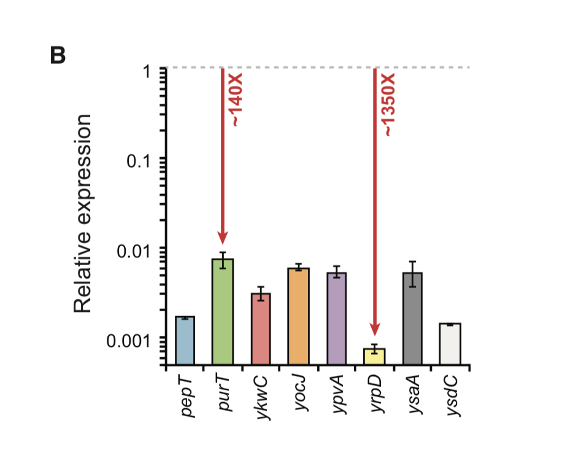
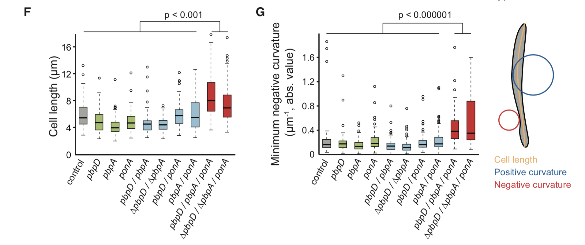

```{r setup, include=FALSE}
knitr::opts_chunk$set(echo = TRUE)
```

# Assignment

In class we learned that bar graphs and boxplots are often used to represent the same kinds of data. In the paper ["A Comprehensive, CRISPR-based Functional Analysis of Essential Genes in Bacteria (Peters et al., 2016)"](https://www.ncbi.nlm.nih.gov/pmc/articles/PMC4894308/), (insert short description)
the authors use both a bar graph and boxplots in figure 7:

{#id .class width=50% height=50%}
{#id .class width=75% height=75%}

1. In figure 7b, what question were the researchers trying to answer?  
    + Why did the authors choose a bar graph to represent these data? What was the sample size of these data?  

2. In figures 7f and g, what question were the researchers trying to answer?  
    + Why did the authors choose a boxplot to represent these data? What was the sample size of these data?  
    + Would a violin plot be appropriate here?  

3. Do you agree with the author's choices to use a bar graph in 7b and boxplots in 7f,g? Why or why not? 


Bonus questions:   

1. What kind of scale did the authors use for the y-axis in figure 7b? Why do you think they chose that scale?   

2. In figures 7f and g, what kind of statistical test was performed and why?     
    + What kind of statistical test would be most appropriate her? Would multiple hypothesis be required? Why or why not?

