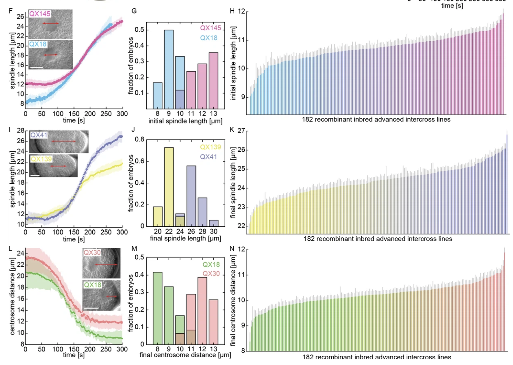

```{r setup, include=FALSE}
knitr::opts_chunk$set(echo = TRUE)
```

# Assignment

In the paper ["Stoichiometric interactions explain spindle dynamics and scaling across 100 million years of nematode evolution (Reza Farhadifar et al., 2020)"](https://elifesciences.org/articles/55877#content), (insert short description)
the authors use multiple plots in figure 1 f-n:

{#id .class width=75% height=75%}


1. In panels 1f-n, what questions were the researchers trying to answer?      

2. For panels f,i,l: 
    + What data is being plotted?   
    + What is the darker line? What is the shaded area around it?  

3. For panels g,j,m: 
    + What data is being plotted?   
    + How are the different colors being used here?
    + There are many different kinds of bar graphs. Is this the optimal bar graph to display these data? Which would you use?  
    
4. For panels h,k,n: 
    + What data is being plotted?   
    + How are the different colors being used here?
    + What are the gray shaded areas?

5. Are the data in each row of panels related? How do they relate to each other?  
    
6. Do you think these plots contained a good use of color? Is the palette colorblind friendly?
    
    
    

