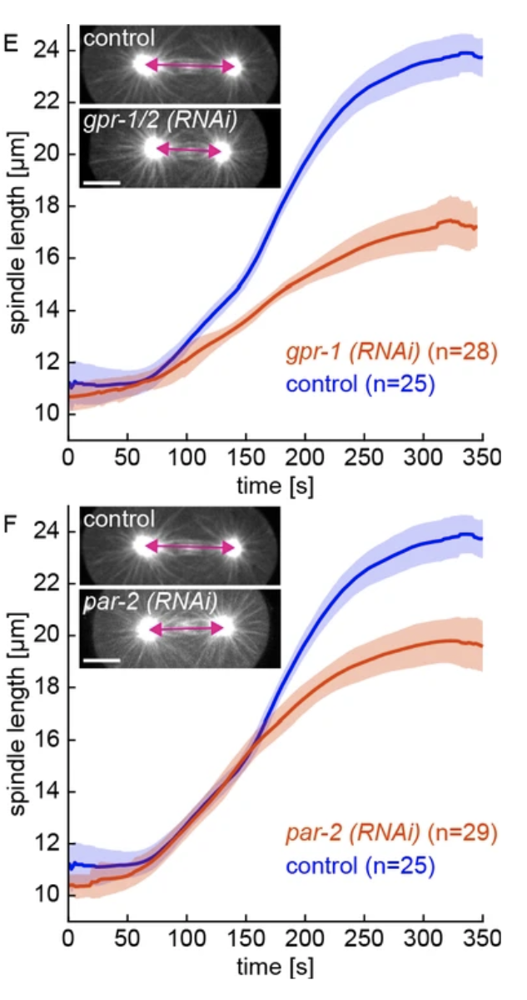

```{r setup, include=FALSE}
knitr::opts_chunk$set(echo = TRUE)
```

# Assignment

The paper ["Stoichiometric interactions explain spindle dynamics and scaling across 100 million years of nematode evolution (Farhadifar et al., 2020)"](https://elifesciences.org/articles/55877#content), explores spindle dynamics in *C. elegans* using a combination of imaging methods and QTL mapping of intercross lines.
The authors use line graphs in figure 3 e,f:

{#id .class width=50% height=50%}

In the paper ["Metabolic competition in the tumor microenvironment is a driver of cancer progression (Chang et al., 2015)"](https://www.ncbi.nlm.nih.gov/pmc/articles/PMC4864363/) the authors use mouse models to demonstrate that in cancers, T cells are metabolically restricted by tumor glucose consumption, ulimately allowing tumor progression. 
the authors use line graphs in figure 4b:

{#id .class width=75% height=75%}


1. What questions were the researchers trying to answer in Farhadifar, et al, figure 3?      
    + What data is being plotted?   
    + What do the shaded areas represent?

2. What questions were the researchers trying to answer in Chang, et al, figure 4?      
    + What data is being plotted?   
    + What do the error bars represent?  
    
3. What is the difference between the standard error (SEM) of the mean and standard deviation?  

4. Which graphical representation do you prefer? (Shaded area or error bars)

5. How would you calculate the SEM of standard deviation in R?

6. How would you plot a similar graph in R?
    
    

    