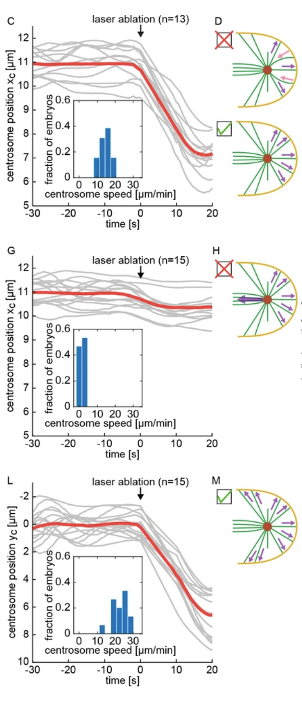

```{r setup, include=FALSE}
knitr::opts_chunk$set(echo = TRUE)
```

# Assignment

The paper ["Stoichiometric interactions explain spindle dynamics and scaling across 100 million years of nematode evolution (Farhadifar et al., 2020)"](https://elifesciences.org/articles/55877#content), explores spindle dynamics in *C. elegans* using a combination of imaging methods and QTL mapping of intercross lines.
The authors use multiple plots in figure 4 c,g,l:

{#id .class width=50% height=50%}


1. In panel 4c, what question were the researchers trying to answer?      
    + What kind of data is being plotted in the larger plot in panel 4c?    
    + Why did the authors choose a line graph to represent these data?    
    + What was the sample size of this dataset?    

2. In this panel, a smaller plot is nested in the larger plot.   
    + What kind of data is being plotted in the smaller plot in panel 4c?   
    + Why did the authors choose a bar graph to represent these data?    
    + What was the sample size of this dataset?    

3. Are the two plots in this panel related? Do they use the same underlying dataset?  
    + If they are related, how would you calculate centrosome speed from the results plotted in the larger line plot?  
    
4. In terms of ease of understanding the data, is nesting these plots the best option?  
    + What are the advantage of nesting these plots? what are the disadvantages?
    + If you were assembling this panel, how would you choose to present this data?
    
    
    

