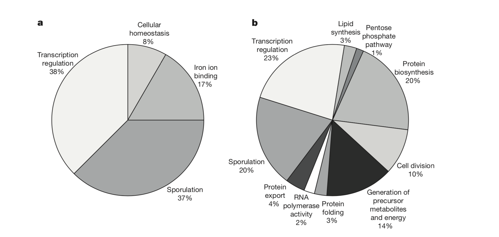
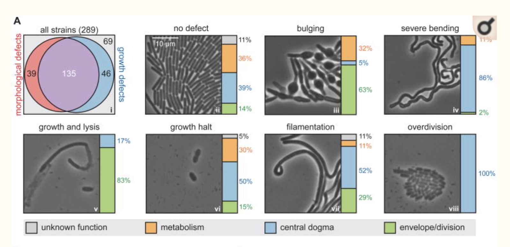

```{r setup, include=FALSE}
knitr::opts_chunk$set(echo = TRUE)
```

# Assignment

In the paper ["Accelerated gene evolution through replication-transcription conflicts (Reza Paul et al., 2013)"](https://pubmed.ncbi.nlm.nih.gov/23538833/), (insert short description)
the authors use pie charts in figure 4:

{#id .class width=75% height=75%}

In the paper In the paper ["A Comprehensive, CRISPR-based Functional Analysis of Essential Genes in Bacteria (Peters et al., 2016)"](https://www.ncbi.nlm.nih.gov/pmc/articles/PMC4894308/) (insert short description)
the authors use a stacked bar graph:

{#id .class width=75% height=75%}


1. What questions were the researchers trying to answer in Paul, et al, figure 4?      
    + What data is being plotted?   
    + Are pie charts considered the best way to depict this kind of data?

2. What questions were the researchers trying to answer in Peters, et al, figure 6?      
    + What data is being plotted?   

3. Which graphical representation do you think is easier to understand?

4. How would you plot a similar graph in R?
    