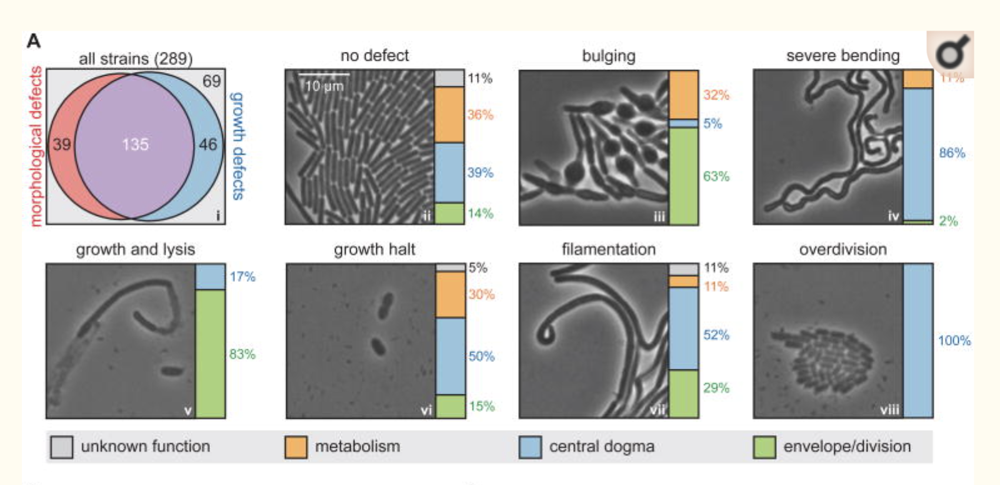

```{r setup, include=FALSE}
knitr::opts_chunk$set(echo = TRUE)
knitr::opts_chunk$set(warning = FALSE, message = FALSE) 
```

# Assignment

The paper ["Accelerated gene evolution through replication-transcription conflicts (Reza Paul et al., 2013)"](https://pubmed.ncbi.nlm.nih.gov/23538833/), looks at mutation rates in leading and lagging strand genes in *Bacillus subtilis* to determine replication/transcription conflict-mediated mutagenesis. The authors use pie charts in figure 4:

{#id .class width=75% height=75%}

The paper In the paper ["A Comprehensive, CRISPR-based Functional Analysis of Essential Genes in Bacteria (Peters et al., 2016)"](https://www.ncbi.nlm.nih.gov/pmc/articles/PMC4894308/) investigates essential gene function in *Bacillus subtilis* using CRISPR interference to create knockdowns of essential genes and catalogue their phenotypes.They also utilized high-throughput microscopy to look at cell morphology in mild and complete knockdowns. The authors use a stacked bar graph:

{#id .class width=75% height=75%}


1. What questions were the researchers trying to answer in Paul, et al, figure 4?      
    + What data is being plotted?   
    + Are pie charts considered the best way to depict this kind of data?

2. What questions were the researchers trying to answer in Peters, et al, figure 6?      
    + What data is being plotted?   

3. Which graphical representation do you think is easier to understand?

4. How would you plot a similar graph in R? Using the dataset "proportional_data.csv", practice plotting a stacked bar graph.

```{r}

library(ggplot2)

proportional_data <- as.data.frame(read.csv("proportional_data.csv"))

proportional_plot<-ggplot(proportional_data, aes(x =generation, 
                          y = proportion, fill=phenotype)) + 
  geom_bar( stat="identity") +
  scale_fill_brewer() +
  xlab("Generation")+
  ylab("Proportion of Phenotypes Observed")+
  theme(panel.background=element_blank(), 
        strip.background = element_blank(),
        panel.border=element_rect(colour="black",fill=NA),
        legend.title = element_blank())

proportional_plot

```