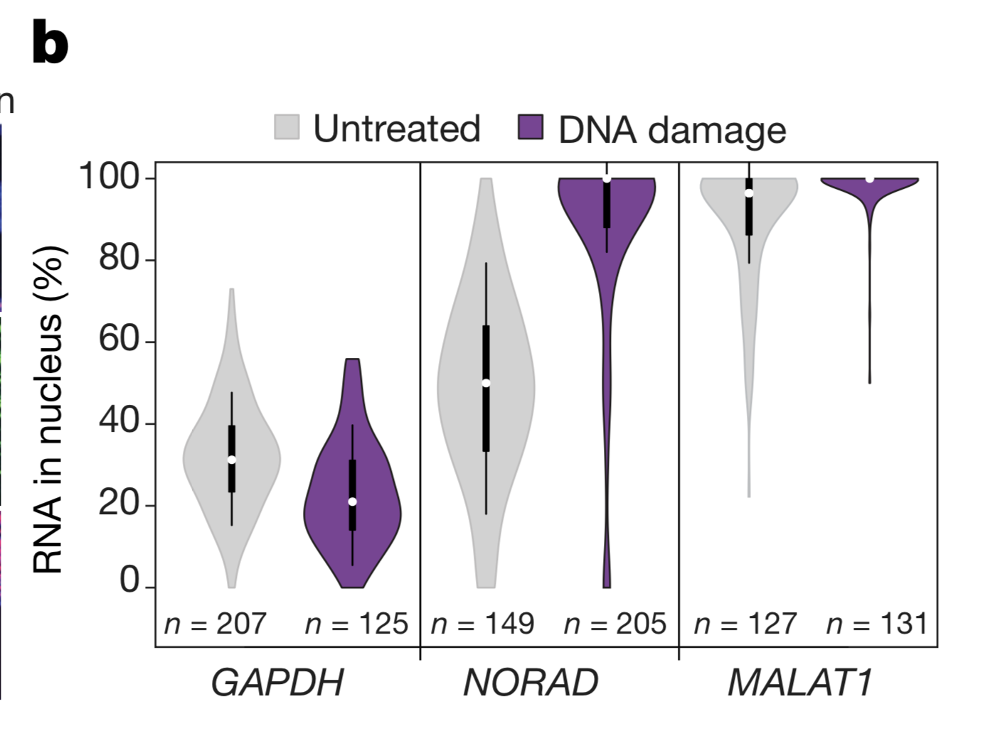

```{r setup, include=FALSE}
knitr::opts_chunk$set(echo = TRUE)
```

# Assignment

In the paper ["The NORAD lncRNA assembles a topoisomerase complex critical for genome stability (Munschauer et al., 2018)"](https://www.nature.com/articles/s41586-018-0453-z), (insert short description)
the authors use a violin plot in figure 2b:

{#id .class width=50% height=50%}


1. In figure 2b, what question were the researchers trying to answer?    
    + What kind of data is being plotted in figure 2b?  
    + Why did the authors choose a violin plot to represent these data?  
    + What was the sample size of this dataset?  

2. In this panel, boxplots are inset in the violin plots. Why did the authors choose to supplement the violin plots with boxplots?    
    + What do the various features of these boxplots represent? (ie. box, whiskers, circle)   

(3. The authors state that this plot is representative of four independent experiments. What kind of statistical tests would be appropriate to determine if all four replicates are usable? Are such tests required?) 

