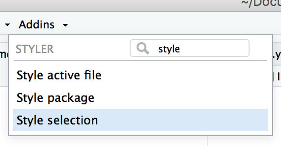

# Best Coding Practices
{: .no_toc }

## Table of contents
{: .no_toc .text-delta }

- TOC
{:toc}

---

# Coding Style
<!-- Note: also put something similar in the R Resources index page -->

Establishing good programming habits is really important. We will be encouraging you to adhere to best coding practices throughout the course.

**Trust us -- if you open a script you wrote 6 months ago, you won't remember anything about what you were thinking when you wrote it!** A script with no comments and poor formatting will be nearly impossible to decipher later and thus will be of little use to anyone.

## Basic Principles

**Clarity** is key to good programming style. The following are important features of clear and reproducible code:

+ A clear articulation of the overall goal of the project - What is your program about? What is it for?
+ Give your data structures human-readable names - This makes your code much more understandable
+ Separate different sections of your code with empty lines - This provides visual cues about organization and flow
+ **COMMENT EVERYTHING!** - Start each section of your code with a header comment describing what task is being performed

## Data Files

It is a good idea to adhere to the following conventions for storing your data:

+ Use descriptive file names
+ Everything should be a **TEXT FILE**
+ Use a simple data format like `.csv` - Proprietary formats can change and become obsolete / unreadable over time
+ Organize your files
  + especially if you have more than one input or output file, use sub-directories (e.g. `/data`, `/input`, `/output`)
+ Provide a metadata file if needed
  + this provides additional information about the contents of your data file (e.g. full names and descriptions of the contents, experimental design etc.)

## Reproducible Workflows with R Markdown

R scripts are great, but they are not ideal for generating reproducible workflows and reports.

**R Markdowns** provide a great framework to ensure that your data analysis can be reproduced by anyone (similar options are also available for other languages such as Python). You can even use them to write a framework for an entire manuscript, including code and figures.

This example is taken from the same source used for the movie clip shown above:

You will get plenty of practice with R Markdowns in this class!

# Style Guides

## R Programming

Hadley Wickham, the creator of the Tidyverse, has some strong opinions on coding style that we encourage you to adopt, as described in these guides:

+ [**Style Guide**](http://adv-r.had.co.nz/Style.html) - Hadley Wickam
  + a very short overview

+ [**The tidyverse Style Guide**](https://style.tidyverse.org/index.html) - Hadley Wickam
  + an updated and expanded guide of his earlier guide that addresses many more topics

## R Markdown

The following provides a succinct guide on best practices for both coding style and generating reports with R Markdown:

* [**Reproducibility and literate programming in R**](https://exeter-data-analytics.github.io/LitProg/index.html){: target="blank"} _TJ McKinley_

<!-- * [**R Programming for Research**](https://geanders.github.io/RProgrammingForResearch/){: target="blank"} -->

# RStudio Style Tools

There are two R packages available that can help you adhere to the style guide advocated above:

+ **styler** - interactively restyle selected text, files, or entire projects.
  + _This package includes an RStudio add-in, the easiest way to re-style existing code._

{: width="40%"}

+ **lintr** - performs automated checks to confirm that you conform to the style guide.

---

[Back to top](#top)
