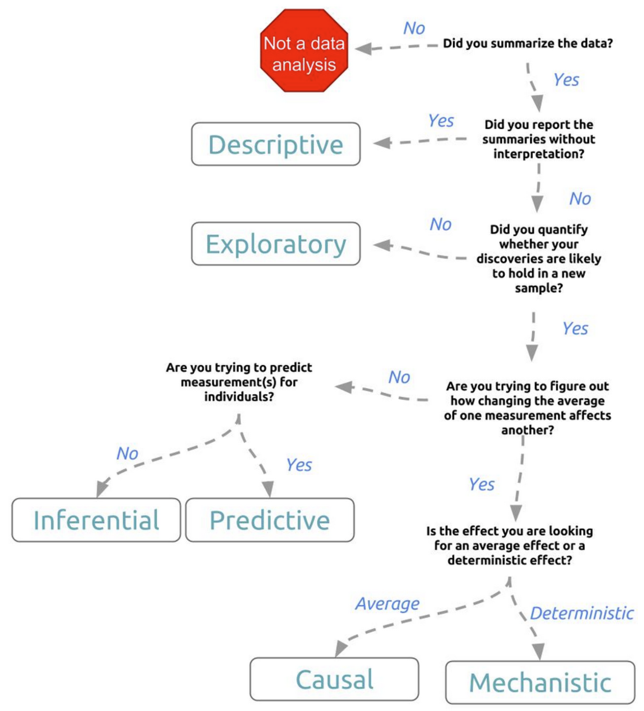

# Data Analytic Style
{: .no_toc }

## Table of contents
{: .no_toc .text-delta }

- TOC
{:toc}

---

Thinking about the process of data analysis at a conceptual level can really help you hone your skills! Here we distill some basic concepts from the following treatise:

**Elements of Data Analytic Style: A guide for people who want to analyze data** _Jeff Leek_ (2015-03-02) - [PDF](pdf_files/datastyle.pdf){: target="blank"} - [Leanpub (EPUB/Kindle/eBook)](https://leanpub.com/datastyle){: target="blank"}

This short (93-page) book outlines the key ideas, practices, and pitfalls of modern data analysis. It summarizes in a succinct way the most common difficulties encountered by practicing data analysts and includes a basic checklist that can be used as a rubric for evaluating data analyses. The book is modeled loosely in format and aim on the classic book about how to write well, _The Elements of Style_ by William Strunk.

**Highly recommended reading!**{: .text-green-200}

# What is the Question?

Before embarking on your data analysis quest, it is important to think about what you are trying to accomplish. A graphical flowchart provides a conceptual framework for thinking about your goals:

{width="70%"}

# Data Analysis Checklist

The book above provides a handy checklist that you should think about for every problem you set out to solve.

This process is summarized (in abbreviated form) below, but you should really peruse the book to get a better idea about what each of these steps entails, and the kinds of pitfalls that may await the unsuspecting data analyst.

## 1. Define the question

+ What is the context?
+ What is the question?
+ What is the experimental design?
+ Can the question be answered with the data at hand?
+ What is your metric for success?

## 2,3. Sanity checks and data tidying

+ Try to identify any errors or miscoding of data
+ Get your raw data into a good form for analysis, and make a code book (see Tidy Data)
+ Record all data transformations you made (units, functions, parameters)
+ Document everything!

## 4. Exploratory data analysis and sanity checks

+ Identify missing data codes, missing data, and outliers
+ Check units, ranges, and scales
+ Make univariate plots and check for correlations

## 5. Inference

+ Identify the population you are trying to describe
+ Identify the quantities of interest, and sources of uncertainty for estimates
+ Consider potential confounders
+ Identify and model possible sources of correlations (e.g. time/space)

## 6. Prediction

+ Identify in advance error measures you will use
+ Split data into training and validation sets
+ Create features using only the training data
+ Perform cross validation/resampling/bootstrapping and parameter estimation only on the training data
+ Fix all features, parameters, and models before applying to the validation data
+ Apply only one final model to the validation data and report the error rate

## 7. Causality

+ Identify whether your study was randomized
+ Identify potential reasons that causality may not be appropriate (e.g. confounders, missing data, non-ignorable dropout, unblinded experiments)
+ If the answer is no, make sure to avoid using language that would imply cause and effect

## 8. Written analyses

+ 1. Did you describe the question of interest?
2. Didyoudescribethedataset,experimentaldesign,and
question you are answering?
3. Did you specify the type of data analytic question you
are answering?
4. Did you specify in clear notation the exact model you
are fitting?
5. Did you explain on the scale of interest what each
estimate and measure of uncertainty means?
6. Did you report a measure of uncertainty for each esti-
mate on the scientific scale?

## 9. Figures

+ 1. Does each figure communicate an important piece of information or address a question of interest?
2. Do all your figures include plain language axis labels?
3. Is the font size large enough to read?
4. Does every figure have a detailed caption that explains
all axes, legends, and trends in the figure?

## 10. Presentations

+ 1. Did you lead with a brief, understandable to everyone statement of your problem?
2. Didyouexplainthedata,measurementtechnology,and experimental design before you explained your model?
3. Didyouexplainthefeaturesyouwillusetomodeldata before you explain the model?
4. Did you make sure all legends and axes were legible from the back of the room?

## 11. Reproducibility

+ Did you save the raw and processed versions of your data?
+ Did you avoid doing calculations manually?
+ Did you create a script that reproduces all your analyses?
+ Did you try to have someone else check your analysis to confirm they got the same answers?
+ Did you record all versions of the software you used to process the data?

## 12. R packages

+ If you created a package for your data analysis (e.g. think Seurat), did you follow best practices?

---

[Back to top](#top)
