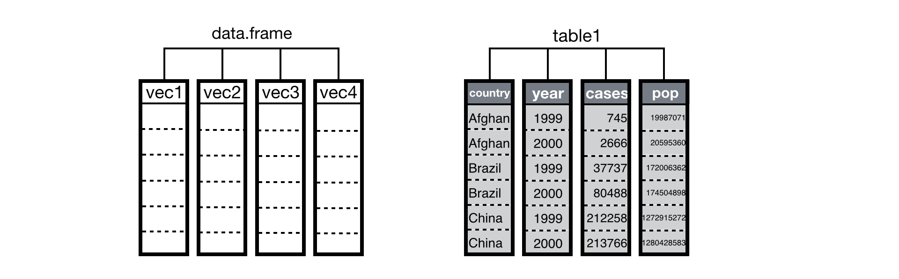

# Data Wrangling
{: .no_toc }

## Table of contents
{: .no_toc .text-delta }

- TOC
{:toc}

Under construction
{: .label .label-red }

Learning how to manipulate data is essential for data science. You need to know how to import data, inspect it, clean it, tidy it, and document it.

Data wrangling, or data munging - cleaning and reformatting data to get it ready for data analysis - is often one of the most time-consuming aspects of data analysis.

Below are some useful resources for thinking about and doing essential data handling tasks.

# What is Tidy Data?

Hadley Wickham introduced a structured framework for thinking about data organization in his 2014 paper [**Tidy Data**](https://vita.had.co.nz/papers/tidy-data.html), published in the _Journal of Statistical Software_.

The paper makes a clear distinction between "messy" vs. "tidy" data, and introduced a small set of tools to perform essential tasks for data cleaning and tidying. The following brief introduction distills / excerpts some of the basics of data tidying based on Wickham's framework, as described in these books:

+ [**R for Data Science**](https://garrettgman.github.io/) - by Hadley Wickham
+ [**Data Science with R**](https://garrettgman.github.io/) - by Garrett Grolemund

## Basic Principles

Tidy data builds on a premise of data science that data sets contain both **values** and **relationships**. Tidy data displays the relationships in a data set as consistently as it displays the values in a data set.

Before diving in further, it is useful to remember that R is a **vectorized** programming language, which is a core feature that tidy data takes advantage of.

Data structures in R are built from vectors, and R’s operations are optimized to work with vectors. In fact, under the hood a data frame is just a list of atomic vectors arranged to look like a table, where each column in the table is an atomic vector:

{: width="70%"}

## Tidy datasets

**Tidy datasets** are easy to manipulate, model and visualize, and have a specific structure:

+ Each type of observational unit is a table
  + Each variable in the data set is placed in its own column
  + Each observation is placed in its own row
  + Each value is placed in its own cell

{: width="70%"}

## Pivoting

### Pivot longer
{: .no_toc}

Sometimes column names are not names of variables but they are actually values of a variable (e.g. year) across which multiple observations (e.g. cases) have been made, as illustrated below:

| country     |   1999 |   2000 |
|-------------|--------|--------|
| Afghanistan |    745 |   2666 |
| Brazil      |  37737 |  80488 |
| China       | 212258 | 213766 |

In this format, each row actually represents two "observations" (here, number of cases per country per year) instead of one.

To make the data tidy, we want to **pivot**  the columns labeled `1999` and `2000` into a new pair of variables, `year` and `cases`:

{: width="70%"}

This creates a longer table that is easier to extract data summaries from using standard R tools.

### Pivot wider
{: .no_toc}

On the flip side, sometimes multiple measurements (e.g. cases, population) for the same variable (e.g. year) are distributed across multiple rows. In this situation, we want to pivot the data into a wider format so that each observation is arranged on a single row:

{: width="70%"}

# Tidyverse R Packages

[**Tidyverse**](http://www.tidyverse.org) tools provide a collection of packages that help you store, format, manipulate, and display your data. We will introduce some of these tools as we practice working with data throughout the semester.

# Additional Resources

## Tutorials

The following are very similar and were written by collaborators:

+ [**R for Data Science: Tidy Data**](https://garrettgman.github.io/tidying/) - by Hadley Wickham
+ [**Data Science with R: Data Tidying**](https://garrettgman.github.io/tidying/) - by Garrett Grolemund

## Video

If you like watching videos, you can watch watch his presentation on Tidy Data and Tidy Tools (58:45):

<iframe src="https://player.vimeo.com/video/33727555?h=a4e09bea86" width="500" frameborder="0" allow="autoplay; fullscreen; picture-in-picture" allowfullscreen></iframe>

<!-- * [**Data Carpentry: Data Analysis and Visualization in R for Ecologists**](https://datacarpentry.org/R-ecology-lesson/index.html)

* [**Data Science for Psychologists**](https://bookdown.org/hneth/ds4psy/) -->

---

[Back to top](#top)
