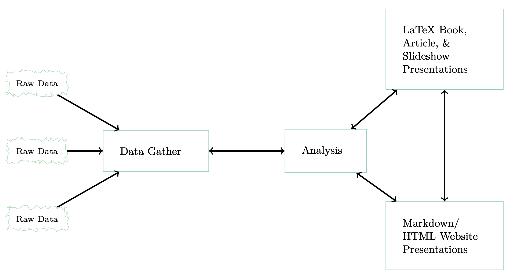

# Reproducible Science: What, Why, and How

We now live in a world with an abundance of data. In order to make sense of it all, we need to develop effective strategies to organize, manage, and track not just our data, but the workflows we use to analyze them.

The following short "horror film" encapsulates the motivation behind the recent trend toward the inclusion of reproducible workflows in scientific publishing:

<iframe width="560" height="315" src="https://www.youtube.com/embed/s3JldKoA0zw" title="YouTube video player" frameborder="0" allow="accelerometer; autoplay; clipboard-write; encrypted-media; gyroscope; picture-in-picture" allowfullscreen></iframe>

# Data Analysis Framework

The book [**R for Data Science**](https://r4ds.had.co.nz/introduction.html){: target="blank"} introduces a model for a typical analysis workflow:

{: width="80%"}

Within this framework, you will develop workflows designed for reprodibility that will look something like this figure from the book [**Reproducible Workflows with R and RStudio**](https://englianhu.files.wordpress.com/2016/01/reproducible-research-with-r-and-studio-2nd-edition.pdf){: target="blank"}:

{: width="80%"}

You should plan to organize your research with the following in mind: 

1. Document everything!
2. Everything is a (text) file.
3. All files should be human readable.
4. Explicitly tie your files together.
5. Have a plan to organize, store, and make your files available.

Here we introduce principles and best practices to help you develop good habits for writing code, managing your data and analysis workflows, and thinking about data analysis more broadly.
