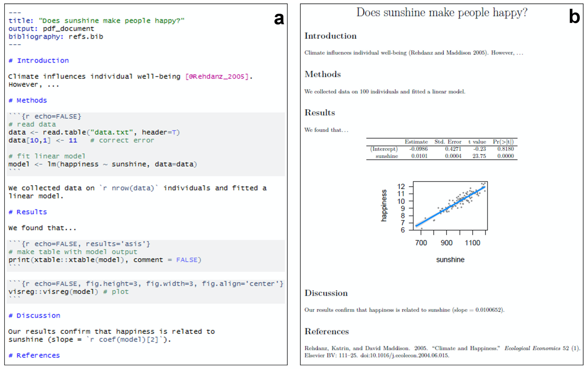

# Reproducible Science: What, Why, and How
{: .no_toc }

## Table of contents
{: .no_toc .text-delta }

- TOC
{:toc}

---

# What is Reproducible Science?

The following short "horror film" encapsulates the motivation behind the recent trend toward the inclusion of reproducible workflows in scientific publishing:

<iframe width="560" height="315" src="https://www.youtube.com/embed/s3JldKoA0zw" title="YouTube video player" frameborder="0" allow="accelerometer; autoplay; clipboard-write; encrypted-media; gyroscope; picture-in-picture" allowfullscreen></iframe>

# Reproducible Workflows with R Markdown

R Markdowns provide a great framework to ensure that your data analysis can be reproduced by anyone (similar options are also available for other languages such as Python). You can even use them to write a framework for an entire manuscript, including code and figures.

This example is taken from the same source used for the movie clip shown above:

---

# Online resources

* [**R Programming for Research**](https://geanders.github.io/RProgrammingForResearch/)

---

[Back to top](#top)
