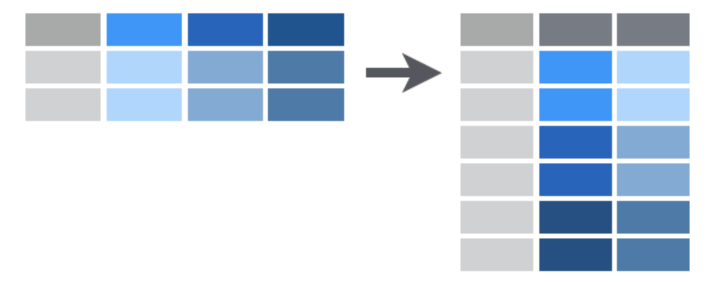

# Tidy Data
{: .no_toc }


## Table of contents
{: .no_toc .text-delta }

- TOC
{:toc}

# Data Wrangling

Learning how to manipulate data is essential for data science. You need to know how to import data, inspect it, clean it, tidy it, and document it.

Data wrangling, or data munging - cleaning and reformatting data to get it ready for data analysis - is often one of the most time-consuming aspects of data analysis.

Below are some useful resources for thinking about and doing essential data handling tasks.


# What is Tidy Data?

Hadley Wickham introduced a structured framework for thinking about data organization in his 2014 paper [**Tidy Data**](https://vita.had.co.nz/papers/tidy-data.html), published in the _Journal of Statistical Software_.

The paper makes a clear distinction between "messy" vs. "tidy" data, and introduced a small set of tools to perform essential tasks for data cleaning and tidying. The following brief introduction distills / excerpts some of the basics of data tidying based on Wickham's framework, as described in the chapters on data tidying from these two books:

+ [**R for Data Science: Tidy Data**](https://garrettgman.github.io/tidying/) - by Hadley Wickham
+ [**Data Science with R: Data Tidying**](https://garrettgman.github.io/tidying/) - by Garrett Grolemund


## Basic Principles

Tidy data builds on a premise of data science that data sets contain both **values** and **relationships**. Tidy data displays the relationships in a data set as consistently as it displays the values in a data set.

Before diving in further, it is useful to remember that R is a **vectorized** programming language, which is a core feature that tidy data takes advantage of.

Data structures in R are built from vectors, and R’s operations are optimized to work with vectors. In fact, under the hood a data frame is just a list of atomic vectors arranged to look like a table, where each column in the table is an atomic vector:

{: width="90%"}


## Tidy datasets

**Tidy datasets** are easy to manipulate, model and visualize, and have a specific structure:

+ Each type of observational unit is a table
  + Each variable in the data set is placed in its own column
  + Each observation is placed in its own row
  + Each value is placed in its own cell

{: width="90%"}


## Pivoting

### Pivot longer
{: .no_toc}

Sometimes column names are not names of variables but they are actually values of a variable (e.g. year) across which multiple observations (e.g. tuberculosis cases) have been made, as illustrated below:

| country     |   1999 |   2000 |
|:------------|-------:|-------:|
| Afghanistan |    745 |   2666 |
| Brazil      |  37737 |  80488 |
| China       | 212258 | 213766 |

In this format, each row actually represents two "observations" (here, number of cases per country per year) instead of one.

To make the data tidy, we want to **pivot**  the columns labeled `1999` and `2000` into a new pair of variables, `year` and `cases`:

{: width="90%"}

This creates a longer table that is easier to extract data summaries from using standard R tools. A more abstract representation of the same idea is shown below:

{width=60%}


### Pivot wider
{: .no_toc}

On the flip side, sometimes multiple measurements (e.g. cases, population) for the same variable (e.g. year) are distributed across multiple rows. In this situation, we want to pivot the data into a wider format so that each observation is arranged on a single row:

{: width="90%"}


## Missing values

A really important thing you need to watch out for is missing data. This is pretty common, especially for e.g. RNA-seq data, where some genes may not have any read counts, and so will be absent from a table of differentially expressed genes.

Missing data may be represented in different ways in tabular data files that you will import, e.g.:

+ empty cells
+ text such as "-", "na", "N/A", etc.
+ NaN

You will need to check for these and replace them with a valid symbol for missing data in R. This is one reason why it is crucial to inspect your data before you start working with it.


### Missing values in R: NA
{: .no_toc}

In R, missing data values are represented as `NA` (without quotes; this is not treated as a character string).

Before you start working with your data, **it is crucial to figure out if there are any missing values and what symbols are used to represent them**. If missing data are represented in a systematic way using some character string (e.g. "n/a"), you can specify this string when you read in a data table from a file:

``` r
# read in a table and recode missing values as NA
> my_table = read.csv("example.csv", na.strings = "n/a")
> head(my_table)
  patientid grade nodesexam nodespos extent nodalstatus size pgr er
1  pid00001     3        32        3     10           6   60   2  2
2  pid00002     2        13        1     10           6   15   1  1
3  pid00003     3         8        0     10           0    8   1  1
4  pid00004     3        20       NA     10           0   10   2  2
5  pid00005     2        16        8     10           6   15   2  1
6  pid00006     3        19        0     10           0   48   1  1
```

Once you have imported your data and all your missing values are properly represented, you can test for them using logical operators, for example:

```r
> my_vector = c(1:5,NA,7:10)
> is.na(my_vector)
 [1] FALSE FALSE FALSE FALSE FALSE  TRUE FALSE FALSE FALSE FALSE
```

You can use this to filter out rows with missing data when you are cleaning and tidying your data, before you start working with it. There are a variety of ways to do this; one example is shown below:

``` r
# use dplyr na.omit() to remove lines with missing values in the nodespos colum
> my_table %>% na.omit(nodespos)
   patientid grade nodesexam nodespos extent nodalstatus size pgr er
1   pid00001     3        32        3     10           6   60   2  2
2   pid00002     2        13        1     10           6   15   1  1
3   pid00003     3         8        0     10           0    8   1  1
5   pid00005     2        16        8     10           6   15   2  1
6   pid00006     3        19        0     10           0   48   1  1
```


# Tidyverse R Packages

[**Tidyverse**](http://www.tidyverse.org) tools provide a collection of packages that help you store, format, manipulate, and display your data. We will introduce some of these tools as we practice working with data throughout the semester.


# Exercises

For practice, try working through these vignettes:

+ [**Chapter 12: Tidy Data**](https://r4ds.had.co.nz/tidy-data.html#tidy-data){: target="blank"} in **R for Data Science**
+ [**Tidy data**](https://cran.r-project.org/web/packages/tidyr/vignettes/tidy-data.html){: target="blank"} _from the CRAN tidyr documentation_


# Additional Resources

## Tidy Video

If you like watching videos, you can watch watch his presentation on Tidy Data and Tidy Tools (58:45):

<iframe src="https://player.vimeo.com/video/33727555?h=a4e09bea86" width="500" frameborder="0" allow="autoplay; fullscreen; picture-in-picture" allowfullscreen></iframe>

<!-- * [**Data Carpentry: Data Analysis and Visualization in R for Ecologists**](https://datacarpentry.org/R-ecology-lesson/index.html)

* [**Data Science for Psychologists**](https://bookdown.org/hneth/ds4psy/) -->

---

[Back to top](#top)
