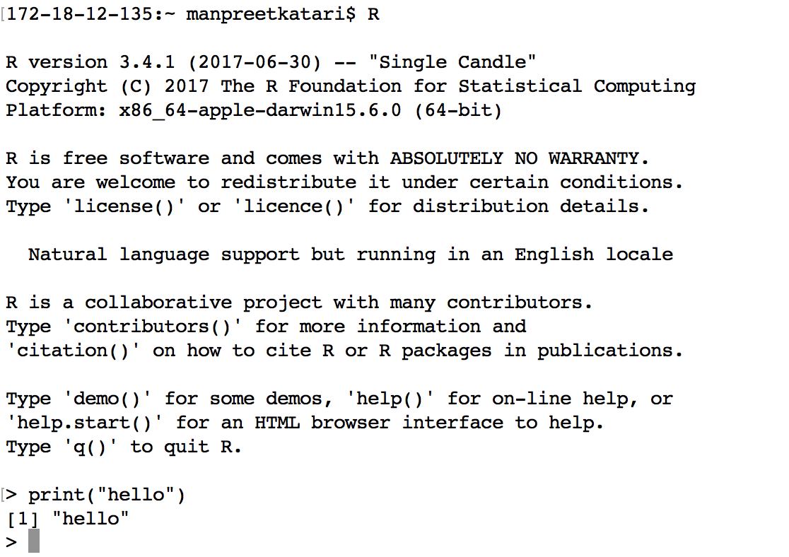
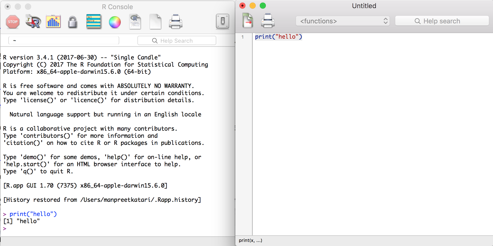
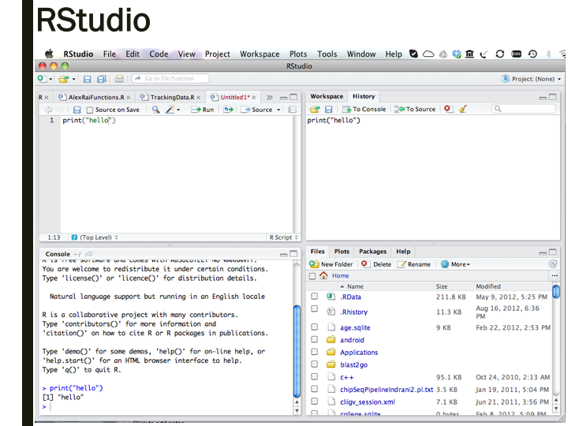

# Interfacing with R {#top}
{: .no_toc }

## Table of contents
{: .no_toc .text-delta }

1. TOC
{:toc}

---

Once you have installed R on your computer, you can start an interactive R session either on the **commandline** or using **RGui**, the built-in R graphical user interface (GUI). **RStudio** provides a richer and more powerful interface for R that we will use in this class.

## Using R on commandline

Once you have installe R, you may simply start a `terminal` on a MAC or `cmd` on a PC to get a black box with a prompt. Type **R** and you should see something like what is shown below. You can start typing R commands here directly.

Although this is a very cumbersome way of interacting with R, it is useful to familiarize yourself with this environment as you may need it in the future, for example when connecting to HPC (High Performance Computing) systems.

{ width=60% }

## The RGui Window System

R comes with a built-in GUI for R called **Rgui**. This is more convenient way to use R because it provides you with a windowing system that comes with buttons and tabs to help you navigate around the R environment. The image below demonstrates the RGui script editor, which allows you to write commands on a separate window and execute them in the console.

{ width=60% }

## RStudio

[**RStudio**](https://www.rstudio.org/) offers many more features and utilities than the base RGui and is the preferred way to interact with R.

### RStudio features

* A windows- and menu-driven GUI for writing, running, and debugging R scripts
* An easy way to manage working directories, workspaces, and R Projects
* An easy way to inspect functions, variables, and data structures in your environment
* Visualization of graphical output
* Generation of PDF, HTML, and Word documents; slide shows; and interactive graphics
* Integration with specialized R packages for graphics and various analytical applications

### RStudio Interface

RStudio's GUI comprises four windows that display different kinds of information. By default, windows will appear as follows (this can be customized to suit your working style):

- **Script Editor** _(top left)_
    - Opens when you select to create a new R script, R Markdown or Notebook, or other kinds of files; all of these can be saved for future use
    - Run scripts or code snippets within other kinds of R documents
    - Provides suggestions for command completion
    - Provides menus for formatting code and other actions
- **Console** _(bottom left)_
    - Displays all R commands executed within scripts and code snippets in the Editor
    - Provides direct access to the commandline - particularly useful for testing out commands and inspecting data structures
    - Get help with R command syntax
    - Access built-in tutorials
- **History and Environment** _(top right)_
    - Shows all variables in the working environment
    - Shows all previous commands that you have executed, either from the console or within a script (even incorrect commands containing errors are included here, so be careful!)
- **Files, Plots, Packages, and Help** _(bottom right)_
    - Easily peruse and navigate directories and files
    - Display plots as they are created
    - See which packages are installed
    - Display R documentation for command syntax

{ width=60% }

---

[Back to top](#top)
