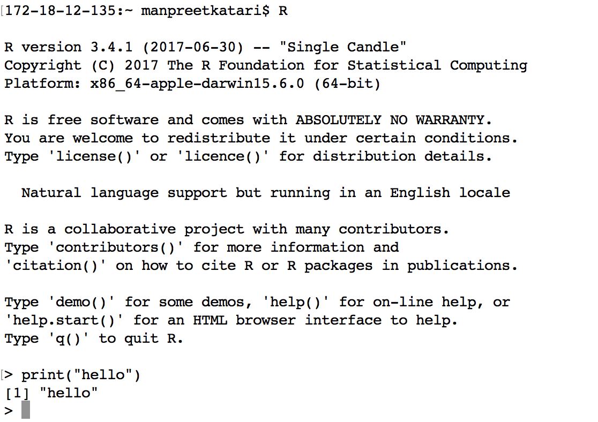

Once you have R installed on your computer, there are two main main ways that you can start interactive with R: - R command line - R GUI

### Using R on command line

To use R on command line simply start a `terminal` on a MAC or `cmd` on a PC to get a black box with a prompt. Type **R** and you should see something like what is shown below. You can start typeing R commands here directly. Although this is a very cumbersome way of interacting with R, you should familiarize yourself with this environment as you may need it in the future, for example when connecting to the HPC ( High Performance Computing ) systems.

### The Window System (Rgui)

Once you have installed R on your desktop, you are also provided with a GUI (Graphical User Interface) to R. This is much more convenient way to use R because it provides you with a windowing system which comes with buttons and tabs to help you navigate around the R environment. The image below also demonstrates an R script editor which allows you to write commads on a separate window and execute them in the console.

### RStudio (www.rstudio.org)

<https://www.rstudio.org/>

RStudio is the a very powerful way of interacting with R. In addition to the features provided in RGui, RStudio also provides:
- Easy way to look at the functions and variables that are in your environment.
- Integration with packages to enable easily repeatable code ( more on this later )
- Project management that allows you to change workspace and working directory with a simple selection from a pull down menu.

Note that RStudio does not come with R, R needs to be installed first separately.

#### The RStudio interface is separated into 4 sections:

- **Script Editor** (top left)
    - This window opens when you select to create a new R script
- **History and Environment** ( top right)
    - This window shows all previous commands that you have typed, even the ones that are incorrect so be careful. Ideally you want to save the correct ones to the R script window on the left.
- **Console** (bottom left)
    The way to execute commands to R directly. This is particularly useful for testing out commands. Commands executed in scripts and code snippets in the Editor will also appear here.
- **Files, Plots, Packages, and Help** (bottom right)
    - Easy way to look for files in the directories and packages that are installed. It also has a tab for all the plots that are created.
