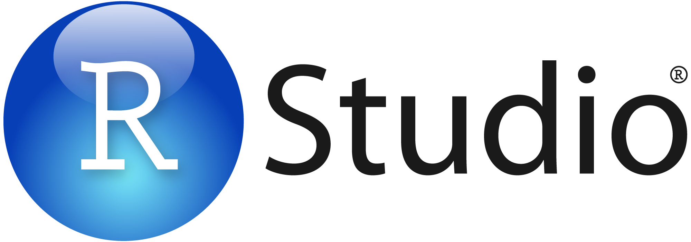
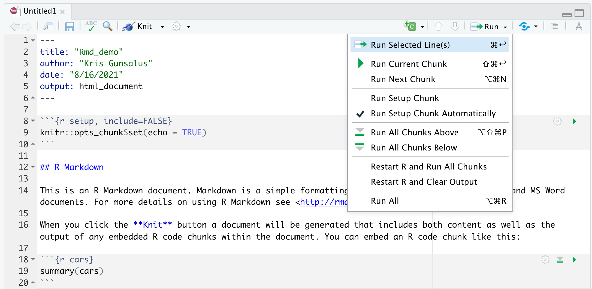

# Interfacing with R {#top}
{: .no_toc }

## Table of contents
{: .no_toc .text-delta }

- TOC
{:toc}

---

Once you have installed R on your computer, you can start an interactive R session either on the **commandline** or using **RGui**, the built-in R graphical user interface (GUI). **RStudio** provides a richer and more powerful interface for R that we will use in this class. Below is a brief introduction to each of these interfaces.

# Using R on commandline

Once you have installed R, you may start a `terminal` on a MAC or `cmd` on a PC to get a commandline window with a prompt.

- You can start typing R commands here directly after the R the prompt, `>`.
- After you type a command and its arguments, simply press the `Return/Enter` key.
- Anything you type after a hashtag, `#`, is a comment and will be ignored.
- You may also enter multiple commands on the same line by separating them with a colon (`;`).
- If you don't complete a command, you will see a `+` symbol displayed on the next line, indicating that R is waiting for you to complete the command you started.

Type **R** and you should see something like what is shown below. Try out the examples shown to get a feel for the commandline. If you make a syntax error, you will get an error message and you can try again (for example, you could forget the quotes and see what happens.)

Although the commandline is a very basic way of interacting with R, it is useful to familiarize yourself with this environment as you may need it in the future, for example when connecting to HPC (High Performance Computing) systems.

[Back to top](#top)

---

# The RGui Window System

R comes with a built-in GUI for R called **Rgui**, which can be started by clicking on the **app icon** on your computer. This is more convenient way to use R because it provides you with a windowing system that comes with buttons and tabs to help you navigate around the R environment.

The image below demonstrates the RGui script editor, which allows you to write R scripts in a separate window and execute them in the console. The first command, `print("Hello world!")` was entered directly on the console, and the second one, `print("Top of the day to you!")` , was executed from the simple script on the right.

[Back to top](#top)

---

# RStudio

 is an integrated development environment (IDE) that is the most convenient way to interact with R because it provides a much richer interface for writing and running R code.

RStudio is available in open source and commercial editions and runs on the desktop (Windows, Mac, and Linux) or in a browser connected to RStudio Server or RStudio Workbench (Debian/Ubuntu, Red Hat/CentOS, and SUSE Linux).

## RStudio Features

* A windows- and menu-driven GUI for writing, running, and debugging R scripts
* An easy way to manage working directories, workspaces, and R Projects
* An easy way to inspect functions, variables, and data structures in your environment
* A great toolbox for visualization of graphical output
* Generation of PDF, HTML, and Word documents; slide shows; interactive graphics; dynamic web pages
* Integration with specialized R packages for graphics and various analytical applications

## RStudio Interface

RStudio includes a console, syntax-highlighting editor that supports direct code execution, as well as tools for plotting, history, debugging, and workspace management.

+ The **top-level menus**{: .text-green-200} (File, Edit, Code, etc.) provide a lot of options for managing all the different features of RStudio, including very convenient **keyboard shortcuts**{: .text-green-200} (go to Tools => Keyboard Shortcuts Help). A list of keyboard shortcuts is also available online [**here**](https://support.rstudio.com/hc/en-us/articles/200711853-Keyboard-Shortcuts-in-the-RStudio-IDE){: .text-green-200}.

+ **Command Palette**{: .text-green-200}: The RStudio 1.4 workbench introduces a new [**Command Palette**](https://blog.rstudio.com/2020/10/14/rstudio-v1-4-preview-command-palette/) feature, which gives instant, searchable access to all available commands in RStudio (Tools => Show Command Palette).

+ The **graphical user interface (GUI)**{: .text-green-200} comprises **four windows** that display different kinds of information. In addition to the quick tour below, the **Pirate's Guide to R** also has a nice introduction to [**the four RStudio Windows**](https://bookdown.org/ndphillips/YaRrr/the-four-rstudio-windows.html).

[**Script Editor** _(top left)_](https://support.rstudio.com/hc/en-us/articles/200484448){: .btn .btn-green target="_blank"}

  - This window will open when you create a new R script, R Markdown, or other kinds of files (all of these can be saved for future use)
  - Run scripts or code snippets within R documents
  - Provides suggestions for command completion
  - Provides menus for formatting code and other actions
  - Provides many utilities for [**navigating code**](https://support.rstudio.com/hc/en-us/articles/200710523-Navigating-Code){: target="blank"}
  - Provides tools for [**debugging**](https://support.rstudio.com/hc/en-us/articles/205612627-Debugging-with-the-RStudio-IDE){: target="blank"}

[**Console** _(bottom left)_](https://support.rstudio.com/hc/en-us/articles/200404846-Working-in-the-Console){: .btn .btn-green target="_blank"}

<!-- <iframe width="400" src="images/Rmd_demo.mov" title="Rmd demo" frameborder="0"></iframe> -->

  - Displays all R commands executed within scripts and code snippets in the Editor
  - Provides direct access to the commandline - particularly useful for testing out commands and inspecting data structures
  - Get help with R command syntax
  - Access built-in tutorials

[**History and Environment** _(top right)_](https://support.rstudio.com/hc/en-us/articles/200526217-Command-History-in-the-RStudio-IDE){: .btn .btn-green target="_blank"}

  - Shows all variables in the working environment
  - Shows all previous commands that you have executed, either from the console or within a script (even incorrect commands containing errors are included here, so be careful!)
  - Provides integration for version control (git, svn) - connecting RStudio to a GitHub repository is a great way to back up and share your work!

[**Files, Plots, Packages, and Help** _(bottom left)_](#files){: .btn .btn-green #files}

<!-- <button type="button" name="files-plots-packages-help" class="btn">**Files, Plots, Packages, and Help** _(bottom left)_</button>{: .btn .btn-green } -->

  - Easily peruse and navigate directories and files
  - Display plots as they are created
  - See which packages are installed
  - Display R documentation for command syntax

---

[Back to top](#top)
