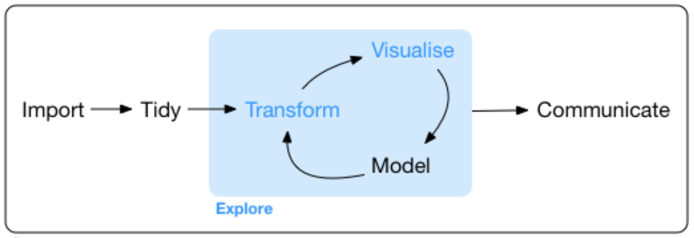

# [xdas-bio-2020](https://xdas.bio.nyu.edu/)

# R Graphics

Visualizing data is a core component of data science. It is important for communication, but also plays a key role in data exploration and modeling. Actually ***looking*** at your data helps to understand its nature and scope, spot any problems that may exist within the data, formulate and test hypotheses, and distill information to convey to others.

A typical workflow is illustrated in this figure from [***R for Data Science***](https://r4ds.had.co.nz/explore-intro.html):



In order to work with data, it is usually necessary to clean, format, and transform it in preparation for visualization and exploratory data analysis. This usually involves an iterative cycle in which we use or data to generate and test hypotheses and to discover and model relationships. Finally, effective visualizations are key to communicating results and conclusions in a clear and concise manner.

# Overview

R is very powerful for creating beautiful publication-ready graphs of all kinds. There are a lot of **built-in functions** for making graphs. It is important to know that these exist, and get a feel for some of the basics.

However, controlling the look and feel of base R graphs, and generating more complex graphs and figures, is not that easy using the base R package. The main approach people now use for data analysis in R follows a systematic layering approach that is implemented in the **ggplot2** package and many extensions that enable very powerful plotting.

## Types of plots

Deciding what kind of plot to use will depend on the type of data you are trying to plot. A couple good websites are very useful for helping you identify the type of plot you want to make, based on what kind of data you have. They also have examples and code for different types of plots:

+ [**Data to Viz**](https://www.data-to-viz.com/): The **decision tree** at Data to Viz illustrates how to choose different visualizations and provides example code for all of them. Very useful!!!
+ The [**R Graph Gallery**](https://www.r-graph-gallery.com/index.html) also contains a lot of examples of different types of graphs, and provides tips for plotting with both base R and ggplot2.


## Tutorials

Here we provide two short guides to plotting with both methods, with links to a variety of other useful resources for each.

+ [**Plotting with base R**](base_r_plotting.html)
+ [**Plotting with ggplot**](ggplot2.html)


## Thinking about colors

Using color is an important aspect of conveying information, and there is a lot of theory behind choosing colors. Color is important for:

+ contrasting different categorical groups
+ distinguishing quantitative variables
+ highlighting information

A good discussion for thinking about and handling colors in R may be found [**here**](https://bookdown.org/hneth/ds4psy/D-apx-colors.html).

R comes with a wide array of built-in colors. You may find a graphical display of 657 named R colors [**here**](https://www.datanovia.com/en/blog/awesome-list-of-657-r-color-names/).

### Palettes

**Palettes** are groups of related colors that are chosen to convey or highlight different kinds of information, and many options are available. A good discussion on palettes (and colors more generally) may be found [**here**](https://bookdown.org/hneth/ds4psy/D-1-apx-colors-intro.html).

#### R Color Brewer

A popular color package is called **RColorBrewer**. RColorBrewer contains a wide variety of nice palettes, including color-blind ones and can be used with both base R graphics and ggplot2. RColorBrewer palettes fall into 3 classes^[Source: https://www.stat.ubc.ca/~jenny/STAT545A/block14_colors.html]:

+ **sequential**: Great for low-to-high things where one extreme is exciting and the other is boring, like (transformations of) p-values and correlations (caveat: here I'm assuming the only exciting correlations you're likely to see are positive, i.e. near 1).
+ **qualitative**: Great for non-ordered categorical things -- such as your typical factor, like country or continent. Note the special case "Paired" palette; example where that's useful: a non-experimental factor (e.g. type of wheat) and a binary experimental factor (e.g. untreated vs. treated).
+ **diverging**: Great for things that range from "extreme and negative" to "extreme and positive", going through "non extreme and boring" along the way, such as t-statistics and z-scores and signed correlations.

```{r, collapse=TRUE}
#install.packages("RColorBrewer")
library(RColorBrewer)
#display.brewer.pal(n = 8, name = 'Spectral') # show one palette
display.brewer.all() # show all the palettes
```


### Other Color Resources

+ A good discussion about thinking about and handling colors in R may be found [**here**](https://bookdown.org/hneth/ds4psy/D-apx-colors.html).
+ You can also read more about choosing colors [**here**](http://www.sthda.com/english/wiki/the-elements-of-choosing-colors-for-great-data-visualization-in-r)
This blog post introduces another tool for designing color palettes called **colortools**.

+ [**SDHTA**: ggplot2 colors](http://www.sthda.com/english/wiki/ggplot2-colors-how-to-change-colors-automatically-and-manually) tutorial
+ [**R Cookbook**: colors with ggplot2 (includes RColorBrewere)](http://www.cookbook-r.com/Graphs/Colors_(ggplot2))
+ [**Tidyverse**: RColorBrewer with ggplot2](https://ggplot2.tidyverse.org/reference/scale_brewer.html)


## General R Graphics Resources

+ **Quick-R** - [***Basic***](https://www.statmethods.net/graphs/index.html) and [***Advanced***](https://www.statmethods.net/advgraphs/index.html) graph tutorials
+ [**STDHA - R Base Graphs**](http://www.sthda.com/english/wiki/r-base-graphs) tutorial
+ The [**Electronic Appendix (Introduction to RR)**](https://xdas.bio.nyu.edu/learning_r/Intro_to_R_Aho.pdf), Section A.8 (pp.26-41) from Ken Aho's book, ***Foundational and Applied Statistics for Biologists Using R*** provides an overview of generic graph functions and parameters for base R
+ Tidyverse: [**ggplot2** documentation](https://ggplot2.tidyverse.org/)

### Types of plots with examples

+ [**Data to Viz**](https://www.data-to-viz.com/)
+ [**R Graph Gallery**](https://www.r-graph-gallery.com/index.html)

---

***Kris Gunsalus, September 2020***
