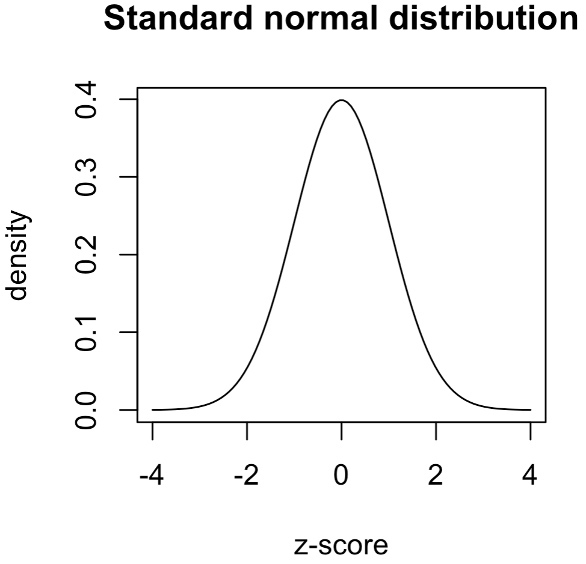

# Base R Graphics
{: .no_toc }


## Table of contents
{: .no_toc .text-delta }

- TOC
{:toc}

---

When you are still just exploring the data, you do not always need to build aesthetically pleasing plots that display multiple layers of information. Sometimes, you just need to quickly build a simple scatterplot or a boxplot. Ideally, you want to do it using a single line of code without thinking too much about the syntax. This is where base R graphics come to help.

The [**graphics**](https://www.rdocumentation.org/packages/graphics/versions/3.6.2) package, which is part of the base R distribution, provides many, many different options for specifying plot type, appearance, and output.

Learning to fine-tune the appearance of plots using the base graphics package can be very tedious and unrewarding. This is why we will focus mainly on the **ggplot2** package to take our graphics to the next level. Nevertheless, we think it is important for you to know that these base functions exist and are available if you want to use them.

You may always consult the documentation to check on available options and the correct **syntax** for the commands you want to use, either on the web or directly in RStudio (type `?commandname` in the console, or use the **Help** tab).

---

# Plotting Functions

The generic **function** for plotting R objects is aptly called `plot()`, and its output will depend on the object it is passed. Additional functions provide methods for generating specific types of plots, such as `barplot()`, `hist()` (histograms), ``boxplot()``, etc.

+ DataCamp's [**QuickR: Creating a Graph**](https://www.statmethods.net/graphs/density.html){: target="blank"} and [**QuickR: Advanced Graphs**](https://www.statmethods.net/advgraphs/index.html){: target="blank"} provide examples of how to make different kinds of plots in base R.
+ The [**R Graphics Cookbook: Chapter 2**](https://r-graphics.org/){: target="blank"} provides side-by-side examples for making all kinds of graphs in base R and ggplot2.

We will go through examples that show how to generate all the main types of plots using both base R methods and ggplot.


## Getting and Setting Parameters

There are many ***parameters*** that control the appearance and output format of a plot: points and lines, axis ticks, plot labels, text, and arrangement of plots (to display multiple plots at the same time). Other packages will come with their own plotting functions, but generally they access the same range of parameters.

All the basic plotting functions have default settings that can be changed manually using the `par()` command. Some useful graphical parameters include:

+ `pch` – style of points (circle, cross, start, etc)
+ `bty` – plot border type
+ `tck` – draw gridlines of tick marks
+ `xaxt`,`yaxt` - Plot x or y tick marks and labels
+ `lab` – number of tick marks on each axis
+ `las` – orientation of axes labels

The `type` parameter controls the appearance of the data points on a plot:

+ `p` – points
+ `l` – lines
+ `b` – both lines and points
+ `c` – lines but not where points are
+ `o` – non overlapping points and lines
+ `h` – histogram-like vertical lines
+ `s` – draw lines as steps
+ `n` – draw only axes

DataCamp's **QuickR** provides some useful quick guides for setting parameters:
  - [**Graphical Parameters**](https://www.statmethods.net/advgraphs/parameters.html){: target="blank"}
    - shows all the types of points you can draw
  - [**Axes and Text**](https://www.statmethods.net/advgraphs/parameters.html){: target="blank"}
    - how to customize text annotations

## Arranging multiple plots

The `mfrow()` and `mfcol()` arguments for the `par()` function allow you to define the number of
figure panels you want to diplay, and how they are to be arranged in terms of rows and columns. For examples, to draw four plots in two rows and two columns, use `par(mfrow=c(2,2))` before issuing the `plot()` commands.

---

# Output Devices

In the RStudio GUI, as a default, plots will be displayed in the **Plots** window, or if you are using R Markdown they will appear inline.

To draw a plot, you need some sort of **canvas** to draw on. This is controlled by the ***device*** directive, which by default is set to print the output directly to your screen (graphs will appear in the **Plots** window in RStudio). This is called the **null device** (on a Windows machine it is actually a device called `windows()`; on a Mac it is called `quartz()`).

Each time you make a new graph in R, the last graph you made will be overwritten to the current canvas (though RStudio saves these for you so you can scroll through them). You can open a new canvas by opening a new null device (e.g. typing `quartz()` and then making a plot). Note that the window might open behind RStudio, so you may have to look for it on your desktop.

```r
# open a new window
# windows()  #on a pc
quartz()     #on a mac

dev.cur()   # check current device
dev.list()  # list all devices

dev.off()   # close the current output device
```

## Saving graphs to files

You may choose the kind of output that is produced by redirecting the output to another type.

+ Different devices include: PDF, PNG, JPG, PostScript, bitmap, and LaTeX.
+ These devices will not print to the GUI -- instead they will save a file in the working directory.
+ You can add filenames, dots per inch (dpi), etc.

PNG (`png("mycoolplot.png"`) and PDF (`pdf("mycoolplot.pdf")`) output are really useful. For example, the following code will print the standard normal distribution to a PDF file.

```r
pdf("mycoolplot.pdf")                      # start pdf device

# make a plot of a standard normal distribution
seq.vec = seq(-4,4,length=100)             # set the range     
plot(x=seq.vec,                            # map the range to the x-axis
     y=dnorm(seq.vec),                     # set y-axis to show the density
     type="l",                             # make a line plot
     xlab = "z-score", ylab="density",     # axis labels
     main="Standard normal distribution")  # main graph labels
dev.off()                                  # close the device to finish
```

{: width="40%"}

---

# Tutorials

+ [**DataCamp: Data Visualization in R**](https://learn.datacamp.com/courses/data-visualization-in-r){: target="blank"}
  - you can also access this course in the [XDASI DataCamp for Education](https://app.datacamp.com/groups/exploratory-data-analysis-and-statistical-inference/assignments/142590){: target="blank"} site

+ [An Idiot's Guide to R Base Graphics](https://rstudio-pubs-static.s3.amazonaws.com/7953_4e3efd5b9415444ca065b1167862c349.html){: target="blank"}

+ **Quick-R**
  - [***Basic***](https://www.statmethods.net/graphs/index.html){: target="blank"}     
  - [***Advanced***](https://www.statmethods.net/advgraphs/index.html){: target="blank"}
+ [**STDHA - R Base Graphs**](http://www.sthda.com/english/wiki/r-base-graphs){: target="blank"} tutorial
+ [**Electronic Appendix, Section A.8**](https://drive.google.com/file/d/0BxPAku5Rir7LRXZ1YTN6ZkdIWDg/view?usp=sharing&resourcekey=0-qWCk3At5SA6zTWLIjadAaQ){: target="blank"} (pp.26-41)
  - from Ken Aho's book, ***Foundational and Applied Statistics for Biologists Using R***
  - an overview of generic graph functions and parameters for base R
