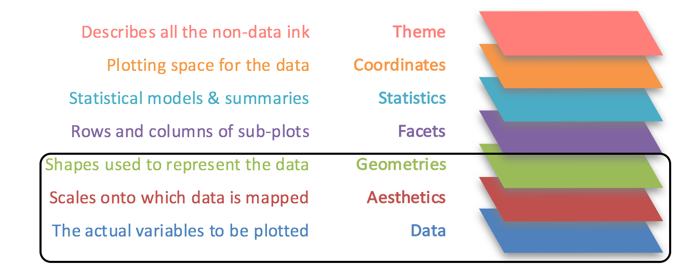
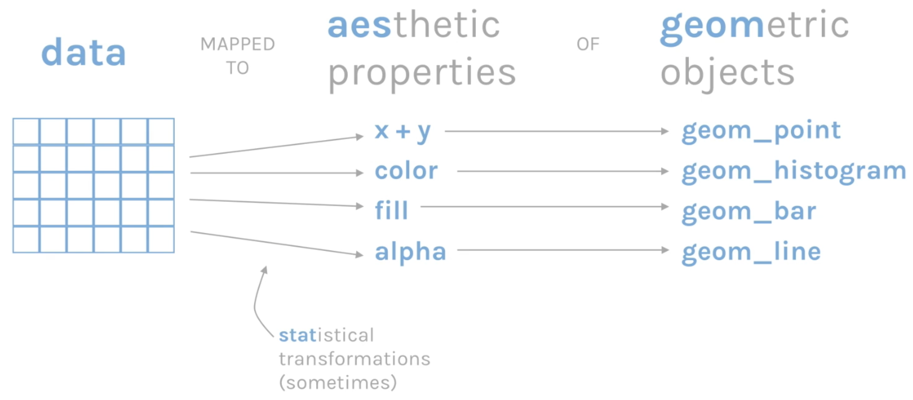

# The Grammar of Graphics

One great feature of R is the powerful and flexible [**ggplot2**](https://ggplot2.tidyverse.org/) package, implemented by Hadley Wickham, for producing elegant graphics. It uses a systematic framework called the **grammar of graphics**  that allows very fine-grained control over how your final product looks.

You will get lots of practice using ggplot during this course. Here, we just review the overall framework so you can get a feel for generating meaningful graphics using this framework.

# Layers

ggplot2 combines multiple **layers** to produce plots, each serving a particular function:

{: width="60%"}

# Mappings

Every ggplot2 graph is composed of **three essential layers[^1]**:

{: width="60%"}

+ **data**
  - The foundation for any visualization (a data frame).
+ **Aesthetics**
  - The **scales**, a.k.a. the coordinate system, onto which the data are **mapped** (e.g. which variables correspond to the ***x*** and ***y*** axes).
  - Also used to map data onto different colors, fills, and data points
  - Often used to show different subsets of data in different colors, sizes, or shapes
+ **Geometries**
  - The visual paradigm, or **type of plot** (histogram, box plot, line plot, density plot, scatter plot, etc.) used to display the data.

Sometimes, **statistical transformations** are also applied, making it very easy to rapidly model your data.

# Tutorials

+ **Please take a few minutes to read** through this
[**excellent step-by-step introduction**](https://englelab.gatech.edu/useRguide/introduction-to-ggplot2.html)
to **layers**, with simple examples using the famous "iris" dataset that comes with R.

+ If you like to watch videos, you may find this [**short video**](https://vimeo.com/332290655) useful, which provides a high-level view of using the grammar of graphics with ggplot2 (6 minutes).

Continue on to the [**ggplot2**](3_ggplot2) page for examples of how to make different kinds of graphs with ggplot2.

[^1]: From [Grammar of Graphics](https://vimeo.com/332290655) by David Keys
