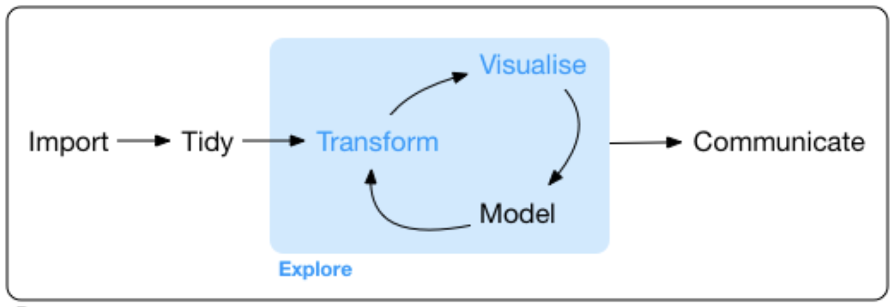

# Introduction

As the saying goes, ***"A picture is worth a thousand words"***{: .text-green-200}.

Before we dive in to the nuts and bolts of plotting in R, let's take a few minutes to think more broadly about data visualization. Consider Minard's famous illustration of Napoleon's Russian campaign of 1812-1813:

Napoleon's army left Paris in June with over 400,000 soldiers; only a few thousand returned, after a harrowing retreat in the bitter cold of winter. This graphic makes the point concisely and impressively.

---

# Visualization in Data Science

Visualizing data is a core component of data science, and has **two main purposes**:

+ It plays a key role in preliminary **data exploration** and modeling.
+ It is important for **communication**, i.e. disseminating your results to the scientific community.

A typical data science workflow is illustrated in this figure from [***R for Data Science***](https://r4ds.had.co.nz/explore-intro.html):

It is usually necessary to clean, format, and transform your data in preparation for further analysis.

**Exploratory data analysis** often involves multiple cycles of iteration, as you work with and gain deeper insights into your data. Actually ***looking*** at your data helps to understand its nature and scope, spot any problems that may exist within the data, develop and test hypotheses, and generate models.

Finally, we need to **communicate** our results and conclusions in a clear and concise manner in the form of talks or publications. Good data visualization helps distill the insights gained and convey them effectively to a broader audience.

## Choosing a Visual Paradigm

Deciding what kind of plot to use will depend on the type of data you are trying to plot. A couple good websites are very useful for helping you identify the type of plot you want to make, based on what kind of data you have. They also have examples and code for different types of plots:

+ [**Data to Viz**](https://www.data-to-viz.com/)
  + This site provides a very useful **decision tree** that illustrates how to choose different visualizations and provides example code for all of them.
+ [**R Graph Gallery**](https://www.r-graph-gallery.com/index.html)
  + Contains a lot of examples of different types of graphs, and provides tips for plotting with both base R and ggplot2.

---

# Visualization in R

R is very powerful for creating beautiful publication-ready graphs of all kinds. Most people use one of two packages to plot data: base R or `ggplot2`.

Briefly, **Base R graphics** are great for **exploratory data analysis** because the code is quicker to write and allows "quick and dirty" plots that help you get a feel for your data. However, controlling the look and feel of base R graphs, and generating more complex graphs and figures, is somewhat cumbersome.

On the other hand, **ggplot2** is better adapted to **scientific communication** - it is more powerful, produces more visually appealing plots, and has many extensions that enable sophisticated graphical presentations. As a result, most people now use this package for much of their data analysis, and for producing publication quality graphs.

We will cover the basics of both packages in this course, but please also refer to the excellent [***R Graphics Cookbook***](https://r-graphics.org/index.html) for detailed guidance on how to visualize data in R (and tons of examples).

Here we provide a framework for thinking about graphics in general, an introduction to plotting with both packages, and links to a variety of other useful resources. We will follow these up with a lot of exercises to get you up to speed with making all kinds of plots in R.
