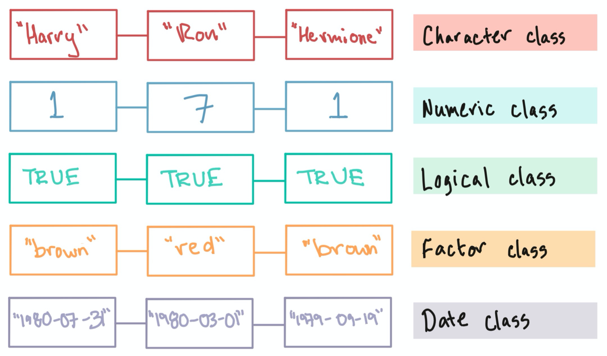

```{r setup, include=FALSE}
knitr::opts_chunk$set(echo = TRUE)
```


Pretty much everything in R is either an object or a function (or a package that contains these). Objects hold data, and functions generally perform some kind operations, or transformations, on data.

# Functions and Operators

R contains a lot of built-in functions that usually have the form `function.name()`. Some examples are listed here: [Built-in Functions](https://www.statmethods.net/management/functions.html).

```{r, collapse=TRUE}
# some built-in functions

```

Some simple arithmetic and logical functions are so common that they have special symbols and are referred to as "operators": [R Operators](https://www.statmethods.net/management/operators.html)

```{r, collapse=TRUE}
# arithmetic

# logical

```


# R Data Types

R can store several different **types** of data:

- Numeric  : numbers (simple or scientific notation, e.g. `1e2` or `1e+2` equal 100)
- Character: strings 
- Logical  : TRUE / FALSE
- Complex  : complex numbers (*i* = square root of -1)
- Raw      : Bytes (for example images)

These data types can be stored in different kinds of containers, or "objects". Different objects are structured in different ways and have different limitations on how they can be used.

R also has a small number of [built-in constants](https://www.rdocumentation.org/packages/base/versions/3.6.2/topics/Constants):

```{r, collapse=TRUE}
pi
letters
LETTERS
month.abb
month.name
```


# R Data Structures and Classes

Most R functions expect a particular type of object, and will sometimes coerce similar objects (e.g. matrix, data frame) into the expected type if possible.

There are 5 basic classes of objects that we will come across most often:

- Vectors
- Factors
- Matrices / Arrays
- Data Frames
- Lists


# Variable Assignment

Objects are created using an arrow (`<-` or `->`) or an equals sign (`=`). 

Left-arrows are technically preferred, but many programmers are so used to using `=` that this symbol is also a valid assignment operator.

The right-arrow works, but is discouraged because it creates confusion and doesn't work using the `=` assignment operator. Always assign your variables with the object name on the left!

```{r, collapse=TRUE, error=TRUE}
# a character object
a <- "Hello"
a
class(a)

# right-arrow assignment works, but don't do it!
6*7 -> the.answer.to.the.universe.and.everything
the.answer.to.the.universe.and.everything
class(the.answer.to.the.universe.and.everything)

# assignment using the equals sign
b = "world"
b

# oops! don't try this, ever.
2 = c
c
```


# Naming Conventions

Here are a few tips for naming objects and functions (when you get around to making your own):

+ Use meaningful names to help you remember what they are for (i.e. avoid names like `a`, `b`, etc.). Valid characters include letters, numbers, `.`, and `_`. Pick a convention and stick to it.

+ R is case sensitive! `My_Favorite_Things` is not the same as `my_favorite_things`.

+ CamelCase seems to not be commonly used in R packages, functions, or object names. This is probably because using a separator provides a little more visual clarity.

+ Some words are reserved and cannot be used as object names (e.g. `TRUE`, `FALSE`, `NA`, `function`, etc.).

+ You should always avoid giving an object the same name as a function to avoid confusion.
```{r}
# never do this!
mean = mean(2,3)
mean
```

+ It can be really helpful to include a tag in your object name to help you remember what kind of data structure you are working with.
```{r, collapse=TRUE}
# a data frame
df.my_cool_data = data.frame(101:103)
df.my_cool_data
class(df.my_cool_data)
```


# Vectors

A vector is the most basic type of data structure in R. Actually, pretty much everything in R is made up of vectors! We will see this as we go through each type of object. Vectors have the following properties:

- A sequence of one or more that can be numbers, characters, logical values, or dates 
- Elements of a vector must be same type 
- Characters must be enclosed in either single or double quotes
- Missing data can be represented as NA

This figure from [**R Programming for Research**](https://geanders.github.io/RProgrammingForResearch/r-preliminaries.html#vectors) illustrates the different types of vectors:

{width="60%"}


## Working with Vectors

- A vector of more than one element can be created by "combining" values using the `c()` function.
- Vector elements are indexed starting with 1 (not zero-indexed like in some other languages!)
- Individual elements or slices can be accessed by their index using square brackets, e.g. `[2]`, `[1:4]`
- You can find out how long a vector is using the `length()` function.

```{r, collapse=TRUE, error=TRUE}
# - a scalar is just a vector of length 1
  # Euler's number
  # take a look at the result
  # vector notation (see below)

vec.num =    # combine five numbers into a vector
  
  # take a look at it
  # what *is* this data structure?

# subsetting: square brackets

  # a single element
  # a slice - watch out for non-existent elements!
  # get values at index positions 1-3 and 5

# how long is it?

# reassignment

# adding elements

```


## Character Vectors

A character vector is simply a collection of strings.

```{r, error=TRUE}
vec.char = 

```

### Special Characters

Certain characters that have a special meaning in R. To tell R not to use them as special characters, you have to "escape" them using a backslash, `\`. These include:

- `\\`  to use a backslash in a string
- `\"` to use double quotes within a string
- `\n` new line character
- `\t` tab character
- `\b` backspace character

```{r, collapse=TRUE, error=TRUE}
# just printing it a string with escaped characters will show the backslashes
print(" \"hello world!\" ")

# this will show the raw contents of a string
writeLines(" \"Hello world!\" \n \"Well hello!\" ")

# this won't work
print(" "hello world!" ")

# you can do this instead
' "hello world" '
```


## Logical Vectors

Vectors containing the special values `TRUE` and `FALSE` can be generated directly or using logical operators that compare values. These can be really useful for finding values that match certain criteria.

### Logical operators

- <, <=, >, >=
- == : test for equality
- != : test for inequality
- &  : and
- |  : or

Note that the value `NA` (not available, like NAN in Python) is also special and is ignored in numerical comparisons, so we use the function `is.na()` to find these instead.

```{r, collapse=TRUE, error=TRUE}
vec.num
  
# compare all values to a number

# which values are NA?

# remove NA's

# filter based on some criteria
  # index positions with values > 3
  # subset of elements > 3 (but still has NA's!)
  # get it right

  # do it all in one go!

```

Note that some operators have precedence over others. When in doubt, use parentheses!


## Factors

Factors are a way of defining groupings in your data, such as which items belong to control and treatment groups. Factors are very helpful when you want to perform an operation to values based on their group membership. 

Below we compute the mean values for a set of measurements using the function `tapply`, which applies a function on an object based on their corresponding factor groupings, and then creates a table with the result. We will go over the `apply` family of functions later.

```{r, collapse=TRUE, error=TRUE}

# some measurements (3 controls, 3 treatment replicates)
expvalues = 

# the experimental groups
expgroup = 
expvalues
expgroup

# the unique group "levels"

# summarize the number of items in each group

# get the mean values in each group with tapply

```

Factors are ordered alphabetically by default. You can reorder, rename, and add labels (such as numerical codes) to factors as desired. We will get into this more later.


# Arrays and Matrices

A matrix is a two-dimensional array and can only contain a single data type (e.g. either numbers or strings, but not both).

A matrix can be created in multiple ways:

- `matrix()`: create a new matrix from a vector using `nrow` and `ncol` arguments
- `array()`: create an array with dimensions given by the `dim` argument
- `dim()`: convert a vector to a matrix by specifying its dimensions directly
- `rbind()` and `cbind()`: combine several vectors or matrices together into rows or columns
  - data structures to be bound must be of the same data type and size/length
  - if not the same length/size, values will be recycled (beware!)

```{r, collapse=TRUE, error=TRUE}
x = c(4,12,1,5,21,7,10,7,2,19,24,3)  # a vector

# 1) matrix function
mat = 
mat
class(mat)

# 2) array function
mat2 = 
mat2

# 3) dim function on a vector
mat3 = 
mat3

# 4) bind vectors or matrices
v1 = c(letters[1:3])
v2 = c("d","e","f")
v3 = c(LETTERS[7:9])

rmat = 
rmat
rownames(rmat)
colnames(rmat)

cmat = 
cmat
rownames(cmat)
colnames(cmat)

# stick two matrices together - what happened to the names?

```

Note that if you try to bind two vectors of unequal lengths, the values in the shorter vector will be recycled.

```{r, error=TRUE}
#create vectors of values
sepal.length <- c(5.1, 4.9, 7.0, 6.4, 6.3, 5.8) # 6 values
sepal.width  <- c(3.5, 3.0, 3.2, 3.2, 3.3)      # only 5 values 

# combine vectors as columns
mat <- 
mat

# inspect subsets of the data
  # just one element
  # a row and all columns
  # a column and all rows

# row and column names of matrix
colnames(mat)
rownames(mat)

# set row names

# access / assign values using row and column names
mat["p4","sepal.length"] = 5

# get a logical matrix

# filter using a logical statement

```


## Indexing

Elements of vectors and matrices can be accessed in a variety of ways.

```{r, collapse=TRUE, error=TRUE}
x[1:3]  # sequential indices

mat[c(1,3,4), ]  # specific rows, all columns
mat[ , 1:2]      # all rows, first two cols

mat[c(TRUE,TRUE,FALSE),]  # a logical vector

x[x<5]  # a logical expression

# vector of named elements
fruit <- c(5, 10, 1, 20) 
fruit
names(fruit) <- c("orange", "banana", "apple", "peach")
fruit

lunch <- fruit[c("apple","orange")] 
lunch
```


# Data Frames

A drawback to matrices is that all the values have to be the same mode (either all numeric or all character). If you try to combine a combination of types, it will default to the `character` class because numbers can be treated as characters, but not vice versa. 

A dataframe is composed of vectors of the same length arranged as columns, where each column can be of a different type. This makes the data frame a perfect structure for mixed-type biomedical data!

Ideally, each **row** of a data frame should contain a single "observation", i.e. data for a single item (e.g. a test subject, a gene), and each **column** should contain a different type of information or measurement (e.g. height, weight, etc.).

Other useful properties of data frames:

+ Can be built by combining vectors or converting matrices
+ Rows can columns can be named using the `rownames()` and `colnames()` functions, or during data import
+ Character columns can be converted to factors (making it easy to summarize and manipulate data by groups)
  + **IMPORTANT NOTE**: the `stringsAsFactors` parameter used to be set to `TRUE` by default, but as of R4.0.0, this is no longer true!!!

Dataframe elements can be accessed using the traditional ``[]`` notation, but named columns can also be accessed using the more convenient `$` notation.

```{r, error=TRUE}
# data vectors
sepal.length = c(5.1, 4.9, 7.0, 6.4, 6.3, 5.8)
sepal.width  = c(3.5, 3.0, 3.2, 3.2, 3.3, 2.7)

# group vector
species = c("setosa", "setosa",
            "versicolor", "versicolor",
            "virginica", "virginica")

  # how can we do this using rep()?

# build a dataframe from three vectors - set strings as factors
iris.df =  

# assign row names
rownames(iris.df) <- c("p1","p2","p3","p4","p5","p6")
iris.df

# view the species column
  # basic matrix notation
  # access species column by name (doesn't work for matrices)
  # what is the class of this column?

# make a table to view the number of items in each group


# a row from a dataframe is still a dataframe because it contains mixed data types
class(iris.df[2,])

# get a summary of the data distribution

```


# Lists

A list is a collection of objects. It can contain vectors, matrices, and dataframes of different lengths. It's a great way to collate a bunch of different information.

Data frames are actually lists with a few restrictions:

+ Different columns must have different names
+ All columns of a data frame are vectors
+ All elements of a data frame must have equal length

List elements are indexed using double sqaure brackets ``[[]]`` or (if named) using the same ``$`` as for data frames.

Beware: there is no restriction on giving different items of a list the same name, but then only the first one will be accessed using the `$` notation.

```{r}
a_list = list(sepal.width, sepal.length, 
              c("setosa", "versicolor","virginica"))

a_list

a_list = list(width=sepal.width, 
              length=sepal.length, 
              species=c("setosa", "versicolor","virginica"),
              numberOfFlowers=50,
              length="test" # yikes! watch out!
              )

a_list$width
mean(a_list$length)
```


# Inspecting Objects

There are a variety of useful commands for getting information about objects.

```{r, error=TRUE}
obj = iris.df

class(obj)
is(obj)               # show class and inheritance
is(obj, "data.frame") # test the class type
str(obj)
head(obj)
summary(obj)
```

