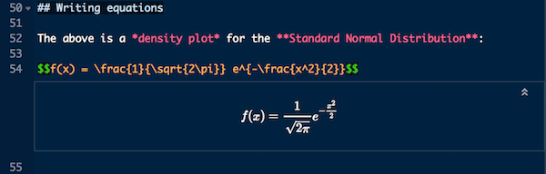
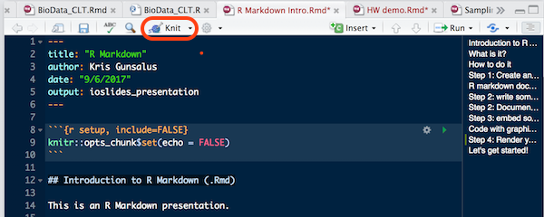

```{r setup, include=FALSE}
knitr::opts_chunk$set(echo = FALSE)
```


## What is it?

This is an R Markdown presentation. 

Markdown is a simple formatting syntax for authoring HTML, PDF, and MS Word documents. 

For more details on using R Markdown consult the [R Markdown page](https://kriscgun.github.io/xdasi-bio-2021/r_resources/1_r_rstudio/5_r_markdown.html)
on the course website.

## Overview

R markdown is a convenient way to present your R scripts that allows you to:

- Embed R code
- Run R code chunks
- Display R graphics output
- Annotate and explain your code
- Display mathematical equations (LaTeX)

You will be handing in all of your homework as .Rmd documents.

## How to do it

From within RStudio, you need to do four things:

1. Create an .Rmd document
2. Write some text
3. Write some code
4. Render the document

## Step 1: Create an .Rmd document

In the RStudio menu, select **File => New File => R Markdown ...**

- Give your document a title.
- Add your name.
- Add the date.
- Select **HTML** or **PDF** (you can change this later).

## **YAML header**

* "YAML ain't markup!"
* Encodes some metadata about the document
     


## Step 2: Add some text

* Use R Markdown tags to format the document (it's simple!)
* Headers, paragraphs, lists, etc. each use special symbols
* Use escape char `\` for special symbols like Greek letters
* Use `$` and `$$` for LaTeX-formatted equations



## Step 3: Embedded chunks of R code

* Insert blocks of code using 
  + the RStudio menu: Insert => R
  + keyboard shorcut: Command+Option+i (Mac) or Control+Option+i (PC)
* Code blocks are enclosed by \`\`\`\{r\} and \`\`\`
* Comments start with `#`

```{r test, echo = FALSE, eval = FALSE}
# This is a block of code
hiya <- paste("Hello","world!",sep = " ")
hiya
```


## Including graphics

+ `echo=FALSE` to hide the code; `eval=FALSE` to hide execution result (TRUE by default)
+ Can specify size


```{r normal_plot, echo=FALSE, eval=TRUE, fig.width=5, fig.height=3 }
x<-seq(-4,4,0.1)
y <- dnorm(x)
plot(x,y,type="h", xlab="Z-score", ylab="Density")
lines(x,y,col="purple", lwd=2)
```

## Step 4: Render your document

+ Click the **Knit** button to generate a document that includes both content as well as the output of any embedded R code chunks within the document.
+ Knit your document to **HTML** or **PDF**, **Word**, or a variety of other formats (e.g. slide presentations).



## Let's get started!

### Exercise

+ Open the R project you just created
+ Start an R Markdown document 
  - You will see some placeholders
  - Replace these with some of your own text and code
+ Knit your .Rmd file to html or pdf
  - Note that it will automatically be saved when you knit it
  
