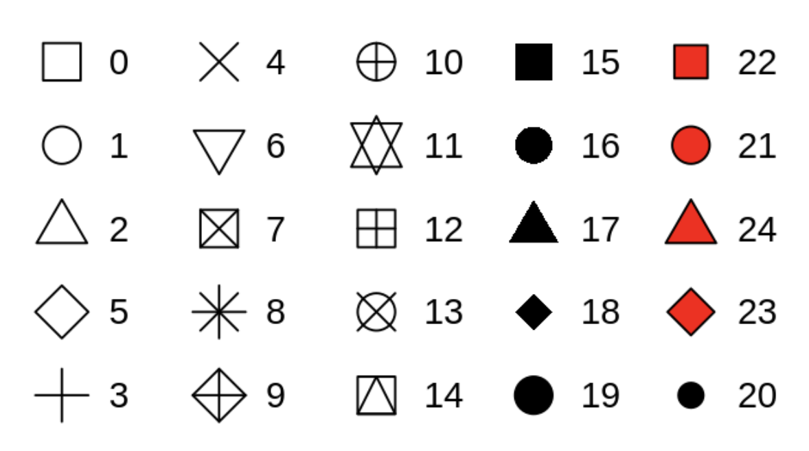
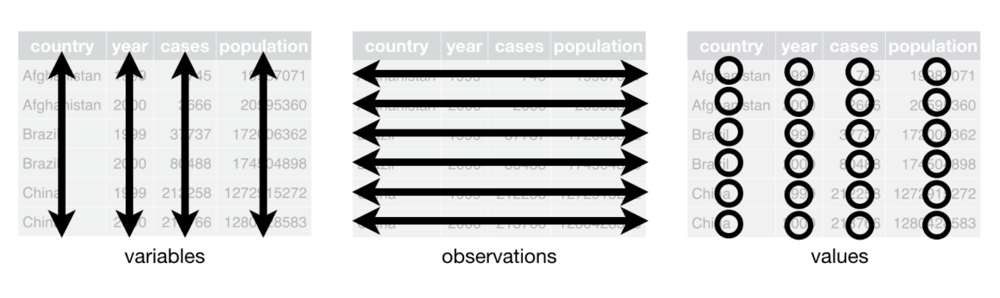

---
output:
  html_document:
    toc: yes
    toc_float: yes
    toc_depth: 3
    highlight: pygments
---

```{r setup, include=FALSE}
knitr::opts_chunk$set(echo = TRUE)
library(dplyr)         # for filtering and piping
library(tidyr)         # for gather
library(reshape2)      # for melt
library(ggplot2)       # for plotting
library(RColorBrewer)  # for palettes
library(ggpubr)        # for arranging plots
```

# [xdas-bio-2020](https://xdas.bio.nyu.edu/)

# Plotting with ggplot

The popular [**ggplot2**](https://ggplot2.tidyverse.org/) package is a powerful and a flexible R package, implemented by Hadley Wickham, for producing elegant graphics. It uses a systematic framework called ***the grammar of graphics*** that allows very fine-grained control over how your final product looks.

You will get lots of practice using ggplot during this course. Here, we just review the overall framework so you can get a feel for how ggplot plots are constructed.

## Introduction

There is an entire online book about ggplot2 called [**ggplot2: Elegant Graphics for Data Analysis**](https://ggplot2-book.org) by Hadley Wickam. It explains all the different aspects of ggplot2 mechanics and is a great quick reference.

Garrett Grolemund and Hadley Wickham have also compiled a book, [***R for Data Science***](https://r4ds.had.co.nz/), that provides a lot of information about managing and displaying data. It uses the **Tidyverse** approach to data management, and provides a good introduction to using ggplot2 for ***data exploration*** (Chapter 3), and later more detail about using it for ***communication*** (Chapter 28):

+ Chapter 3: Data Visualisation
+ Chapter 28: Graphics for Communication

... and don't forget the handy [**Data to Viz**](https://www.data-to-viz.com/) and [**R Graph Gallery**](https://www.r-graph-gallery.com/index.html) websites!


### ggplot2 Essentials

The following brief overview is adapted from an STHDA tutorial you can find [**here**](http://www.sthda.com/english/wiki/ggplot2-essentials) that covers all the basic types of plots you can make with ggplot. 

The concept behind ggplot2 divides plot into **three different fundamental** parts: 

**Plot = Data + Aesthetics + Geometry**

The principal elements of every plot can be defined as follows:

+ **Data** is a data frame (variables) to be plotted.
+ **Aesthetics**: the `aes()` function is used to indicate ***how*** to display the data: which categories or measurements to map to x and y coordinates; or color, size or shape of points, etc.
+ **Geometry** defines the ***type of graphics*** (histogram, box plot, line plot, density plot, dot plot, ….)

There are **two major functions** in the ggplot2 package:

+ `qplot()` stands for quick plot, which can be used to produce easily simple plots.
+ `ggplot()` function is more flexible and robust than `qplot()` for building a plot piece by piece.

Plots are constructed by **layering** geometries, additional aesthetics, and themes on top of the primary aesthetic mapping.

The **basic syntax** is:

```{r, eval=FALSE, echo=TRUE}
ggplot(data = <data.frame>,
       mapping = aes(x = <column of data.frame>, y = <column of data.frame>)) +
  geom_<type of geometry>()
```

_Note that the **plus sign**, indicating that more lines are to come, must always appear at the **end** of a line; putting this at the beginning of a line will cause an error._

### Aesthetics

If your data is **tidy**, then the columns of your data frame will contain the variables that you want to display. Each of these can be mapped to different **aesthetics** of the graph (e.g. axis, colors, shapes, etc.). A few of the examples below are based on Chapter 3 from ***R for Data Science***.

There are **two ways** to specify aesthetics:

  * **Mapping**: This maps specific types of **data** to different visual elements
    + Mappings are included ***inside*** `aes()`.
    + In the base layer of the graph, the mapping will be applied to all geometries.
    + In another layer, the mapping will be applied only to a particular geometry.
  * **Setting**: Manually set an aesthetic **independently** of data
    + Settings are placed ***outside*** of an `aes()` directive.
    
Aesthetic elements include things such as:

+ x- and y- axes
+ Colors
+ The size of points (in mm)
+ The shape of points (a number; see below)
+ Transparency (range 0-1)

Here are some examples:
  
```{r, out.width = "60%"}
library(ggplot2)
head(iris)
# quick plot with defaults
qplot(x=Sepal.Length, y=Sepal.Width, data=iris, geom = c("point"))
# Mapping data to coordinates (quantitative) and color (qualitative)
ggplot(data = iris, 
       mapping = aes(x=Sepal.Length, y=Sepal.Width, color=Species)) +
  geom_point()
# Here, putting the color aesthetic inside the geom layer works the same way 
# because there is only one geometry on this graph
# We also add a different shape and size, independent of the data
ggplot(iris, aes(x=Sepal.Length, y=Sepal.Width)) +
  geom_point(aes(color=Species), shape=18, size=3)
# assigning point color independent of data
ggplot(iris, aes(x=Sepal.Length, y=Sepal.Width)) +
  geom_point(color="blue")
# why doesn't this work?
ggplot(iris, aes(x=Sepal.Length, y=Sepal.Width)) +
  geom_point(aes(color="blue"))
# Change the size and opacity of points: data are mapped to size, but 
# transparency is independent of data
ggplot(data = iris, 
       mapping = aes(x=Sepal.Length, y=Sepal.Width, color=Species)) +
  geom_point(alpha = 0.4, aes(size = Petal.Length))
```

#### Color vs. fill

R has 25 built-in shapes that are identified by numbers:

{width=50%}

The `color` and `fill` aesthetics are applied differently to these different shapes, depending on whether they are:

+ hollow (0-14): `color` maps to border
+ solid (15-18): `color` maps to entire shape (border and fill)
+ filled (21-24): `color` maps to border, and `fill` maps to fill

Shapes for other types of plots can also have borders and fill designated separately (e.g. barplots, histograms, boxplots, violin plots).

### Geometries

**Geometries** control the ***type of visual paradigm*** you want to use to display your data, for example:

+ geom_bar() - barchart
+ geom_histogram() - histogram
+ geom_dotplot() - dot plot, a.k.a. strip chart
+ geom_boxplot() - boxplot
+ geom_violin() - violin plot
+ geom_point() - scatterplot

Geom functions also allow you to add additional features to a graph, for example:

+ geom_jitter() - spread points out (e.g. on strip charts) to make the data more visible
+ geom_vline() - add a vertical line (can also add other kinds of lines)

Statistical features can also be layered onto graphs, e.g.:

+ geom_smooth() - a regression line (according to a global or local model)
+ stat_summary() - add some kind of statistical function to a graph
  + This can also be done by adding `stat = "something"` inside another geometry (some examples below)

### Themes

[**Themes**](https://ggplot2.tidyverse.org/reference/theme.html) are used to customize the non-data components of your graphs, such as titles, labels, fonts, background, gridlines, and legends. The default appearance of ggplot graphs produces graphs with a gray background and white gridlines. This can be changed to almost any look and feel by customizing their themes, which can also be used to give plots a consistent look for presentation.

In addition to setting `theme()` components manually, the [**ggthemes*](https://yutannihilation.github.io/allYourFigureAreBelongToUs/ggthemes/) package also provides a variety of defined themes that replicate the look and feel for different visual paradigms and applications.

### Presenting multiple graphs together

Multiple unrelated graphs can be combined into a single figure using the **ggpubr** package. This allows you to make publication-ready figures with multiple panels. We show this for a couple of examples below.


## Types of Plots

A few examples of common plots are illustrated below. Examples for other plot types, including pie charts, line plots, QQ-plots, ECDFs, dendrograms, heat maps, etc. can be found at the **Data to Viz** website, the **R Graph Gallery**, or the [**STHDA tutorial**](http://www.sthda.com/english/wiki/ggplot2-essentials) tutorial mentioned above.

### Bar plots

If you have a **frequency table** for one or more categorical variables, you can use a barchart to summarize these data.

_Note: It is relatively common to see barplots with with error bars, showing a quantitative variable on the y-axis, but this is discouraged since it masks the true distribution of the data. It is recommended in such cases to use strip charts, boxplots, or violin plots._

#### One variable

```{r, out.width = "60%"}
avg.sepal.length = iris %>% group_by(Species) %>% 
  summarize(avg = mean(Sepal.Length), .groups = 'drop')
str(avg.sepal.length)
ggplot(avg.sepal.length, aes(x=Species,y=avg, fill=Species)) +
  geom_bar(stat="identity", color="black") +
  ylab("Mean Sepal Length (cm)")
```

#### Two variables

For two types of categorical variables, a single value for each type category can be displayed either **stacked** or **side-by-side**. Note that bars within categories are usually shown juxtaposed to each other, while bars showing data for different categories are shown with spaces in between them.

The options for arranging bars within groups are:

+ position_stack() - stack bars (default)
+ position_fill() - stack bars and scale to 1
+ position_dodge() - place bars side by side

Here we will plot average lengths for the different flower attributes in the iris dataset. To do this we first make a table of the mean measurements across all of the columns:

```{r}
# get the mean for all four measurements for all 3 species
iris.avg = iris %>% group_by(Species) %>% 
  summarise_all(list(mean))
iris.avg
```
##### Wide vs. Long format

This is great, but we have a problem because in order to plot the numerical data grouped by both species and flower attribute, we need to put each of these three "dimensions" into a different **column**. This means we need to **transform** our tidy data from a ***wide*** format to a ***long*** format:

{width=60%}
{width=60%}

To do this we can use the `gather()` command from the **tidyr** package, or the `melt()` command from the **reshape2** package. These end up doing pretty much the same thing, except the `gather()` command creates an object of class "tibble", which is just a fancy data frame. You don't need to worry about this for now.

*Note: the opposite of `gather()` is `spread()` and the opposite of `melt()` is `cast()`.*

```{r, collapse=TRUE}
iris.avg.long = gather(iris.avg, key="flower_attr", value="avg", -Species)
str(iris.avg.long)
head(iris.avg.long)
iris.avg.long2 = melt(iris.avg, variable.name="flower_attr", value.name = "avg")
str(iris.avg.long2)
head(iris.avg.long2)
```

Now that we have each of our two categorical variables in two different columns, and our average measurement in another column, we can plot all of these different combinations.

```{r, out.width = "60%"}
# make a barplot by group and measurement type
ggplot(iris.avg.long, aes(x=Species, y=avg, fill=flower_attr)) +
  geom_bar(stat="identity") +
  ylab("Mean Length (cm)")
```

Oops! This view makes it a bit difficult to compare lengths for each flower attribute across species. Let's make the chart again, but mapping our variables to different aesthetics:

```{r}
p.stacked = ggplot(iris.avg.long, aes(x=flower_attr, y=avg, fill=Species)) +
  geom_bar(stat="identity") +
  ylab("Mean Length (cm)")
p.beside = ggplot(iris.avg.long, aes(x=flower_attr, y=avg, fill=Species)) +
  geom_bar(stat="identity", position=position_dodge()) +
  ylab("Mean Length (cm)")
ggarrange(p.stacked, p.beside, common.legend = TRUE)
```


### Histogram

Histograms are good for showing the distribution of a **single quantitative variable**. Two or more distributions can be shown together on one histogram, though showing more than two or three gets really confusion. 

Here we illustrate showing the distributions of sepal length for the three different iris species with `qplot()`:

```{r, out.width = "60%"}
qplot(x = Sepal.Length,
      data = iris,
      binwidth = 0.2,
      fill = Species,
      color=Species,
      alpha=0.5,
      xlab = "Sepal Width (cm)")
```

... and with `ggplot()`:

```{r, out.width = "60%"}
p.iris = ggplot(iris, aes(x=Sepal.Length, fill=Species, color=Species))  +
  geom_histogram(alpha=0.3, binwidth=0.2)
p.iris
```

We can also decorate the plot with additional information by adding a new geometry:

```{r, out.width = "60%"}
# compute group means and plot them
p.iris + 
  geom_vline(data=avg.sepal.length,
             aes(xintercept=avg,color=Species),linetype="dashed")
```

Stacked histograms (multiple histograms shown one below the other) can also be used to show comparisons of multiple distributions, though other methods are more often used since they are more compact.

A fancier way to show multiple distributions is implemented by the **ggridges** package (see this [**gallery** for examples](https://cran.r-project.org/web/packages/ggridges/vignettes/gallery.html)).


### Scatterplot

These are used to show the relationships between two numerical variables. Points with different shapes and/or colors can also be used to split the data across different categories.

```{r}
# plot with LOESS best fit (local linear regression line)
lm1 = ggplot(iris, aes(x=Sepal.Length, y=Petal.Length, color=Species)) +
  geom_point(alpha=0.5) +
  geom_smooth(color="darkgray") # default method is loess
# same plot but overlaid with linear regression lines for each species 
lm2 = lm1 +
  geom_smooth(method=lm, aes(color=Species, fill=Species), 
              size=0.5, fullrange=TRUE)
ggarrange(lm1, lm2, common.legend=TRUE)
```


### Dotplot / Stripchart

Strip charts (a.k.a. dotpolots), boxplots, and violin plots are all good for comparing numerical distributions for multiple categories. Strip charts (dot plots) are good for showing distributions when there are few data points (<20-30); when there are more than this, it's a better choice to use boxplots and/or violin plots.

Strip charts / dotplots can be drawn in two different ways: using `geom_dotplot()` or `geom_jitter( )`, which produce slightly different visual displays. It is also possible to draw statistical summaries on top of them (see the Datanovia tutorial for examples).

```{r}
# dot plot
dp = ggplot(iris, aes(x=Species, y=Sepal.Length, fill=Species)) +
  geom_dotplot(binaxis = "y", stackdir="center", dotsize=.5)
# strip chart
sc = ggplot(iris, aes(x=Species, y=Sepal.Length, color=Species)) +
  geom_jitter(position=position_jitter(0.2))
ggarrange(dp, sc, labels=c("A","B"))
```

### Boxplot and violin plot

Below we make boxplots for the same data with different outlines and fill, and use the **ggpubr** package to arrange them in a figure:

```{r}
# data=colors(default)
a = ggplot(iris, aes(x=Species, y=Sepal.Length, color=Species)) +
  geom_boxplot()
# fill=data + outline=all
b = ggplot(iris, aes(x=Species, y=Sepal.Length, fill=Species)) +
  geom_boxplot(color="magenta")
# outline=data + color=manual
c = ggplot(iris, aes(x=Species, y=Sepal.Length, color=Species)) +
  geom_boxplot() +
  scale_color_manual(values=c("orange", "forestgreen", "purple"))
# fill=data(default) + outline=palette
d = ggplot(iris, aes(x=Species, y=Sepal.Length, fill=Species)) +
  geom_boxplot(color="pink") +
  scale_color_brewer(palette="Set1")
# ggpubr: arrange and label plots!
ggarrange(a, b, c, d,
          labels = c("A", "B", "C", "D"),
          ncol = 2, nrow = 2)
```

... and here we show how to combine boxplots with violin plots, which show both distributions and summary statistics all at once:

```{r}
box = ggplot(iris, aes(x=Species, y=Sepal.Length, color=Species)) +
  geom_boxplot()
vln = ggplot(iris, aes(x=Species, y=Sepal.Length, fill=Species)) +
  geom_violin()
# both together
bv = ggplot(iris, aes(x=Species, y=Sepal.Length, fill=Species)) +
  geom_violin(trim=FALSE) +
  geom_boxplot(width=0.1, fill="white")
figure = ggarrange(box, vln, bv,labels = c("A", "B", "C"))
figure
```

### Faceting

Sometimes we want to show numerical data separated by category, or split according to multiple categories. We can use **facets** to show a bunch of related data arranged in multiple **panels**. See [this tutorial](https://www.datanovia.com/en/lessons/combine-multiple-ggplots-into-a-figure/) from Datanovia for examples.

The following is based on the ***Facetting*** chapter from the online [**ggplot2** book](https://ggplot2-book.org/facet.html).

+ Facet plots, also called "lattice" or "trellis" plots, are a powerful tool for exploratory data analysis: you can rapidly compare patterns in different parts of the data and see whether they are the same or different. There are three types of faceting:

+ facet_null() - a single plot (default)
+ facet_wrap() - “wraps” a 1D ribbon of panels into 2D (useful if you have a large number of categories)
+ facet_grid() - produces a 2D grid of panels defined by different variables, which form the rows and columns

This figure from the book illustrates the differences between wrapping and making a grid:

{width=60%}

+ `facet_wrap()` makes a long ribbon of panels (generated by any number of variables) and wraps it into 2d. This is useful if you have a single variable with many levels and want to arrange the plots in a more space efficient manner.
+ facet_grid() lays out plots in a 2d grid

Both of these can be specified with one or two variables defined by a **formula** (specified with a tilde symbol, `~`). The difference is in the specific **syntax**. 

The output will be similar for one variable, but for two variables the axis labels will differ, and and `facet_grid()` will produce a more sensible representation of the data.

* Syntax for `facet_wrap()`:
  + `(~ a)` - spreads the values of ***a*** across panels
facilitates comparisons of ***y*** position, because the vertical scales are aligned.
  + `(~ a + b)` - spreads the combinations of values for both ***a***and ***b***

For the **iris** dataset:

```{r, out.width = "60%"}
base.plot = ggplot(iris, aes(x=Petal.Length, y=Petal.Width, color=Species)) +
  geom_point()
base.plot
  
base.plot + facet_wrap(~ Species)
base.plot + facet_wrap(~ Species, ncol=1)
```

* Syntax for `facet_grid()`:
  + `(. ~ a)` - spreads the values of ***a*** across the columns. This direction
facilitates comparisons of ***y*** position, because the vertical scales are aligned.
  + `(b ~ .)` - spreads the values of ***b*** down the rows. This direction facilitates comparison of ***x*** position because the horizontal scales are aligned. This makes it particularly useful for comparing distributions.
  + `(a ~ b)` - spreads ***a*** across columns and ***b*** down rows. You’ll usually want to put the variable with the greatest number of levels in the columns, to take advantage of the aspect ratio of your screen.

We can easily split our plots by **Species** to produce the same output as `facet_wrap()`:

```{r, out.width = "60%"}
base.plot + facet_grid(. ~ Species)
base.plot + facet_grid(Species ~ .)
```

However, since the **iris** dataset contains only **one categorical variable**, we would have to do something fancier to get good mileage out of `facet_grid()` for this example. 

We can do this by *splitting some of the quantitative data into categories* (this is kind of a kluge)^[https://stackoverflow.com/questions/40350230/variable-hline-in-ggplot-with-facet]. Below we plot Sepal Length against Sepal Width (quantitative variables) split out by Petal type (Long vs. Short, Narrow vs. Wide):

```{r}
data=iris
data$Petal.Width.Range=factor(ifelse(data$Petal.Width<1.3,"Narrow Petals","Wide Petals"))
data$Petal.Length.Range=factor(ifelse(data$Petal.Length<4.35,"Short Petals","Long Petals"))
ggplot(data, aes(x=Sepal.Length, y=Sepal.Width, color=Species)) + 
  geom_point(alpha=0.5) +
  facet_grid(Petal.Width.Range ~ Petal.Length.Range)
```

You should consult the ggplot2 book chapter for information on customization, such as controlling axis **scales**, or cutting continuous variables into bins in order to facet them.


## Writing to files

We still use the `par()` command to specify the output file for a graph:

```{r}
pdf("boxplot.pdf")
figure
dev.off()
```


## Resources

### Documentation

+ [**ggplot2 Documentation**](https://ggplot2.tidyverse.org/) 
  + [**Quick Guide**](https://ggplot2.tidyverse.org/reference/) to functions for different layers
+ [**Tidyverse website**](https://ggplot2.tidyverse.org/)
+ [**ggplot2 Cheatsheet**](https://github.com/rstudio/cheatsheets/blob/master/data-visualization-2.1.pdf)
+ [**ggplot2: Elegant Graphics for Data Analysis**](https://ggplot2-book.org)
+ [**R for Data Science**](https://r4ds.had.co.nz/)]
  + Chapter 3: Data Visualisation
  + Chapter 28: Graphics for Communication

### Tutorials

+ [**ggplot Essentials**](http://www.sthda.com/english/wiki/ggplot2-essentials) - a **tutorial** on ggplot plotting techniques with examples
  + ***Basic plots:*** qplot, boxplots, violin plots, dot plots, strip charts, density plots, histograms, scatter plots, bar plots, line plots, error bars, pie chars, qqplots, ECDF plots, saving plots
+ A good tutorial on [**mosaic plots**](https://cran.r-project.org/web/packages/ggmosaic/vignettes/ggmosaic.html) (not discussed here)
  
### Examples

Don't forget to check out these great resources:

+ [**Data to Viz**](https://www.data-to-viz.com/)
+ [**R Graph Gallery**](https://www.r-graph-gallery.com/index.html)

### Extensions

+ [**Mode blog: 12 Extensions to ggplot2 for More Powerful R Visualizations**](https://mode.com/blog/r-ggplot-extension-packages/)
  + gganimate - animate ggplot2 visualizations
  + ggdendro - flexible dendrogram manipulation
  + ggthemes - extended themes to control the look and feel of graphs, including colorblind palette
  + ggpubr - publication-ready plots
  + [Plotly](https://plotly.com/r/) - graphing library for interactive and dynamic plots
  + patchwork - combine and arrange multiple plots
  + ggridges - ridgeline plots (helpful for showing changes in distributions over time)
  + ggmap - spatial data and models
  + ggrepel - greater control over how text looks in plots
  + ggradar - radar / spider charts
  + ggcorrplot - chart correlation matrices
  + GGally - "functions to reduce the complexity of combining geometric objects with transformed data"; includes ggpairs for fancy plot matrices
  + ggiraph - interactive charts with html and javascript integration
+ A seemingly random [**gallery**](https://yutannihilation.github.io/allYourFigureAreBelongToUs/) of ggplot extensions

---

*** Author: Kris Gunsalus ***