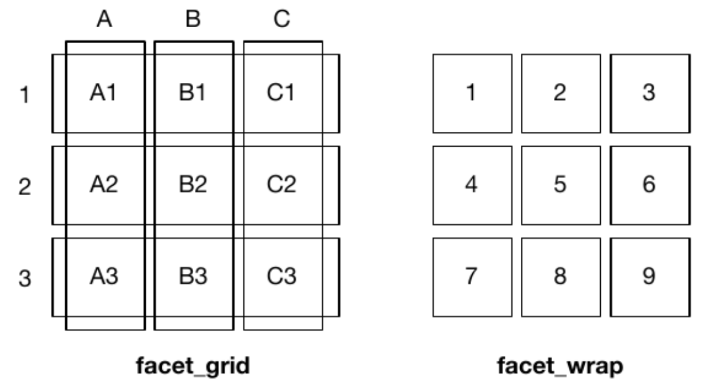

```{r setup, include=FALSE}
knitr::opts_chunk$set(echo = TRUE)
```

# Output devices

To export any kind of plot, you need some sort of "canvas" to draw on. In the RStudio GUI, as a default, plots will be printed in a new window, or if you are using R Markdown they will appear inline. Still, even in these cases you may want to use devices to write your plot to a file.

The kind of output that is produced is controlled by a ***device*** directive, which by default is set to `null device`. On a windows machine it is actually a device called `windows()`; on a Mac it is called `quartz()`.

+ You may choose the kind of output that is produced by redirecting the output to another type.
+ Different devices include: PDF, PostScript, bitmap, jpeg, png, and LaTeX.
+ These devices will not print to the GUI -- instead they will save a file in the working directory.

```{r}
#open a new window
#windows() #on a pc
quartz() #on a mac

#current device
dev.cur()

```

PDF output is really useful. Let us try to write a random plot to a pdf file.

```{r, collapse=TRUE}
#start pdf device
pdf("mycoolplot.pdf") # you can specify many other parameters here, e.g. size, dpi, etc

# make a random plot
plot(1)

#list of devices
dev.list()
dev.cur()
```

```{r, collapse=TRUE}
#select a device
dev.set(3)

#end a device or close a file
dev.off()
dev.cur()

dev.off()
dev.cur()
```

# Essentials of base R graphics

Here we introduce the basic elements of the [**graphics**](https://www.rdocumentation.org/packages/graphics/versions/3.6.2) package, which is part of the base R distribution. 

The **graphics** package provides ***functions*** for creating all kinds of plots. Many of these can be used to conveniently get a quick idea of what your data look like. They are simple yet powerful.

There are also many graphical ***parameters*** that can be set in order to control the appearance of points and lines, axis ticks, plot labels, text, and arrangement of plots when multiple plots are generated at the same time. Other packages will come with their own plotting functions, but generally they access the same range of parameters.

Learning to fine-tune the appearance of plots using the base graphics package can be very tedious and unrewarding. This is why we will transition to mainly using the **ggplot2** package to take our graphics to the next level. Nevertheless, we think it is important for you to know that these base functions exist and are available if you want to use them.

## The plot() function can automatically generate plots

The generic function for plotting R objects is aptly called `plot()`. The default output
of the function depends on the object it is passed.

`ldeaths` is an object of class `ts` (time series) that is provided in R.
This dataset provides the number of deaths in UK from 1974-1979 due to lung disease.
Since it is a numerical vector, the plot function plots a line.

```{r}
plot(ldeaths)
```

The built-in `iris` dataset contains measurements on sepals and petals of three different species of iris.
Its class is `data.frame`. In this case, `plot()` shows all comparisons between the 5 columns in the data frame.

```{r}
head(iris)
plot(iris)
```

## The plot() function can be also programmed to generate simple scatter plots

Rather than relying on the ability of `plot()` to automatically recognize the structure of your R object, you can use this function to create simple scatter plots by explicitly specifying `x` and `y` parameters.

```{r}
plot(x=iris$Sepal.Length,
     y=iris$Sepal.Width)
```

Let us color the points by species (`iris$Species`). Somewhat confusingly, the `plot()` help file (see `?plot`) does not describe any parameters to specify color. Instead, it says:
`... Arguments to be passed to methods, such as graphical parameters (see par).`
So, you should look up documentation for `par()` (`?par`), where you will find an extensive list of graphical parameters that you can pass to `plot()` and other similar functions. The parameter we need is `col`.

```{r}
plot(x=iris$Sepal.Length,
     y=iris$Sepal.Width,
     col='red') # pass a single value to color *all* points the same way
```
```{r}
species_colors = iris$Species # make a copy of the Species column
levels(species_colors) # examine the number of levels
levels(species_colors) = c("red","green","blue") # set color names as levels
species_colors = as.character(species_colors) # convert factor to character vector
species_colors # check

plot(x=iris$Sepal.Length,
     y=iris$Sepal.Width,
     col=species_colors) # pass a vector of colors to set the color of each point individually
```

You may also want to tweak some other things, e.g. axis labels. 

```{r}
plot(x=iris$Sepal.Length,
     y=iris$Sepal.Width,
     col=species_colors,
     xlab='Sepal length, mm',
     ylab='Sepal width, mm')
```

# Essentials of ggplot2

The following brief overview is adapted from an STHDA tutorial you can find [**here**](http://www.sthda.com/english/wiki/ggplot2-essentials) that covers all the basic types of plots you can make with ggplot. 

The concept behind ggplot2 divides plot into **three different fundamental** parts: 

**Plot = Data + Aesthetics + Geometry**

The principal elements of every plot can be defined as follows:

+ **Data** is a data frame (variables) to be plotted.
+ **Aesthetics**: the `aes()` function is used to indicate ***how*** to display the data: which categories or measurements to map to x and y coordinates; or color, size or shape of points, etc.
+ **Geometry** defines the ***type of graphics*** (histogram, box plot, line plot, density plot, dot plot, ….)

There are **two major functions** in the ggplot2 package:

+ `qplot()` stands for quick plot, which can be used to produce easily simple plots.
+ `ggplot()` function is more flexible and robust than `qplot()` for building a plot piece by piece.

Plots are constructed by **layering** geometries, additional aesthetics, and themes on top of the primary aesthetic mapping.

The **basic syntax** is:

```{r, eval=FALSE, echo=TRUE}
ggplot(data = <data.frame>,
       mapping = aes(x = <column of data.frame>, y = <column of data.frame>)) +
  geom_<type of geometry>()
```

### Aesthetics

If your data is **tidy**, then the columns of your data frame will contain the variables that you want to display. Each of these can be mapped to different **aesthetics** of the graph (e.g. axis, colors, shapes, etc.). A few of the examples below are based on Chapter 3 from ***R for Data Science***.

There are **two ways** to specify aesthetics:

  * **Mapping**: This maps specific types of **data** to different visual elements
    + Mappings are included ***inside*** `aes()`.
    + In the base layer of the graph, the mapping will be applied to all geometries.
    + In another layer, the mapping will be applied only to a particular geometry.
  * **Setting**: Manually set an aesthetic **independently** of data
    + Settings are placed ***outside*** of an `aes()` directive.
    
Aesthetic elements include things such as:

+ x- and y- axes
+ Colors
+ The size of points (in mm)
+ The shape of points (a number; see below)
+ Transparency (range 0-1)

### Geometries

**Geometries** control the ***type of visual paradigm*** you want to use to display your data, for example:

+ geom_bar() - barchart
+ geom_histogram() - histogram
+ geom_dotplot() - dot plot, a.k.a. strip chart
+ geom_boxplot() - boxplot
+ geom_violin() - violin plot
+ geom_point() - scatterplot

Geom functions also allow you to add additional features to a graph, for example:

+ geom_jitter() - spread points out (e.g. on strip charts) to make the data more visible
+ geom_vline() - add a vertical line (can also add other kinds of lines)

Statistical features can also be layered onto graphs, e.g.:

+ geom_smooth() - a regression line (according to a global or local model)
+ stat_summary() - add some kind of statistical function to a graph
  + This can also be done by adding `stat = "something"` inside another geometry (some examples below)

### Themes

[**Themes**](https://ggplot2.tidyverse.org/reference/theme.html) are used to customize the non-data components of your graphs, such as titles, labels, fonts, background, gridlines, and legends. The default appearance of ggplot graphs produces graphs with a gray background and white gridlines. This can be changed to almost any look and feel by customizing their themes, which can also be used to give plots a consistent look for presentation.

In addition to setting `theme()` components manually, the [**ggthemes*](https://yutannihilation.github.io/allYourFigureAreBelongToUs/ggthemes/) package also provides a variety of defined themes that replicate the look and feel for different visual paradigms and applications.

## qplot() can automatically generate plots

Let us recreate the Sepal.Length vs Sepal.Width scatterplot using `qplot()`.

```{r}
library(ggplot2)
head(iris)

# quick plot with defaults
qplot(x=Sepal.Length,
      y=Sepal.Width,
      data=iris,
      xlab='Sepal length, mm',
      ylab='Sepal width, mm',
      geom=c("point")) # set geometry - this is the biggest difference from base R
```

## ggplot() is a function to build plots piece-by-piece

Let us recreate the Sepal.Length vs Sepal.Width scatterplot using `ggplot()`.

```{r}
ggplot(data=iris, 
       mapping=aes(x=Sepal.Length,   # set aesthetics
                   y=Sepal.Width)) +
  geom_point() +                     # set geometry
  theme_grey() +                     # set theme (although this theme is default)
  xlab('Sepal length, mm') +
  ylab('Sepal width, mm')
```

Again, you can set a color for all points or each point independently depending on which species it belongs to.

```{r}
# pass a single value to the parameter color inside the geometry function to color *all* points the same way
ggplot(data=iris,
       mapping=aes(x=Sepal.Length,
                   y=Sepal.Width)) +
  geom_point(color="red") + # here
  xlab('Sepal length, mm') +
  ylab('Sepal width, mm')

# pass the name of the data.frame column by which to color points to the parameter color inside the aesthetics
ggplot(data=iris, 
       mapping=aes(x=Sepal.Length,
                   y=Sepal.Width,
                   color=Species)) + # here
  geom_point() +
  xlab('Sepal length, mm') +
  ylab('Sepal width, mm')

ggplot(data=iris, 
       mapping=aes(x=Sepal.Length,
                   y=Sepal.Width,
                   color=Species)) +
  geom_point(mapping=aes(color=Species)) + # you can also create an aesthetics mapping inside geometries!
  xlab('Sepal length, mm') +
  ylab('Sepal width, mm')
```

# Histograms

Histograms are good for showing the distribution of a **single quantitative variable**. Two or more distributions can be shown together on one histogram, though showing more than two or three gets really confusion. 

## hist() in base R

Base R has a special function called `hist()`.

```{r}
hist(iris$Sepal.Length)
```

Keep in mind that `iris` contains data for three species, so the histogram above makes little biological sense because it is a mixture of measurements of three different species! There is no way to separate them inside `hist()`, so you may split the data.frame manually.

```{r}
virnica_rows = which(iris$Species=='virginica')
iris_virginica = iris[virnica_rows,]

hist(iris_virginica$Sepal.Length)
```

## qplot() and geom_histogram() in ggplot2

`qplot()` provides an easy way to display the data for the three species overlayed.

```{r}
qplot(x=Sepal.Length,
      data=iris,
      fill=Species,
      color=Species,
      alpha=0.5) # make the bars semi-transparent
```

The same with `ggplot()`:

```{r}
ggplot(data=iris,
       mapping=aes(x=Sepal.Length,
                   fill=Species,
                   color=Species))  +
  geom_histogram(alpha=0.5)
```

# Boxplots and violin plots

Boxplots and violin plots are good for comparing numerical distributions for multiple categories. Specifically, boxplots (or box and whisker plots) allow you to compare the **median**, and quartiles of the data sets, while violin plots depict the density of data points.

## boxplot() in base R

Base R has a built-in function `boxplot()`. Pay attention to the `~` notation in the argument passed to the parameter `formula`.

```{r}
boxplot(formula = iris$Sepal.Length ~ iris$Species,
        xlab = "Species",
        ylab = "Sepal length, mm")
```

## geom_boxplot() and geom_violin() in ggplot2

Below we make boxplots and violinplots for the same data, and use the **ggpubr** package to arrange them in a figure.

```{r}
library(ggpubr)

# boxplot only
box = ggplot(iris, aes(x=Species, y=Sepal.Length, color=Species)) +
  geom_boxplot()

# violin plot only
vln = ggplot(iris, aes(x=Species, y=Sepal.Length, fill=Species)) +
  geom_violin()

# both together
bv = ggplot(iris, aes(x=Species, y=Sepal.Length, fill=Species)) +
  geom_violin(trim=FALSE) +
  geom_boxplot(width=0.1, fill="white")

# arrange in the same figure
figure = ggarrange(box, vln, bv,
                   labels = c("A", "B", "C"))
figure
```

# Bar plots

Bar plots are among the most common plots and are useful for comparing data values.
More complex bar plots can show the different factors that contribute to the value.

## barplot() in base R

Base R has a built-in function `barplot()`.

+ The first argument to `barplot()` is `height`, which is expected to be a vector or a matrix.
+ The arrangment of bars is given by the `beside` argument. The default value is `FALSE`.
+ If `height` is a matrix, the default setting makes a stacked barplot.

```{r}
# create sample data
sampleData.df = data.frame(Control=sample(20,5),
                           Nitrogen=sample(20,5),
                           Phospate=sample(20,5))
rownames(sampleData.df) = c("GeneA","GeneB","GeneC", "GeneD", "GeneE")
sampleData.df # take a look

# genes in Control condition
barplot(height=sampleData.df$Control,
        names.arg=row.names(sampleData.df))

# matrix with stacked bars
barplot(height=as.matrix(sampleData.df))
#barplot(height = sampleData.df) # this does not work!

# side-by-side bars in the rainbow palette, horizontal orientation
barplot(height=as.matrix(sampleData.df),
        beside=TRUE,
        horiz=TRUE,
        col=rainbow(4))
```

Oops! What happened? `rainbow(4)` makes a palette that just recycles four different colors. Since we have 5 genes, and we want the colors to match across groups, we need the right number of colors. Let's fix this up, and also add a legend. We will place the legend somewhere on the graph by specifying x- and y-coordinates.

```{r}
barplot(height=as.matrix(sampleData.df),
        beside=TRUE,
        horiz=TRUE,
        col=rainbow(5))
legend(15, 10, legend = rownames(sampleData.df), fill = rainbow(5))
```

## geom_bar() in ggplot2

To use ggplot2, we will need to transform `sampleData.df`. To plot the numerical data grouped by both gene and condition attribute, we need to put each of these three "dimensions" into a different **column**. This means we need to **transform** our  data from a ***wide*** format to a ***long*** format:

{width=60%}
{width=60%}

To do this we can use the `stack()` command.

```{r}
sampleData.df.long = stack(sampleData.df)
head(sampleData.df.long) # check

colnames(sampleData.df.long)[2] = "Condition" # rename "ind" to "Condition"

sampleData.df.long$Gene = rep(rownames(sampleData.df),3) # create "Gene" column from the row names of sampleData.df
head(sampleData.df.long) # check
```

Stacked bars:

```{r, out.width = "60%"}
ggplot(data=sampleData.df.long,
       aes(x=Condition,
           y=values,
           fill=Gene)) +
  geom_bar(stat="identity",
           color="black")
```

Bars side-by-side:

```{r}
ggplot(data=sampleData.df.long,
       aes(x=Condition,
           y=values,
           fill=Gene)) +
  geom_bar(stat="identity",
           color="black",
           position=position_dodge())
```

# Faceting

Sometimes we want to show numerical data separated by category, or split them according to multiple categories. In other cases we just want to look at several plots side-by-side. For this, we can arrange plot in multiple **panels**.

## mfrow() and mfcol() in base R

+ mfrow – number of plots to be drawn in a window (also mfcol)

The `mfrow()` argument in the `par()` function allows you to define the number of
figure panels you want in the device, and how they are to be arranged in terms of rows and columns.

Note that repeated calls to plotting functions will fill up the device according to the number of panels specified by `mfrow()`. If `plot()` is called more times than the number of plots specified, then a new window is opened with the same `mfrow()` options.

```{r}
# display four plots in a 2x2 grid
par(mfrow=c(2,2))
boxplot(iris$Sepal.Length ~ iris$Species,main="Sepal Length",xlab="Species",ylab="cm")
boxplot(iris$Sepal.Width ~ iris$Species,main="Sepal Width",xlab="Species",ylab="cm")
boxplot(iris$Petal.Length ~ iris$Species,main="Petal Length",xlab="Species",ylab="cm")
boxplot(iris$Petal.Length ~ iris$Species,main="Petal Width",xlab="Species",ylab="cm")

# reset display to one graph only
par(mfrow=c(1,1))
```

## facet_wrap() and facet_grid() in ggplot2

+ Facet plots, also called "lattice" or "trellis" plots, are a powerful tool for exploratory data analysis: you can rapidly compare patterns in different parts of the data and see whether they are the same or different. There are three types of faceting:

+ facet_null() - a single plot (default)
+ facet_wrap() - “wraps” a 1D ribbon of panels into 2D (useful if you have a large number of categories)
+ facet_grid() - produces a 2D grid of panels defined by different variables, which form the rows and columns

This figure from the book illustrates the differences between wrapping and making a grid:

{width=60%}

+ `facet_wrap()` makes a long ribbon of panels (generated by any number of variables) and wraps it into 2d. This is useful if you have a single variable with many levels and want to arrange the plots in a more space efficient manner.
+ facet_grid() lays out plots in a 2d grid

Both of these can be specified with one or two variables defined by a **formula** (specified with a tilde symbol, `~`). The difference is in the specific **syntax**. 

The output will be similar for one variable, but for two variables the axis labels will differ, and and `facet_grid()` will produce a more sensible representation of the data.

* Syntax for `facet_wrap()`:
  + `(~ a)` - spreads the values of ***a*** across panels
facilitates comparisons of ***y*** position, because the vertical scales are aligned.
  + `(~ a + b)` - spreads the combinations of values for both ***a***and ***b***

For the **iris** dataset:

```{r, out.width = "60%"}
base.plot = ggplot(iris, aes(x=Petal.Length, y=Petal.Width, color=Species)) +
  geom_point()
base.plot
  
base.plot + facet_wrap(~ Species)
base.plot + facet_wrap(~ Species, ncol=1)
```

* Syntax for `facet_grid()`:
  + `(. ~ a)` - spreads the values of ***a*** across the columns. This direction
facilitates comparisons of ***y*** position, because the vertical scales are aligned.
  + `(b ~ .)` - spreads the values of ***b*** down the rows. This direction facilitates comparison of ***x*** position because the horizontal scales are aligned. This makes it particularly useful for comparing distributions.
  + `(a ~ b)` - spreads ***a*** across columns and ***b*** down rows. You’ll usually want to put the variable with the greatest number of levels in the columns, to take advantage of the aspect ratio of your screen.

We can easily split our plots by **Species** to produce the same output as `facet_wrap()`:

```{r, out.width = "60%"}
base.plot + facet_grid(. ~ Species)
base.plot + facet_grid(Species ~ .)
```

However, since the **iris** dataset contains only **one categorical variable**, we would have to do something fancier to get good mileage out of `facet_grid()` for this example. 

We can do this by *splitting some of the quantitative data into categories* (this is kind of a kluge)^[https://stackoverflow.com/questions/40350230/variable-hline-in-ggplot-with-facet]. Below we plot Sepal Length against Sepal Width (quantitative variables) split out by Petal type (Long vs. Short, Narrow vs. Wide):

```{r}
data=iris
data$Petal.Width.Range=factor(ifelse(data$Petal.Width<1.3,"Narrow Petals","Wide Petals"))
data$Petal.Length.Range=factor(ifelse(data$Petal.Length<4.35,"Short Petals","Long Petals"))
ggplot(data, aes(x=Sepal.Length, y=Sepal.Width, color=Species)) + 
  geom_point(alpha=0.5) +
  facet_grid(Petal.Width.Range ~ Petal.Length.Range)
```

You should consult the ggplot2 book chapter for information on customization, such as controlling axis **scales**, or cutting continuous variables into bins in order to facet them.


