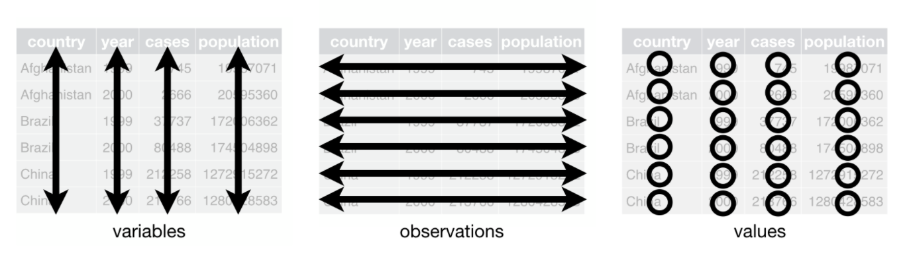

```{r setup, include=FALSE}
knitr::opts_chunk$set(echo = TRUE)
library(ggplot2)
```


# Output devices

To make any kind of plot, you need some sort of "canvas" to draw on. In the RStudio GUI, as a default, plots will be printed in the **Plots** window, or if you are using R Markdown they will appear inline. 

The ***device*** directive controls the output stream, which by default is set to `null device`, meaning that they will appear directly on your screen. On a Windows machine it is actually a device called `windows()`; on a Mac it is called `quartz()`.

In R, new plots will just overwrite old plots in the same device, unless you open a device to create a new canvas.

```{r}
#open a new window
#windows() #on a pc
quartz() #on a mac

#current device
dev.cur()
```

In RStudio they are saved in your current session and you can scroll through them. The Plots menu allows you to pop them open in a new window, or save them to a file using the menu.

Let's see what happens when we make a plot and redirect its output to a new device. First, let's use the built-in `iris` dataset, which contains measurements on sepals and petals of three different species of iris.
Its class is `data.frame`.

First, let's use this dataset to make a plot that just gets sent to the screen from within this .Rmd file. Notice that the plot appears inline.

Then we will try different variants:

+ paste the code into the console (do it more than once)
+ start a new `quartz()` window in the console and write it there

```{r}
?iris
head(iris)
str(iris)

# ================================================== #
# 1. scatter plot of petal width vs. length (RMD)
plot(iris$Petal.Length, iris$Petal.Width)

# open new device first
quartz()
plot(iris$Petal.Length, iris$Petal.Width)
dev.off()

# repeat in console
plot(iris$Petal.Length, iris$Petal.Width, col="orange")
dev.cur()

# ================================================== #
# plot directly from console
plot(iris$Petal.Length, iris$Petal.Width)

# plot directly from console, with blue points
plot(iris$Petal.Length, iris$Petal.Width, col="blue")

# ================================================== #
# plot directly from console
plot(iris$Petal.Length, iris$Petal.Width, col="red")

# plot directly from console, with blue points
plot(iris$Petal.Length, iris$Petal.Width, col="green")
dev.off()  # what happened to the plot?

```


## Writing to files

You can redirect your output to another type of device if you want to write your plot to a file.

+ Different devices include: PDF, PostScript, bitmap, jpeg, png, and LaTeX.
+ These devices will not print to the GUI -- instead they will save a file in the working directory.

PDF output is really useful. Let us try to write a random plot to a pdf file.

```{r, collapse=TRUE}
# ================================================== #
# plot to PDF file in RMD (execute all at once)
pdf("iris_plot.pdf")
plot(iris$Petal.Length, iris$Petal.Width, col="purple")
dev.off()
dev.cur()

# ================================================== #
# repeat in console

pdf("iris_plot.pdf")
plot(iris$Petal.Length, iris$Petal.Width, col="magenta")
dev.off()

dev.cur()
```


# Essentials of base R graphics

Here we introduce the basic elements of the [**graphics**](https://www.rdocumentation.org/packages/graphics/versions/3.6.2) package, which is part of the base R distribution. 

The **graphics** package provides ***functions*** for creating all kinds of plots. Many of these can be used to conveniently get a quick idea of what your data look like. They are simple yet powerful.

There are also many graphical ***parameters*** that can be set in order to control the appearance of points and lines, axis ticks, plot labels, text, and arrangement of plots when multiple plots are generated at the same time. Other packages will come with their own plotting functions, but generally they access the same range of parameters.

Learning to fine-tune the appearance of plots using the base graphics package can be very tedious and unrewarding. This is why we will transition to mainly using the **ggplot2** package to take our graphics to the next level. Nevertheless, we think it is important for you to know that these base functions exist and are available if you want to use them.


## The `plot()` function: automatic plot

The generic function for plotting R objects is aptly called `plot()`. The default output
of the function depends on the object it is passed.

`ldeaths` is an object of class `ts` (time series) that is provided in R.
This dataset provides the number of deaths in UK from 1974-1979 due to lung disease.
Since it is a numerical vector, the plot function plots a line.

```{r}
plot(ldeaths)
```

For the `iris` data frame, `plot()` shows all comparisons between the 5 columns in the data frame.

```{r}
head(iris)
str(iris)
plot(iris)
```


## The `plot()` function: scatter plot

Rather than relying on the ability of `plot()` to automatically recognize the structure of your R object, you can use this function to create simple scatter plots by explicitly specifying `x` and `y` parameters. We did this above already.

```{r}
plot(x=iris$Sepal.Length,
     y=iris$Sepal.Width)
```


# Customizing parameters

Above, we also drew the points in different colors. You may also want to tweak some other things, like the shape and size of the points, and the axis labels, or overlay additional information, such as a regression line.

Somewhat confusingly, the `plot()` help file (see `?plot`) does not describe any parameters to specify color. Instead, it says:
`... Arguments to be passed to methods, such as graphical parameters (see par).`

So you need to look up `par` in the Help to get a list of these. You can set parameters globally, or within a plot function. See [**QuickR: Graphical Parameters**](https://www.statmethods.net/advgraphs/parameters.html) by Datacamp for more info on these parameters.

```{r}
# ================================================== #
# facy plot
x=iris$Sepal.Length
y=iris$Sepal.Width

plot(x, y,
     pch = 15, # 23
     col = "blue",
     cex = 0.5,
     xlab='Sepal length, mm',
     ylab='Sepal width, mm')

# ================================================== #
# add a regression line
# this throws an error if try to use dataframe cols directly
# this is because the function wants a matrix or vector object
abline(lm(y ~ x))
```


# Coloring by dataset


So, you should look up documentation for `par()` (`?par`), where you will find an extensive list of graphical parameters that you can pass to `plot()` and other similar functions. The parameter we need is `col`.

```{r}
plot(x=iris$Sepal.Length,
     y=iris$Sepal.Width,
     col='red') # pass a single value to color *all* points the same way
```

We can also color the points by dataset.

```{r}
# ================================================== #
# default
plot(x=iris$Sepal.Length,
     y=iris$Sepal.Width,
     col=iris$Species)

# use different colors
plot(x=iris$Sepal.Length,
     y=iris$Sepal.Width,
     col=c("red","green","blue"))
```

You can also specify color using a character vector of the same length as the factor vector in the dataframe, but this is more complicated!

```{r}
# ================================================== #
# make a copy of the Species column and check the levels
species_colors = iris$Species
levels(species_colors) 

# ================================================== #
# set color names as levels
levels(species_colors) = c("orange","purple","aquamarine")
species_colors                # what is this vector?
str(species_colors)           # is it already a factor?

# try this
plot(iris$Sepal.Length,
     y=iris$Sepal.Width,
     col=species_colors)

# ================================================== #
# huh? we need to convert the factor vector to a character vector
# why? these are not already part of the data frame (I don't get this behavior)
species_colors = as.character(species_colors)
plot(x=iris$Sepal.Length,
     y=iris$Sepal.Width,
     col=species_colors)
```


# Essentials of ggplot2

The following brief overview is adapted from an 
[**STHDA tutorial**](http://www.sthda.com/english/wiki/ggplot2-essentials) 
that covers all the basic types of plots you can make with ggplot. 

The concept behind ggplot2 divides plot into **three different fundamental** parts: 

**Plot = Data + Aesthetics + Geometry**

The principal elements of every plot can be defined as follows:

+ **Data** is a data frame (variables) to be plotted.
+ **Aesthetics**: the `aes()` function is used to indicate ***how*** to display the data:
  + which categories or measurements to map to x and y coordinates; or color, size or shape of points, etc.
+ **Geometry** defines the ***type of graphics*** 
  + e.g. histogram, box plot, line plot, density plot, dot plot, etc.

There are **two major functions** in the ggplot2 package:

+ `qplot()` stands for quick plot, which can be used to produce easily simple plots.
+ `ggplot()` function is more flexible and robust than `qplot()` for building a plot piece by piece.

Plots are constructed by **layering** geometries, additional aesthetics, and themes on top of the primary aesthetic mapping.

The **basic syntax** is:

```{r, eval=FALSE, echo=TRUE}
ggplot(data = <data.frame>,
       mapping = aes(x = <column of data.frame>, y = <column of data.frame>)) +
  geom_<type of geometry>()
```

Notice that as layers are added, a `+` symbol is added at the end of the previous layer. This signals that the plot is not finished. 

***The `+` symbol must always appear at the end of a line.***


## Aesthetics

If your data is **tidy**, then the columns of your data frame will contain the variables that you want to display. Let's take a minute to review tidy data by reviewing the page on the course website. 

Remember how we said that R is a **vectorized** language? Vectors are the basic units of all data structures in R.

So, each **column** of a data frame can be **mapped** to different **aesthetics** of the graph (e.g. axis, colors, shapes, etc.). A few of the examples below are based on Chapter 3 from ***R for Data Science***.

### Specifying aesthetics

There are **two ways** to specify aesthetics:

+ **Mapping**: This maps specific types of **data** to different visual elements
  + Mappings are are always included ***inside*** of an `aes()` directive.
    + In the **data** layer, mapping is applied to **all geometries**.
    + In the **geom** layer (or other layers), the mapping will be applied only to a particular geometry or feature.

+ **Setting**: Manually set an aesthetic **independently** of data
  + Settings are placed ***outside*** of an `aes()` directive.
    
Aesthetic elements include things such as:

+ x- and y- axes
+ Colors
+ The size of points (in mm)
+ The shape of points (a number; see below)
+ Transparency (range 0-1)

## Geometries

**Geometries** control the ***type of visual paradigm*** you want to use to display your data, for example:

+ geom_bar()       - barchart
+ geom_histogram() - histogram
+ geom_dotplot()   - dot plot, a.k.a. strip chart
+ geom_boxplot()   - boxplot
+ geom_violin()    - violin plot
+ geom_point()     - scatterplot

Geom functions also allow you to add additional features to a graph, for example:

+ geom_jitter() - spread points out (e.g. on strip charts) to make the data more visible
+ geom_vline()  - add a vertical line (can also add other kinds of lines)

Statistical features can also be layered onto graphs, e.g.:

+ geom_smooth() - a regression line (according to a global or local model)
+ stat_summary() - add some kind of statistical function to a graph
  + This can also be done by adding `stat = "something"` inside another geometry (some examples below)


### Themes

[**Themes**](https://ggplot2.tidyverse.org/reference/theme.html) are used to customize the **non-data components** of your graphs, such as titles, labels, fonts, background, gridlines, and legends. 

+ The **default** appearance of ggplot graphs produces graphs with a gray background and white gridlines. This can be changed to almost any look and feel by customizing their themes, which can also be used to give plots a consistent look for presentation.

+ The [**ggthemes*](https://yutannihilation.github.io/allYourFigureAreBelongToUs/ggthemes/) package provides a variety of defined themes that replicate the look and feel for different visual paradigms and applications. 

+ `theme()` components can also be set manually.


## Plotting functions

### The `qplot()` uses simple syntax to generate plots

The "quick plot" method uses simplified syntax resembling that of Base R. The biggest difference is that we explicitly add the **geometry**.

Let us recreate the `Sepal.Length` vs `Sepal.Width` scatterplot using `qplot()`. We'll also color the points by group, and add some axis labels.

```{r}
library(ggplot2)
head(iris)

# ================================================== #
# quick plot with defaults
qplot(x=Sepal.Length,
      y=Sepal.Width,
      data=iris,
      geom=c("point"),
      color=Species,
      xlab='Sepal length, mm',
      ylab='Sepal width, mm')
```


### The `ggplot()` function builds plots layer by layer

Let us recreate the Sepal.Length vs Sepal.Width scatterplot using `ggplot()`.

```{r}
ggplot(data=iris,                    # specify the data frame
       mapping=aes(x=Sepal.Length,   # add aesthetics
                   y=Sepal.Width)) +
  geom_point() +                     # add geometry
  theme_grey() +                     # add a theme (this is actually the default theme)
  xlab('Sepal length, mm') +         # add axis labels
  ylab('Sepal width, mm')
```

Again, you can set a **color** for all points, or by groups (factors) in the dataset.

```{r}
# ================================================== #
# global aes mapping by factor group
ggplot(data=iris, 
       mapping=aes(x=Sepal.Length,
                   y=Sepal.Width,
                   color=Species)) + # global color
  geom_point() +
  xlab('Sepal length, mm') +
  ylab('Sepal width, mm')

# ================================================== #
# mapping to data to aes can also go inside a geometry
ggplot(data=iris, 
       mapping=aes(x=Sepal.Length,
                   y=Sepal.Width)) +
  geom_point(mapping=aes(color=Species)) # geom color

# ================================================== #
# manual mapping of ALL data to the same color

# can do this globally ...
ggplot(data=iris,
       mapping=aes(x=Sepal.Length,
                   y=Sepal.Width, color="red")) +
  geom_point()

# ... or in the geom layer
ggplot(data=iris,
       mapping=aes(x=Sepal.Length,
                   y=Sepal.Width)) +
  geom_point(color="red")
```


# Histograms

Histograms are good for showing the **distribution** of a **single quantitative variable**. Two or more distributions can be shown together on one histogram, though showing more than two or three gets really confusing. 

## `hist()` in base R

Base R has a special function called `hist()`. It's great for very quick visualization.

```{r}
hist(iris$Sepal.Length)
```

Keep in mind that `iris` contains data for three species, so the histogram above makes little biological sense because it is a mixture of measurements of three different species! There is no way to separate them inside `hist()`, so you have to split the data.frame manually.

Plot labels can get kind of ugly, so it's nice to add labels if you're going to share your plots with someone else.

```{r}
# do it in steps
virgnica_rows = which(iris$Species=='virginica')
iris_virginica = iris[virgnica_rows,]
hist(iris_virginica$Sepal.Length)

# ================================================== #
# do it in one go
hist(iris[which(iris$Species=='virginica'), "Sepal.Length"])

# prettier
hist(iris[which(iris$Species=='virginica'), "Sepal.Length"],
     xlab='Sepal length, mm',
     main='Sepal length for Virginica')
```


## qplot() and geom_histogram() in ggplot2

`qplot()` provides an easy way to display the data for the three species overlayed.

```{r}
qplot(x=Sepal.Length,
      data=iris,
      fill=Species,
      color=Species,   # here color applies to the borders!
      alpha=0.2)       # make the bars semi-transparent
```

The same with `ggplot()`:

```{r}
ggplot(data=iris,
       mapping=aes(x=Sepal.Length,
                   fill=Species,
                   color=Species))  +
  geom_histogram(alpha=0.2)
```

There is an extension of ggplot2 that makes histograms look a little nicer (I'll find this and add to this worksheet later).


# Bar plots: comparing 1D categorical data

Bar plots are among the most common plots and are useful for comparing counts among individuals or groups.

## barplot() in base R

Base R has a built-in function `barplot()`.

+ The first argument to `barplot()` is `height`, which is expected to be a vector or a matrix.
+ The arrangement of bars is given by the `beside` argument, which is `FALSE` by default.
+ If `height` is a matrix, the default setting makes a **stacked** barplot.
+ Set `beside=TRUE` to make a **side-by-side** barplot.

Again, there are a bunch of parameters that can be used to control other aspects of the plot's appearance.

Let's make a barplot for a toy dataset where we compare gene expression levels for five different *Arabidopsis* genes under different nutrient conditions.

```{r}
# ================================================== #
# create sample data
sampleData.df = data.frame(Control=sample(20,5),
                           Nitrogen=sample(20,5),
                           Phospate=sample(20,5))
rownames(sampleData.df) = c("GeneA","GeneB","GeneC", "GeneD", "GeneE")
sampleData.df # take a look

# ================================================== #
# genes in Control condition (a single vector)
barplot(height=sampleData.df$Control,
        names.arg=row.names(sampleData.df))

# ================================================== #
# matrix with stacked bars
barplot(height=as.matrix(sampleData.df))
#barplot(height = sampleData.df) # this does not work!

# ================================================== #
# side-by-side bars in the rainbow palette, horizontal orientation
barplot(height=as.matrix(sampleData.df),
        beside=TRUE,
        horiz=TRUE,
        col=rainbow(4))
```

Oops! What happened? `rainbow(4)` makes a palette that just recycles four different colors. Since we have 5 genes, and we want the colors to match across groups, we need the right number of colors. 

Let's fix this up, and also add a legend. We will place the legend somewhere on the graph by specifying x- and y-coordinates.

```{r}
barplot(height=as.matrix(sampleData.df),
        beside=TRUE,
        horiz=TRUE,
        col=rainbow(5)) # use the right number of colors

# add a legend
legend(15, 10, legend = rownames(sampleData.df), fill = rainbow(5))
```

Well, we are getting there. To fix this up so the legend doesn't cover up any of the data, we also need to set the limits of the plot.

```{r}
barplot(height=as.matrix(sampleData.df),
        beside=TRUE,
        horiz=TRUE,
        xlim = c(0,25),
        col=rainbow(5)) # use the right number of colors

# add a legend
legend(20, 14, legend = rownames(sampleData.df), fill = rainbow(5))

```


## `geom_bar()` in ggplot2

To make a barplot grouped by **Condition** in ggplot2, we will need to transform `sampleData.df` into a different format. Let's review what **tidy** data is first by looking at the **tidy data** page on the course website.

Right now the data are in what's balled "wide" format. Each of the columns in the dataset actually represent **variables** of a global attribute, **Condition**.

{width=60%}

To plot the numerical data grouped by both the **Gene** and **Condition** attributes, we need to put each of these three "dimensions" into its own **column**. 

This means we need to **transform** our  data from a ***wide*** format to a ***long*** format:

{width=60%}

To do this we can use the `stack()` command. There are other commands to do this in the `tidyverse` package, which we will learn about later.

```{r}
# ================================================== #
# transform wide to long format
sampleData.df.long = stack(sampleData.df)
head(sampleData.df.long) # check

# ================================================== #
# Let's rename "ind" to "Condition"
colnames(sampleData.df.long)[2] = "Condition"

# ================================================== #
# Let's also add a "Gene" column
# Since there are 5 genes and 3 conditions, we will just replicate the 5 gene names 3 times.
sampleData.df.long$Gene = rep(rownames(sampleData.df),3)
head(sampleData.df.long) # check
```

Now we can make our stacked and side-by-side bar plots.


```{r, out.width = "60%"}
# ================================================== #
# stacked
ggplot(data=sampleData.df.long,
       aes(x=Condition,
           y=values,
           fill=Gene)) +
  geom_bar(stat="identity",
           color="black")

# ================================================== #
# side-by-side
ggplot(data=sampleData.df.long,
       aes(x=Condition,
           y=values,
           fill=Gene)) +
  geom_bar(stat="identity",
           color="black",
           position=position_dodge())
```


Next time, we will look at boxplots, violin plots, faceting, and placing multiple graphs on the same plot in the style of a figure in a publication.