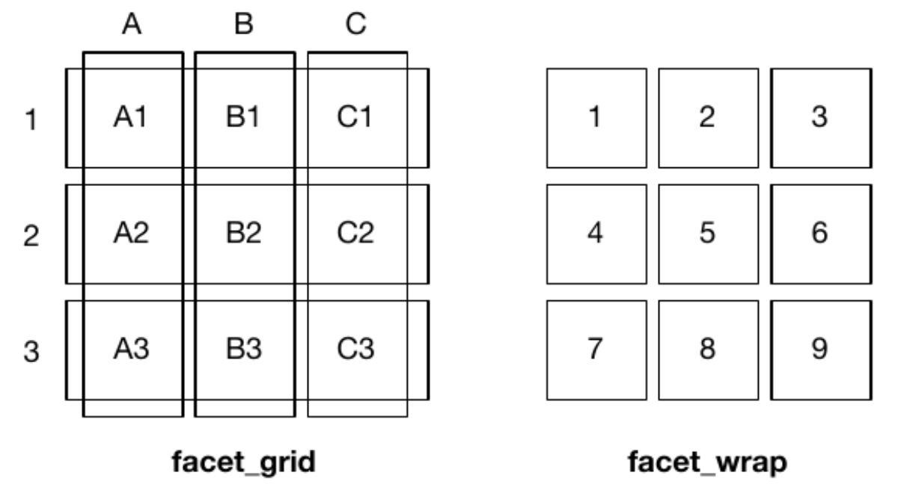

```{r setup, include=FALSE}
knitr::opts_chunk$set(echo = TRUE)
library(ggplot2)
```

# Boxplots and violin plots

Boxplots and violin plots are good for comparing numerical distributions for multiple categories. Specifically, boxplots (or box and whisker plots) allow you to compare the **median**, and quartiles of the data sets, while violin plots depict the density of data points.

## `boxplot()` in base R

Base R has a built-in function `boxplot()`. Pay attention to the `~` notation in the argument passed to the parameter `formula` **if** you are using `formula`.

```{r}
# remind yourself what the iris data look like
head(iris)
tail(iris)

# create a boxplot by providing an argument to the "formula" parameter
boxplot(formula = iris$Sepal.Length ~ iris$Species)

# you can also create boxplots by providing a single vector or a matrix to the "x" parameter

# first, subset iris to only keep the virginica data
virginica_rows = which(iris$Species=="virginica")
iris_virginica = iris[virginica_rows,]
head(iris_virginica)

# x = vector
boxplot(x = iris_virginica$Sepal.Length)

# x = matrix
boxplot(x = iris_virginica)

# x = matrix, but do not plot the Species column
boxplot(x = iris_virginica[,1:4])
```

## `geom_boxplot()` and `geom_violin()` in ggplot2

Below we make boxplots and violinplots for the same data.

```{r}
# boxplot
ggplot(data=iris,
       mapping=aes(x=Species,
                   y=Sepal.Length)) +
  geom_boxplot()

# boxplot with actual data points on top (some data points overlap!)
ggplot(data=iris,
       mapping=aes(x=Species,
                   y=Sepal.Length)) +
  geom_boxplot() +
  geom_point()

# boxplot with actual data points on top, jittered horizontally
ggplot(data=iris,
       mapping=aes(x=Species,
                   y=Sepal.Length)) +
  geom_boxplot() +
  geom_jitter(width=0.1,height=0) # jitter horizontally, but not vertically

# violin plot
ggplot(data=iris,
       mapping=aes(x=Species,
                   y=Sepal.Length)) +
  geom_violin()

# a combination of both
ggplot(data=iris,
       mapping=aes(x=Species,
                   y=Sepal.Length)) +
  geom_violin() +
  geom_boxplot(width=0.1)

# a combination of both, but let us add some color!
ggplot(data=iris,
       mapping=aes(x=Species,
                   y=Sepal.Length)) +
  geom_violin(aes(color=Species,
                   fill=Species)) +
  geom_boxplot(width=0.1)
```

# Faceting

Sometimes we want to show numerical data separated by category, or split them according to multiple categories. In other cases we just want to look at several plots side-by-side. For this, we can arrange plot in multiple **panels**.

## `par(mfrow)` and `par(mfcol)` in base R

+ `mfrow` – number of plots to be drawn in a window (also `mfcol`), stands for Matrix Filled by ROWs (or Matrix Filled by COLumns)

The `mfrow` argument in the `par()` function allows you to define the number of
figure panels you want in the device, and how they are to be arranged in terms of rows and columns.

Note that repeated calls to plotting functions will fill up the device according to the number of panels specified by `mfrow`. If `plot()` is called more times than the number of plots specified, then a new window is opened with the same `mfrow` options.

```{r}
# display three plots in a 2x2 grid
par(mfrow=c(2,2))

boxplot(iris$Sepal.Length ~ iris$Species)
boxplot(iris$Sepal.Width ~ iris$Species)
boxplot(iris$Petal.Length ~ iris$Species)

# reset display to one graph only
par(mfrow=c(1,1))
```

If instead of using R Markdown, you are running the code above in the console, you need to be careful in those situations when not every position is filled (e.g. 3 plots on a 2x2 grid leave one position vacant). To see an example of how things may go wrong, copy the code below and run it in the console:

```
# first, copy and run this
par(mfrow=c(2,2))
boxplot(iris$Sepal.Length ~ iris$Species)
boxplot(iris$Sepal.Width ~ iris$Species)
boxplot(iris$Petal.Length ~ iris$Species)

# then copy and run this
boxplot(iris$Sepal.Length ~ iris$Species)
boxplot(iris$Sepal.Width ~ iris$Species)
boxplot(iris$Petal.Length ~ iris$Species)
```

## `ggpubr::ggarrange()` for ggplot2 plots

To manually combine several ggplot2 plots in a figure, we will use the function `ggarrange()` from the package called **ggpubr** (stands for "GGplot2-based PUBlication Ready plots").

```{r}
library(ggpubr)

# boxplot
box = ggplot(data=iris,
       mapping=aes(x=Species,
                   y=Sepal.Length)) +
  geom_boxplot()

# violin plot
violin = ggplot(data=iris,
       mapping=aes(x=Species,
                   y=Sepal.Length)) +
  geom_violin()

# box + violin plot
combined = ggplot(data=iris,
       mapping=aes(x=Species,
                   y=Sepal.Length)) +
  geom_violin(aes(color=Species,
                   fill=Species)) +
  geom_boxplot(width=0.1)

# arrange in a 2x2 grid and label panels as A, B, C
ggarrange(box, violin, combined,
          ncol = 2,
          nrow = 2,
          labels = c("A","B","C"))
```

## `facet_wrap()` and `facet_grid()` in ggplot2

+ Facet plots, also called "lattice" or "trellis" plots, are a powerful tool for exploratory data analysis: you can rapidly compare patterns in different parts of the data and see whether they are the same or different. There are three types of faceting:

+ facet_null() - a single plot (default)
+ facet_wrap() - “wraps” a 1D ribbon of panels into 2D (useful if you have a large number of categories)
+ facet_grid() - produces a 2D grid of panels defined by different variables, which form the rows and columns

This figure from the book illustrates the differences between wrapping and making a grid:

{width=60%}

Both `facet_wrap()` and `facet_grid()` can be specified with one or two variables defined by a **formula** (specified with a tilde symbol, `~`). The difference is in the specific **syntax**. 

The output will be similar for one variable, but for two variables the axis labels will differ, and and `facet_grid()` will produce a more sensible representation of the data.

* Syntax for `facet_wrap()`:
  + `(~ a)` - spreads the values of ***a*** across panels
facilitates comparisons of ***y*** position, because the vertical scales are aligned.
  + `(~ a + b)` - spreads the combinations of values for both ***a***and ***b***

For the **iris** dataset:

```{r, out.width = "60%"}
base_plot = ggplot(data=iris,
                   mapping=aes(x=Petal.Length,
                               y=Petal.Width,
                               color=Species)) +
  geom_point()

base_plot # display

# wrap by Species
base_plot + facet_wrap(~Species)

# the same but arrange vertically
base_plot + facet_wrap(~Species,
                       ncol=1)

# the same but arrang in a 2x2 grid
base_plot + facet_wrap(~Species,
                       ncol=2,
                       nrow=2)
```

* Syntax for `facet_grid()`:
  + `(. ~ a)` - spreads the values of ***a*** across the columns. This direction
facilitates comparisons of ***y*** position, because the vertical scales are aligned.
  + `(b ~ .)` - spreads the values of ***b*** down the rows. This direction facilitates comparison of ***x*** position because the horizontal scales are aligned. This makes it particularly useful for comparing distributions.
  + `(a ~ b)` - spreads ***a*** across columns and ***b*** down rows. You’ll usually want to put the variable with the greatest number of levels in the columns, to take advantage of the aspect ratio of your screen.

We can easily split our plots by **Species** to produce the same output as `facet_wrap()`:

```{r, out.width = "60%"}
# by columns
base_plot + facet_grid(. ~ Species)

# by rows
base_plot + facet_grid(Species ~ .)
```

However, since the **iris** dataset contains only **one categorical variable**, we would have to do something fancier to get good mileage out of `facet_grid()` for this example. 

We can do this by *splitting some of the quantitative data into categories* (this is kind of a kluge)^[https://stackoverflow.com/questions/40350230/variable-hline-in-ggplot-with-facet]. Below we plot Sepal Length against Sepal Width (quantitative variables) split out by Petal type (Long vs. Short, Narrow vs. Wide):

```{r}
iris_categories = iris # make a copy

# add a new column called Petal.Width.Categories
# where all petals narrower than 1.3 cm are "Narrow Petals" and the rest are "Wide Petals"
iris_categories$Petal.Width.Categories = factor(ifelse(iris_categories$Petal.Width<1.3,
                                                  "Narrow Petals",
                                                  "Wide Petals"))

# add a new column called Petal.Length.Categories
# where all petals shorter than 4.35 cm are "Short Petals" and the rest are "Long Petals"
iris_categories$Petal.Length.Categories = factor(ifelse(iris_categories$Petal.Length<4.35,
                                                        "Short Petals",
                                                        "Long Petals"))

# plot and wrap 
ggplot(data=iris_categories,
       mapping=aes(x=Sepal.Length,
                   y=Sepal.Width,
                   color=Species)) + 
  geom_point() +
  facet_grid(Petal.Width.Categories ~ Petal.Length.Categories)
```

You should consult the ggplot2 book chapter for information on customization, such as controlling axis **scales**, or cutting continuous variables into bins in order to facet them.


