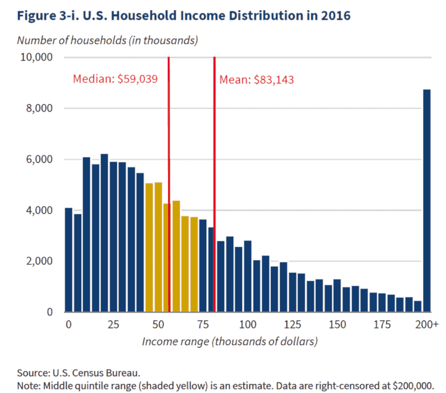

```{r setup, include=FALSE}
knitr::opts_chunk$set(echo = TRUE)
```

# What are statistics?

In general, numerical summaries of data that represent their structure, such as measures of central tendency and dispersion. 


## Background reading

**Whitlock & Schluter, Chapter 3**


## Some terminology

* **Population**: every instance of an object or item of interest
* **Parameter**: Greek, "beyond measurement"
* **Estimate**: a reasoned guess
* **Samples**: things that you measure; individual observations taken from a population
* **Random**: "representative"
* **Variables**: items that can take on a range of different values.

So, **statistics** are _**estimations of population parameters based on random samples**_, and we use _**random variables**_ to represent them.

## Types of data

* **Categorical**: species (e.g. versicolor, setosa, virginica); treatment conditions; types of medication; healthy or diseased; wild-type (reference) strain or mutant strain
* **Ordinal**: weak < medium < strong; 1, 2, 3 ...
* **Discrete**: integers
* **Continuous**: smoothly varying data that can take on an infinite number of values (temperature, speed)

## Notation

We use mathematical shorthand to describe essential concepts.

Most of the math we will use will involve addition, subtraction, multiplication, and division. We will also use exponentiation, logarithms, and integrals (which are just sums, extended to continuous variables).

There are certain **conventions** that you should be aware of and get used to as a matter of habit. For example:

### Population parameters

These are typically represented with _**Greek**_ letters:

* Population average, $\mu = E(X)$
* Population variation, $\sigma^2 = E[(X-\mu)^2]$

Here, $X$ represents all of the measurements in the population. $E(X)$ is read as "the expected value of $X$".

### Sample estimates

These are instead represented with _**Latin**_ letters:

* Sample mean, $\bar{X}$
* Sample variance, $s^2$
* Sample standard deviation (root mean squared deviation), $s$
* Sample median, $M$

In general, notation varies somewhat among different texts. We will almost certainly abuse formal notation throughout the course.


## Measures of location, or central tendency

The most basic descriptor of a sample is a measure of its **representative value**. The most familiar measures of central tendency are the mean and median. 

What are their essential properties and how do they differ?


### Arithmetic Mean

* A sample estimate of the arithmetic **average** of a population. As we all know, it is calculated as the sum of the samples divided by the total:

$$Mean = \frac{\sum(x)}{n} = \bar{X}$$

+ Another way to describe the mean is that it is an estimator of the **expected** value of all the elements in a population (i.e. the population average $\mu$).
+ The mean is an **unbiased estimator**, meaning that in the limit, the mean of the sampling distribution of $\bar{X}$ is equal to the population parameter $\mu$. We will talk about the sampling distribution of the mean later when we consider the Central Limit Theorem.

* It is, however, very sensitive to **outliers**: extreme values (with large deviations from the mean) make a big contribution.
* The mean has a **finite sample breakdown point** equal to $1/n$. This means that an arbitrarily small proportion of data can cause the population mean to become arbitrarily small or large, irrespective of where the bulk of the data lie.


### Median

* The "**middle**", or *50th percentile*, of a sample set. It represents the value for which, in a collection of samples, half of the samples are smaller and half of the samples are bigger.
* If the **number of samples is odd**, then in an *ordered set*, the sample number with the median value is $(n+1)/2$ (e.g. the 7th out of 13 samples).
* If the **number of samples is even**, the median is the average of the two middle ordered values.
* The median is a **robust** estimator, meaning that it is **insensitive to outliers**.
* If the data distribution is *skewed*, the median may be a more representative estimate since 50% of the data are above or below this value, whereas that will not be the case for the mean.

### Mean vs. Median

To determine which is the best measure of **central tendency**, we need to determine if the population has a lot of **outliers** that would distort our estimate of the population mean, and whether it is strongly **skewed.** 

If data are symmetrically distributed, the mean and median are approximately the same, but they begin to diverge when this is not the case.

{width=60%}

+ Mean: the average value
+ Median: half of the measurements are above or below this value


### Other measures of location

In some cases, other measures of central tendency can be useful. We will not use these here, but it's good to know they exist, in case you find a need for them later.

#### Trimmed mean and Windsorized mean

These methods are *robust estimators* of location that eliminate or uniformly transform *outliers*. In biology, these are rarely used, since we are often very interested in unusual values and removing or altering them could lead to loss of informative data points.

+ *Trimmed mean*: The mean calculated after removal of outliers, i.e. extreme sample measurements that fall outside of the central bulk of the data.

+ *Windsorized mean*: The mean after setting all extreme values equal to the maximum allowed central range.

In both cases, the central part of an ordered sample is defined as $1-2\kappa$, where $0 < \kappa < 0.5$ and $\kappa$ is the proportion of values to be trimmed from each tail of the distribution. For example, if 20% of the values are to be considered outliers, $\kappa = 0.2$ and all values in the bottom or top 20% will be either removed (trimmed mean) or set to a value equal to the 20th or 80th percentile (Windsorized mean) of all values.

#### Geometric and harmonic mean

If the phenomena of interest involve a multiplicative process or reciprocal values, then the arithmetic mean is not an appropriate measure of central tendency. In these cases, sample means can be calculated using a log transform to calculate products (geometric mean) or using the inverse of the arithmetic mean of the reciprocals (harmonic mean).

* Processes that can be described using **exponentials**, such as growth rates, require the **geometric mean**. The geometric mean is the arithmetic mean of the **log-transformed** measurements (because multiplication becomes additive after taking the log). _**Example:** you want to find the average growth rate of wild-type and mutant yeast to evaluate the fitness of specific mutants evolved in a chemostat with different carbon sources._

* The **harmonic mean** is used for processes that are described by an **inverse relation**, such as velocity (e.g. $v = d/t$, where $d$ is distance traveled and $t$ is the time). _**Example:** you want to measure how long it takes a wild-type fly or one with an olfactory mutation to traverse from a fixed starting point to the source of the odor. The average time traveled for a fixed distance is then the distance divided by the harmonic mean of the speed, e.g. seconds = mm / (average mm/sec)._


## Measures of scale

Measures of scale are used to quantify data **variability** and **dispersion** (i.e. how **spread** out the data are).

### Range and IQR

* The **range** may be represented by the minimum and maximum values in the dataset.
* **Quantiles** include deciles and quartiles. These represent bins of 10% and 25% of the data, respectively. _Note that the data must be ordered from low to high, so that the bottom quartile represents the 25% of data with the lowest values, and the top decile represents the 10% of data with the highest values._
* The **inter-quartile range (IQR)** is a typical measure of range. The IQR contains the middle 50% of the data points, based on the *median*. To find the IQR, we first find the median of the bottom half of points and call this the first quartile (Q1). We do the same for the top half (Q3). Then the $IQR = Q3 - Q1$.
* Measures of range are **robust** estimators, i.e. insensitive to **outliers**. For the IQR, outliers are data that are more or less than 1.5x the IQR (see Fig. 1 below).

### Absolute deviation

* A simple way to calculate **dispersion** is to sum up the absolute difference between all the individual measurements and some measure of *central tendency* (either the sample mean or sample median), and then take the *mean* or *median* of these values.
* These measures are called the mean or median **absolute deviation** around the mean or median, and you might see any combination of these abbreviated as **MAD** (which can be confusing!).

* The **median absolute deviation around the median (MAD median)** is a measure of the spread of the data that is robust to outliers. It is defined as the median of the absolute distances between each of the data points and the sample median: $MAD = median |x_i - median(X)|$.
* To estimate the standard deviation of a distribution using the MAD, it is multiplied by a constant $c$ as a scaling factor: $s \approx c * MAD$. For a normal distribution, $c = 1.4826$ and $s \approx 1.4826 * MAD$.

### Variance

* The variance of a **population** of size $N$ is the normalized sum of squared deviations from the mean $\mu$, represented as:

$$\sigma^2 = \frac{1}{N}\sum({x_i - \mu)^2}$$

* The **sample variance** is the normalized sum of squared deviations from the *sample mean* $\bar{X}$:

$$s^2 = \frac{\sum({x_i - \bar{X})^2}}{n-1}$$

* Here $x_i$ represents an individual measurement, $N$ represents the number of items in the total population, and $n$ represents the total number of sampled items.

* For the *sample variance*, we use $n-1$ in the denominator because, after using all the sample measures to calculate the mean, we only have left $n-1$ *independent measurements*, or **degrees of freedom**.

* The **sum of squares** is the most commonly used measure of dispersion and has useful mathematical properties.

* It should be noted that, like the mean, the variance is very **sensitive to outliers** and thus is **not a robust** measure of dispersion.

### Standard deviation

* The **square root of the variance** (often abbreviated as $SD$).
* SD is the **most widely used statistic** to report *variation about the mean*, particularly as applied to a normal distribution (we will go over distributions soon).
* The **population SD** is denoted as $\sigma = \sqrt{\sigma^2}$; the **sample SD** is $s = \sqrt{s^2}$.
* SD is in the **same units** as the **original data**, making it a very useful parameter for defining the spread of a distribution or sample.

### Standard deviation vs. IQR

The figure shows the difference in the amount of data captured by the **IQR** vs. the **standard deviation**:

{width=45%}

* Top panel: boxplot showing IQR and limit of outliers.
  + The "whiskers" on the plot extend 1.5 times the IQR below the first quartile and above the third quartile.
  + So, outliers are below Q1 - 1.5\*IQR and above Q3 + 1.5\*IQR.
  + Note: If there are no outliers and all of the data points are closer to the median than this, then the whiskers are just drawn to the limits of the data and represent the entire range of the distribution.

* Middle and bottom panels: a probability density function with mean $\mu$ = 0 and variance =  $\sigma^2$.
  * The IQR (middle panel) captures the central 50% of the data, and the whiskers capture almost all the rest.
  * For the standard deviation (bottom), a handy rule of thumb is that one $\sigma$ captures around 2/3 of the data; 2$\sigma$ captures ~95%; and 3$\sigma$ captures around 99% of the data.
  * If the data are normally distributed, then the limits of the IQR fall at $\pm$ 0.67 standard deviations from the mean/median (these are the same for a normal distribution).

### z-score

The $z$-**score** represents the number of standard deviations that some value is away from the mean.

  + A **standard normal** distribution has a mean = 0 and SD = 1 and is sometimes called a $Z$ distribution.
  + $Z$ can be obtained from any normal distribution by subtracting the mean and dividing by the SD.

## Descriptive statistics in R

The functions for computing basic descriptive statistics in R are:

| Measures                          | R commands  |
|-----------------------------------|-------------|
| Mean, $\bar{Y}$                   | `mean()`    |
| Variance, $s^2$                   | `var()`     |
| Std Dev, $s$                      | `sd()`      |
| IQR                               | `IQR()`     |
| Mean, Median, Quartiles, Min, Max | `summary()` |

---

*Authors: Kris Gunsalus & Manpreet Katari*
