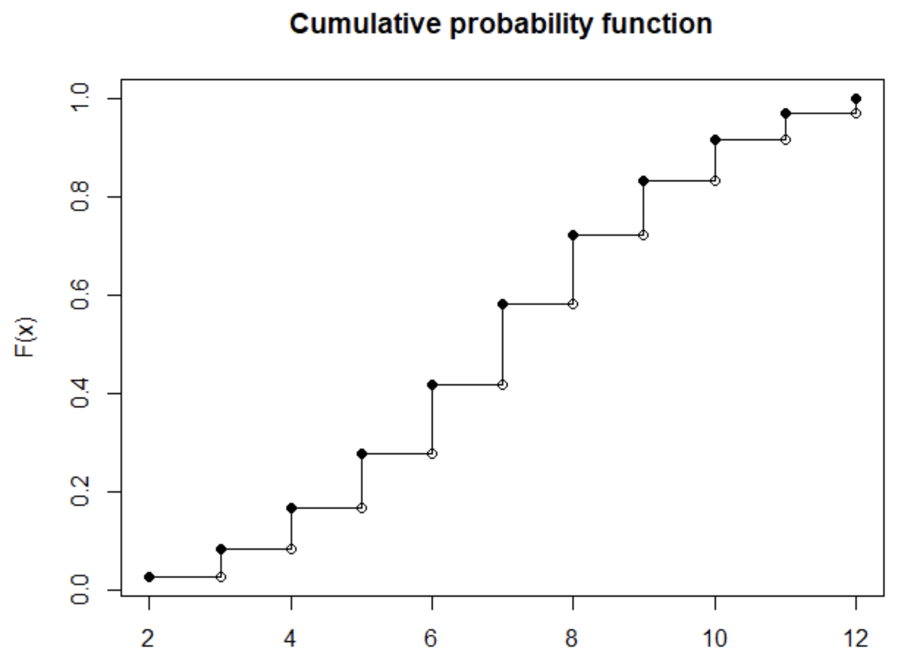
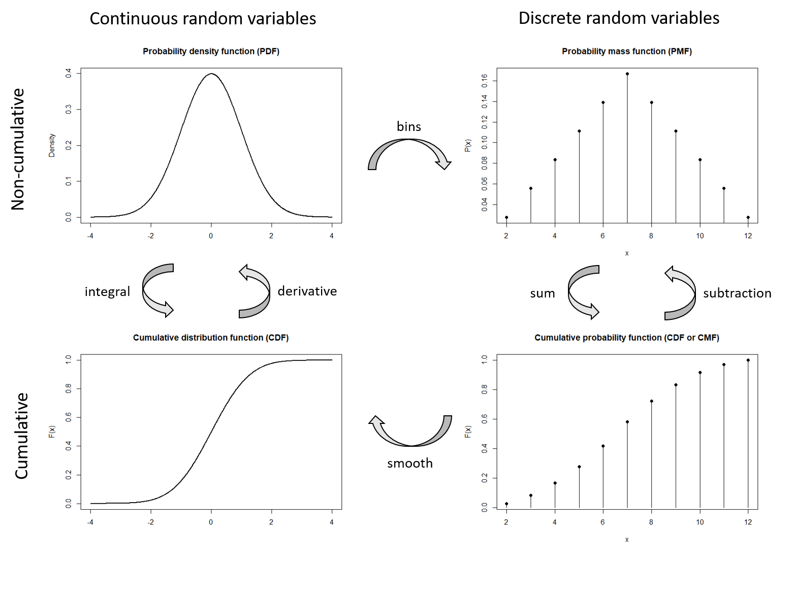
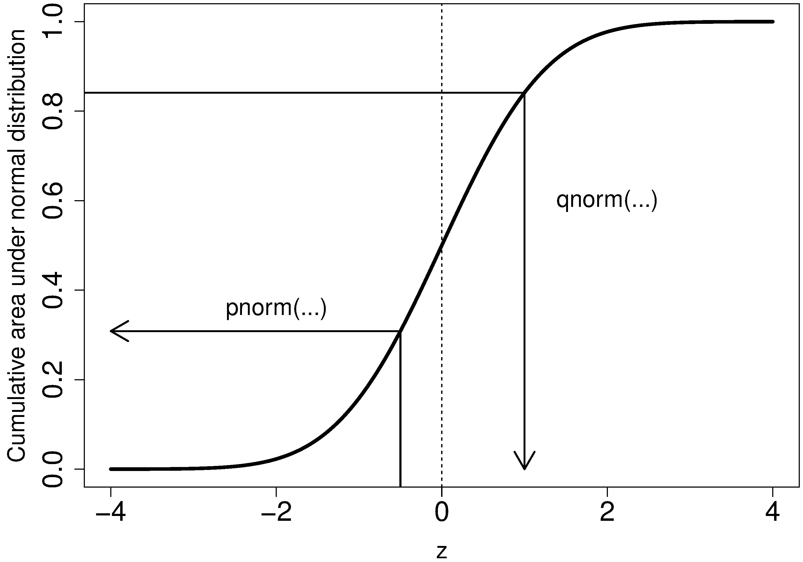
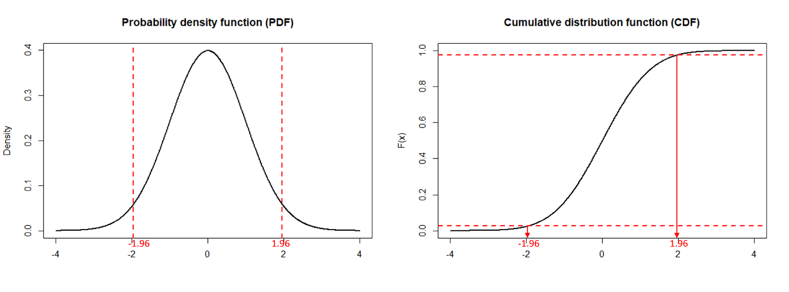

<!-- Note: add `class.source="fold-show"` to top of R block to show code by default -->

```{r setup, include=FALSE}
knitr::opts_chunk$set(echo = TRUE)
library(tigerstats)
library(ggplot2)
library(ggpubr)
```

```{css, echo=FALSE}
.qbox {
  padding: 1em;
  background: cornsilk;
  border: 1px solid burlywood;
  border-radius: 5px;
}

.bluebox {
  padding: 1em;
  background: #d8ecf3;
  border: 1px solid cornflowerblue;
}

h1 {color: mediumblue}
h2 {color: mediumblue}
h3 {color: mediumblue}
h4 {color: mediumblue; font-style: italic}
```

# References

+ **Whitlock & Schluter, Chapter 5: Probability**
+ **Optional**: ***Aho, Foundational and Applied Statistics for Biologists with R***
  + [**Chapter 2**](https://drive.google.com/file/d/1cpC3ofcP9DIB8vDieE1lBVVAesWklCyM/view?usp=sharing)
  + [**Chapter 3.1-3.2**](https://drive.google.com/file/d/1ck7QGKh1TS_lo_BCjBHMk4LSB-TO2sEN/view?usp=sharing)

# Classical Probability

At its core, statistics is about probabilities and probabilistic inference. So we need to build some common vocabulary to talk about probability.

### Terminology

 Let's start with some of the basics:

<!-- ======================================================================= -->
<div class="qbox">
$\Rightarrow$ ***Question: What is a variable?***

<details closed markdown="block">
  <summary>Answer</summary>
  
+ Something whose value can change. 

For example, the formula for instantaneous velocity of a falling body is:

$$f(t) = gt$$

+ where $g=9.8m/s^2$ is acceleration due to gravity (a constant), and
+ $t = time (sec)$ (a variable)


</details>
</div>
<!-- ======================================================================= -->

### Deterministic vs. probabilistic models

<!-- ======================================================================= -->
<div class="qbox">
$\Rightarrow$ ***Q: What is a deterministic model?***

<details closed markdown="block">
  <summary>Answer</summary>
  
+ Something that when given the same inputs, will always produce the same output.
+ Such models are useful conceptually, but almost never characterize real-world phenomena.

</details>
</div>
<!-- ======================================================================= -->
<p>
<!-- ======================================================================= -->
<div class="qbox">
$\Rightarrow$ ***Q: What is a probabilistic model?***

<details closed markdown="block">
  <summary>Answer</summary>
  
+ A model that incorporates **random variables**.
+ Such models need not produce **exact** outputs, but the **most probable** outcome.

For example, a probabilistic model for the instantaneous velocity of a falling body is:

$$f(t) = gt + \varepsilon$$

+ where $\varepsilon$ represents measurement error, and
+ the expected value of $\varepsilon$ is zero: $\bar{\varepsilon} = 0$.
+ Values of $\varepsilon$ that are close to zero will occur with the highest frequency.
+ This value represents the **maximum likelihood**.

</details>
</div>
<!-- ======================================================================= -->

### Random variables and random trials

When we do experiments with an unknown outcome, we need a common framework for thinking about the process and outcomes. Let's review some basic concepts:

<!-- ======================================================================= -->
<div class="qbox">
$\Rightarrow$ ***Q: What is a random variable?***

<details closed markdown="block">
  <summary>Answer</summary>
  
+ Something whose value cannot be known preceding a measurement (a.k.a. **trial**).

</details>
</div>
<!-- ======================================================================= -->
<p>
<!-- ======================================================================= -->
<div class="qbox">
$\Rightarrow$ ***Q: What is a random trial?***

<details closed markdown="block">
  <summary>Answer</summary>
  
+ A process with two or more possible outcomes that are not predictable.

</details>
</div>
<!-- ======================================================================= -->
<p>
<!-- ======================================================================= -->
<div class="qbox">
$\Rightarrow$ ***Q: What is an event?***

<details closed markdown="block">
  <summary>Answer</summary>
  
+ An observed outcome of a random trial.

</details>
</div>
<!-- ======================================================================= -->
<p>
<!-- ======================================================================= -->
<div class="qbox">
$\Rightarrow$ ***Q: What is a probability, in terms of random trials?***

<details closed markdown="block">
  <summary>Answer</summary>
  
+ The proportion of random trials with a particular outcome.
+ The probability always between zero and one:  $0 \le P \le 1$ 

In mathematical notation, we can write:

$$P[A] = \frac{N(A)}{N}$$

Which is to say, "the ***probability*** of event $A$" equals the ***proportion*** of events with outcome $A$ relative to all possible outcomes.

</details>
</div>
<!-- ======================================================================= -->


<!-- ======================================================================= -->

# Probability Distributions

A ***probability distribution*** describes the probabilities of all possible outcomes of a random variable.

## Quantitative random variables

**Discrete** vs. **continuous** distributions describe situations in which there are a ***limited*** vs. an ***infinite*** number of outcomes.

## Some terminology

To write mathematical formulas for distributions, we need some notation to describe random variables, outcomes, and probability distributions:

- A random variable, $X$
- A (continuous) random variable outcome, $x$
- Discrete variable outcomes are called _mass points_ $x_i$
- A PDF, $f(x)$
- The output generated by a PDF, a $density$
- A cumulative distribution function (CDF), $F(x)$

## Probability density functions

A **probability density function (PDF)** is a mathematical expression that describes the distribution of all possible outcomes for a random variable.

- A ***discrete*** probability density function is more technically called a **probability mass function (PMF)**, but we will commonly refer to these as PDFs instead.

The **density function**, written as $f(x)$, gives the ***height*** of a PDF for any outcome $x$. Both types of PDFs will be valid $iff$ ("if and only if"):

1. $f(x) \ge 0, \forall x \in \mathbb{R}$
2. $\sum_x f(x) = 1$ (discrete PDF) or $\int_{-\infty}^{\infty} f(x) dx = 1$ (continuous PDF)

In other words, 

+ the density function must be zero or positive for all possible outcomes, and 
+ the total probability of all possible outcomes must equal one. 


# Probability distribution functions

## The PDF

### Discrete random variables

Since all possible values of $x$ are discrete, the ***density*** at any point, $x_i$, is ***equivalent to the probability*** that our random variable $X$ equals any individual value $x_i$. Thus we can write:

$$f(x) = P(X=x),\ \ \ x \in X = \{x_1, x_2, ...\}.$$

Usually, discrete distributions are illustrated using histograms, and continuous PDFs are illustrated using line graphs.

#### Example

Let's take a simple example of rolling two fair 6-sided dice. Below are two plots illustrating this scenario:

+ A histogram showing all the possible combinations of outcomes.
  + This distribution is symmetric with a peak in the middle, because there are many more ways to roll a 7 than there are to roll a 2 or a 12.
  
+ The corresponding PMF of this distribution.
  + The PMF shows the **probability** of getting any particular combination of two dice.
  + The height of each bar represents the ***proportion of the time** that we rolled a given face value.
  
This is an example of an **empirical** distribution, which represents experimental outcomes rather than ideal outcomes.

```{r fig.width=6, fig.asp=.4}
# ============================================================================ #
# distributions for rolling a pair of dice

num.dice <- 2L
num.rolls <- 10000L
outcomes <- matrix(sample(1:6, num.dice * num.rolls, replace = TRUE),
                   nrow = num.rolls, ncol = num.dice)
sums <- rowSums(outcomes)
#barplot(table(sums))

dd = data.frame(table(sums))

freq.plot = ggplot(dd) +
  geom_bar(aes(x=sums, y=Freq), stat='identity', fill="peachpuff", color="black") +
  labs(x="Total face value" , y= "Count") +
  theme_classic()

prop.plot = ggplot(dd) +
  geom_bar(aes(x=sums, y=Freq/num.rolls), stat='identity', fill="peachpuff", color="black") +
  labs(x="Total face value" , y= "Probability") +
  theme_classic()

ggarrange(freq.plot, prop.plot, nrow=1, ncol=2)
```


### Continuous random variables

Plots for variables that can take on any real value are often drawn using line plots, particularly for ideal distributions.

Empirical distributions for continuous data can also be plotted by binning the values and using histograms, which shows the variation in the actual data a little better. This is illustrated below using a large number of random samples from a standard normal distribution.

+ The sample data is shown using a histogram.
+ The cyan line shows the same distribution with a smoothened curve.
+ The dark blue line shows an ideal normal distribution superimposed on top.

```{r fig.width=6, fig.asp=.8}
# ============================================================================ #
# standard normal distribution

set.seed(9-18-2021)                 # set a seed random number generator
                                    # this makes the simulation reproducible

z.scores = seq(-5,5,by=.01)         # a sequence of length 1001
samples = rnorm(length(z.scores))   # random samples 

hist(samples, prob="true", col="blanchedalmond", 
     breaks=40,
     xlim=c(-4,4),
     xlab="z-score",
     main="Standard normal distribution\n(1000 samples and ideal curve)")

lines(density(samples),col="cyan", lwd=2)  # smoothened curve
curve(dnorm(x), add=TRUE,                  # ideal curve
      col="darkblue", lwd=2)
```


A really important fact to keep in mind is ***for a continuous variable, the probability at any discrete value of $x$ is zero***.

<!-- == TEMPLATE =========================================================== -->
<div class="qbox">
$\Rightarrow$ ***Q: Why is this the case?***

<details closed markdown="block">
  <summary>Answer</summary>
  
+ Because it is necessary to integrate across some interval to get a finite area under a continuous curve.

Note that continuous distributions, we will see the density may sometimes exceed one across a range of values. Nevertheless, **the total area under any PDF is always equal to one**.

</details>
</div>
<!-- ======================================================================= -->


## The CDF

The **cumulative** distribution function answers the question, "What is the probability of observing a value **less than or equal to** $x$ as an outcome?" This is called a ***lower-tailed probability***.

It can also be used to answer the question, "What is the probability of observing a value **greater than** $x$?" This is the ***upper-tailed probability*** and is obtained by subtracting the value of the CDF at $x$ from 1.

The CDF for a random variable $X$ is denoted $F(x)$ and gives the **lower-tail probability** $P(X \le x)$ for the corresponding PDF. This probability is given by the **total area** underneath a density, for all outcomes **up to and including** the value $x$.

A CDF drawn using actual sampled data is called an **empirical** CDF.

### Discrete random variables

For a **discrete** random variable, the total probability is the ***sum*** of the probabilities for each possible value from the smallest one up to the value of interest, $x$:

$$ F(x) = P(X \le x) = \sum_{x_i \le x} f(x_i) $$

The CDF for the example of rolling two dice looks like this:

{width=60%}

### Continuous random variables

For a **continuous** random variable, the CDF gives the total probability the $X$ will take a value of $x$ or less.

We find the total probability using ***integration***, which gives us the area under a curve: 

$$ F(x) = P(X \le x) = \int_{-\infty}^x f(t)dt$$

+ The total probability of getting a value at least as big as $x$ is the area under the curve from minus infinity up to $x$. 
+ Note that to be proper, we called the continuous variable of integration in the above formula $t$, since we are using it to find $x$. This is just a formality. 

Closed forms of some continuous distribution functions (such as a uniform distribution) allow solutions to be found without the need for integration. 


## Relationship between the PDF and CDF

### Illustration

The figure[^1] below illustrates these relationships:



## Total probability for an interval

Say we want to find the total probability that an observed outcome falls within an interval between two values. How do we find this?

### Discrete distributions

For discrete distributions, we just sum up the individual probabilities for each possible outcome: 

$$ P(x_a \lt X \le x_b) = \sum_{x_i=x_a+1}^{x_b} f(x_i)  = F(X_b) - F(x_a)$$

+ Note that $x_i$ ranges from $x_{a+1}$ to $x_b$, and $x_b \gt x_a$.
+ To get the interval with $x_a$ inclusive, we use $P(x_a \le X \le x_b) = F(x_b) - F(x_a-1)$.

### Continuous distributions

We find the total area under the curve for a continuous distribution by integrating our density function across the range of interest:

$$ P(x_a \lt X \le x_b) = \int_{a}^{b} f(x)  = F(b) - F(a) = F\Biggr|_{-\infty}^{b} - F\Biggr|_{-\infty}^{a}$$

# Example

Say we want to find the central 95% of some normally distributed data:

```{r fig.width=5, fig.asp=0.8}
y <- rnorm(100000)
den <- density(y)   # Density estimation

# Middle 95% of data
value1 <- qnorm(0.025)
value2 <- qnorm(0.975)

# Lower and higher indices on the X-axis
l <- min(which(den$x >= value1))
h <- max(which(den$x < value2))

# Plot
plot(den,
     xlab = "z-score",
     main="Middle 95% of the data")

polygon(c(den$x[c(l, l:h, h)]),
        c(0, den$y[l:h], 0),
        col = "slateblue1")
```

To do this we would just take the area from $-\infty$ to $b$, and subtract the area from $-\infty$ to $a$:
 
```{r fig.width=8, fig.asp=0.5}
par(mfrow=c(1,2))

# upper plot
plot(den,
     xlab = "z-score",
     main="Area up to b=1.96 (q=0.975)\n(97.5% quantile)")

# total area less than or equal to b
value = value2
polygon(c(den$x[den$x <= value ], value),
        c(den$y[den$x <= value ], 0),
        col = "slateblue1",
        border = 1)

# lower plot
plot(den,
     xlab = "z-score",
     main="Area up to a=-1.96 (q=0.025)\n(2.5% quantile)")

# total area less than or equal to a
value = value1

polygon(c(den$x[den$x <= value ], value),
        c(den$y[den$x <= value ], 0),
        col = "slateblue1",
        border = 1)
```
 
 
# Distribution Functions in R

**Fortunately, many distribution functions are already built into R, so we don't usually have to worry about manual summation or integration to figure out probabilities!** *(R also provides the capability to perform integration directly, if you want to check that the built-in functions are giving you the correct answer.)*

R has four families of commands relating to distributions that you should become familiar with. For a *normal* distribution, these are:

- **rnorm**: generates ***random samples*** from the normal distribution
- **dnorm**: gives the ***density function (PDF)***
- **pnorm**: gives the ***cumulative distribution function (CDF)***
- **qnorm**: gives the ***inverse CDF***, a.k.a. the ***quantile function***

Understanding the relationship between the PDF, the CDF, and the inverse CDF is easier if we depict them graphically.

## PDF and CDF

**dnorm** gives the **height** of the distribution for any particular value of a discrete or continuous distribution (PDF), whereas **pnorm** give the **total probability** (CDF).

*Note: this can be a little confusing at first, because one tends to automatically associate "PDF" with "pnorm". You can help yourself by thinking "density" vs. "total probability" function.*

```{r fig.width=8, fig.asp=.5}
par(mfrow=c(1,2))

z.scores = seq(-5,5,by=.01)         # a sequence of length 1001
PDF      = dnorm(z.scores)
CDF      = pnorm(z.scores)
plot(z.scores, PDF,
     xlim=c(-4,4),
     type = "l",
     xlab="Z-score", ylab="Density",
     main = "Standard Normal PDF")
abline(v=0, lty="dashed", col="red")
plot(z.scores, CDF,
     xlim=c(-4,4),
     type = "l",
     xlab="Z-score", ylab="Total probability",
     main = "Standard Normal CDF")
abline(v=0, lty="dashed", col="red")
abline(h=0.5, lty="dashed", col="black")
```


## CDF and inverse CDF (quantile function)

The diagram below shows the shape of the CDF for a standard normal distribution, which represents the total probability as a function of the $z$-score.

{width=60%}

+ The **pnorm** function takes a real value as input, and returns the ***total probability*** at that value.
  + Recall that the total probability is defined as the lower-tailed area under the PDF curve.
  + Note that for a standard normal distribution, the values along the $x$-axis are measured in units of standard deviations, or $z$-scores.
  
+ The **qnorm** function takes a level of probability, or a **quantile**, as input, and returns the corresponding value along the $x$-axis. 

Recall that we used the `qnorm` function last week to get the $z$-score for the bounds of our 95% confidence intervals. Conversely, we can use the CDF to get the total probability, or area under the curve, at each of these quantiles:

```{r class.source="fold-show", collapse=TRUE}
qnorm(0.975) # upper bound for 95%CI
qnorm(0.025) # lower bound for 95%CI (the same since the normal is symmetric)

pnorm(c(-1.959964,1.959964))
```

We can see that these are really the inverse of each other by applying them sequentially:

```{r class.source="fold-show", collapse=TRUE}
pnorm(qnorm(0.975))
qnorm(pnorm(1.959964))
```

#### Note that since R is vectorized, these functions can also operate on a vector of values instead of just a single number.

You can verify this yourself in R:

```{r class.source="fold-show", collapse=TRUE}
# CDF and QF for the standard normal

# CDF for z-scores ranging from -3 to 3
pnorm(-3:3, mean=0, sd=1)

# QF for probabilities ranging from 0.1 to .9
qnorm(seq(0,1, by=0.1), mean=0, sd=1)
```


### Example: Standard normal distribution

Say we want to find the central 95% of a normal distribution. We can use qnorm to find the $z$-score corresponding to the lower 2.5% and upper 97.% bounds of the data, which we already know should be around -1.96 and 1.96:

```{r class.source="fold-show"}
qnorm(c(0.025,0.975))
```

We can plot this on the normal PDF, but we will really use the CDF to compute the area under the curve for these limits[^1]:

{width=90%}

Once we have the $z$-scores (or actual $x$-values for a non-standardized distribution), finding the total area is as simple as subtracting the values of `pnorm()` between the upper and lower bounds of the interval:

```{r class.source="fold-show", collapse=TRUE}
# compute area under the standard normal for central 95% of data
# the lower z-score is found by qnorm(0.025) and the upper by qnorm(0.975)
lower_bound = qnorm(0.025, mean=0, sd=1)
upper_bound = qnorm(0.975, mean=0, sd=1)
c(lower_bound, upper_bound)

# total probability between lower and upper bound z-scores
pnorm(upper_bound) - pnorm(lower_bound)

# this is the same
pnorm(qnorm(0.975)) - pnorm(qnorm(0.025))
```

### Example: Human height distribution

Say we are making compact cars and we want to know what proportion of humans are above 195mm, and therefore might not fit in our car? Let's assume $\mu = 169$ and $\sigma = 14$.

We can do this in two ways:

+ use `pnorm` to get either the `upper.tail` probability (the probability of getting a value at least as high as the one observed)
+ find the `lower`tail` probability and subtract from 1

```{r class.source="fold-show"}
# equivalent ways to find total probability X > x
x=195
pnorm(x, mean=169, sd=14, lower.tail=FALSE)     # upper tail probability
1 - pnorm(x, mean=169, sd=14, lower.tail=TRUE)  # 1 - lower tail probability
```

On the other extreme, some peope are just too short to see above the steering wheel and reach the pedals.

Say we want to accommodate 80% of the population and let the other 10% find other modes of transportation. What are the shortest and tallest people that can fit in the car?

```{r class.source="fold-show"}
# boundaries for 10%-90% of human heights
qnorm(c(0.1,0.9), mean=169, sd=14)
```


## Quantile-quantile plots

Say we want to compare a sample of the height of 100 healthy human individuals to a theoretical normal distribution.

<!-- ======================================================================= -->
<div class="qbox">
$\Rightarrow$ ***Q: Why might this particular question be of interest to us?***

<details closed markdown="block">
  <summary>Answer</summary>
  
+ We may want to use a parametric statistical test to compare these with a sample from a severely undernourished population.

If the data do not conform approximately to a normal distribution, we cannot use tests that require this assumption and must therefore use other methods.

</details>
</div>
<!-- ======================================================================= -->

One way we can tell how well the shape of a distribution conforms to a theoretical distribution is using a **QQ plot**, which compares theoretical quantiles on the x-axis with experimental quantiles on the y-axis

+ QQ plots can be made for different common distributions, but you may see it most often applied to the normal distribution.

To make the QQ plot of your data against a normal distribution, just use the `qqnorm()` function. 

+ Even if we sample from a normal and plot against the ideal distribution, notice that each sample will vary slightly from the ideal, especially at the tails where the sampling is more sparse.

```{r fig.width=8, fig.asp=.8}
par(mfrow=c(2,2))
qqnorm(rnorm(100),  # sample 100 individuals
       xlab = "Theoretical Quantiles", 
       ylab = "Sample Quantiles",
       main = "Normal Q-Q Plot")
qqline(y)           # add an ideal qq line

qqnorm(rnorm(100),  # sample 100 individuals
       xlab = "Theoretical Quantiles", 
       ylab = "Sample Quantiles",
       main = "Normal Q-Q Plot")
qqline(y)           # add an ideal qq line

qqnorm(rnorm(100),  # sample 100 individuals
       xlab = "Theoretical Quantiles", 
       ylab = "Sample Quantiles",
       main = "Normal Q-Q Plot")
qqline(y)           # add an ideal qq line

qqnorm(rnorm(100),  # sample 100 individuals
       xlab = "Theoretical Quantiles", 
       ylab = "Sample Quantiles",
       main = "Normal Q-Q Plot")
qqline(y)           # add an ideal qq line

```


<!-- ======================================================================= -->

<!-- ## Set theory and notation -->

<!-- + Set -->
<!-- + Element -->
<!-- + Subset -->
<!-- + Sample space -->
<!-- + Event -->
<!-- + Empty set -->
<!-- + Probability of an event -->
<!-- + Proportion -->
<!-- + Sample space -->
<!-- + Null set -->

<!-- ## Relationships between outcomes -->

<!-- + Disjoint sets (mutual exclusion) -->
<!--   + Intersect -->
<!--   + Union (addition rule) -->
<!--   + Example: Blood type -->
<!-- + Nondisjoint sets -->
<!--   + Intersect -->
<!--   + Union (general addition rule) -->
<!--   + Example: Blood type -->
<!-- + Independence -->
<!--   + Multiplication rule -->
<!--   + Addition -->
<!--   + Can mutually exclusive outcomes be independent? -->
<!--   + How common is independence? -->

<!-- ======================================================================= -->


<!-- ======================================================================= -->
<!-- == TEMPLATE =========================================================== -->
<!-- <div class="qbox"> -->
<!-- $\Rightarrow$ ***Question: ?*** -->

<!-- <details closed markdown="block"> -->
<!--   <summary>Answer</summary> -->

<!-- + Answer. -->

<!-- </details> -->
<!-- </div> -->
<!-- ======================================================================= -->


[^1]: Image from a short tutorial by A. Kujowska in [Towards data science](https://towardsdatascience.com/quantiles-key-to-probability-distributions-ce1786d479a9)