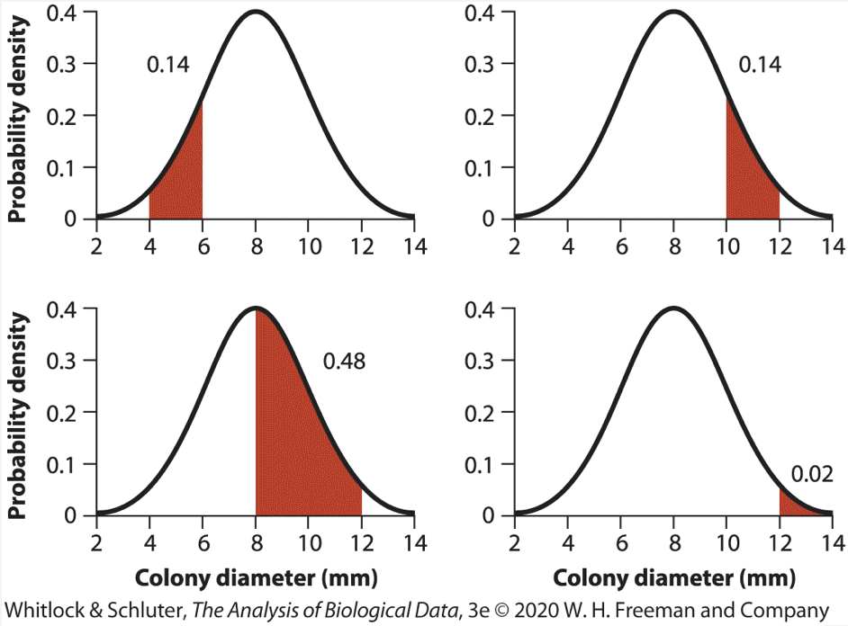

```{r setup, include=FALSE}
knitr::opts_chunk$set(echo = TRUE, error = TRUE)
# remove "error = TRUE" to make knitr halt on errors
# (do this when you are ready to check if your code will knit without errors)
```

## Practice problems

### 1. Co-occurrence of infection: Venn diagams

Among women voluntarily tested for sexually transmitted diseases in one university (modified from Tábora et al. 2005):

+ 18% tested positive for human papilloma virus (HPV) only,
+ 2% tested positive for Chlamydia only, and
+ 3% tested positive for both HPV and Chlamydia. 

Use the following steps to calculate the probability that a woman from this population who gets tested would test positive for either HPV or Chlamydia.

a. Write the goal of the question using probability notation (e.g. P(something) or Pr[something]). 

<!-- Your answer here -->

b. Write the general addition rule, as applied to this example.

<!-- Your answer here -->

c. First, calculate the total frequency of HPV and of Chlamydia in the population.
```{r}
# given probabilities
p.hpv = 0.18
p.chl = 0.02
p.hpv.chl = 0.03

# total probabilities
p.hpv.tot =
p.chl.tot =
```

d. Calculate the probability that a randomly sampled woman would test positive for at least one of these, using the total probabilities and the joint probability.

```{r cars}
# P(HPV OR Chlamydia)

```

e. Is the occurrence of these infections independent? Explain.
```{r}
# Criterion for independence:

```


### 2. Allele frequencies: Addition and multiplication rules

Many gene loci have a major allele and a number of minor alleles in the population. Let's say there are 5 alleles for a particular locus, that individuals mate randomly with respect to the genotype at this locus, and that allele frequences for A1-A5 are 0.82, 0.06, 0.05, 0.04, and 0.03 respectively.

For each of the questions below, first **define the problem** by writing out the probability equations (e.g. Pr[Ai] or P(Ai) for each term), and then compute the answers numerically.

a. What is the probability that any single allele chosen at random from the population is either A4 or A5? Write out the probability statement as a comment below and then computer the answer.
```{r}
# Allele frequencies
A1 = 0.82
A2 = 0.06
A3 = 0.05
A4 = 0.04
A5 = 0.03

# Probability of either A4 or A5 = ?

```

b. What is the probability that an individual carries two A2 alleles?
```{r}

```

c. What is the probability that someone does NOT carry two A2 alleles?
```{r}

```

d. What is the probability that someone is heterozygous for A1 and A3?
```{r}

```

e. What is the probability that *neither* of two random individuals in the population would carry two A1 alleles?
```{r}

```

f. What is the probability that 3 random individuals carry no A4 or A5 alleles at all? (Remember that each individual carries two alleles.) 
```{r}

```


### 3. Nucleic acids: Sampling, permutations and combinations

a. Restriction enzymes recognize specific sequences in DNA and cut the DNA within or near those sites. How many possible restriction sites of length 6 are there?
```{r}

```

b. At what frequency would you expect to find a binding site for a particular restriction enzyme that recognizes a 6 bp sequence? _Note: Restriction enzymes usually recognize a palindromic sequence, so you don't need to worry about looking on both strands._
```{r}

```

c. What is the average length of a fragment produced by a 6-cutter?
```{r}

```

d. The EcoR1 enzyme cuts the sequence "GAATTC". How many different sequences could be made out of this set of nucleotides (assume that you treat each A and T as distinct individuals)?
```{r}

```

d. You are interested in synthesizing a bunch of random oligonucleotides for a SELEX experiment. How many possible oligos of length 22 are there?
```{r}

```


e. How many ways could you make a sequence of 6 nt by grabbing them at random from a bag of 12 nucleotides (assuming each base is treated as a distinct unique entity, and you can only pick each nt once)? This is an example of "random sampling without replacement".
```{r}

```

f. How many combinations of 6nt are there in a set of 12 random nucleotides? (That is, pick any group of 6 nt, where each one is treated as unique, and you don't care about the sequence in which you pick them.)
```{r}

```

g. How are your answers in parts e and f related?

<!-- Your answer here -->


### 4. Wnt signaling: Binomial proportions

Proliferation of embryonic stem cells is important for early development and is promoted by Wnt signaling, which promotes cell cycle progression through the transcriptional activator beta-catenin. In a study of the developing mouse, it was found that only 11% of cells in a region of the brain that is rich in neuronal progenitors was responsive to Wnt (even though Wnt is required for stem cell expansion).

**Note:** You may find the `choose()` function to be useful for parts of this question.

a. If you were to perform FACS on cells from this region that are labeled with a fluorescent antibody against the Wnt receptor, what is the probability of observing the following outcomes among a sample of 6 cells? Below, let's call Wnt-responsive cells = W and Wnt-insensitive cells = I.

```{r}
W = 0.11
I = 0.89

# 1. A sequence of WWIIII

# 2. A sequence of IIWWII

# 3. A string of WWWWWW

# 4. At least one W cell out of 6

```

b. How many ways are there to get four Wnt-insensitive cells out of 6 total? (This is the same as the number of ways to get two W cells out of 6.)
```{r}

```

c. What is the total probability of getting exactly 4 I cells and 2 W cells in your sample, taking into account all the different ways that this outcome can be obtained?
```{r}

```

d. What would be the probability of getting 2 or less W cells in a sample? (Consider the probability of getting either 0, 1, or 2 W cells.)
```{r}

```


### 5. Normal distribution: Probability density and cumulative probability

Answer the questions below, based on Question 31 from the Assignment Problems in Whitlock, Chapter 5. The questions are based on the diagrams in the accompanying figure, which has been uploaded to the Resources page on Ed in the Exercises section and embedded in the HTML version of this document:

<!-- Note: the figure is rendered in the HTML version of this file. It will not be found when you knit the .Rmd yourself since it is not in your file path. You could download it from Ed if you want, but it is not at all necessary. -->
{width=50%}

The figure shows the probability density of colony diameters (in mm) in a hypothetical population of *Paenibacillus* bacteria. The distribution is continuous, so the probability of sampling a colony within some range of diameter values is given by area under the curve. Numbers next to the curve indicate the area of the region indicated in red. Consider the case in which a single colony is randomly sampled from the population.

a. Are the events “diameter is between 4 and 6” and “diameter is between 8 and 12” mutually exclusive? Explain. 

<!-- Your answer here. -->

b. What is the probability that a randomly chosen colony diameter is between 4 and 6 or between 8 and 12? 
```{r}

```

c. What is the probability that a randomly chosen colony diameter is greater than or equal to 10? 
```{r}

```

d. What is the probability that a randomly chosen colony diameter is between 8 and 10? 
```{r}

```

e. What is the probability that a randomly chosen colony diameter is NOT between 4 and 12? 
```{r}

```

---