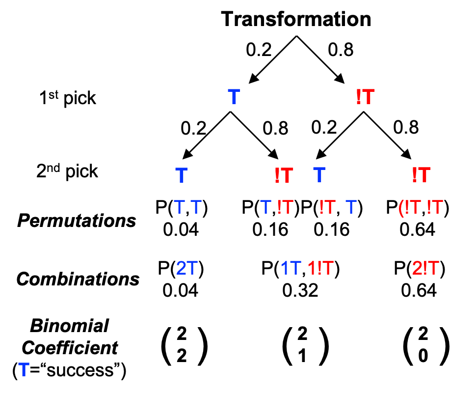

```{r setup, include=FALSE}
knitr::opts_chunk$set(echo = TRUE)
```

```{css, echo=FALSE}
.qbox {
  padding: 1em;
  background: cornsilk;
  border: 1px solid burlywood;
  border-radius: 5px;
}

.bluebox {
  padding: 1em;
  background: #d8ecf3;
  border: 1px solid cornflowerblue;
}

h1 {color: mediumblue}
h2 {color: mediumblue}
h3 {color: mediumblue}
```


# References

+ ***Whitlock & Schluter, Chapter 5: Probability***
+ ***Aho, Foundational and Applied Statistics for Biologists with R***
  + <a href="https://drive.google.com/file/d/1cpC3ofcP9DIB8vDieE1lBVVAesWklCyM/view?usp=sharing" target="blank">**Chapter 2: Introduction to Probability**</a>


# Combinatorial analysis

## Permutations

A **permutation** is a particular ***ordering*** of objects, like a DNA or protein sequence.

The number of possible orderings of $n$ objects is "n factorial", which is written as $n!$. For example:

+ There are 6 ways to arrange 3 nucleotides to make a codon: 3! = 1. 
  + One possible set is $S = {A,G,U}$, and the codons you can make from these are: AGU (Ser), AUG (Met), GAU (Asp), GUA (Val), UAG (Stop), UGA (Stop). 
+ If you have 5 amino acids, then you can arrange them in 120 different ways: $5! = 120$.

<!-- ======================================================================= -->
<!-- <div class="qbox"> -->
$\Rightarrow$ ***Q: How do permutations relate to the probability distribution of two independent rolls of a die?***

<details closed markdown="block">
  <summary>Answer</summary>

+ The total probability of getting any particular total face value from two rolls depends on the number of permutations that can give that face value.

For example, there is only one way to roll a 12 ... but there are 6 ways to roll a 7: 

$$nPerm = nPerm\{1,6\} + nPerm\{2,5\} + nPerm\{3,4\} = 2! + 2! + 2! = 6$$
The total probability of getting a 7 is the inverse of the number of permutations: 

$$Pr[7] = \frac{1}{nPerm} = \frac{1}{6}$$

<!-- </details> -->
<!-- </div> -->
<!-- ======================================================================= -->


### Sampling without replacement

If you randomly pick a **subset** of $k$ items from a larger set of $n$ items, then ***the number of possible sequences is much larger***. 

+ For example, if you pick 5 cards from a deck of 52, then you will have 52 choices on the first pick, 51 choices, on the second pick, and so on. 
  + Because the number of cards to choose from decreases by one each time, the number of ways to order 5 cards picked at random will be $52*51*50*49*48$.

We can use a very simple mathematical trick to find a convenient way to express this. We just multiply $52*51*50*49*48$ by 1, but we write it as: 

$$1 = \frac{47!}{47!} = \frac{47*46*...*2*1}{47*46*...*2*1}$$
So, we can now write out the number of permutations, $nPerm$, as:

$$nPerm = 52*51*50*49*48 * \frac{47!}{47!} = 52*51*50*49*48* \bigg( \frac{47*46*...*2*1}{47*46*...*2*1} \bigg) = \frac{52!}{47!} = \frac{n!}{(n-k)!}$$

The **probability** of picking a particular set of 5 cards in some order is the product of the individual probabilities of each random event:

+ The probability of picking the first card is $\frac{1}{52}$,
+ the probability of picking the second one is $\frac{1}{51}$, 
+ and so on.

$$\frac{1}{52}*\frac{1}{51}*\frac{1}{50}*\frac{1}{49}*\frac{1}{48} = \frac{1}{nPerm} = \frac{47!}{52!} = \frac{(n-k)!}{n!}$$

So, we see that the ***probability*** of any permutation of observed outcomes (ordering of independent random variables drawn from a finite set) is just the ***inverse*** of the number of possible permutations.

*** Note: The fact that the probabilities change each time we draw from a finite population is the reason that **sampling with replacement** is typically used for simulations instead. Sampling with replacement simulates a situation in which we draw independent samples repeatedly from a population. If we don't use replacement, then our samples are not truly independent, so the probabilities we want to calculate will not be representative.***


## Combinations

Now, say we don't care about the ***ordering*** of those 5 cards at all; we just want to know how probable it is that we pick **any particular set of 5 cards**.

Instead of $5! = 120$ possible orderings, we now have just one set of 5 cards in no particular order: $S = \{x_1,x_2,x_3,x_4,x_5\}$

+ This reduces the number of possibilities by $5!$, since we collapse all of the 120 independent possible orderings (***permutations***) into just one set (***combination***).

So, we just divide our permutations by $5!$ to get the number of combinations:

$$nComb = \frac{nPerm}{5!} = \frac{52!}{5!*47!} = \frac{n!}{k!(n-k)!} = \binom{n}{k}$$

The number of combinations, which we call "***n*** choose ***k***", is also known as the **binomial coefficient** and is a fundamental component of discrete probability theory.


## Binomial coefficient

When we perform more than one random trial, we are interested in the frequency of some particular outcome relative to all the possible outcomes, in other words its probability.

For example, if you want to make a strain with a GFP-tagged protein by CRISPR, and your probability of getting a transformant is 20%, then if you test 10 different lines, the probability that the first 3 lines you pick were transformed and the next 7 were not is:

$$Pr[T]*Pr[T]*Pr[T]*Pr[!T]*Pr[!T]*Pr[!T]*Pr[!T]*Pr[!T]*Pr[!T]*Pr[!T] = Pr[T]^3*Pr[!T]^7$$

+ This is one ***permutation*** of possible outcomes. But this represents only one of the ways you could get 3 transformants! It could be that the last 3 you picked were transformed, or the 1st, 4th, and 7th. 

In terms of computing probabilities, we are interested in the **number of successes** for a series of **random trials** that can give rise to that number of successes. In this example, that is 3 transformants out of 10. 

+ So we need to know **how many ways** it is possible to get this number of transformants, or the ***number of combinations*** that can give rise to it. This is where the **binomial binomial coefficient** comes in.

We can use **decision trees** to visualize how many possibilities exist for the different permutations of outcomes, and thus the number of possible combinations. This is illustrated below for the first two lines you picked:

{width=60%}

However, this approach becomes increasingly unwieldy as the number of independent trials grows! Instead, we can just use the formula we learned for combinations:

$$\binom{n}{k} = \frac{n!}{k!(n-k)!}$$

As we will see when we look at discrete distributions in more detail, the binomial coefficient is key to calculating probabilities for a series of independent random trials, and this translates directly to calculating binomial proportions.

