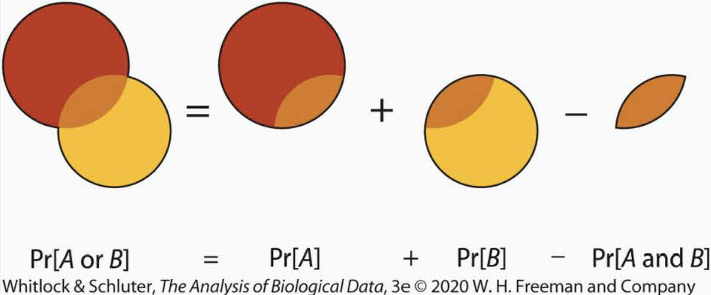

```{r setup, include=FALSE}
knitr::opts_chunk$set(echo = TRUE)
```

```{css, echo=FALSE}
.qbox {
  padding: 1em;
  background: cornsilk;
  border: 1px solid burlywood;
  border-radius: 5px;
}

.bluebox {
  padding: 1em;
  background: #d8ecf3;
  border: 1px solid cornflowerblue;
}

h1 {color: mediumblue}
h2 {color: mediumblue}
h3 {color: mediumblue}
```


# References

+ ***Whitlock & Schluter, Chapter 5: Probability***
+ ***Aho, Foundational and Applied Statistics for Biologists with R***
  + <a href="https://drive.google.com/file/d/1cpC3ofcP9DIB8vDieE1lBVVAesWklCyM/view?usp=sharing" target="blank">**Chapter 2: Introduction to Probability**</a>


# Review: Random variables

When we perform experiments, we are doing "**random trials**" with two or more possible "**outcomes**" that cannot be known with certainty in advance of measurement or observation. 

Different possible outcomes are called "**events**". This might be something like "Probability that an individual carries allele X", or "Brood size is between 20-50% of WT", etc.


When we want to evaluate our results, for example in hypothesis testing, we want to know the **frequency** with which different outcomes are obtained. This is a **probability.**


# Basics of set theory

In order to compute probabilities we need to be able to enumerate collections of **all possible outcomes** and have a way to determine what proportion of the time we expect to observe different potential outcomes. This is the realm of set theory.

## Set notation

+ **Set** - A collection of distinct objects: $S = \{A,B,...\}$
+ **Element** - An object in S: $A \in S$
+ **Subset** - One or more objects contained within S: $\{A,B\} \subset S$
+ **Event** - A plausible subset (e.g., all tails)
+ **Universal set** - The entire sample space $S$, where $P(S) = 1$
+ **Null (empty) set** - $B = \emptyset$, the set of objects not contained in S: $B \not \subset S$ and $P(\emptyset) = 0$
+ **Probability of an event** - Proportion of events with a specific outcome: $P(A) = \frac{N(A)}{N}; \ \  0 \le P \le 1$

### Set operations
  + Intersect
  + Union (addition / general addition rule)
  + Exclusion (subtraction)

### Set relations

  + Disjoint (mutual exclusion)
  + Nondisjoint (overlapping)
  + Independent
    + Can mutually exclusive events be independent?
    + How common is independence?
    
### Combinatorial analysis

  + Permutations & sampling without replacement
  + Combinations: binomial coefficient


## Sets

The set of possible outcomes, or the **sample space**, is the ***universal set*** $S$. 

For **discrete** data, we can enumerate the elements of the set in curly brackets:

$$S = \{x_1, x_2, ... x_n\}, \ \  x_i \in S$$

where $n$ is the total number of possible distinct outcomes, and each $x_i$ is an **element** of $S$.

## Events

An **event** is ***any plausible subset of possible outcomes***. For example, $A = \{x_1\}$, $A = \{x_1, x_2\}$, and $A = \{x_1, x_2,x_3\}$ are different **events**, and all of these are **subsets** of $S$.

To illustrate, say you have made a genetic cross to get a 3xFLAG-tagged transgene into a mutant background. You cross a heterozygous 3xFLAG strain to your homozygous mutant line and test 8 progeny by PCR to see which ones have the 3xFLAG tag in them. 

+ The set of PCR reactions is $S=\{r_1,r_2,r_3,...r_8\}$. 
+ One possible outcome is that that the 1st, 3rd, and 7th reactions have the 3xFLAG in them, and the rest don't. This subset would be $S=\{r_1,r_3,r_7\}$.


## Probability of an event

The **probability** is the **proportion** of random trials with a particular outcome. The **probability of event** $A$ is its frequency of occurrence, relative to all other outcomes:

$$Pr[A] = \frac{N[A]}{N}$$ 

where $N[A]$ is the number of times $A$ was observed, and $N$ is the total number of observations. 

+ The probability of any event ranges from 0 to 1, and the probability of the full sample space $Pr[S] = 1$. 
+ Conversely, the probability that some event does **NOT** occur is $1 - Pr[A]$.

<!-- ======================================================================= -->
<div class="qbox">
$\Rightarrow$ ***Q: What the probability of any single PCR reaction being 3xFLAG positive among the progeny of the cross?***

<details closed markdown="block">
  <summary>Answer</summary>

+ $Pr[3xFLAG] = 0.5$, and $Pr[NOT\ \ 3xFLAG] = 1 - 0.5 = 0.5$, since there is a 50:50 chance that the tagged chromosome will be transmitted. 

</details>
</div>
<!-- ======================================================================= -->


# Set operations

When a process can give rise to two or more outcomes, some very simple rules govern the relationships between them. These can be visualized using **Venn** diagrams:

{width=60%}


## Disjoint vs. non-disjoint sets

Two sets are **disjoint** if they have no shared elements. Similarly, two events are **mutually exclusive** if they cannot occur at the same time (for example, a particular allele cannot be both A1 and A2, and any individual can have only one blood type). 

Co-occurrence represents the **intersection** of two sets. It is represented by the $AND$ or operation, and its mathematical symbol, $\cap$, looks like an upside down U.


for **mutually exclusive** events, **the probability that both events occur at the same time is zero***:

$$Pr[A \ \ AND\ \  B] = Pr[A \cap B] = 0$$

Otherwise, for non-disjoint sets, the probability of co-occurrence must be greater than zero:

$$Pr[A \ \ AND\ \  B] = Pr[A \cap B] > 0$$

<!-- ======================================================================= -->
<div class="qbox">
$\Rightarrow$ ***Question: How does mutual exclusion relate to probability distributions?***

<details closed markdown="block">
  <summary>Answer</summary>

+ Different possible outcomes of a probability distribution are mutually exclusive.

</details>
</div>
<!-- ======================================================================= -->


## Independence

If two events are unrelated, and knowing something about one gives no information about the other, then they are **independent**. In this case, **the probability of both events occurring is the product of their individual probabilities**:

$$Pr[A \ \ AND\ \  B] = Pr[A \cap B] = Pr[A]*Pr[B]$$

Many combinations of genetic traits are **independent** (e.g. Mendel's green and wrinkly peas). 

Sometimes, however, two genes will show a ***genetic interaction***, in which case the independence rule is violated. When this happens, a functional association between these genes will show up as a deviation from independence.

<!-- ======================================================================= -->
<!-- <div class="qbox"> -->
$\Rightarrow$ ***Q: How does the law of independence relate to the distribution of allele combinations for 2 independently assorting genes with 5 alleles each, where each allele is equally likely to occur in the population?***

<details closed markdown="block">
  <summary>Answer</summary>

+ The total probability of getting any combination of 2 alleles is the product of the individual probabilities. 

In this case, the probability of seeing any two alleles together is 1/5*1/5 = 1/25.

<!-- </details> -->
<!-- </div> -->
<!-- ======================================================================= -->
<p>
<!-- ======================================================================= -->
<!-- <div class="qbox"> -->
$\Rightarrow$ ***Q: Can two mutually exclusive events be independent?***

<details closed markdown="block">
  <summary>Answer</summary>

+ No! It is not possible to simultaneously satisfy $P(A \cap B) = 0$ and $P(A \cap B) > 0$.

<!-- </details> -->
<!-- </div> -->
<!-- ======================================================================= -->
<p>
<!-- ======================================================================= -->
<!-- <div class="qbox"> -->
$\Rightarrow$ ***Q: How common is it for two overlapping sets to be independent?***

<details closed markdown="block">
  <summary>Answer</summary>

+ This is rare! There are many ways for two sets to overlap, but there is only one way to get $P(A \cap B) = P(A)*P(B)$.

<!-- </details> -->
<!-- </div> -->
<!-- ======================================================================= -->


## General addition rule

The **union** of two sets represents the probability that **either or both** outcome has occurred. The probability of $A \ OR \ B$ is represented by the **union** symbol, $\cup$, so the union of A and B is $A \cup B$. 

To find the probability of $A \cup B$, we need to subtract the probability that they are co-occurring from the total probability of each individual event (or else we would be counting the overlap twice).

$$Pr[A \ \ OR\ \  B] = Pr[A \cup B] = Pr[A] + Pr[B] - Pr[A\ \  AND \ \ B] = Pr[A] + Pr[B] - Pr[A \cap B]$$
Visualizing this rule makes it more intuitive:

{width=60%}


### Simple addition rule

The **general addition rule** applies whether two sets are mutually exclusive or not. For two ***mutually exclusive*** events, since $Pr[A \cap B] = 0$, the probability that either one occurs is simply the sum of their individual probabilities:

$$Pr[A \ \ OR\ \  B] = Pr[A \cup B] = Pr[A] + Pr[B]$$


<!-- ======================================================================= -->
<!-- <div class="qbox"> -->
$\Rightarrow$ ***Q: How does the addition rule relate to finding the total probability of different outcomes in probability distributions?***

<details closed markdown="block">
  <summary>Answer</summary>

+ Since each outcome in a distribution is mutually exclusive of the others, we can use the simple addition rule to find the total probability for different ranges of outcomes.

For example, for the discrete distribution of face values for 2 fair dice:

  + to find $Pr(X = 11 \cup 12)$, or $Pr(X \le 7 = Pr(X = 1 \cup 2 \cup ... \cup 7))$, etc. we just add up the frequencies of occurrence for each of these values.

</details>
<!-- </div> -->
<!-- ======================================================================= -->

---

