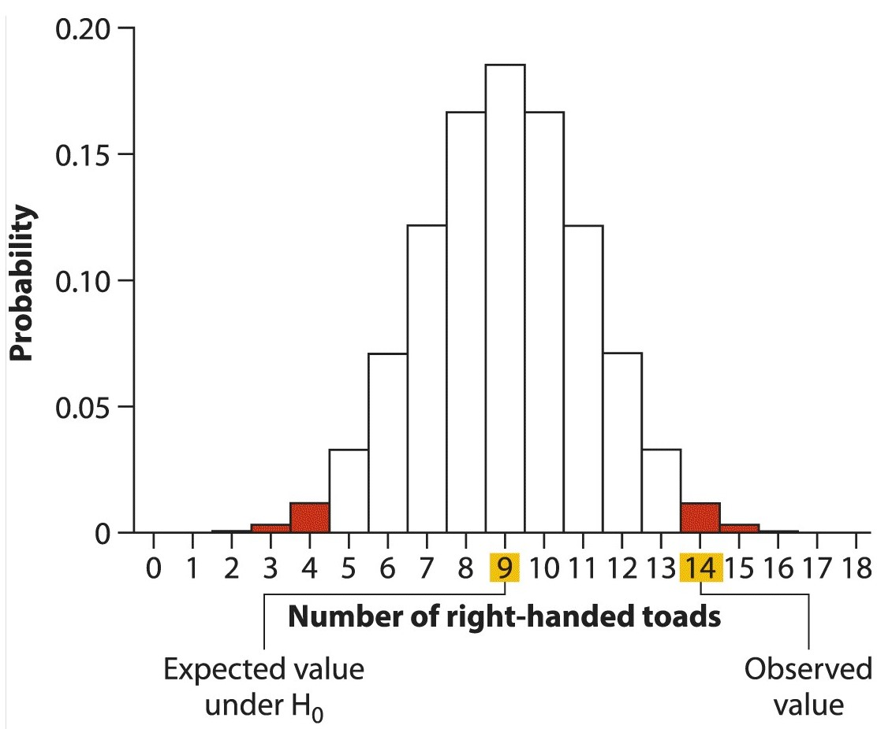
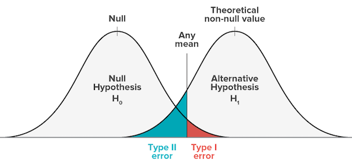

```{r setup, include=FALSE}
knitr::opts_chunk$set(echo = TRUE)
```


### Example: Polio vaccine

```
In 1954, Jonas Salk’s vaccine was tested on elementary-school students across the United States and Canada. In the study, 401,974 students were divided randomly into two groups: kids in one group received the vaccine, whereas those in the other group (the control group) were injected with saline solution instead. The students were unaware of which group they were in.

Of those who received the vaccine, 0.016% developed paralytic polio during the study, whereas 0.057% of the control group developed the disease (Brownlee 1955). The vaccine seemed to reduce the rate of disease by two-thirds, but the difference between groups was quite small, only about 4 cases per 10,000.

Did the vaccine work, or did such a small difference arise purely by chance?
```

Before we address this question, let's review the basics of hypothesis testing and work through a simple example.


## Null Hypothesis

To answer this question we need to formulate a *null* hypothesis, often denoted as $H_o$, and an alternative hypothesis, $H_A$.

+ The $H_o$ for the above question is that there is no difference between the proportion of polio cases in the vaccinated and the unvaccinated groups. 
+ The alternative hypothesis, $H_A$, is that the proportion of cases in the vaccine group is lower than in the unvaccinated group.

If the probability of $H_o$ is very low, then we can reject $H_o$ and accept the alternate hypothesis $H_A$.

Since we know that random samples display variation, this question becomes, ***"What is the chance that a difference at least as great as that observed is likely to occur just by chance, if $H_o$ is true?"***


## Four basic steps of hypothesis testing

- State the hypothesis. 
- Compute the test statistic with the data. 
- Determine the $p$-value.
- Draw the appropriate conclusions.

There are two kinds of tests we can perform to compare $H_o$ and $H_A$:

+ A **two-sided** test asks whether the observed result is either greater than or smaller than expected under the null hypothesis.
+ A **one-sided** test is more specific, when we are interested in asking about a difference in only one direction.

A **test statistic** is a value based on the observed data that is compared to the null distribution to see how consistent the data are with expectation under $H_o$.

+ Note: It is important to decide ***in advance*** what $p$-value you will accept as the threshold for rejecting the null hypothesis; adjusting the $p$-value to accommodate your results is called ***$p$-value hacking***.


## Null distribution

To figure out how likely our observed data are under $H_o$, we need to know something about the **null** distribution, i.e. the frequency of occurrence of all possible outcomes that WOULD be consistent with the null hypothesis.

Therefore we want to compare our results with the $H_o$ distribution and see ***how often we would see a difference from the null expectation that is at least as great as the one we observed, just by chance.***

+ ***The $p$-value represents the probability of a specific event under the $H_o$, i.e. the probability of a particular observed outcome, given the null distribution.***


### Example: handedness in toads^[1]

```
Bisazza et al. (1996) tested the possibility of handedness in European toads, Bufo bufo, by sampling and measuring 18 toads from the wild. We will assume that this was a random sample. It was found that individual toads tended to use one forelimb more than the other. Of the 18 toads tested, 14 were right-handed and 4 were left-handed.

At this point the question became: do right-handed and left-handed toads occur with equal frequency in the toad population, or is one type more frequent than the other, as in the human population? Are these results evidence of a predominance of one type of handedness in toads?
```

Our null and alternative hypotheses are:

+ $H_o$: Left- and right-handed toads are equally frequent in the population.
+ $H_A$: Left- and right-handed toads are not equally frequent in the population.

+ The ***null expectation*** (no handedness) is that, out of 18 individuals sampled, we should observe 9 right-handed and 9 left-handed individuals.
+ The ***test statistic*** is 14, the number of right-handed individuals.

When will perform a ***two-sided test*** since we are looking for any difference in either direction. 

The null distribution and observed outcome for the handedness problem are illustrated below:

{width=60%}

The null distribution above assumes that the probability of right- or left-handed toads is 0.5, and so we would expect most often to see 9 right-handed toads in any sample of 18 individuals.


### Binomial proportions test: Handedness

This distribution is an example of a **binomial** distribution with $p=0.5$ (we will discuss the binomial in great detail in the next class). Therefore, we can use R's function for the CDF of a binomial distribution, `pbinom()`, to calculate the total probability of these two outcomes.

Since we will perform a two-tailed test, we are interested in the probability of seeing $\ge 14$ OR $\le 4$ right-handed toads:

```{r collapse=TRUE}
# cdf of total probability up to and including 4
pbinom(q = 4, size = 18, prob = 0.5) 

# cdf of greater than 13 (same as >= 14)
pbinom(13, 18, 0.5, lower.tail = F)

# alternative method for CDF >= 14
1 - pbinom(13, 18, 0.5, lower.tail = T)


# combined total probability of both tails
pbinom(4, 18, 0.5) + pbinom(13,18,0.5, lower.tail = F)
```

The $p$-value of our test statistic is 0.031. This is lower than the conventional cutoff of $p=0.05$, also known as **significance level**, or $\alpha$. 

Thus we **reject** the $H_o$ that there is no handedness and accept the $H_A$ that there is a preferential handedness for toads.


### Binomial proportions test: Polio vaccine

We can formulate the question about vaccine effectiveness in a similar manner as for the handedness example above. Take a few minutes to formulate the null and alternative hypotheses, and then compute a $p$-value for the observed data on your own. Assume the study included 200,000 unvaccinated and 200,000 vaccinated children.

What are the null and alternative hypotheses?

```
H_o: The proportion of children who contracted polio in each group was the same
H_A: The proportion of children who contracted polio in each group was not the same
```

+ What is the test statistic?
+ What are the $p$-values for each group given the data?
+ How significant was the $p$-value from this study?

```{r}
# sample size
n = 200000

# proportion of individuals with polio in each group
p.polio.ctl = 0.00057
p.polio.vac = 0.00016

# number of individuals with polio in each group
num.polio.ctl = p.polio.ctl * n
num.polio.vac = p.polio.vac * n
num.polio.ctl # 114
num.polio.vac # 32

# binomial test for vaccinated group given H_o
pbinom(114,n,p.polio.ctl)  # control group
pbinom(32,n,p.polio.ctl)   # vaccinated group
```


## Errors in Hypothesis testing

### Type I vs. Type II errors

There are two basic kinds of errors we can make in hypothesis testing:

+ Rejecting a true null hypothesis is a **Type I** error. This is also called a **False Positive**. 
+ Conversely, failing to reject a false null hypothesis is **Type II** error, or a **False negative**.

{width=70%}


This is also illustrated in the table below:


### Tradeoffs in hypothesis testing

+ **Type I error (False positives)**

The number $\alpha$ is an arbitrary threshold at which we call an observed difference **significant**.

  + Often, we choose $\alpha = 0.05$. 
    + Note that at this threshold, we will falsely reject a true null hypothesis 5% of the time, or 1/20 times.
    + The probability of accepting a true $H_o$, i.e. the **True negative** rate, is $1 - \alpha$.
    
One can try to reduce the **Type I** error by simply reducing the $\alpha$, for example setting $\alpha=0.01$. 

  + However, this makes the **Type II** error worse! If the $\alpha$ threshold is too conservative, more true rejections will be missed.
  + On the other hand, if you are too liberal in setting $\alpha$, you risk increasing false negatives (failing to accept a true $H_o$).

+ **Type II error (False negatives)**

The number $\beta$ represents the proportion of the time that we do NOT reject $H_o$, even though $H_A$ is true.

  + A low **Type II** error is a sign that a test has high **power**, i.e. the probability of correctly accepting an alternative hypothesis $H_A$ (i.e. correctly rejecting a false null hypothesis). 
  + Since power encompasses all **True positives**, power = $1 - \beta$. 
  
We will talk more about power when we discuss experimental designs.


## Interpreting non-significant results

Note that a high $p$-value does not prove that the null hypothesis is true. 

  + Our test is to see if the test statistic is more extreme than what we would expect by random sampling, and so all it says is that we cannot reject $H_o$ on the basis of the data at hand.
  + It is possible that with more data, our test would achieve greater **power**, i.e. the ability to discriminate between a true $H_o$ and a true $H_A$.
  

## Confidence intervals

As we have already seen, confidence intervals enable us to estimate a range within which we would expect the true population parameter to fall some specified percentage of the time.

$p$-values are closely related to confidence intervals: they are essentially reciprocal, and play complementary roles in Statistics. However,

  + $p$-values are more ***qualitative***, since they only allow binary conclusions (i.e. "significant" or "not significant".) 
  + Confidence intervals are more ***quantitative***: they give you z range of values that are acceptable. 
***If a test statistic falls outside of the $1 - \alpha$ confidence interval, than the result of that test will be called statistically significant because the it will surely have a $p$-value less than 0.05.***


### Example: Can parents distinguish their own children by smell alone?

```
To investigate, Porter and Moore (1981) gave new T-shirts to children of nine mothers. Each child wore his or her shirt to bed for three consecutive nights. During the day, from waking until bedtime, the shirts were kept in individually sealed plastic bags. No scented soaps or perfumes were used during the study. Each mother was then given the shirt of her child and that of another, randomly chosen child and asked to identify her own by smell. Eight of nine mothers identified their children correctly.
```

In the exercise we will examine the following questions:

+ What is the appropriate null hypothesis?
+ What is the alternative hypothesis? 
+ What test statistic should you use? 
+ If the null hypothesis were true, what is the probability of the observed data?
+ What is the P-value for the test? 
+ What is the appropriate conclusion?
+ We would we want to calculate a 95% confidence interval for the true proportion of correct identifications?

---

*The examples used here are from Whitlock, Michael C. & Schluter, Dolph, The Analysis of Biological Data (Chapter 6).*
