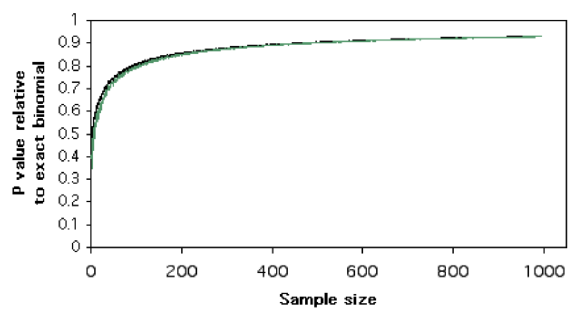

```{r setup, include=FALSE}
knitr::opts_chunk$set(echo = TRUE)
library(knitr)
```

# Overview: proportional tests for frequency distributions

## Types of questions

1. ***Goodness-of-fit***: Do one or more categorical variables fit an expected frequency distribution?
2. ***Independence***: Are two categorical variables associated in some way? Do response variables differ between groups?

## One-sample vs. two-sample tests

1. Compare an observed proportion to an expected distribution
2. Compare two observed proportions to see if they are different from each other

## Types of tests

+ ***Exact tests***: Enumerate **all possible discrete outcomes** that are at least as extreme as the observed data (i.e. as or more different from expectation) and compute the total probability of these.
+ ***Approximate tests***: Compare **observed vs. expected** values to estimate the probability of obtaining a result at least as extreme as the observed data. This approach uses a **continuous distribution** to **approximate** the probability.


## Exact and approximate tests for frequency distributions

|                   | One variable                	| Two variables          |
|-------------------|-------------------------------|------------------------|
| ***Exact***	      | Binomial proportions          |	Fisher’s exact test    |
| ***Approximate***	| $\chi^2$ goodness-of-fit      |	$\chi^2$ test of independence |

*Note: the binomial approximate test, or the $z$-test, can be used instead of the $\chi^2$ test for one or two variables. It is mathematically equivalent to the $\chi^2$ test because they both use a normal approximation. However the $\chi^2$ test is more general because it can be applied to multiple categories.*

### *Limitations of exact tests*

The **exact tests** should be used whenever possible, since they compute exact probabilities given all possible outcomes. However,

+ The **binomial proportions test** only works for binary outcomes (two categories).
+ **Fisher's test** can be extended to larger RxC tables, but it works best when the row and column totals are small, since it is computationally more expensive.
  + While R is able to calculate Fisher's for some tables with many observations, it becomes relatively slow for large sample sizes, in which case the Chi-squared test of independence is sufficiently accurate.

### *Limitations of approximate tests*

**Approximate** frequency tests do not provide accurate $p$-values when the frequency of one or more groups is low. Standard textbooks will tell you that before using a $\chi^2$ test, you should check that the following **assumptions** are met:

+ Samples are unbiased random samples
+ At least 20% of the cells have an expected frequency = 5
+ The *expected frequency* for all cells is at least 1

When the above conditions are **not** met, several **alternative options** are available:

+ Combine some groups so that assumptions can be met (e.g. two groups can become "Other")
+ Use an exact test if possible
+ Use permutation tests to compute a $p$-value (Chapter 13, W&S)

*Note that the numbers given above are slightly arbitrary cutoffs. In general, exact tests are preferred whenever feasible.*


### *Continuity correction for approximate tests*

The following diagram[^1] illustrates the P-value computed by an approximate test relative to the P-value from a binomial exact test as a function of sample size. This shows that even for sample sizes that meet the criteria for an approximate test, $\chi^2$ (black) and a similar test called the "G-test" (green) provide estimates for P-values that are too small relative to an exact binomial P-value, thus inflating the apparent significance of the test.

{width=50%}

```{r out.width="50%", include=F}
# library(knitr)
# 
```


To correct for this, the default behavior in R for $\chi^2$ tests is to perform ***Yates' continuity correction***, which modifies the $(O-E)^2$ term as $(|O-E| - 1/2)^2$ to reduce the overall magnitude of the $\chi^2$ test statistic. The term "continuity" correction is applied here because a *continuous* function (Chi-square) is being applied to approximate a *discrete* function (e.g. binomial).

There is some disagreement about when continuity correction should be applied, since in some cases it can result in overcorrection that results in a type II error (failure to correctly reject the null hypothesis). The Yates correction is strongly recommended when the expected number of observations in a cell is less than 5-10.

*For these reasons, it is preferable to use an exact test whenever possible in order to get the most accurate measure of significance.*


## Contingency tests

A common question that arises in biology is whether a response variable differs between groups. If so, we would also like to evaluate whether the probability distribution of one categorical variable is likely to be **dependent** on that of a second variable. For example:

+ *Do smokers have a higher incidence of lung cancer?*
+ *Does aspirin lower the incidence of heart attacks?*
+ *Do parasites alter the behavior of their hosts?*

In other words, are any observed differences are likely to occur by chance alone, due to variation among random samples? 

If the differences are not random, we may also like to know the strength of the association, i.e. what is the magnitude of the difference? We will address the latter question in a future class.

Two kinds of analysis can be done to address such questions:

+ Tests for **independence**: do the data show a significant difference from what would be expected if two variables were unrelated?
  + ***Exact tests***: compute an exact $p$-value based on all possible discrete outcomes
  + ***Approximate tests***: estimate $p$-values based on a continuous approximation of a discrete distribution
  
+ **Estimation**: how different is a response variable between two groups of interest?
  + ***Relative risk***: relative proportions between two groups
  + ***Odds ratio***: relative ***odds*** between two groups
  
We will discuss measures of association for categorical data in the next class, and for continuous data a little bit later.


### $\chi^2$ test for independence

The $\chi^2$ is the most common **approximate test** for independence and is widely used for contingency analysis. It can be used to test multiple categories with multiple possible outcomes and so is appropriate for a range of simple comparisons. Please refer to the lecture notes from the last class for a discussion of $\chi^2$ tests.

Other approximate tests exist for experimental designs that are **paired** or that control for **multiple measurements**. We will not cover these here, but they are mentioned at the bottom of this document.

### Fisher's Exact Test

Fisher's exact test uses the **hypergeometric** distribution (sampling without replacement from a finite population) to provide an **exact $p$-value** for contingency tables, by computing the cumulative probability of **all possible scenarios** that differ as much or more from a neutral expectation than the observed values. 

+ Where possible to use, it is preferred to the $\chi^2$ test for all 2x2 contingency tables.
  + In particular, it should be used instead of the $\chi^2$ test for independence for cases where some of the **frequencies** in the contingency table are **too low to satisfy the assumptions** of the $\chi^2$ test. 
+ Fisher's exact $p$-value can be extrapolated to larger datasets and tables with more rows and columns, but it becomes computationally impractical as the number of possibilities increases.

We will discuss Fisher's test in the next class.

---

## Other frequency tests

Other flavors of tests exist that apply to different kinds of situations where frequency data need to be analyzed. We will not cover these here, but merely mention them in case you may want to use them in the future.


### G-test for goodness-of-fit

The $G$–test of goodness-of-fit (a.k.a. likelihood ratio test, log-likelihood ratio test, or $G^2$ test) tests whether one nominal variable with two or more categories fits a theoretical expectation. Like the Chi-square test, it should be used with large sample sizes, since it will give inaccurate $P$-values for small sample sizes.


### Barnard's Exact Test for equality of proportions

It turns out that experimental study design governs whether the true distribution of the data is hypergeometric or multinomial, and therefore whether Fisher's is necessarily the right choice.

Barnard's test is a **non-parametric alternative** to Fisher's exact test. Because it is not conditioned on fixed margins (meaning it does not assume that the row and column totals are independent), Barnard's exact test is reported to have greater ***power*** than Fisher's exact test for 2x2 contingency tables. You can read about it on Wikipedia:
 [Barnard's test](https://en.wikipedia.org/wiki/Barnard%27s_test)

An implementation of Barnard's test is available in R:
[Blog on Barnard's exact test](https://www.r-statistics.com/2010/02/barnards-exact-test-a-powerful-alternative-for-fishers-exact-test-implemented-in-r/)


### McNemar and Cochran-Mantel-Haenszel

For more complicated scenarios, additional tests are available that we will not cover here. These include:

+ ***McNemar's test***
  + Used for "paired data", in which two measurements that come from the same individuals are compared. For example, a response variable can be compared between "pre-" and "post-" treatment, such as incidence of heart attacks before and after bypass surgery.
+ ***Cochran-Mantel-Haenszel test***
  + Used for testing the independence of two nominal variables with *repeated measurements*. For example[^2], to test for independence between an *Allele* and *Habitat* measured in four different *Locations*, the test could be applied to a 2x2x4 table to test for a relationship between the first two variables while controlling for the third.
  + The R implementation can also handle larger sets of categorical data.

---

## R commands for different kinds of frequency tests

To summarize, R contains commands for computing statistics for comparing categorical variables to expected discrete distributions, as well as for testing for and measuring associations between categorical variables:

+ Goodness-of-fit
  + `binom.test()`
  + `chisq.test()`

+ Independence
  + `fisher.test()`
  + `chisq.test()`

---

## Converting between lists and tables

Often our data will not be pre-formatted as a contingency table, so we will need to transform it in order to use these functions. The most common functions are `table()` and `xtable()`, which allow you to create 2x2 or larger tables. You can also cross-tabulate on one or more variables.

Some short tutorials for making tables and converting between data frames and tables are available here:

+ [R Cookbook](http://www.cookbook-r.com/Manipulating_data/Converting_between_data_frames_and_contingency_tables/)
+ [Quick R](https://www.statmethods.net/stats/frequencies.html)


---

## Additional Resources

+ **Whitlock & Schluter, Chapters 8 and 9**
+ **Whitlock & Schluter Online Tutorials**
  + [Frequency Data](https://whitlockschluter3e.zoology.ubc.ca/RLabs/R_tutorial_Frequency_data.html)
  + [Contingency Analysis](https://whitlockschluter3e.zoology.ubc.ca/RLabs/R_tutorial_Contingency_analysis.html)
+ [**Handbook of Biological Statistics**](http://www.biostathandbook.com/)
  + Goodness-of-fit tests
    + [Binomial](http://www.biostathandbook.com/exactgof.html)
    + [Chi-square](http://www.biostathandbook.com/chigof.html)
    + [G-test](http://www.biostathandbook.com/gtestgof.html)
  + Tests for independence
    + [Fisher's Exact Test](http://www.biostathandbook.com/fishers.html)
    + [Chi-square](http://www.biostathandbook.com/chiind.html)
      + [*The problem with small numbers in Chi-square test*](http://www.biostathandbook.com/small.html)
  + [Chochran-Mantel-Haenzl](http://www.biostathandbook.com/cmh.html)
+ [R Cookbook](http://www.cookbook-r.com/)
+ Aho, Chapter 11

[^1]: [Handbook of Biological Statistics](http://www.biostathandbook.com/), by John H. McDonald
[^2]: [Handbook of Biological Statistics](http://www.biostathandbook.com/), by John H. McDonald
