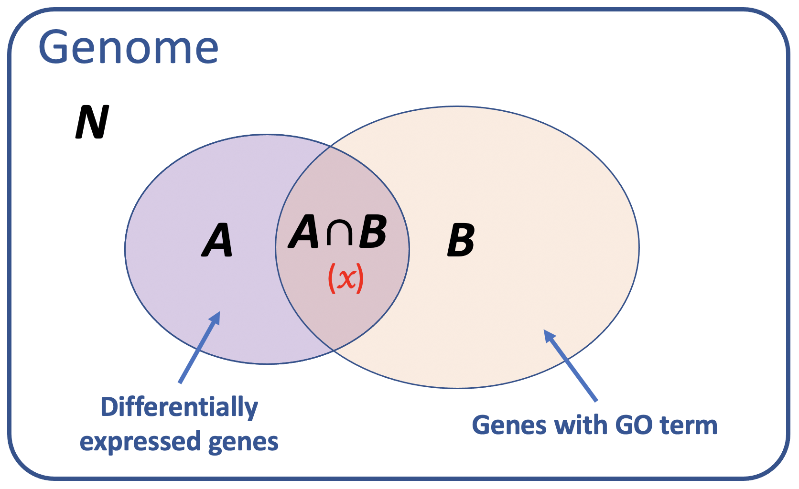
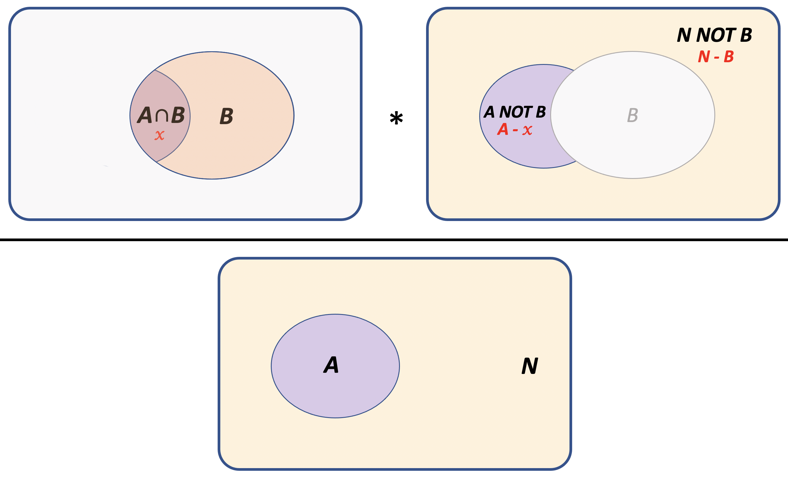

```{r setup, include=FALSE}
knitr::opts_chunk$set(echo = TRUE)
```


# Hypergeometric distribution

The hypergeometric distribution is similar to the *binomial distribution*, except it defines the *probability of obtaining $x$ independent successes* when sampling _**without replacement**_. It is classically described in terms of an urn containing some black balls and some white balls. The hypergeometric distribution will tell us how likely it is that a handful of balls picked from the urn contains a certain number of black (or white) balls.

## Example: GO-term enrichment

In our field, probably the most common application of the hypergeometric distribution is to test whether a set of genes of interest (e.g. up- or down-regulated genes in a differential gene expression analysis) is enriched for a specific functional annotation (e.g. GO term).

To test this, we need to ask whether the observed overlap is different from what we would
expect if we picked the same number of genes at random from the genome. What would this be? We can use set theory to figure this out. Let's visualize the problem:

{width=40%}

Our question is whether the overlap between the two sets of genes is greater than (or less than) expected by chance. Under independence, we know that:

$$Pr[A \cap B] = Pr[A]*Pr[B]$$

We can use a hypergeometric test to answer this question. The question is formulated in this way:

***If we pick $n$ out of $N$ total items (Set A), what is the chance that $x$ of them would also be contained in $M$ (Set B), if the two sets were independent?***

To answer this, we need to know just a few things:

+ $N$: the total number of selectable items in the genome
+ $n$: the number of items in Set $A$
+ $M$: the number of items in Set $B$
+ $x$: the overlap between Set A and Set B ($A \cap B$)


## Hypergeometric PDF

Sampling without replacement means that we are picking a particular set of items from a
finite set of total items. Therefore, each trial affects the probability of the next outcome -- in other words, we need an equation to find the relative frequency of $x$ in a shrinking sample space. (If the population were infinite, then this would essentially
be the same as sampling with replacement, since the sample would not make a dent in the
remaining number of individuals to choose from.)

The PDF is defined as:

$$ f(x) = P(X = x) = \frac{\binom{B}{x} \binom{N-B}{A-x}} {\binom{N}{A}}$$

where:

- $x \in \{0,1,2,...,n\}$ is the number of "successful" trials
- $N \in \{1,2,...,N\}$ is the total number of selectable items 
- $M \in \{0,1,2,...,N\}$ is the total number of possible "successful" outcomes (the number of items in the group we are comparing against)
- $n \in \{0,1,2,...,N\}$ is the number of items sampled

The random variable $x$ represents the overlap between the two sets ($A \cap B$), $n$ is Set $A$, and $M$ is Set $B$. Here, Set $B$ is defined as "success" and Set $A$ is the sample we are asking about.

The **lower-tail** probability is the probability that ***fewer*** than $x$ overlaps are observed (depletion), and the **upper-tail** probability is the probability that ***more*** than $x$ overlaps are observed (enrichment).

The components of the equation are:

+ $\binom{M}{x}$: the number of ways to get ($A \cap B$) out of $B$ items 
+ $\binom{N - M}{n - x}$: the number of ways to get ($A\ \ NOT\ \ B$) out of ($N\ \ NOT\ \ B$) items 
+ $\binom{N}{n}$: the number of ways to get $A$ out of $N$ items

{width=50%}

## Hypergeometric test

The `hyper` family of functions in R does not observe the usual naming convention, which is a bit confusing at first, but the variables are the same. 

For example, let's say we have a list of 59 genes that are predicted to be regulated by the mouse E2F transcription factor, and we want to know whether they are enriched for genes involved in the cell cycle. There are 13,588 genes with some GO annotation in the mouse genome, and 611 of them are annotated with the term "cell cycle". We find that 19 out of our 59 genes are annotated with the GO term "cell cycle". 

Is the list of predicted E2F targets significantly enriched for the GO term "cell cycle"? We can figure this out in the following way:

```{r}
help(phyper)

# hypergeometric CDF in R is defined as: 
#   p(x) = choose(m, x) choose(n, k-x) / choose(m+n, k)

# the formula is:
#   phyper(q, m, n, k, lower.tail = T/F)

# Instead, we will use: 
#   phyper(Overlap-1, SetB, N - SetB, SetA, lower.tail= FALSE)
Overlap = 19  # predicted genes with GO term
A = 59        # predicted E2F targets
B = 611       # genes with GO term
N = 13588     # total annotated genes

# Expected overlap based on the null hypothesis:
# [# genes in (A AND B)] = [# genes in A] * [# genes in B] / N
exp.overlap = A * B / N
print(paste("Expected overlap =", round(exp.overlap,2)))

# Fold-enrichment: OL / (A*B/N) = (OL/A) / (B/N) = OL*N / A*B
fold.enrichment = Overlap / exp.overlap
print(paste("Fold-enrichment =", round(fold.enrichment,2)))

# P(enrichment) = upper-tail probability: P(X >= x)
# Note: We use Overlap-1, otherwise we are asking for P(X > x)
#       since this is a discrete distribution
phyper(Overlap-1, B, N - B, A, lower.tail= FALSE)

# same using PDF instead
sum(dhyper( Overlap:A, B, N - B, A ))
```

## Fisher's Exact Test

The hypergeometric test is the same as a one-tailed Fisher's exact test:

```{r}
# set up the contingency table with the overlap in the top left corner
# first row is the predicted targets
A.not.B = A-Overlap
B.not.A = B-Overlap
N.not.AB = N - B - A.not.B
contingency.table = rbind(c(Overlap, A.not.B),
                          c(B.not.A, N.not.AB))
rownames(contingency.table) = c("target","not.target")
colnames(contingency.table) = c("GO","not.GO")
contingency.table

# Is the overlap greater than expected by chance?
fisher.test(contingency.table, alternative="greater")
fisher.test(contingency.table, alternative="greater")$p.value
```
