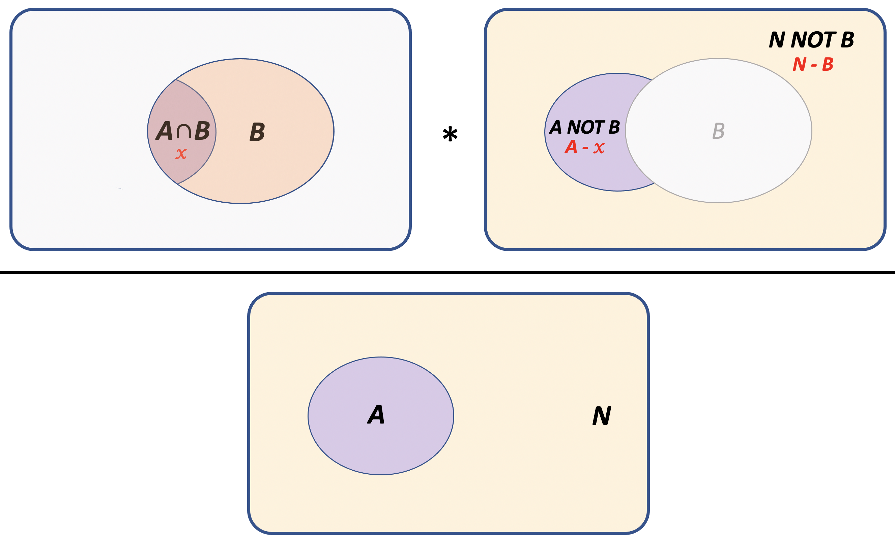

```{r setup, include=FALSE}
knitr::opts_chunk$set(echo = TRUE)
```


The hypergeometric distribution is similar to the *binomial distribution*, except it defines the probability of obtaining $x$ independent successes when ***sampling without replacement***. The basic question can be thought of this way:

***If we randomly pick a group of items from a finite total, what is the chance that the overlap with a second group would be more (or less) than expected by chance?***

The hypergeometric distribution is classically described in terms of an urn containing some black balls and some white balls. It allows us to tell how likely it is that a handful of balls picked from the urn contains a certain number of one color, in comparison with what would be expected just by chance alone if the sampling were totally random.

## Example: GO-term enrichment

In our field, probably the most common application of the hypergeometric distribution is to test whether a set of genes of interest (e.g. up- or down-regulated genes in a differential gene expression analysis) is enriched for a specific functional annotation (e.g. GO term).

To test this, we need to ask, ***Is the observed overlap different from what we would expect if we picked the same number of genes at random from the genome?*** We can use set theory to figure this out. 

Let's visualize the problem:

<div align="center">
{width=40%}
</div>

We are interested in whether the probability of the observed overlap between the two gene sets is greater than (or less than) expected by chance. Under the **null hypothesis** of ***independence***, we know that:

$$Pr[A \cap B] = Pr[A]*Pr[B]$$

We can use the hypergeometric test to answer this question by formulating it in this way:

***If we pick $A$ genes out of $N$ total genes, what is the chance that $x$ of them would also be contained in $B$, if the two sets were independent?***

To answer this, we need to know just a few things:

+ $N$: the total number of annotated genes in the genome
+ $A$: the number of genes in Set $A$ (e.g. differentially expressed genes)
+ $B$: the number of genes in Set $B$ (e.g. genes with a particular GO term)
+ $x$: the overlap between Set $A$ and Set $B$ ($A \cap B$)


## Hypergeometric PDF

**Sampling without replacement** means that we are picking a particular set of items from a
***finite*** set of total items. Therefore, each trial affects the probability of the next outcome -- in other words, we need an equation to find the relative frequency of $x$ in a shrinking sample space.

Note that ***if*** the population were ***infinite***, then this would essentially
be the same as **sampling with replacement**, since the sample would not make a dent in the
remaining number of individuals to choose from.

The hypergeometric PDF is defined as:

$$ f(x) = P(X = x) = \frac{\binom{B}{x} \binom{N-B}{A-x}} {\binom{N}{A}}$$

where:

- $x$ is the number of "successful" trials (overlap between A and B)
- $N$ is the total number of selectable items (all annotated genes)
- $B$ is the total number of possible "successful" outcomes (Set B)
- $A$ is the number of items sampled (Set A)

The random variable $x$ represents the intersection of the two sets ($A \cap B$). Set $A$ is the sample we are asking about, and Set $B$ is the group we are comparing against. 

The components of the equation are:

+ $\binom{B}{x}$: the number of ways to get ($A \cap B$) out of $B$ items 
+ $\binom{N - B}{A - x}$: the number of ways to get ($A\ \ NOT\ \ B$) out of ($N\ \ NOT\ \ B$) items 
+ $\binom{N}{A}$: the number of ways to get $A$ out of $N$ items

<div align="center">
{width=50%}
</div>

## Hypergeometric CDF

As always, the cumulative distribution gives the total probability $P(X \le x)$ and $P(X > x)$. The **lower-tail** probability is the probability that ***fewer*** than $x$ overlaps are observed (depletion), and the **upper-tail** probability is the probability that ***more*** than $x$ overlaps are observed (enrichment).

## Hypergeometric test

The `hyper` family of functions in R does not observe the usual naming convention, which is a bit confusing at first. 

```{r}
help(phyper)

# hypergeometric density function in R is defined as: 
#   p(x) = choose(m, x) choose(n, k-x) / choose(m+n, k)

# where:
#   x = # of white balls drawn w/o replacement from an urn
#            containing black and white balls (overlap, x)
#   m = # of white balls in the urn (Set B)
#   n = # of black balls in the urn (N - B)
#   k = # of balls drawn from the urn (Set A)

# the command is:
#   dhyper(x, m, n, k, lower.tail = T/F)
```

## Example: Gene set enrichment

I think it's a little easier to think in terms of overlaps than white and black balls drawn from an urn, in which case we can use an alternative formulation:

```{r eval=FALSE, results=FALSE}
# lower tail: overlap less than expected by chance, P(X < X or X = x)
phyper(Overlap, B, N - B, A)

# upper tail: overlap more than expected by chance, P(X > x)
phyper(Overlap, B, N - B, A, lower.tail= FALSE)
```


For example, let's say we have a list of 59 genes that are predicted to be regulated by the mouse E2F transcription factor, and we want to know whether they are enriched for genes involved in the cell cycle. There are 13,588 genes with some GO annotation in the mouse genome, and 611 of them are annotated with the term "cell cycle". We find that 19 out of our 59 genes are annotated with the GO term "cell cycle". 

Is the list of predicted E2F targets significantly enriched for the GO term "cell cycle"? We can set the problem up in the following way:

```{r}
Overlap = 19  # predicted genes with GO term
A = 59        # predicted E2F targets
B = 611       # genes with GO term
N = 13588     # total annotated genes

# Expected overlap based on the null hypothesis:
# [# genes in (A AND B)] = [# genes in A] * [# genes in B] / N

exp.overlap = A * B / N
print(paste("Expected overlap =", round(exp.overlap,2)))

# Fold-enrichment: OL/(expected OL) = OL/(A*B/N) = (OL/A)/(B/N) = (OL*N)/(A*B)

fold.enrichment = Overlap / exp.overlap
print(paste("Fold-enrichment =", round(fold.enrichment,2)))
```

Notice that since we are specifically interested in ***enrichment***, we want the ***upper tail*** probability. Since this is defined as $P(X > x)$, but we want a probability wtih $x$ **inclusive**, we need to use $P(X \ge x-1)$.

In R, we get the total probability using `pyhper` (CDF), which is equivalent to adding up all the discrete probabilities using `dhyper` (PDF):

```{r}
# The CDF function is:
#   dhyper(q, m, n, k, lower.tail = T/F)

# Instead, we will use: 
#   phyper(Overlap-1, B, N-B, A, lower.tail= FALSE)

# P(enrichment) = upper-tail probability: P(X >= x)
# Note: Since this is a discrete distribution,
#       we use Overlap-1, otherwise we are asking for P(X > x)

phyper(Overlap-1, B, N - B, A, lower.tail= FALSE)

# same using PDF instead
sum(dhyper( Overlap:A, B, N - B, A ))
```


## Fisher's Exact Test

The hypergeometric test is the same as a one-tailed Fisher's exact test:

```{r}
# set up the contingency table with the overlap in the top left corner
#   first row is the # of predicted targets (Set A)
#   first column is the # of genes with GO term (Set B)
A.not.B = A-Overlap
B.not.A = B-Overlap
N.not.AB = N - B - A + Overlap  # same as: N - B - A.not.B
contingency.table = rbind(c(Overlap, A.not.B),
                          c(B.not.A, N.not.AB))
rownames(contingency.table) = c("target","not.target")
colnames(contingency.table) = c("GO","not.GO")
contingency.table

# Is the overlap greater than expected by chance?
fisher.test(contingency.table, alternative="greater")
fisher.test(contingency.table, alternative="greater")$p.value
```

Since both methods enumerate all possible combinations of outcomes at least as extreme as the observed overlap, these give exactly the same result. 

Fisher's test gives the added benefit of providing a 95%CI and an odds ratio.

## Which test should I use?

Since `pyhper` or `fisher.test` give the same $p$-value, it doesn't really matter, unless you wish to report confidence intervals or odds ratios. However, `phyper` is implemented in a slightly more efficient manner. You can see this by comparing the execution times of the two commands (though in this case the practical effect is trivial):

```{r results=FALSE}
start.time.phyper = Sys.time()
phyper(Overlap-1, B, N - B, A, lower.tail= FALSE)
execution.time.phyper = Sys.time() - start.time.phyper

start.time.fisher = Sys.time()
fisher.test(contingency.table, alternative="greater")
execution.time.fisher = Sys.time() - start.time.fisher
```

```{r}
paste("phyper:", execution.time.phyper)
paste("Fisher's:", execution.time.fisher)
```


As noted before, if $N$ is really large, exact tests become inefficient. In such cases, you can use approximate tests such as the Chi-squared test of independence. Alternatively, you could simulate the null distribution and use that to compute an empirical p-value.

However, with modern computers, Fisher's works pretty well for datasets up to 5 or 6 figures (and if you can afford to wait, you can use it on even larger datasets, or contingency tables with more than two rows and columns.)
