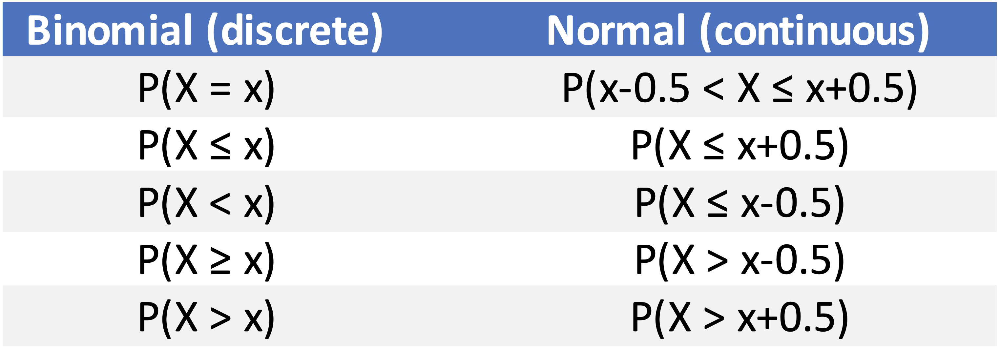

```{r setup, include=FALSE}
knitr::opts_chunk$set(echo = TRUE)
```

We've talked about the idea that "continuity correction" needs to be performed when we approximate a (discrete) binomial distribution with a (continuous) normal distribution. 

The correction mysteriously involves the addition or subtraction of 1/2 from the usual expression for a z-score. Let's see why this is empirically.

# Binomial probabilities

Let's say we have a binomial distribution with the following properties:

```{r}
n = 16
p = 0.5
```

The mean and SD for a binomial distribution are:

```{r}
mean.binom = n*p
sd.binom = sqrt(n*p*(1-p))
mean.binom
sd.binom
```


The general rule of thumb is that we can use the normal approximation if $np \ge 5$ and $n(1-p) \ge 5$.
Since $np > 5$, we can go ahead and use this approximation.

Let's take a large number of samples from this distribution draw a histogram of the results. Then we will add a line that shows a normal approximation with a normal approximation overlaid on top:

```{r}
# sample from a binomial
samples=100000
binom.sample = rbinom(samples, n, p)
table(binom.sample)  # what happens if only sample 1000?

# sample from a normal with the same parameters
xfit = seq(0,n,length=samples)
norm.sample = dnorm(xfit,mean=mean.binom,sd=sd.binom)
yfit = norm.sample*samples

hist(binom.sample, xlim = range(0:n), breaks=seq(-0.5,n+0.5,1))
lines(xfit,yfit,col="blue",lwd = 2)
abline(v=mean.binom,col="blue", lwd=2, lty=2)
```

What is $Pr[X = 8]$? (This is the mean value of the distribution, so the most frequently occurring value). First, compute this using `dbinom`.

```{r}
# dbinom gives exact probability for a given value
dbinom(mean.binom, n, p)
```

Look at the height of the normal approximation for this distribution at X=8. Is this the same thing as $Pr[X = 8]$ for the normal distribution? 

```{r}
# this is the height of the curve (not area under the curve, so not a proper probability)
dnorm(mean.binom, mean=mean.binom, sd=sd.binom)
```

Examine the total probability for this distribution $Pr[X \le 8]$ and  $Pr[X \le 7]$ using `dbinom`. Then, take the difference between these. 

The result should be exactly the same as using `dbinom` to get $Pr[X = 8]$. Is this what we see?

```{r collapse=TRUE}
# Pr[X = mean.binom] using dbinom
dbinom(mean.binom, n, p)

pbinom(mean.binom, n, p)      # Pr[X < mean.binom] 
pbinom(mean.binom - 1, n, p)  # Pr[X < mean.binom - 1] 

# Pr[X = mean.binom] using pbinom
pbinom(mean.binom, n, p) - pbinom(mean.binom - 1, n, p)
```

Now repeat this exercise using `pnorm`.

```{r collapse=TRUE}
pnorm(mean.binom, mean=mean.binom, sd=sd.binom)      # Pr[X < mean.binom] 
pnorm(mean.binom - 1, mean=mean.binom, sd=sd.binom)  # Pr[X < mean.binom - 1] 

# Pr[X = mean.binom] using pnorm
pnorm(mean.binom, mean=mean.binom, sd=sd.binom) - pnorm(mean.binom - 1, mean=mean.binom, sd=sd.binom)
```

What's going on here? We see that the total probability for the mean using the normal approximation is exactly 0.5 (as one would actually expect). But this is not quite right if we are interested in approximating the binomial distribution:

```{r}
# normal density
norm.dens = dnorm(seq(0,n,by=0.1), mean=mean.binom, sd = sd.binom)

# overlay bins from normal approx onto density of binomial samples
hist(binom.sample, xlim = range(0:n), breaks=seq(-0.5,n+0.5,1), freq=FALSE)
lines(seq(0,n,by=0.1),norm.dens,col="blue",lwd = 2)
abline(v=mean.binom,col="red", lwd=2, lty=2)
abline(v=mean.binom-1,col="red", lwd=2, lty=2)
```


Is this close enough of an approximation? Let's do a continuity correction.

```{r}
pnorm(mean.binom + 0.5, mean=mean.binom, sd=sd.binom)
pnorm(mean.binom - 0.5, mean=mean.binom, sd=sd.binom)
pnorm(mean.binom + 0.5, mean=mean.binom, sd=sd.binom) - pnorm(mean.binom - 0.5, mean=mean.binom, sd=sd.binom)
```

This is closer. We can see why this is more correct by looking at the boundaries of the bin that we just estimated the total probability for:

```{r}
# overlay bins from normal approx onto density of binomial samples
hist(binom.sample, xlim = range(0:n), breaks=seq(-0.5,n+0.5,1), freq=FALSE)
lines(seq(0,n,by=0.1),norm.dens,col="blue",lwd = 2)
abline(v=mean.binom + 0.5,col="gold1", lwd=2, lty=2)
abline(v=mean.binom-0.5,col="gold1", lwd=2, lty=2)
```

## Summary

To use a normal approximation of a binomial distribution, we need to use the following corrections for continuity:

{width=50%}

In this way, we can *include* or *exclude* the area under the curve that spans a discrete value of X, as needed for the particular question we are asking.

