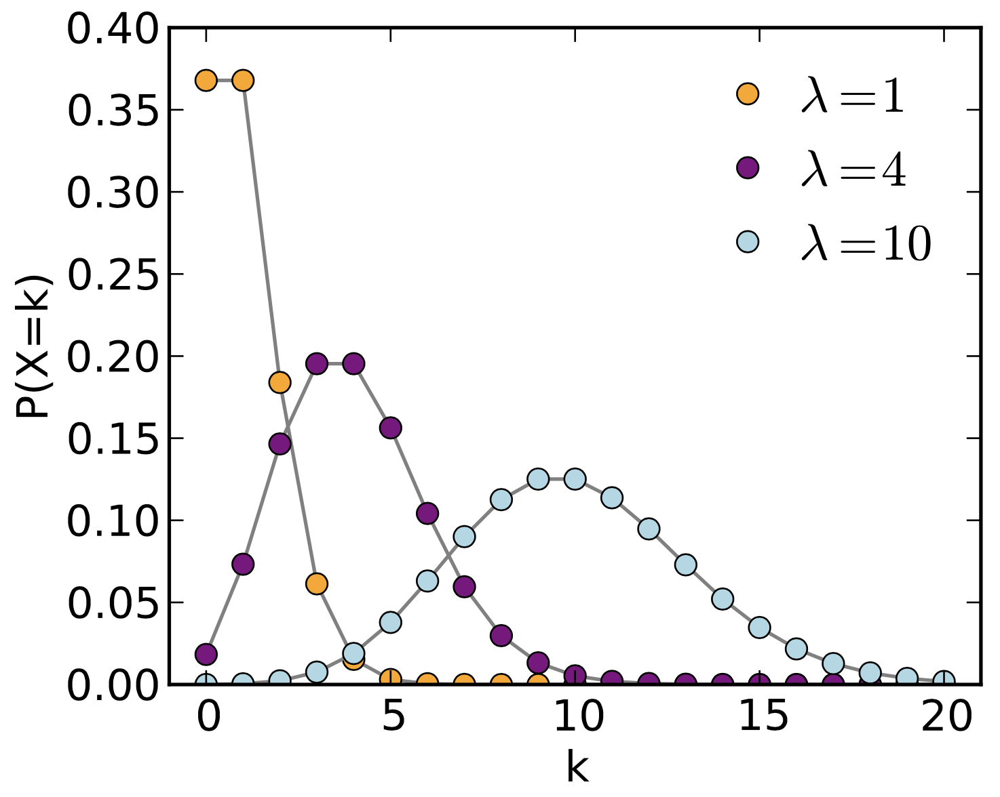

```{r setup, include=FALSE}
knitr::opts_chunk$set(echo = TRUE)
```

# Background

+ **W&S Chapter 8.4**
+ [**Aho - Chapter 3.3-3.6**](http://xdas.bio.nyu.edu/references/Aho_Ch3.3-3.6_PDFs_Part2.pdf)
+ **Introduction to dnorm, pnorm, qnorm, rnorm** - 
  [**PDF**](http://xdas.bio.nyu.edu/learning_r/Intro_R_dqpr_functions.pdf) - 
  [**RMD**](http://xdas.bio.nyu.edu/learning_r/Intro_R_dqpr_functions.Rmd)
+  [**Tranchina - Elements of Calculus**](http://xdas.bio.nyu.edu/references/CalculusReview_2.0.pdf)


# Poisson Distribution

A **Poisson process** describes occurrences that are ***randomly*** distributed in space or time, where the number of occurrences in non-overlapping intervals is statistically independent. The Poisson distribution models ***stochastic*** processes, such as shot noise or scattered objects. It is particularly useful for **rare** events.

Examples in ***time***:

- The number of gamma rays detected in a scintillation counter over time (the number of particles emitted over time due to exponential decay)
- The number of mutations that accumulate per generation in a chemostat
- The number of accidents in New York City per day
- The number of 911 calls per day

Examples in ***space***:

- The number of mutations per kilobase after treatment with a mutagen (e.g. EMS)
- Distribution of bacterial colonies on an evenly spread agar plate, or of bacteriophage plaques plated at low multiplicity
- Distribution of gas molecules in a closed container
- The number of typos per page in a book
- Distribution of chocolate chips in cookie dough


## PDF

The Poisson **PDF** is:

$$ f(x) = P(X = x) = \frac{e^{-\lambda}\lambda^x}{x!} $$
where $X$ is a Poisson random variable and $\lambda$ is the **rate** at which events occur in one unit of time (or space).

If $X$ follows a Poisson distribution, we write $X$ ~ $POI(\lambda)$. The Poisson has only a _**single parameter**_ that determines both its _**location**_ and _**scale**_, i.e. the expected value (mean) and the variance ($s^2$) are the same: 

$$E(X) = Var(X) = \lambda$$


### Alternative PDF formula

If we are interested in the number of events that occur within a larger interval of time (or space), the Poisson can be written using the _**mean number of events $\mu$ in $t$ units of time (or space)**_, where $\mu = \lambda t$:

$$ P(X = x) = \frac{e^{-\lambda t}(\lambda t)^x}{x!} = \frac{e^{-\mu}\mu^x}{x!} $$

When $t=1$, this boils down to the first form of the equation, with just $\lambda$ instead of $\mu$. Because $t$ is some constant, it's just a scaling factor, so the formula still works out. 

**The important thing is that we want to define our problem in terms of the intervals that we are interested in asking about**, as shown in the examples below. If we are really interested in the number of events per $t$ units, and not the number per just one unit, then the expression for the PDF in terms of $\mu$ is what we want (essentially, we just redefine the units).


## CDF

The **CDF** gives the total probability, which is area under the PDF curve. The cumulative probability for $x$ is just the sum of the PDF from zero to some value of $x$:

$$ P(X \le x) = \sum_{x=0}^k{\frac{e^{-\lambda t}(\lambda t)^x}{x!}} = \frac{e^{-\mu}\mu^x}{x!} $$


## Visualization

The figure and code below show how the shape of the curve varies with $\lambda$.

{width=60%}


```{r, }

par(mfrow=c(2,2))

for (lambda in c(1,3,10,30)) {
  y = rpois(1000, lambda)
  xlimit=max(y) + 10
  title = paste("POIS(",lambda,") w/ normal approx",sep="")
  hist(y, prob=T, br=(-1:xlimit)+.5, col="skyblue2", xlab="x", main=title)
  lines(density(y,bw=1), col="blue", lwd=2)
  curve(dnorm(x, mean(y), sd(y)), col="red", lwd=2, add=T) 
}

```

As you can see, when events are rare (i.e. the rate constant $\lambda$ is low), the Poisson is very left-skewed. As the rate increases and the sampling size is very large, the distribution starts to look a lot more like a Normal distribution (red curve). This can be seen from the graph above for $\lambda=30$.


## Assumptions

Like any other distribution, the Poisson makes certain assumptions about the nature of the data:

+ The number of observed events $x \in \{0,1,2,...\}$ is independent in any interval
+ Events occur at a constant (random) rate over a set of intervals of time (or space)
+ The rate of events is $\lambda > 0$, the *rate constant* per unit interval 
+ The probability of observing two or more events in the same interval will approach 0 as intervals become smaller


## Example

Say a book has **1 typo per 100 pages, on average**. We assume that the number of typos in any random set of 100 pages is *independent* of the number in any other interval. 

Let's say we want to ask the following question: If we look at 500 random pages, what is the probability of finding no typos at all?

First, we need to define the rate constant $\lambda$ and the unit of measure, which we will call $t$. We can set up the problem in different ways:

+ Use a single page as the "unit" measure, i.e. $\lambda = 1/100 = 0.01$ for $t = 1$. So for $t=100$ units, we would have $\mu = \lambda t = (1/100)*100 = 1$, and for 500 pages, we would have $\mu = \lambda t = (1/100)*500 = 5$.
+ Use 100 pages as the "unit" measure instead of a single page. In this case, $\lambda = 1$ for $t=1$, and $\mu = \lambda t = 1*5 = 5$ for 500 pages.
+ Use 500 pages as the "unit" measure. In that case $\lambda = 5$ for $t=1$.

In the last case, we would have:

$$ Pr[X = 0] = \frac{e^{-\lambda}\lambda^x}{x!} = \frac{e^{-5}*5^0}{0!} $$
In the second case, we would instead have:

$$ Pr[X = 0] = \frac{e^{-\lambda t}(\lambda t)^x}{x!} = \frac{e^{-\mu}(\mu)^x}{x!} = \frac{e^{-1*5}(1*5)^0}{0!} = \frac{e^{-5}(5)^0}{0!} $$

**Bottom line: The units you use for the rate constant should always match the interval you are interested in. How you define $t=1$ and which form of the equation you use do not matter as long as you scale the units for the rate constant by the interval of interest.**

_**Note**: R assumes that you have **already scaled** $\lambda$ according to the interval of interest, so below we specify $\lambda=6$: our rate constant is 6 per "unit", where we define one "unit" to be 400 pages. For any question about the interval of 100 pages, we will use $\lambda=1.5$, and for any question about the interval 400 pages we will use $\lambda=6$._


Now we can go back to our original question:

$\Rightarrow$ ***If we look at 500 random pages, is the probability of finding zero typos?***

```{r, collapse=T}
# Pr[X = 0]
dpois(0,lambda=5) # discrete value for the PDF
ppois(0,lambda=5) # here PDF and CDF are the same
```


$\Rightarrow$ ***What is the total probability of seeing up to 4 typos per 500 pages?***

$$ Pr[X \le 4] = \sum_{x=0}^4{\frac{e^{-5}*5^x}{x!}} $$

```{r, collapse=T}
sum(dpois(0:4,lambda=5)) # sum across discrete values for the PDF
ppois(4,lambda=5)        # cumulative probability with the CDF
```


#### Technical note

Since this is a **discrete** distribution, we **cannot** solve this problem by asking for $Pr[0 \le X \le 0.8]$ over 100 pages. Since $x$ must be an integer, this is a case where we really have to factor in the interval 500 by using the formula with $\mu = \lambda t = 1 * 5$, or else just define $\lambda = 5$, so we can get $Pr[0 \le X \le 4]$ in this interval.

*Also note that, because R implements `ppois()` using the Gamma function, which is continuous, it will give a result if you call it with a non-integer value, but this is not technically valid. Calling `dpois()` with a non-integer value will give an error; calling `rpois()` with a non-integer value will just return the number of values corresponding to int(n); and `qpois()` takes a continuous vector of values between 0 and 1.*

```{r, collapse=T}
rpois(0:4.25,lambda=1) # uses 0:4
dpois(0.8,lambda=1) # raises an error
ppois(0.8,lambda=1) # returns a value, but not "technically" valid for a discrete distribution
qpois(seq(from=0, to=1, by=0.1),lambda=1) # takes any probability value(s) between 0-1
```


# Exponential Distribution

The exponential distribution is a continuous distribution that, like the Poisson distribution, also relates to a **Poisson process**.

Whereas the ***Poisson*** describes the **number of events** that occur in a given period of time, the ***exponential*** describes **the length of time elapsed** between consecutive events. You can also think of this as the ***waiting time*** until the **first observed event**.

Examples:

- Radioactive decay (time to the first emission, given a particular rate of decay)
- Type II survivorship (mortality rates are about the same at any age)
- Battery life (for a given failure rate)


## PDF and CDF

The exponential distribution describes the density of waiting times (failures) before the next Poisson event. The **PDF** is:

$$ f(t) = \lambda e^{-t\lambda} $$
where $\lambda > 0$ and $t \ge 0$. We write $T$ ~ $EXP(\lambda)$. 

The expected value $E(T)$ (the mean) and standard deviation are both $1/\lambda$: 

$$\mu = \sigma = 1/\lambda\ \ ;\ \ \sigma^2 = (1/\lambda)^2 $$

```{r}
interval.exp<-seq(0, 10, 0.05)
plot(interval.exp,dexp(interval.exp,rate=0.5),type = "l", xlab="x",ylab="density", main="Exponential PDF")
lines(interval.exp,dexp(interval.exp,rate=1),col="red")
lines(interval.exp,dexp(interval.exp,rate=2),col="blue")
lines(interval.exp,dexp(interval.exp,rate=5),col="green")
legend("topright", legend=c("lambda=0.5","lambda=1","lambda=2","lambda=5"),
       col=c("black"," red", "blue", "green"), lty = 1, cex=0.8)
```

The **CDF** has a closed form that does not require integration:

$$ F(t) = \int_0^\infty \lambda e^{-\lambda t}dt = 1 - e^{-t\lambda} $$

If we change the name of our random variable to $x$, then we have the probability that a Poisson event occurs within a timespan of zero to $x$:


$$Pr[X \le x] = 1-e^{-x\lambda}$$

```{r}
interval.exp<-seq(0, 10, 0.05)
plot(interval.exp,pexp(interval.exp,rate=0.5),type = "l", xlab="x",ylab="density", main="Exponential CDF")
lines(interval.exp,pexp(interval.exp,rate=1),col="red")
lines(interval.exp,pexp(interval.exp,rate=2),col="blue")
lines(interval.exp,pexp(interval.exp,rate=5),col="green")
legend("topright", legend=c("lambda=0.5","lambda=1","lambda=2","lambda=5"),
       col=c("black"," red", "blue", "green"), lty = 1, cex=0.8)
```


The probability that a Poisson event happens ***within the interval*** between $x_1$ and $x_2$ is:

$$Pr[x_1 < X \le x_2] = F(x_2) - F(x_1) = (1-e^{-x_2\lambda})- (1 - e^{-x_1\lambda})$$

The **survivorship**, or the length of time ***before*** something happens, is the same as probability that the time to a Poisson event is ***greater*** than $x$:

$$Pr[X > x] = 1 - (1 - e^{-x\lambda}) = e^{-x\lambda}$$


## Example

Going back to our example of typos, we had a book with an average of 1 typo per 100 pages, and we used the Poisson to find the probability of finding exactly 0, or up to 4, typos in 500 pages. To ask about $x$ *number of events* in an interval of 500 pages, we used either $\mu=\lambda t = 1*5 = 5$, or just $\lambda = 5$.

Here, our random variable $x$ represents an **interval** of *time* or *space*, and we use the exponential to ask slightly different questions.

$\Rightarrow$ ***What is the average number of pages within which we would expect to find one typo?***


```{r}
# EXP(X) = 1 / rate
1/(1/100)
```

$\Rightarrow$ ***What is the probability of a typo occurring somewhere within 100 pages?***

$$Pr[X \le 100] = 1 - e^{-x\lambda} = 1-e^{-100*(1/100)} = 1-e^{-1} = 0.632 $$

```{r, collapse=T}
pexp(100,rate=1/100, lower.tail=T) # cumulative prob from 0-100 (CDF)
pexp(100,rate=1/100) # same
```


$\Rightarrow$ ***What is the probability of reading 100 pages and NOT finding a single typo?*** 

This is the same as asking for the upper-tail probability of finding at least one within 100 pages.

$$P(X > 100) = 1 - P(X \le 100) = e^{-x\lambda} = e^{-1} = 0.368 $$
```{r, collapse=T}
# these are all equivalent
exp(-1)
pexp(100,rate=1/100,lower.tail=F)
1-pexp(100,rate=1/100)
```

$\Rightarrow$ ***What is the probability of finding the first typo somewhere between 50 and 100 pages?*** (That is, one is NOT encountered in the first 50 pages but IS encountered somewhere in the next 50 pages?)

$$Pr[x_1 < X \le x_2] = F(x_2) - F(x_1) = (1-e^{-1}) - (1 - e^{-50*(1/100)})$$

```{r}
(1 - exp(-1)) - (1 - exp(-50*(1/100)))
```


# Relationships between distributions

### *Relationship between the Poisson and Exponential distributions*

The Poisson is a discrete distribution describing the ***number of events per unit time***, and the exponential is a continuous distribution describing the ***length of time between events***. For a Poisson process, then, if events happen at a rate of $\lambda$ per unit time on average, an average of $\lambda t$ events will occur per $t$ unit of time.

#### Classic example: Radioactive decay

The decay of radioactive isotopes is a Poisson process, since radioactive isotopes have a constant half-life, and each successive emission is independent of the last one. The Poisson and exponential are complementary ways of describing this process.

+ The slower the decay rate (longer half-life), the larger the time interval between observed events (exponential), and the fewer events observed per unit time (Poisson).
+ The probability of time elapsed between decay events follows a continuous exponential distribution.
+ The probability of detecting a certain number of decay events per unit time with a scintillation counter follows a discrete Poisson distribution.


#### Survival function

The ***survival function*** is the complement of the CDF of a particular distribution. If the CDF is $F(X) = P(X \le x)$, then the **survivorship** is $P(X > x) = 1 - F(X)$. 

For a Poisson distribution $P(X = x) = \frac{e^{- \lambda t}(\lambda t)^x}{x!}$, $P(X = 0) = e^{-\lambda t}$ is the probability of *no* events within $t$ units of time. This is the same as the survivorship, or the probability that the time $T$ to the *first occurrence* exceeds $t$:

$$ P(T > t) = P(X = 0 | \mu = \lambda t) = e^{-\lambda t} $$

You can see that this is just one minus the exponential CDF, which gives the total probability that an event *does* occur within an interval of time $t$:

$$ P(T \le t) = 1 - P(X = 0 | \mu = \lambda t) = 1 - e^{-\lambda t} $$

For example, the ***exponential survivorship*** function describes situations where the *probability of mortality is the same for all individuals in a population*, since the rate of events is always the same for a Poisson process. In other words, the chance of dying is independent of age! This is not true for mammals, but it is true of some birds, rodents, lizards, and sea animals.


### *Poisson, Exponential, and Gamma distributions*

We will not go over the Gamma distribution here, but it is commonly encountered in Bayesian probability applications, as a congugate prior distribution for a number of likelihood functions. 

Conceptually, you can think of the exponential function as the **waiting time** until the **first** Poisson-distributed event, and Gamma as the waiting time until the $n$th Poisson-distributed event (or the $n$th change in a Poisson process). So, *the exponential distribution is a special case of the Gamma distribution* [in which the "shape" parameter equals 1]. 


### *Normal approximation of the Poisson and Binomial distributions*

Like the Binomial distribution for large $n$, the Poisson is well approximated by the normal distribution when $\lambda$ is large (and the sampling size is very large). This can be seen from the graph above for the Poisson distribution with $\lambda=30$.


### *Poisson approximation of the Binomial distribution*

The Poisson is the **limiting** case of a Binomial distribution for **rare** events. That is, a Poisson with parameter$\lambda = np$ approximates the Binomial when $n$ is large and $p$ is small. 

For example, let's consider hits on a website. This could be modeled as a Binomial distribution with a Bernoulli trial every minute for an hour, with $n=60$. If $p=0.1$, this would be the same as a Poisson distribution with 6 events per hour, i.e. $\lambda=6$.

The Poisson has some advantages over the Binomial:

+ The Poisson can contain more than one event per unit interval (whereas the binomial only handles one, since it describes Bernoulli trials, which only have a binary outcome)
+ It can be easier to work with the Poisson since it has only one parameter instead of two.

Starting with the Binomial probability, it can be shown that the limit of $P(x)$ as $n$ goes to infinity and $p$ goes to 0 is the equation for the Poisson distribution. Setting $p=\frac{\lambda}{n}$, the Binomial formula may be written in terms of $\lambda$ as:

$$\begin{aligned} \\
P(x) &= \lim_{n\rightarrow\infty}\binom{n}{k} (p)^k (1-p)^{n-k} \\
&= \lim_{n\rightarrow\infty}\binom{n}{k} (\frac{\lambda}{n})^k (1-\frac{\lambda}{n})^{n-k} \\
&= \lim_{n\rightarrow\infty}\frac{n!}{(n-k)!k!}(\frac{\lambda}{n})^k (1-\frac{\lambda}{n})^{n}(1-\frac{\lambda}{n})^{-k} \\
&= 1*\frac{\lambda^k}{k!}e^{-\lambda}*1 \\
&= \frac{e^{-\lambda}\lambda^k}{k!}
\end{aligned}$$ 


All the terms including $n$ in a factorial expression cancel out to 1 as $n$ goes to infinity, and the last term also goes to 1 in the limit. So why does the second to last term equal $e^{-\lambda}$? The definition of $e$ is:

$$e = \lim_{x\rightarrow\infty} \left(1+ \frac{1}{x} \right)^n$$

If we set $x = -\frac{n}{\lambda}$, then we find that:

$$\lim_{x\rightarrow\infty} \left( 1-\frac{\lambda}{n} \right) ^{n} = \lim_{x\rightarrow\infty} \left(1+ \frac{1}{x} \right)^{-\lambda x} = e^{-\lambda}$$


# Examples

## Single-nucleotide variants

Say the number of single-nucleotide variants (SNVs) between *C. elegans* strains from Bristol (N2) and Hawaii (CB) is 1.5 per 1000nt (1 kilobase). Here we define 1kb as one unit of $t$ (i.e. the "unit" size here is 1kb; the important thing is that we are operating in units).

### Poisson

$\Rightarrow$ ***What is the probability of observing zero SNVs in a random selection of 1000 bases?*** (Hint: use one of the dqpr functions.)

We use the PDF to find the probability that our random variable exactly equals zero. That is, what is

$$p(X=0)\ \ for\ \  X \sim POIS(\lambda = 1.5)\ \ ?$$

```{r}
# the rate is given as lambda = 1.5 per unit t, where t = 1kb
dpois(0,lambda=1.5)

# In this case, the PDF and the CDF are the same, since t cannot be less than zero.
ppois(0,lambda=1.5)
```

$\Rightarrow$ ***What is the probability of observing 5 or fewer mutations in a random selection of 4000nt?***

Since we are given a multiple of $t$, and this is a discrete distribution, we can use the formulas with $\mu = \lambda t$ instead to get the number of mutations per 4kb. We can either sum up the individual values using the PDF, or use the CDF directly:

$$P(X \le 5) = \sum^{5}_{x=0}P(X=x) = \sum^{5}_{x=0}\frac{e^{-\mu}\mu^x}{x!} = e^{-\mu}\sum^{5}_{x=0}\frac{\mu^x}{x!}$$

+ First, since this is a discrete distribution, use the PDF (density function) to sum the probabilities up to 5:

```{r}
# Now our interval is t=4 units (where one unit = 1kb), 
# so we use mu = lambda*t = 1.5*4 = 6
# sum of probabilities for X = {0,1,2,3,4,5}
sum(dpois(0:5,6))
```

+ Now use the CDF (the total probability function) to compute this value:

```{r}
# mu = lambda * t = 1.5 * 4 = 6
ppois(5,lambda=6) # now plug in mu instead of the original value of lambda
```


### Exponential

The rate of SNV's is 1.5 per kb, so we use ***rate = 1.5***, where 1kb is "1" unit.

$\Rightarrow$ ***What is the probability that a span of 1000nt (1kb) will contain no SNV's?***

```{r, collapse=T}
# P of finding a span of 1000 bases that contains no SNV
# (i.e., P of not finding an SNV within 1kb)
pexp(1, 1.5, lower.tail=F)       # 1 unit at rate = 1.5/unit
pexp(1000, 0.0015, lower.tail=F) # same: 1000 units at rate = 0.0015/unit

# this is the same as:
ppois(0, 1.5, lower.tail=T)

# but this is not the same, because this distribution has a different shape!
ppois(0,0.0015)
```

$\Rightarrow$ ***What is the probability that at least one SNV will occur within 1000nt (1kb)?***
```{r, collapse=T}
pexp(1, 1.5, lower.tail=T)  # P of finding at least 1
ppois(0, 1.5, lower.tail=F) # P of NOT finding 0 (different way to say the same thing)
```

$\Rightarrow$ ***What is the chance that an SNV will occur between 1 and 4kb?***
```{r}
# an SNV between 1-4kb
pexp(4, 1.5, lower.tail=T) - pexp(1, 1.5, lower.tail=T)

# this cannot really be answered using the Poisson, since it asks about
# the probability of a single event or a range of events for a fixed interval
```


## Lizard mortality

For some animals, like lizards, their mortality rate is independent of their age. Over an extended trip to Costa Rica, you studied a large population of lizards and found that their rate of mortality is $\lambda$ = 0.05 deaths per month.


$\Rightarrow$ ***What is the expected number of deaths in one month?***

```{r}
# Poisson: E(X) = SD(X) = lambda = 0.05
0.05
```


$\Rightarrow$ ***What is the expected lifespan of one of these lizards?*** (In other words, this is the wait time until one death occurs.)

```{r}
# Exponential: E(X) = SD(X) = 1/lambda = 20 months.
1/0.05
```


$\Rightarrow$ ***What is the probability an animal will survive more than 20 months?*** 

This is given by the the exponential survivorship function.

$$P_{exp}(X > 20) = e^{-0.05*20} = 0.3679 $$
Alternatively, it is given by the lower-tail Poisson probability for $\mu = \lambda * t = 0.05 * 20$:

$$P_{pois}(X = 0 ) = e^{-\lambda t}\frac{\lambda t^x}{x!} = e^{-\mu}\frac{\mu^x}{x!}$$

```{r, collapse = T}
# with exponential
exp(-0.05*20)                       # manual calculation
pexp(20, rate = 0.05, lower.tail=F) # with CDF

# with Poisson: need to multiply units out to mu = lambda * t = 0.05/month * 20 months => 1 new unit
mu = 0.05*20 # number of deaths in t=20 months
ppois(0, lambda = mu, lower.tail=T)
dpois(0, lambda = mu) # same, since just one value for x
```

$\Rightarrow$ ***What is the probability an animal will survive 20 months or less?*** This is given by the CDF:

$$ P(X \le 20) = 1 - e^{-0.05*20} = 1 - 0.3679 = 0.6321 $$
```{r, collapse = T}
1-exp(-0.05*20) # manual calculation
pexp(20,0.05)   # with CDF

ppois(0, lambda = mu, lower.tail=F) # P(no death > 20 months)
```

$\Rightarrow$ ***What is the probability an animal will survive between 10 and 15 months?*** 

We subtract the total probability of the lower value from the higher value.

$$ P(10 \le X \le 15) = (1 - e^{-0.05*15}) - (1 - e^{-0.05*10}) = e^{-0.05*10} - e^{-0.05*15} =  0.165 $$
```{r, collapse = T}
exp(-0.05*10) - exp(-0.05*15) # manual calculation
pexp(15,0.05) - pexp(10,0.05) # with CDF

# can't answer this with Poisson, since can only vary # events (not time)
```

