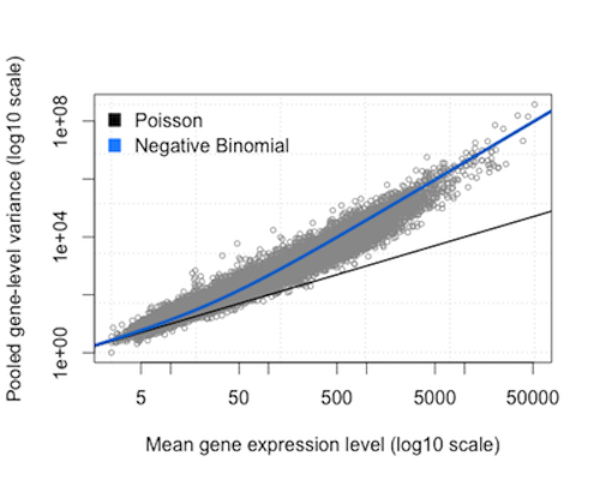

```{r setup, include=FALSE}
knitr::opts_chunk$set(echo = TRUE)
library(tidyverse)
library(ggpubr)
```


```{css, echo=FALSE}
.qbox {
  padding: 1em;
  background: cornsilk;
  border: 1px solid burlywood;
  border-radius: 5px;
}

.bluebox {
  padding: 1em;
  background: #d8ecf3;
  border: 1px solid cornflowerblue;
}

h1 {color: mediumblue}
h2 {color: mediumblue}
h3 {color: mediumblue}
h4 {color: mediumblue; font-style: italic}
```


# Background

[**Aho - Chapter 3.3-3.6**](https://drive.google.com/file/d/1cjF3ykw5K1_gjd4mydDN9fvBdzELpLvk/view?usp=sharing){target="blank"}


# Review: Distributions

- Normal
- Bernoulli and Binomial distribution
- Poisson and Exponential
- Hypergeometric

# Geometric distribution

The geometric distribution is similar to the *binomial distribution*, except it gives the probability that $x$ independent Bernoulli **failures** occur **prior to the FIRST success**.

Example:

- The number of cards you would need to sample (with replacement, i.e. "catch and release") before finding an ace.
- The number of jelly beans you need to sample from a mixed bag before finding a watermelon flavored one (my favorite!)
- The number of CRISPR-treated animals you have to look at before finding one that has your GFP-tagged gene in it

The PDF is:
$$ f(x) = P(X = x) = p(1-p)^x$$

where:

- $p$ is the **unchanging** probability of success in a single Bernoulli trial, and
- $x \in \{0,1,2...,n\}$ is the _number of **unsuccessful**_ trials _**preceding**_ the first success. 

There is a single parameter $p$. If a random variable follows the geometric distribution, we write: $X$ ~ $GEO(p)$.

Since we are only concerned with a *single success* following $x$ failures, the above formula fully defines this probability as the intersection of $x$ failures and one success. We do not need to use any binomial coefficients because there is only one way to get this outcome (of course, that is if you stop when you get the first success; it's the same as the old adage, "You always find what you were looking for in the last place you look!")

We can plot the PDF as a histogram (since the distribution is discrete) or a line plot (to highlight the shape of the PDF):

```{r warning=F}
x=c(0:30)
geom.dist = data.frame(x = x,
                       p0.10 = dgeom(x, 0.1),
                       p0.25 = dgeom(x, 0.25),
                       p0.50 = dgeom(x, 0.5),
                       p0.75 = dgeom(x, 0.75))
geom.dist.long = gather(geom.dist, "probability", "density", 2:5, na.rm = TRUE)
geom.dist.long = geom.dist.long %>% mutate(probability = substring(probability,2))

nb.hist = ggplot(geom.dist.long, aes(x=x)) +
#  geom_bar(aes(y=density, fill=probability), alpha=0.4, 
   geom_histogram(aes(y=density, fill=probability), alpha=0.4, 
           stat="identity", position="identity") +
  scale_fill_manual(values = c("goldenrod","red","purple","blue")) +
  ylab("Probability density") +
  ggtitle("Geometric PDF") +
  coord_fixed(ratio = 30)

nb.line = ggplot(geom.dist.long, aes(x=x)) +
#  geom_bar(aes(y=density, fill=probability), alpha=0.4, 
   geom_line(aes(y=density, col=probability), alpha=0.4, 
           stat="identity", position="identity") +
  scale_fill_manual(values = c("goldenrod","red","purple","blue")) +
  ylab("Probability density") +
  ggtitle("Geometric PDF") +
  coord_fixed(ratio = 30)

ggarrange(nb.hist, nb.line, nrow = 1)
```

Below the plots are separated out so it's easier to see each one individually:

```{r}
# rgeom(n,p)

par(mfrow=c(2,2))
prob = c(0.1,0.25,0.5,0.75)
for (i in prob) {
  y = rgeom(1000, i)
  xlimit = max(y) + 5
  title = paste("GEOM(p=",i,")",sep="")
  hist(y, prob=T, br=(-1:xlimit)+.5, col="skyblue2", xlab="x", main=title)
}

```


# Negative Binomial

The Negative Binomial distribution is commonly used to model count data such as encountered in deep sequencing experiments.

It is an extension of the geometric distribution to cases where we are interested in $r$ successes after $x$ failures. So, the geometric distribution is a special case of the negative binomial in which the number of successful trials = 1. 

We can use the negative binomial to answer questions of the form:

+ What is the chance that I will get 12 tails before I get at least 3 heads ($x=12, r=3$)?
+ What is the length of stay in a hospital before someone gets released ($r=1$)?

Example:

- The probability that you will have a total of 5 failed experiments (e.g. PCR runs, or CRISPR injections of individual *C. elegans* animals) before you will manage to get three experiments to work, given that your success rate is 20% on average (three is the magic number! ;-)
- In another formulation, the total number of experiments you will need to perform in order to achieve three successful experiments.

There are a number of different parameterizations of the NB distribution, depending on exactly which question you are asking. I found a very good discussion of these topics here[^2]. This blog also provides insight into the relationship between the negative binomial, the Poisson, the binomial, and the gamma distributions.

## PDF

The PDF for the discrete NB distribution is:

$$ \begin{aligned}
f(x) = P(X_r = x) &= { x+r-1 \choose r-1}p^{r}(1-p)^x 
= { x+r-1 \choose x}p^{r}(1-p)^x \\
&= {n-1 \choose r-1} p^r(1-p)^x = {n-1 \choose x} p^r(1-p)^x 
\end{aligned}$$

where:

- trials are independent and only two outcomes are possible
- the probability of success $p$ in each trial is constant
- $n$: total number of trials
- $r$: number of successes
- $x$: number of *failures* preceding $r$ successes in $n$ independent trials (note that $x + r = n$)
- $X_r$: the random variable, representing the number of *unsuccessful trials* before $r$ successes

Since the last ($n$th) Bernoulli trial is the $r$th success, the binomial coefficient gives the number of ways to obtain $x$ failures in the preceding $x + r - 1 = n - 1$ trials, which is equivalent to the number of ways to obtain $r-1$ successes preceding the $r$th success. The binomial coefficients above are equivalent, since

$${a \choose b} = {a \choose a-b}\ \ for\ \  0 \le b \le a.$$

If a random variable follows a negative binomial distribution, we write $X$ ~ $NB(r, p)$. There are two parameters: 

+ the ***number of successes*** desired, and 
+ the ***probability of success***. 

It is important to remember that $X$, the **random variable**, represents the number of ***failures*** before achieving the desired number of successes. So, the distribution represents the probability of obtaining different numbers of failures before a total of $r$ successes is obtained.

The mean and variance of the negative binomial distribution are: $E(X) = \frac{r}{p}$ and $Var(X) = \frac{r(1-p)}{p^2}$.

Below are density plots for the NB showing how its shape changes as the probability changes or the number of successes changes.

```{r}
library(ggplot2)

# The plot below shows varying the probability
nbinomdata = data.frame(x=1:100,
                        y=dnbinom(1:100,size=20,0.25),
                        z=dnbinom(1:100,20,0.5),
                        w=dnbinom(1:100,20,0.75))

nb.pvar = ggplot(nbinomdata) + 
  geom_line(aes(x=x, y=y, col="0.25")) +
  geom_line(aes(x=x, y=z, col="0.5")) +
  geom_line(aes(x=x, y=w, col="0.75")) +
  ggtitle("NB for varying P(success)") +
  xlab("Expected number of failures\n prior to 20 successes") +
  ylab("Density")+
  labs(col = "p(Success)") +
  coord_fixed(ratio = 500)
  

# The plot below shows varying the number of successes
nbinomdata = data.frame(x=1:100,
                        y=dnbinom(1:100,10,0.5),
                        z=dnbinom(1:100,30,0.5),
                        w=dnbinom(1:100,70,0.5))

nb.svar = ggplot(nbinomdata) + 
  geom_line(aes(x=x, y=y, col="10")) +
  geom_line(aes(x=x, y=z, col="30")) +
  geom_line(aes(x=x, y=w, col="70")) +
  ggtitle("NB (p=0.5)\nVary # of successes") +
  xlab("Expected number of failures\n prior to observed successes") +
  ylab("Density") +
  labs(col = "Num Success") +
  coord_fixed(ratio = 950)

ggarrange(nb.pvar, nb.svar, nrow=1)
```

### Alternative formulation

Another way to express this distribution gives the ***total number of trials*** $n$ that must be performed in order to achieve the $r$th success, is:

$$ f(n;r,p) = P(X = n) = { n-1 \choose r-1}p^{r}(1-p)^{n-r} $$

where $n = \{r, r+1, r+2, ...\}$


## CDF

The CDF of the NB is:

$$ P(X_r \le x) = \sum_{j=0}^k{j+r-1 \choose j}p^r(1-p)^j \ \ \ for \ \ \ k = 0,1,2,... $$

### Survival function

It is common to encounter the ***survival function***, which is the complement of the CDF of a particular distribution. If the CDF is $F(X) = P(X \le x)$, then the ***survivorship*** is $P(X > x) = 1 - F(X)$:

$$ P(X_r > x) = 1 - F(X) = \sum_{j=k+1}^{\infty}{j+r-1 \choose j}p^r(1-p)^j$$

for $k \in \{0,1,2,...\}$. 

### Relationship with Geometric Distribution

The **geometric** distribution is a special case of the NB, where $r=1$: $X$ ~ $GEO(p)$ is equivalent to $X$ ~ $NB(1,p)$

Therefore, the *negative binomial* is to the *geometric* distribution as the *binomial* is to the *Bernoulli* distribution.


## Negative binomial in analysis of deep sequencing data

The negative binomial has become popular in recent years as a way to model the distribution of read counts in deep sequencing data. 

In brief, count data for ***technical replicates*** can be modeled by a Poisson distribution. Recall that the mean and the variance for a Poisson are given by the same parameter, $\lambda$. Thus, ***the variance is proportional to the mean***.

When considering ***biological replicates***, it turns out that the variation in the counts varies with the number of counts per feature (e.g. expression level); it is ***overdispersed***. In such cases, the Poisson is no longer the best model for the data. 

Instead, the NB is used to model the uncertainty in the variance. In this case, the variation is proportional to the mean, with an added term to account for the dispersion: 

$$ \sigma^2 = \mu + \alpha\mu^2 $$
where $\alpha$ is the dispersion parameter. For $\alpha > 1$, the dispersion is greater than the mean; as $\alpha$ goes to 0, the NB converges on a Poisson distribution.



There are various explanations for modeling sequence count data with the NB distribution, and a relatively simple one may be found here[^3]. The authors of DESeq2 provide a more detailed discussion[^4].


## Relationship between different distributions and parameterization

Technically, the NB is a *Poisson-Gamma mixture distribution*: a mixture of Poisson distributions where the uncertainty in the various $\lambda$s follows a Gamma distribution. The details are beyond our pay grade for the purposes of this class, but you may want to file this for future reference.

As we have seen, different distributions are characterized by different ***parameters***. It turns out that many of these can be modeled by the more general Gamma and Beta distributions, and some of them are actually implemented by these in R for practical reasons. The following diagram illustrates some relationships between the distributions we have learned about and these more general distributions (which we will not discuss in this class):


# Examples

## Geometric

You are performing an exit poll at a polling station in a district where the proportion of independent voters is 20%.

$$ f(x) = P(X = x) = p(1-p)^x$$

How likely is it that you will have to interview at least 10 people before finding one that voted independent? No more than 10? No more than 5? Exactly 5?

$n$: total number interviewed
$x = n-1$: number of failures
$p = 0.2$: probability of success

```{r, collapse=T}
pgeom(9,0.2, lower.tail = F)  # 10 or more: P(X > 9)
pgeom(10,0.2, lower.tail = T) # 10 or fewer: P(X <= 10)

pgeom(5,0.2, lower.tail = T) # P(X <= 5)
sum(dgeom(0:5,0.2))          # same using PDF
dgeom(5,0.2)                 # P(X = 5 failures): the 6th person is independent
0.2*(1-0.2)^5                # same using equation
```


## Negative Binomial

What is the chance that you will have to interview exactly 15 people in total order to find 5 that voted independent? No more than 15 (i.e. 15 or fewer)? More than 15? At least 15 (i.e. 15 or more)? 

$n$: total interviewed
$r$: number of successes
$x = n-r$: number of failures
$p = 0.2$: probability of success

$$ P(X = 10) = {x+r-1 \choose r-1}p^r(1-p)^x = {14 \choose 4}(0.2)^5(0.8)^{10} = 0.034$$
```{r, collapse=T}
# for n=15, x=n-r (# of failures = total - # of successes)
dnbinom(10, size=5, prob=0.2)     # P(X = 10) exactly 10
pnbinom(10, 5, 0.2, lower.tail=T) # P(X <= 10) 10 or fewer
pnbinom(10, 5, 0.2, lower.tail=F)  # P(X > 10) more than 10
pnbinom(9, 5, 0.2, lower.tail=F)  # P(X >= 10) 10 or more
```

What is the chance you'll interview 5 or less before finding one independent? More than 5? Exactly 5?

```{r, collapse=T}
# same as geometric function
pnbinom(5, size=1, prob=0.2) # P(X <= 5, r=1)
pnbinom(5, size=1, prob=0.2, lower.tail=F) # P(X > 5, r=1)
dnbinom(5, size=1, prob=0.2) # P(X = 5,  r=1)
```


<!-- footnotes -->

[^1]: http://pedagogix-tagc.univ-mrs.fr/courses/ASG1/practicals/go_statistics_td/go_statistics_td_2015.html
[^2]: https://probabilityandstats.wordpress.com/tag/negative-binomial-distribution/
[^3]: https://bioramble.wordpress.com/2016/01/30/why-sequencing-data-is-modeled-as-negative-binomial/
[^4]: https://genomebiology.biomedcentral.com/articles/10.1186/gb-2010-11-10-r106

