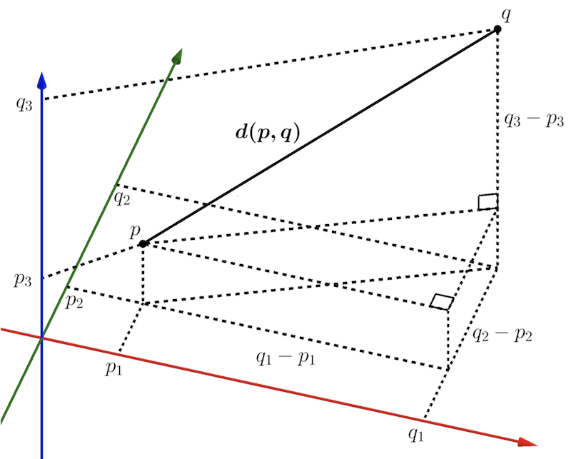

```{r setup, include=FALSE}
knitr::opts_chunk$set(echo = TRUE)
```

# Common analysis tasks and questions

We are often interested in identifying **similarity patterns** in our data as a first step to develop more specific questions.

Examples of common **applications**:

* RNA-seq experiments: 
  + Are the transcriptomes of control and treated samples more different at day 10 than at day 1 of treatment?
  + Which genes exhibit similar expression trends?
  + Do cells of the same type have similar transcriptomes in single-cell experiments?
* Genomics:
  + Does the assembly scaffold that is suspected to be contamination have different nucleotide composition from the rest of the genome?
* Experiments that involve measuring multiple environmental parameters (temperature, pH, salinity):
  + Which environments are more similar to each other?
* Multivariate morphometric analysis:
  + Which samples are more similar to each other?
  + Is distance between cheekbones associated with the width of the skull?

...and many others.


# Distance measures

Distance measures between two variables are commonly used for such applications as constructing phylogenetic trees (e.g. based on sequence divergence, a proxy for evolutionary distance) and some clustering algorithms (e.g. k-means clustering). Distance can also be used to evaluate overall differences in gene expression, for example between different samples. There are many ways to measure distance.


### Euclidean distance

The most common is **Euclidean** distance, which measures the Cartesian distance between data points. To calculate it in two dimensions, recall the basic Pythagorean formula:
$$a^2 + b^2 = h^2$$

where $a$ and $b$ are sides of a right triangle and $h$ is the hypotenuse. More specifically, $a$ is the difference between the two points in the first dimension, and $b$ is the difference in the second dimension. To get the Euclidean distance $h$ we take the $\sqrt{h^2}$, which equals $\sqrt{a^2 + b^2}$.

To calculate the distance between any two points, let us call our data points $\mathbf{p}$ and $\mathbf{q}$, and let us say we have two measurements for each of them, in dimensions $D_1$ and $D_2$ (for example, weight and height, which gives body mass index). Then, $\mathbf{p} = (p_1,p_2)$ and $\mathbf{q} = (q_1,q_2)$, and we can write the distance between them, $d_{pq}$, as:

$$d_{pq} = d_{qp} = \sqrt{ (q_1 - p_1) ^2 + (q_2 - p_2) ^2 }$$

{width=45%}

In three dimensions, Euclidean distance is calculated in a very similar way:

$$d_{pq} = d_{qp} = \sqrt{ (q_1 - p_1) ^2 + (q_2 - p_2) ^2 + (q_3 - p_3) ^2 }$$

{width=60%}

The same applies to four or more dimensions, so we can generalize Euclidean distance in the following way, where $n$ is the number of dimesions:

$$ d(p,q) = \sqrt{\sum\limits_{i=1}^{n}{(q_i - p_i)} ^2} $$


### Manhattan distance

* a.k.a. *taxicab metric*, *grid distance*, and *rectilinear distance*

The Manhattan distance gets its name because it uses a "city block" approach to measuring distance. It is calculated using absolute distances in orthogonal dimensions (rather than squared distances):

$$d(p,q) = \sum\limits_{i=1}^{n}|q_i - p_i|$$


### Minkowski distance as the generalization of Euclidean and Manhattan, and how to choose between the latter

If you look carefully at the two formulas above, the similarity between them is obvious. In fact, both distance measures belong to the **Minkowski family** of distance measures. The Minkowski distance is defined, for vectors $\mathbf{p}$ and $\mathbf{q}$ of length $n$ (corresponding to $n$ dimensions), as:

$$d_{Minkowski}(p,q) = \Bigg[ \sum_{i=1}^{n}{ |q_i - p_i| ^r } \Bigg] ^{1/r}$$

By substitution, we can see that Euclidean distance corresponds to the special case of $r = 2$ and the Manhattan distance to $r = 1$.

Most of the time you will want to use the more intuitive Euclidean distance ($r = 2$). But it turns out that Manhattan distance may be preferable for high-dimensional data because Manhattan distance better separates far and close neighbors in higher-dimensional space (something that may not be obvious at all, since humans evolved to think in three dimensions). Manhattan distance is also less sensitive to outliers because distances are measured in absolute magnitude rather than squared magnitude. However if data are distributed approximately normally, so that extreme values are uncommon, then Euclidean distance usually works well.

_**A short digression (you can safely ignore this section, but read on if you are interested):**_

If you continue in data science you will probably hear more about *L-norms* (based on Lebesgue spaces). In linear algebra, a *norm* is a function that assigns a positive length or size to any non-zero vector.

* For **_L2_ statistics** (based on Euclidian distance), the *mean* is the value that minimizes the *mean squared error* across the dataset.
* For **_L1_ statistics** (based on Manhattan distance), the *median* is the value that minimizes the sum of *absolute deviations* across the dataset.
* A family of **regularization** techniques for multivariate regression problems is often applied to large datasets to simplify computational solutions by applying penalties to a solution's parameter values (don't worry if this sounds like a lot of gobbledy-gook for now; you may find it useful later). 
  + *L1 regularization* (like the LASSO method) encourage solutions with a lot of zero values, whereas 
  + *L2 regularization* (used in ridge regression) encourage solutions where many values are very small.
  + *Elastic net regularization* uses a combination of L1 and L2 norms.


# Similarity measures

It is often useful to measure the **joint variability**, or **association** between two variables, instead of how far apart they are.

### Covariance

Before we look at any formulas, let us start with a hands-on example. Let us generate a random sample of 10 uniformly distributed values and store them in a vector called `a`. Then, let us generate another set of values that is **dependent** on `a` in a way that it is `a` with some noise added. We will store these new set of values in a vector `b`.

```{r}
# generate a random uniform distribution
set.seed(10) # set seed for reproducibility
a <- runif(n = 10,
           min = -10,
           max = 10)
a

# add some random normally distributed noise to a
b <- a + rnorm(n = 10,
               mean = 0,
               sd = 4) # the SD value controls the amount of noise and it is completely arbitrary

# plot the two distributions against each other
plot(x = a,
     y = b,
     xlim = c(-10,5),
     ylim = c(-10,8))
```

Now, let us find a way to assess whether:

* higher values of `a` are associated with *higher* values of `b`
* higher values of `a` are associated with *lower* values of `b`
* values of `a` and `b` lack association

Here is one (rather simple and smart) way of doing this:

1. Find and plot the mean of the distribution and draw a rectangle between the mean and the first data point.
2. Find the area of this rectangle. The idea is that the area will be the **largest** if **both** `a` and `b` coordinates are far away from the mean.
3. Determine the direction of association. If the rectangle is in either I or III quadrants (higher a -> higher b and vice versa), let the calculated area value be positive. If the rectangle is in either II or IV quadrants (higher a -> lower b and vice versa), let the calculated area value be negative.

```{r}
# plot the two distributions against each other
plot(x = a,
     y = b,
     xlim = c(-10,5),
     ylim = c(-10,8))

#plot the mean
points(x = mean(a),
       y = mean(b),
       cex = 2,
       pch = 16)

# draw a rectangle between the mean and the first data point and calculate its area
rect(xleft = mean(a),
     xright = a[1],
     ybottom = mean(b),
     ytop = b[1],
     border = NA, # do not draw a border
     col = rgb(1, 0, 0, alpha = 0.3)) # color red because in I quadrant

area_1 <- (mean(a) - a[1]) * (mean(b) - b[1]) # calculate the area

text(x = mean(c(mean(a), a[1])),
     y = mean(c(mean(b), b[1])),
     labels = round(area_1, 1)) # add text label with the calculated area
```

Now do the same, but for all data points.

```{r}
# plot the two distributions against each other
plot(x = a,
     y = b,
     xlim = c(-10,5),
     ylim = c(-10,8))

# plot the mean
points(x = mean(a),
       y = mean(b),
       cex = 2,
       pch = 16)

# draw a rectangle between the mean and each data point and calculate its area;
# let the area value be positive if the rectangle is in either I or III quadrants
# and negative if the rectangle is in either II or IV quadrants

areas <- c() # create empty vectors to store area values

for (i in 1:length(a)) {
  area_i <- (mean(a) - a[i]) * (mean(b) - b[i]) # calculate the area
  areas <- c(areas, area_i) # append to the areas vector
  
  rect(xleft = mean(a),
       xright = a[i],
       ybottom = mean(b),
       ytop = b[i],
       border = NA, # do not draw a border
       col = ifelse(test = area_i > 0,
                    yes = rgb(1, 0, 0, alpha = 0.3), # color red if in I or III quadrant (area>0)
                    no = rgb(0, 0, 1, alpha = 0.3))) # color blue if in II or IV quadrant (area<0)

    text(x = mean(c(mean(a), a[i])),
       y = mean(c(mean(b), b[i])),
       labels = round(area_i, 1)) # add text label with the calculated area
}
```

We see **more red rectangles** than blue rectangles, and the **red rectangles tend to be larger**, indicating that higher `a` tends to be associated with higher `b` and vice versa. Let us find some way to put a number on this by averaging out the areas of the rectangles. The only thing we need to keep in mind is that we lose one degree of freedom by using the mean, so we should divide by the number of points - 1:

```{r}
# sum up all variances and divide by the number of degrees of freedom
sum(areas) / (length(a) - 1)
```

**This metric is called covariance**. Here is the formal mathematical notation:

$$cov_{x,y} = \frac{\sum\limits_{i=1}^{n}{(x_i-\overline{x})(y_i-\overline{y})} }{n-1}$$

And here is the way to calculate it using a built-in R function `cov()`:

```{r}
# does the in-built function return the same result?
cov(a, b) # yes!
```


### Covariance vs. variance

Does the formula above look familiar? Of course it does, it is very similar to the formula of sample variance:

$$s^2 = \frac{\sum\limits_{i=1}^{n}{(x_i-\overline{x})^2} }{n-1} = \frac{\sum\limits_{i=1}^{n}{(x_i-\overline{x})(x_i-\overline{x})} }{n-1}$$

In fact, **variance is a special case of covariance. Variance is covariance with itself!**

Let us demonstrated this by re-running the code above, but instead of comparing `a` and `b` we will compare `a` with itself.

```{r}
# plot the two distributions against each other
plot(x = a,
     y = a,
     xlim = c(-10,5),
     ylim = c(-10,8))

# first, plot the mean
points(x = mean(a),
       y = mean(a),
       cex = 2,
       pch = 16)

# draw a rectangle between the mean and each data point and calculate its area;
# let the area value be positive if the rectangle is in either I or III quadrants
# and negative if the rectangle is in either II or IV quadrants

areas <- c() # create empty vectors to store area values

for (i in 1:length(a)) {
  area_i <- (mean(a) - a[i]) * (mean(a) - a[i]) # calculate the area
  areas <- c(areas, area_i) # append to the areas vector
  
  rect(xleft = mean(a),
       xright = a[i],
       ybottom = mean(a),
       ytop = a[i],
       border = NA, # do not draw a border
       col = ifelse(test = area_i > 0,
                    yes = rgb(1, 0, 0, alpha = 0.3), # color red if in I or III quadrant (area>0)
                    no = rgb(0, 0, 1, alpha = 0.3))) # color blue if in II or IV quadrant (area<0)
  text(x = mean(c(mean(a), a[i])),
       y = mean(c(mean(a), a[i])),
       labels = round(area_i, 1)) # add text label with the calculated area
}

# sum up all variances and divide by the number of degrees of freedom
sum(areas) / (length(a) - 1)
# does the in-built function to calculate covariance return the same result?
cov(a, a) # yes!
# does the in-built function to calculate variance return the same result?
var(a) # yes again!
```

### Covariance and independence

In our example, the covariance of `a` and `b` shows that they are positively associated, as they should be given that we created `b` from `a` (i.e. `b` is dependent on `a`). But do covariance and dependence always go hand-in-hand? The answer is the following: **independent random variables exhibit no covariance, but the lack of covariance does not always imply independence**. Here is an example of two variables fully dependent on each other which show no covariance:

```{r}
# generate a uniform distribution c
c <- seq(from = -1,
         to = 1,
         by = 0.01)
# generate a distribution d that is the square of c
d <- c^2

# plot the two distributions against each other
plot(c, d)

# calculate covariance
cov(c, d) # it is close to 0!
```


### Linear correlation

Covariance has further problems. The greatest one is that it is not scaled. Let us get back to our vectors `a` and `b`. We determined that they are positive associated. Now, one could argue that `a` and `b*10` should be associated equally well as `a` and `b`. However, covariance does not reflect this intuition:

```{r}
cov(a, b)
cov(a, b*10)
```

This has important practical implications. Thinking of gene expression, you are normally interested in whether the expression of two genes is associated **regardless** of how highly each of them is expressed. So, we need to find a way to normalize covariance. The most obvious solution is to scale it to the variance of each variable (more specifically, to the square root of variance a.k.a. standard deviation, to keep the units the same):

$$\begin{aligned}
r &= \frac{Cov(X,Y)}{s_{X}s_{Y}} \\
  &= \frac{\sum(x_i - \bar{x})(y_i - \bar{y})} {(n-1){s_Xs_Y}}
   = \frac{\sum(x_i - \bar{x})(y_i - \bar{y})} {n-1\sqrt{Var(X)Var(Y)}} \\
  &= \frac{\sum(x_i - \bar{x})(y_i - \bar{y})}
        {\sqrt{\sum(x_i - \bar{x}) ^2} \sqrt{\sum(y_i - \bar{y}) ^2}} 
\end{aligned}$$

This last expression is the form of the correlation coefficient given in your book, which is the sum of products divided by the individual sums of squares. Notice that if $y = x$, then we can write:

$$r = \frac{\sum(x_i - \bar{x})(x_i - \bar{x})}
        {\sqrt{\sum(x_i - \bar{x}) ^2} \sqrt{\sum(x_i - \bar{x}) ^2}} = 1$$

Similarly, if $y = -x$, then $r = -1$. So $r$ ranges from $-1$ to $+1$.

This **normalized covariance is the Pearson's correlation coefficient**.

```{r}
# note that normalized covariance is insensitive to scaling
cov(a, b) / (sqrt(var(a)) * sqrt(var(b)))
cov(a, b*10) / (sqrt(var(a)) * sqrt(var(b*10)))

# square root of variance can be replaced with standard deviation
cov(a, b) / (sd(a) * sd(b))
cov(a, b*10) / (sd(a) * sd(b*10))

# all of this is the same as the Pearson's coefficient of correlation
cor.test(x = a,
         y = b,
         method = "pearson")$estimate
cor.test(x = a,
         y = b*10,
         method = "pearson")$estimate
```


#### Properties of $r$

The value of $r$ is such that $-1 \le r \le +1$.  The + and – signs signify positive and negative linear correlations, respectively. The figure below illustrate data with a strong positive correlation (left), uncorrelated data (middle), and data with a strong negative correlation (right).


* **Positive correlation:** If *x* and *y* have a strong positive linear correlation, $r$  is close to +1. An $r$ value of exactly +1 indicates a perfect positive fit. Positive values indicate a relationship between *x* and *y* variables such that as *x* increases, *y* also increases. 

* **Negative correlation:** If *x* and *y* have a strong negative linear correlation, $r$ is close to -1. An $r$ value of exactly -1 indicates a perfect negative fit. Negative values indicate a relationship between *x* and *y* such that as values for *x* increase, values for *y* decrease. 

* **No correlation:**  If there is no linear correlation or a weak linear correlation, $r$ is close to 0.  A value near zero means that there no relationship between the two variables.

* Note that $r$ is a dimensionless quantity; that is, it does not depend on the units employed.

* A perfect correlation of ± 1 occurs only when the data points all lie exactly on a straight line.  If $r$ = +1, the slope of this line is positive.  If $r$ = -1, the slope of this line is negative.

* A correlation greater than 0.8 is generally described as strong, whereas a correlation less than 0.5 is generally described as weak.These values can vary based upon the "type" of data being examined. A study utilizing scientific data may require a stronger correlation than a study using social science data.

The following diagram illustrates data showing a range of correlation coefficients:


#### Significance testing

The p-value assigned to Pearson's correlation coefficient is drawn from a t-distribution with the number of points - 2 degrees of freedom. The upper **quantile** is calculate using the following formula, where $r$ is the correlation coefficient and $n$ is the number of points:

$$\frac{r\sqrt{n-2}}{\sqrt{1-r^2}}$$

The most important to remember is the following: **the p-value of the Pearson's correlation coefficient does not directly depend on the distribution of your data, it only depends on the number of data points and the value of the correlation coefficient**.

The built-in R function `cor.test()` outputs the t-statistic and the p-value by default:

```{r}
cor.test(x = a,
         y = b,
         method = "pearson")
```


### Coefficient of determination ($R^2$)

The **coefficient of determination is denoted** as $R^2$. For the special case of two variables, $R^2$ is equivalent to $r^2$ -- the square of the linear correlation coefficient (we will come back to this shortly when we discuss linear regression). As such, it varies between 0 and 1.

The coefficient of determination is useful because it gives the **proportion of the variance** (fluctuation) of one variable that is predictable from the other variable. It is a measure that allows us to determine how certain one can be in making predictions using a particular model.

Notice that the following graph, showing the RPKM for two replicate samples, gives their $R^2$ value. This is a measure of the reproducibility of the data.


#### Properties of $r^2$

* $r^2$ is the ratio of the explained variation to the total variation.

* $r^2$ is such that **0 < $r^2$ < 1**,  and denotes the strength of the linear association between $\mathbf{x}$ and $\mathbf{y}$.

* $r^2$ represents the percent of the data that is explained by the line of best fit.  For example, if $r$ = 0.922, then $r^2$ = 0.850, which means that  85% of the total variation in y can be explained by the linear relationship between $\mathbf{x}$ and $\mathbf{y}$ (as described by the regression equation, which we will discuss later). The other 15% of the total variation in $\mathbf{y}$ remains unexplained.

* $r^2$ is a measure of how well the regression line represents the data. If the regression line passes exactly through every point on the scatter plot, it would be able to explain all of the variation. The further the line is away from the points, the less it is able to explain.


### Rank-based methods

In order to use a linear correlation coefficient, data should be randomly sampled from a population and should follow a **bivariate normal distribution** with the following features:

+ Individual variables are normally distributed
+ Variables show a linear relationship 

When these do not hold, it may be possible to make data more normal using a transformation such as taking the log, square, or arcsin. Alternatively, non-parametric (rank-based) methods may be applied:

#### **Spearman's rho** ($r_s$)

Whitlock & Schluter explains Spearman's rho and how it is used for significance testing. Very briefly, features of Spearman's rho are:

  + Assumes a **monotonic** relationship between random samples (variables increase or decrease together, or one does not change)
  + Correlation test uses a $t$-test, and so incorporates variation (standard error) of $r_s$

#### **Kendall's tau** ($\tau$)

An alternative rank-based measure that you will come across is **Kendall's $\tau$**. The [**Wikipedia**](https://en.wikipedia.org/wiki/Kendall_rank_correlation_coefficient) entry for Kendall's tau has a good explanation of how it is computed and how it is used for significance testing, so I won't go into the details here, but just give a very brief overview:

  + Measures difference between **concordant** (the ranks are the same) vs. *discordant* (different ranks) pairs of data points, normalized by the binomial coefficient (the **total number of pairwise combinations**)
  + Values usually smaller than Spearman's rho
  + Advantages: Insensitive to error, and gives more accurate p-values for small sample sizes

Spearman's rho and Kendall's tau often give similar interpretations of significance. **Both measures vary between -1 and 1**, and so intuitively are similar to the linear correlation coefficient.
