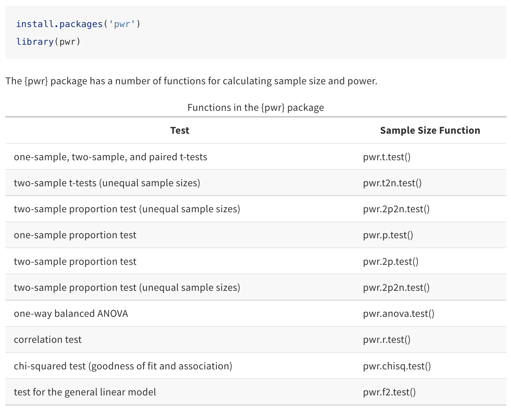

```{r setup, include=FALSE}
knitr::opts_chunk$set(echo = TRUE)
```

<!-- Note: add `class.source="fold-show"` to top of R block to show code by default -->

```{css, echo=FALSE}
.qbox {
  padding: 1em;
  background: cornsilk;
  border: 1px solid burlywood;
  border-radius: 5px;
}

.bluebox {
  padding: 1em;
  background: #d8ecf3;
  border: 1px solid cornflowerblue;
}

h1 {color: mediumblue}
h2 {color: mediumblue}
h3 {color: mediumblue}
h4 {color: mediumblue; font-style: italic}
```


## Background Reading

+ **Whitlock & Schluter, Chapter 14**
+ **Aho, Chapter 6.3-6.4: Type I and Type II Errors; Power**


## Type I and II Errors

When we make statistical inferences, we are making statements about the likelihood that some hypothesis is true based on a chosen significance threshold, based on data from a finite set of experimental samples. By convention, a significance cutoff of $\alpha = 0.05$ is often chosen, meaning that _5% of the time we are likely to get a value as extreme or more extreme than the one we have observed in our test sample **just by random chance**_. That means that 5/100 times, a sample drawn from the null distribution will result in a false conclusion that the sample is NOT drawn from the null distribution. There are two types of errors we can make:

_**Type I error**_ ($\alpha$): A "false positive"

- concluding that there is an effect when none exists
- incorrectly rejecting the null hypothesis (accept the alternative $H_A$) when $H_o$ is true.
- probability of observing a value as extreme or more extreme by random chance, if the sample comes from the null distribution.

_**Type II error**_ ($\beta$): A "false negative"

- concluding that there is no effect when there is one
- incorrectly accepting $H_o$ (rejecting $H_A$) when the alternative hypothesis is true.
- probability that an extreme observation from the non-null distribution could overlap the null distribution just by chance.

<div align="center">
{width=40%}
</div>

The **tradeoff** between Type I and Type II errors is illustrated by a diagram showing two different populations whose distributions partially overlap.


{width=60%}


**When designing experiments, it is important to decide in advance what you will consider as acceptable Type I and Type II error rates.** Depending on one's goals, either of these can be undesirable. For example:

+ In many applications, Type I errors are considered especially bad, for instance when reporting results for RNAi screens or differential gene expression, since they can result in a lot of extra work that does not pan out. 
+ On the other hand, casting a wide net in a primary screen at the expense of a few false positives may be ok if you want to minimize your chances of missing anything important, and you plan to double-check all of your primary data in a second round of testing (e.g. secondary RNAi screens with more replicates, or qPCR to confirm differential expression for genes of interest.)  


## Planning for power

***Power*** is the ability to detect a true effect when one is present. In discussing Experimental Design, we emphasized that methods to ***reduce sampling error*** also ***increase precision and power***.

We can choose our sample size in order to plan for either of these. 

+ When planning for ***precision***, we want to estimate the ***effect size*** as precisely as possible. 
  + To do this, we want to ***minimize our margin of error*** in our sample estimates.
  + We do this by defining a minimum uncertainty we will consider to be acceptible, and then picking a sufficient sample size to achieve this.
  
+ When planning for ***power***, we set a minimum ***effect size*** that we can reliably detect. 
  + Power scales with both sample size and effect size. 
  + ***It is typical to shoot for a power of 0.8.*** This means that we will be confident that we have correctly rejected the null hypothesis 80% of the time at a set significance level (e.g. $\alpha=0.5$).

### Power analysis

**Power analysis** tells us how confident we can be that the results we have observed are realistic. That is, how confident can we be, when we reject the null hypothesis, that our conclusion is reasonable? The power of an experiment depends on several variables:

- **Effect size ($E$)**: This is the expected (true) difference between the population means, $\mu_1 - \mu_2$. A greater effect size gives a better chance of distinguishing between two populations (i.e. getting "true positives").
- **Population variance ($\sigma^2$)**: Populations with less variation make it easier to distinguish between them for a given effect size.
- **Sample size ($n$)**: Since we know from the Central Limit Theorem that increasing sample size gives us a better estimate of the population mean (standard error), it also gives greater power.
- **Significance threshold ($\alpha$)**: Relaxing our criteria for rejecting the null hypothesis will result in a larger acceptance region for a given effect size.

Given **any four of the five parameters** that define the power relationship, it is possible to **estimate the remaining one**. This allows us to answer a variety of related questions, for example:

+ Given a chosen significance threshold and expected effect size, how big of a sample do I need to achieve a particular power?
+ Given my sample size, how much power will I have to detect an effect of a particular size?
+ Given a chosen critical value (significance threshold) and power, how big of an effect will I be able to reliably detect? 

**Goals for experimental power should always be specified in advance for a fixed level $\alpha$ and $\beta$.**


### Example: Alzheimer's and smoking

To illustrate the idea of power, and the factors that affect it, below will walk through **Example 6.10** from Ken Aho's book in class. The problem is:

+ Alzheimer's seems to be negatively associated with moderate smoking!!! Possibly because nicotine may reduce apoptosis (programmed cell death) of neurons
+ Researchers want to know if a sample size of 200 at $\alpha = 0.05$ is sufficent to detect a decrease of 7% on Alzheimer's in subjects that smoke 10-20 cigarettes per day, given that $\sigma = 45\%$.

***What is the power of the experiment?*** In other words, what is the probability of rejecting the null hypothesis if the effect of smoking is a 7% decrease in Alzheimer's?

An annotated version of the accompanying figure (Fig. 6.7) illustrates how the above variables affect the power to detect true differences in sample means. Panels (b-d) show that the following differences in the scenario would increase power:

   (b) Larger effect size ($E$) -- a bigger separation between population means
   (c) Larger sample size ($n$) -- this will decrease the SEM
   (d) Lower stringency of the test (increase $\alpha$) -- increase the rejection region

{width=80%}


### Calculating power

Recall that the probability of a **Type I** error is the chosen significance threshold for an experiment, $\alpha$. The probability of a **Type II** error is denoted by $\beta$. Now we can define the basic form of an equation to compute the **Power** for an experiment in terms of the significance threshold, effect size, variation, and sample size:

$$ Power = 1 - \beta \propto \frac{E\alpha\sqrt{n}}{\sigma} = \frac{E\alpha}{\sigma/\sqrt{n}} =  \frac{E\alpha}{SEM}$$

When designing experiments, **it is good practice to choose a desired significance and power for your experiment in advance**. Typical values are $\alpha = 0.05$ and $1-\beta = 0.8$. In this case, we would like to detect outliers at a significance threshold (false positive rate) of 5%, with a power of 80%.


### Estimating adequate sample size

#### Population mean estimates (review)

Recall that when we learned about **confidence intervals**, we derived an **estimate for the population mean** as a function of the sample mean, sample size, and desired range $\gamma = 1 - \alpha$. We expect that $\gamma * 100\%$ of such intervals will contain the true population mean (e.g. the 95% CI):

$$ \mu = \bar{X} \pm z_{1-(\alpha/2)} * \frac{\sigma}{\sqrt{n}} $$
Here, $z$ is the **quantile function** for a standard normal distribution at probability $1 - \alpha/2$ and represents the $z$-score, or number of standard deviations away from the mean of a normal distribution.

#### Precision

The **margin of error**, $m = z_{1-(\alpha/2)} * \frac{\sigma}{\sqrt{n}}$, represents how far away the confidence bounds will be for a given CI.

Rearranging this equation allows us to estimate the required **sample size** to achieve a particular significance level and desired margin of error $m$:

$$ n = \Bigg( \frac{z_{1-(\alpha/2)}\sigma}{m} \Bigg)^2 $$

Upon setting a desired margin of error, we can use this formula to calculate the sample size required to achieve it. Note that precision is likely smaller than planned for smaller $n$, since $s^2 \propto 1/n$.


#### Power

Similarly, for **power calculations**, we can estimate the sample size required to detect a particular **effect size** ($\mu - \mu_o$), given a predetermined **power** ($1-\beta$) and **Type I error** ($\alpha$). 

For a **one-tailed** $z$-test, this gives:

$$ n \approx \frac{(z_{1-\alpha} + z_{1-\beta})^2\sigma^2}{(\mu - \mu_o)^2} $$
For a **two-tailed** $z$-test, this gives:

$$ n \approx \frac{(z_{1-(\alpha/2)} + z_{1-\beta})^2\sigma^2}{(\mu - \mu_o)^2} $$

These equations differ only in whether the Type I error, $\alpha$, is found on one side or is split between both sides of the null distribution. Recall that for $\alpha = 0.05$, $z_{1-\alpha/2} \approx 1.96$ and $z_{1-\alpha} \approx 1.645$. Similarly, for $80\%$ power, $1-\beta = 0.8$ and $z_{1-\beta} \approx 0.842$.

Note that **we either need to know the population variance, or have a good estimate of it** (when the sample size is large, this can be estimated using the sample variance). 

### *Power for t-tests*

Power analyses can be performed in a similar way for $t$-tests. In this case the null distribution follows a "non-central" $t$-distribution (where the expectation value can be non-zero) that will depend on the degrees of freedom. Again, some estimate for the population variance is needed.


## Cohen's d

Above we discussed the **effect size** in terms of the true difference between means, $\mu - \mu_o$ (or, more generally, $(\mu_X - \mu_Y) - D_o$). When the true effect size or population variance are not known, as is often the case, we can use an alternative measure of effect size, Cohen's $d$ [^1]:

$$d = \frac{|\mu_1 - \mu_2|}{\sigma}$$
where $\sigma$ is the common group variance (the variance of the two groups is expected to be the same). Cohen's $d$ is a **normalized** effect size that measures the difference between two groups in standard deviations.

Cohen's $d$ can be used to make power calculations assuming "small", "medium", or "large" effect sizes. (For his work, Cohen set the boundaries between these categories at $d = 0.2$ and $d = 0.8$). It is common to set $d = 0.5$, as anything larger than this is considered to be a moderate to large effect.


## Power calculations in R

R functions for power calculations will compute, given any four arguments, a value for the missing variable. For example, they can be used to compute the expected power given a certain sample size and expected effect size, or the required sample size to achieve a given desired power, etc. 

In practice, formulas for power estimates will depend on the type of experimental scenario and statistical test one is performing (e.g. $t$-test, proportions test, ANOVA, etc.). Base R and the `asbio` and `pwr` packages provide a variety of functions for performing different kinds of power tests. Not surprisingly, these use different names for the command arguments, so make sure to check the documentation. Additional packages are available for different applications in statistical genomics.

### Base R

Power functions include:

+ `power.t.test()` - $t$-tests
+ `power.prop.test()` - proportions tests
+ `power.anova.test()` - ANOVA

### asbio package

The `asbio` package is a companion package for Ken  Aho's statistics book [^2]. It implements a function for a $z$-test, `power.z.test()`, as an alternative to `power.t.test()`, which can be used if the population sigma is known and the sample size is large.

### pwr package

Functions in this package begin with `pwr` instead of `power`. The package does not contain a function for a $z$-test, but it is much more general and contains functions for $t$-tests (with even or uneven sample sizes), proportions, Chi-square, ANOVA, correlation, and general linear models. The package is pretty well-documented, and several sites provide [**tutorials**](https://www.statmethods.net/stats/power.html) and [**vignettes**](https://cran.r-project.org/web/packages/pwr/vignettes/pwr-vignette.html) with examples for different use cases.

**NOTE:** The `pwr` package uses **Cohen's $d$** for the effect size, rather than **delta** (the true difference in means). Tests can be run using a pre-computed value for $d$, or using "small", "medium", or "large" effect sizes. The function `cohen.ES()` will provide a standard value for each of these categories for a given flavor of test.

The power tests included in the `pwr` package are listed in the table below.

{width=70%}

## Multiple Hypothesis Testing

Situations in which we make many comparisons, such as gene expression profiling, can result in a lot of false positives just by chance. For example, for 20,000 genes, finding significant changes in gene expression at $\alpha = 0.05$ can produce 1,000 false positives just by random chance!

The two most popular methods to control for this are controlling for the **family-wise error rate (FWER)** or the **false discovery rate (FDR)**. 

### Bonferroni correction

**Bonferroni correction** controls the FWER and is the most conservative method to correct for multiple hypothesis testing. The procedure is simply to divide the false positive rate by the number of tests performed: $\alpha^* = \alpha / (\#\ of\ tests)$. 

### False discovery rate

The **Benjamini-Hochberg** procedure controls the FDR. The steps are as follows:

+ Set a desired FDR (denoted by $Q$) that you are willing to tolerate, e.g. $Q = 0.1$ (a false discovery rate of 10%).
+ Rank each data point by its unadjusted $p$-value.
+ The Benjamini-Hochberg **critical value** is $(i/m)Q$, where $i$ is the rank, $m$ is the number of tests, and $Q$ is the FDR.
+ Compare each $p$-value to its B-H critical value.

Then, the **largest** test result that has $P < (i/m)Q$ is significant, and *all other $P$-values less than this* will be significant as well (even if they are larger than their respective B-H critical values, which does happen.)

Controlling the FDR is less conservative and thus has more power than controlling the FWER. Consequently, over the last decade reporting FDR has become more popular than reporting FWER in the field of genomics.

The [_**Handbook of Biological Statistics**_](www://biostathandbook.com/multiplecomparisons.html) walks the reader through an example of how to apply both kinds of correction to a particular dataset relating dietary factors with mammogram density (a risk factor for breast cancer).

We will come back to these topics later when we discuss gene expression analysis.

<!-- footnote -->

[^1]: Cohen (1988), *Statistical Power Analysis for the Behavioral Sciences (2nd ed)* 
[^2]: Ken Aho (2013), *Foundational and Applied Statistics for Biologists Using R* 


