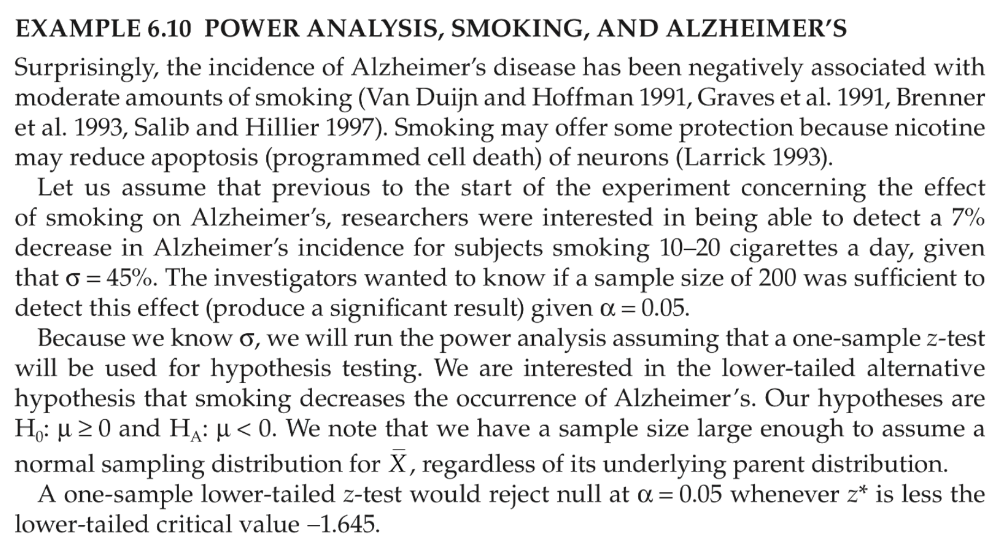

```{r setup, include=FALSE}
knitr::opts_chunk$set(echo = TRUE)
#install.packages("asbio")
#install.packages("pwr")
library(asbio)
library(pwr)
```


## Example

**Aho, Ex. 6.10 (also see Fig. 6.7)**

Surprisingly, the incidence of Alzheimer's disease is negatively associated with moderate smoking, possibly because nicotine may reduce apoptosis (programmed cell death) of neurons. The description of the problem is as follows:

<div align="center">
{width="60%"}
</div>

### What is the question?

Researchers were interested in being able to detect a 7% reduction in Alzheimer's for patients smoking 10-20 cigarettes a day, given that $\sigma=45\%$.

Is a sample size of 200 sufficient to detect this effect size given $\alpha=0.05$?

+ What are $H_o$ and $H_A$?
+ Can we assume that the sampling distribution of the sample mean, $\bar{X}$, is normal?
+ What type of test should we use?
+ What is the critical value for the test?

```{r}
# your answer here
```


### Manual power calculation

First, compute the power by hand:

```{r, collapse=T}
# =================================================== #
# set up variables
# =================================================== #

effect.size =   # effect size = Exp(X) under H_A
n = 
sigma = 
alpha = 
type =  # one or two sample
alt =   # one- or two-sided

# set Exp(X) = 0 under null H_o

# critical value (z*) for lower-tail test at alpha=0.05
z.crit = 

# check alpha using standard normal distribution

  
# compute SEM for sample size
sem = 
sem

# =================================================== #
# manual power calculation
# =================================================== #

# compute power using area under the curve for H_A

# get value of critical x at z.crit for H_A
# want P( X.bar  <= z.crit * sem)
# percent difference for lower-tail significance
x.crit =    # x-value at critical z-score 
x.crit

# Expected X.bar (pop. mean) under H_A is (mu_o - mu_A): Exp(X) = -7
pwr =  
pwr

# check z-score for H_A at expected power
   # alpha = P(X.bar <= -5.24)
```

### Compute power in R

Given any 4 of the 5 variables that go into the power equation, we can use `power.t.test()` to compute the missing value. Since $n$ is large, we could also use the `power.z.test()` command from the `asbio` package. These give slightly different results, as the $t$-test is a bit more conservative. (They also use different names for their arguments, and the objects the produce are also different.)

**NOTE:** *Effect size used for these functions should be given as a positive number, otherwise these 
functions will not work as expected.*

```{r}
# ================================================== #
# provide expected effect size as a positive number
power.t.test(n, delta =  , sd =  , sig.level =  ,
             type= , alternative= , strict=T)

# note that arguments for this command differ
power.z.test(n, effect =  , sigma =  , 
             alpha =  , test= , strict=T)
```


### What if you change different variables that influence power?
 
+ Increase effect size => increase power (reduce Type II error)
+ Increase sample size => increase power (reduce Type II error)
+ Raise $\alpha$       => lower stringency (increase Type I error)

We can compute the new power by hand, or use the `power.z.test()` command:

```{r}
# ================================================== #
# increase effect size
# ================================================== #
# what happens if E = -8? => increase power
# (keep alpha the same)


# ================================================== #
# increase sample size
# ================================================== #
# what if sample size = 300? => more power for same E
# (keep alpha the same)
n = 300

# get x-bar and SEM
sem = 
sem
x.crit = 
x.crit

# ================================================== #
# power


# ================================================== #
# relax stringency: raise alpha
# ================================================== #
# raising alpha increases Type I error
# what happens to power? => power goes down
alpha = 0.2
z.crit = 

# check alpha2 using standard normal distribution
pnorm(0,abs(z.crit),lower.tail=T)

x.crit = 
x.crit

pwr = 
pwr

# =================================================== #
# check power


# power is the same with the z-test power function

```


### Design for a targeted power

What if you want to design the experiment for power = 0.8, for the same sample
size and effect size? What is the Type II error? What happens to the Type I error?

```{r}
# ================================================== #
# increase desired power to 0.8
# ================================================== #
# if raise desired power without increasing effect size,
#   => alpha goes up (less stringent)
x.bar2 = 
x.bar2

# what significance level is this?
alpha2 = 
alpha2

# probability

# what significance level is this?
alpha2 = 
alpha2

# probability

# ================================================== #
# using power.t.test command
# now supply power and ask what new alpha is

```

