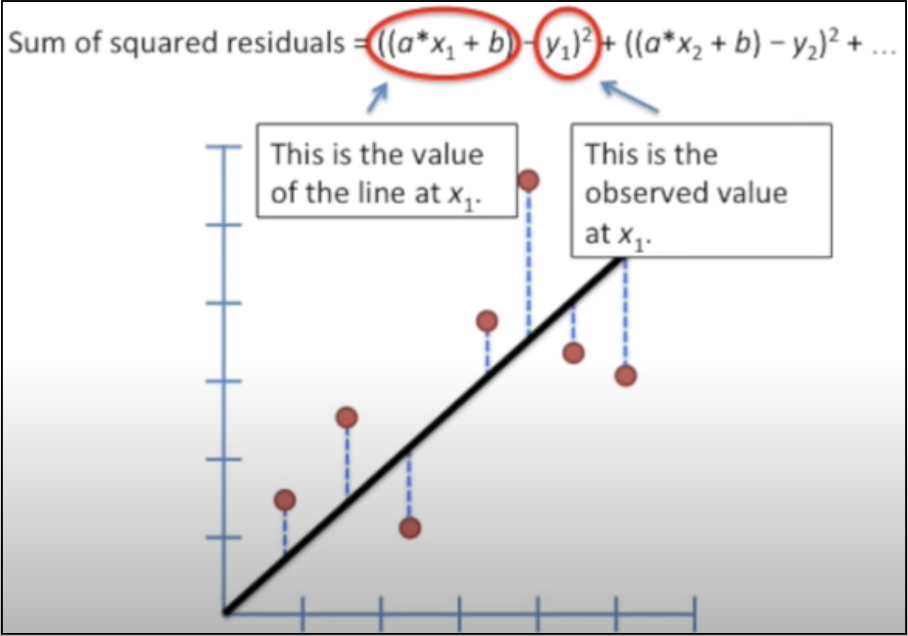
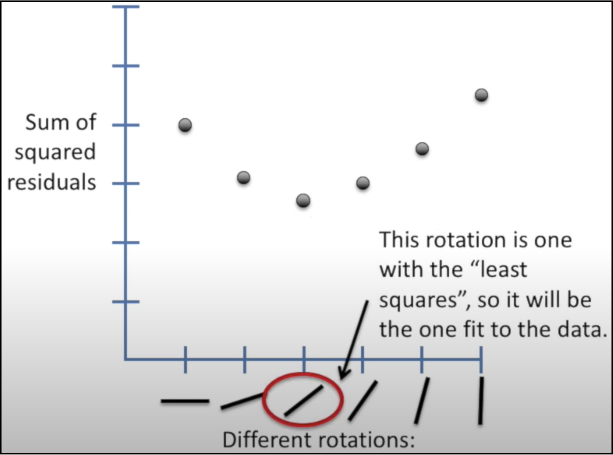
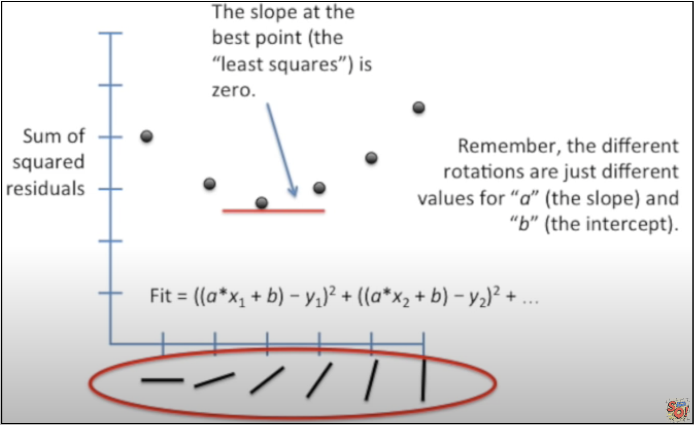
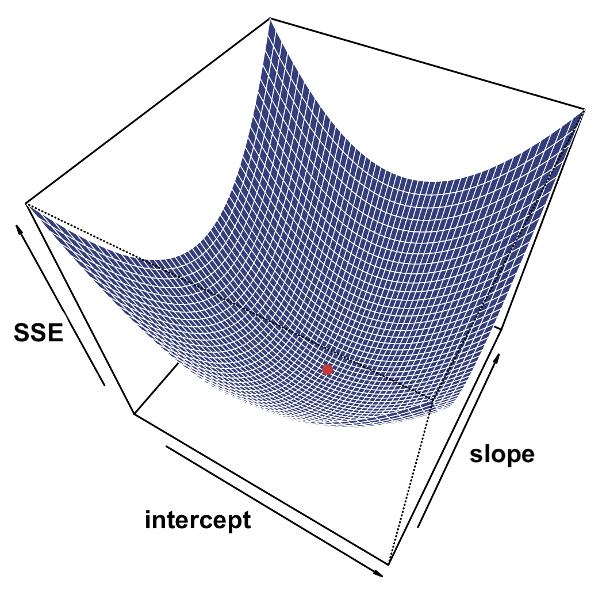

```{r setup, include=FALSE}
knitr::opts_chunk$set(echo = TRUE)
```

# Review

## ANOVA

ANOVA and related non-parametric methods allow us to compare differences in a ***quantitative*** variable between ***categorical*** groups. Using the sums-of-squares method, we saw that we can partition the total variation among and between groups, as shown in W&S Fig, 15.1-2:

<div align="center">
{width="70%"}
</div>


For any individual data point, we can separate its distance from the overall mean into two parts: its distance to its own group mean, and the distance from its group mean to the overall mean.

$$ (Y_{ij} - \bar{Y}) = (Y_{ij} - \bar{Y}_j) + (\bar{Y}_j - \bar{Y}) $$

where

+ $\bar{Y}$ is the overall mean,
+ $\bar{Y}_j$ is the mean of group $j$, for $j \in \{1..m\}$ and $m$ is the number of groups
+ $Y_{ij}$ is the value of data point $j$ in group $i$, for $i \in \{1..n_j\}$ and $n_j$ is the number of data points in group $j$.

It's easy to see that the group terms on the right ($\bar{Y}_j$) cancel each other out.

### Sums of Squares

To get the total variation in the data, we just sum up all the squared differences from every data point to the grand mean. Similarly, we can sum up the the squared differences from each data point to its individual group mean, and the squared differences between the group means and the total mean:

$$
\begin{aligned}
\sum_{i=1}^n\sum_{j=1}^m(y_{ij} - \bar{Y})^2 &= \sum_{i=1}^n\sum_{j=1}^m(y_{ij} - \bar{Y}_j)^2 + \sum_{j=1}^m n_j(\bar{Y}_j - \bar{Y})^2 \\
SS_{total} \ \ \ \ \ \ \ \ \ &= \ \ \ \ \ \ \ \ \ SS_{error} \ \ \ \ \ \ \ \ + \ \ \ \ \ \ \ \ \ SS_{group}
\end{aligned}
$$

### Mean Squared Error

Recall that the ***variance*** of a random sample is defined as $s^2 = \frac{\sum({y_i} - \bar{Y})^2}{n-1}$, where the degrees of freedom are $df = n - 1$.

So, the variance is essentially the ***mean sum of squares*** of a random variable. More generally, we can write $MSS = \frac{SS}{df}$. For ANOVA with $m$ groups, we can write:

$$MS_{group} = \frac{SS_{group}}{df_{group}} = \frac{\sum_j n_j(\bar{Y}_j - \bar{Y})^2}{m-1}$$

$$MS_{error} = \frac{SS_{error}}{df_{error}} = \frac{\sum_i\sum_j(y_{ij} - \bar{Y}_j)^2}{N-m}$$

where $N$ is the total number of points, $N=\sum_j{n_j}$, and $m$ is the number of groups.

### F-statistic

The F-ratio is the ratio of the between-group variance to the within-group variance:

$$ F = \frac{MS_{group}}{MS_{error}} = \frac{SS_{group}/df_{group}}{SS_{error}/df_{error}} $$

If there is no difference between the groups, then $F = 1$; otherwise, $F > 1$, and the upper-tail probability determines how significant the differences between groups are. 

The critical value for the F-statistic is determined by the allowable Type I error rate, $\alpha$ (usually $\alpha=0.05$), and the degrees of freedom for $SS_{group}$ and $SS_{error}$:

$$ F_{crit} = F_{(1-\alpha),(m-1),(N-m)} $$

Interestingly, when there are only two groups, and so $df = 1$, the F-statistic is the same as the square of the 2-sample t-statistic: $F=t^2$. This may seem a little weird, but just take my word for it. Recently someone posted a proof of this on their blog, which you can read if you want! [^1]

### R-squared

$R^2$ is the ***amount of variation in the data that is explained by the groups***, i.e. the proportion of the total variation that is due to variation between groups:

$$ R^2 = \frac{SS_{group}}{SS_{total}} $$

$R^2$ ranges from $0 \le R^2 \le 1$. 

+ If the groups are all drawn from the same population, then almost none of the total variation will be due to differences between groups, so $R^2$ will be close to zero. 
+ On the other hand, if the groups are very different, then $R^2$ will be close to 1, since the differences between groups will account for almost all of the variation in the dataset.


## Measures of Association

To measure the strength of association between ***two quantitative variables***, we have seen that we can use the ***covariance***, or the more useful ***linear correlation coefficient***. 

### Covariance

The covariance can easily tell us if there is a positive, negative, or no association between two variables. It is defined as:

$$ Cov(X,Y) = \frac{\sum(x_i - \bar{X})(y_i - \bar{Y})}{n-1}$$

Again, notice that this equation has exactly the same form as that for the variance of a single variable: $s^2 = \frac{\sum(x_i - \bar{X})(x_i - \bar{X})}{n-1}$! **Cool.** So now we've seen that the ***mean squared error*** and the ***covariance*** both have the same form as the ***variance***! Keep this in mind for later.

The ***drawback of the covariance*** is that it is not so easy to interpret:

+ it is not bounded, i.e. it ranges from $-\infty$ to $+\infty$
+ it varies with sample size
+ it changes with scale, even when the underlying relationship is the same (e.g. X ranging from 0-20 vs. 0-40)

### Correlation

To solve these problems, we can simply ***normalize*** the covariance by the variance of the individual variables. This is called the ***linear correlation coefficient, r***:

$$ r = \frac{Cov(X,Y)}{\sqrt{Var(X)}\sqrt{Var(Y)}} $$

The correlation coefficient $r$ is easier to interpret because has the following advantages:

+ its range is bounded: $-1 \le r \le 1$
+ it is unaffected by the scale of the data

$r$ quantifies the ***strength*** of a linear relationship between two variables. A single variable is perfectly correlated with itself, so $Cor(X,X) = 1$. When two variables are completely uncorrelated, $r=0$ *(warning: the reverse is not true, e.g. $y=x^2$!)*

One caveat to be aware of is that $r$ may differ depending on the ***range*** of the data analyzed. This is illustrated in W&S Fig. 16.4-1, which shows that computing $r$ over just a small portion of the available data does not reveal the same correlation.

Our ***confidence*** in the significance of any non-zero correlation depends on the ***value of r***, coupled with the ***amount of data***. For example, any two points will have a correlation of 1, but that's not very significant! On the other hand, the chance of being able to draw a straight line through 3 random points is very low.

The ***p-value*** for $r$ quantifies the probability that some number of random data points will show a certain correlation, and it depends ***only*** on the value of $r$ and the number of data points. It is calculated in the usual way following a $t$-distribution, using the test statistic

$$t = \frac{r}{SE_r}\ \ ,\ where\ SE_r = \sqrt{\frac{1-r^2}{n-2}}$$

The higher the $r$, and the more data we have, the better confidence we can have in our ability to make inferences about our data. This means that for the same $r$, the dataset with a lot more data points will have a lower $p$-value. On the other hand, a low $r$ could have a significant $p$-value and still have very low predictive value due to the large amount of variation in the data.

### R-squared

One problem with $r$ is that it's not so easy to compare two different $r$ values. Is $r=0.8$ twice as good as $r=0.4$? Well, it's not really that clear.

However, something interesting happens if we take the square of $r$:

$$R^2 = r^2 = \frac{Cov(X,Y)^2}{Var(X)Var(Y)}$$

Now we have a new variable, $R^2$, that ranges from $0 \le R^2 \le 1$. So, it does not contain any information about the ***direction*** of the relationship. 

However, $R^2$ is great because it measures the ***amount of variation*** that's due to the ***association*** between two variables, relative to their ***individual variation***. It has a formal name, which is the ***coefficient of determination***. To help you remember the proper name, just ask the question, _"How much of the variation is **determined** by the relationship between variables?"_

Unlike $r$, $R^2$ ***can*** be used to directly compare two different sets of data. For example, an $R^2 = 0.5$ means that the association between variables explains 50% of the total variation in the data, whereas $R^2 = 0.25$ explains 25% of the variation in the data. So, the amount of variation explained by the association between X and Y in the first dataset is two times that for the second dataset.

Although it's calculated differently, $R^2$ represents the same idea whether we are looking at variation between groups in ANOVA, or association between two quantitative variables: it is the ***fraction of the total variation that is NOT explained by the variation of the individual variables alone***. We will revisit $R^2$ again from a slightly different perspective as related to least squares linear regression.

### Spearman's Rank Correlation

When the data do not follow a bivariate normal distribution (such as when the variation in Y varies with X, or there are outliers, or there is a nonlinear relatinoship), then other approaches must be used to test for correlation between two quantitative variables. 

The same options exist as for univariate data: try transforming the data to make it look more normal, or use a rank-based test. Spearman's Rank Correlation computes a correlation using the ranks of the data, called $r_S$, and signficance is calculated using a t-statistic in the usual manner.


# Linear Regression

Linear regression also examines the relationship between two quantitative variables, but instead of simply asking whether the data are correlated, it asks the question, _"How much of the variation in Y can be explained by the variation in X?"_ Here we treat X as the independent variable, and we want to discover its relationship with the dependent variable, Y. In other words, is there a  ***linear dependence*** of Y on X?

## Method of Least Squares

### Sums of Squares

The procedure for linear regression uses the same idea of partitioning of variation as is used for ANOVA, but takes it one step further.

First, let us plot the data in Euclidian space and give each point an x-y coordinate. Then, we take the mean of all the y-values and draw a horizontal line at $\bar{Y} = \frac{\sum{y_i}}{n}$. 

If there is no relationship between X and Y, we would expect that the variation about $\bar{Y}$ will not vary with X. To measure the total variation in Y, we just sum up the squared distances of each point to the mean:

$$ SSY = \sum_{i=1}^n(y_i - \bar{Y})^2$$

So, $SSY$ represents the total spread of the data around the mean value for Y.

Next, we can pivot the line about the mean of X, $\bar{X}$, to find the best fit line. For any straight line that is not horizontal (meaning there is no correlation between X and Y), we can split the total variation into 2 parts:

+ $SSE$: the sum of squared differences between all the $y_i$ to the new line (a.k.a. $SS_{error}$, the "residual error")
  + the "residual" deviation not explained by the line
+ $SSR$: the sum of squared differences between the new line and the horizontal line at $\bar{Y}$ (a.k.a. $SS_{regression}$)
  + the deviation in Y that is explained by the best fit line

And just as in ANOVA, we can relate these in a very simple way, as illustrated below:

$$ SSY = SSE + SSR  = \sum_{i=1}^n(y_i - \hat{Y})^2 + \sum_{i=1}^n(\hat{Y} - \bar{Y})^2$$

where $n$ is the total number of points and $\hat{Y}$ is our estimate for Y according to the best fit line.


Here is another illustration I borrowed from the web (where SSY is called SST): [^2]

<div align="center" with="60%">
{width="60%"}
</div>

### F-statistic

Just like with ANOVA, we can take the ratio of the mean sums of squares for the two partitions to measure the association:

$$ F = \frac{SSR/df_{SSR}}{SSE/df_{SSE}}$$

The degrees of freedom are the number of data points minus the number of parameters used up in computing each SS. Thee are: 

+ $df_{SSY} = n-1$ (since we use up one d.f. with $\bar{Y}$)
+ $df_{SSE} = n-2$ (since both X and Y are needed to fit the line)
+ $df_{SSR} = df_{SSY} - df_{SSE} = (n-1) - (n-2) = 1$.

As before, $F=1$ if there is no association between the variables, and we can get a $p$-value for the $F$-ratio using the $F$-distribution.

### R-squared

Recall that $R^2$, or the coefficient of determination, expresses what proportion of the overall variation between two random variables can be explained by their ***covariance*** relative to their ***individual variances***.

We can also compute the same $R^2$ as above, but now using the sums of squares:

$$R^2 = \frac{SSR}{SSY} = \frac{SSY - SSE}{SSY} = 1 - \frac{SSE}{SSY}$$

In terms of linear regression, $R^2$ represents the ***amount of variability in Y that can be explained by the variability in X***.

## Fitting Values

### Finding the best fit line

Recall that for a linear function, we can describe the relationship between X and Y as:

$$y = \alpha + \beta x$$

Beta, the slope of the line, is just the "rise" over the "run", or the derivative of the line, i.e. $\beta = \frac{\Delta y}{\Delta x} = \frac{dy}{dx}$

We can express our ***estimate*** for the best fit line as:

$$ \hat{y} = \hat{\alpha} + \hat{\beta} x = a + bx$$

The way we find the ***regression coefficients*** for the best-fit line is to ***minimize the squared sum of residual errors*** between the data points and the regression line, $SSE$. To illustrate this idea, below I've borrowed several figures from a couple of nice Statquest videos on linear regression. [^3]

Recall that our best estimate for $\hat{Y} = a + bX$. So we want to minimize the following:

$$ SSE = \sum_i(y_i - \hat{Y})^2 = \sum_i(y_i - (a + bx_i))^2$$

But how do we do this? Let's say the best fit line is a diagonal line where $y = x$, as shown approximately below. First, Let's look at the SSE:

<div align="center">
{width="50%"}
</div>


Now imagine that we start out with our horizontal line, where $y = \bar{Y}$, and then slowly pivot about the point $\textbf{p} = (\bar{X},\bar{Y})$. As the line approaches the optimal slope, SSE will get smaller and smaller, but as we keep rotating past the optimal line, SSE will start growing again. So, we want to find the sweet spot where SSE is minimized:

<div align="center">
{width="50%"}
</div>

Mathematically, we do this by finding the inflection point for a curve passing through all of the SSE values shown above. This happens when the rate of change, or the slope of the curve, is zero:

<div align="center">
{width="50%"}
</div>

### Regression coefficients

Rearranging the equation for the SSE with some calculus gives the optimal values for the slope and intercept of the line:

<div align="center">

<div>

$$\hat{\beta} = min \Bigg[ \frac{\sum(x_i-\bar{X})(y_i - \bar{Y})}{\sum(x_i-\bar{X})^2} \Bigg] $$

Once the slope is found, it's easy to get the intercept:

$$ \hat{\alpha} = \bar{Y} - \hat{\beta}\bar{X} $$

### Relationship between slope and correlation


## Statistics

### Measures of association and hypothesis testing

Size of association: F-ratio

F and t^2

### Accuracy

R-squared

## Confidence and Prediction Intervals

Sources of uncertainty in estimates and inferences

### CI

Scatter around true line

### PI

Scatter (CI) plus undertainty in intercept, slope
<!-- footnotes -->

[^1]: https://canovasjm.netlify.app/2018/10/29/when-does-the-f-test-reduce-to-t-test/
[^2]: https://vitalflux.com/linear-regression-explained-python-sklearn-examples/
[^3]: (a) *Main ideas of fitting a line to data:* https://www.youtube.com/watch?v=nk2CQITm_eo 
(b) *Linear regression, clearly explained!:* https://www.youtube.com/watch?v=PaFPbb66DxQ
<!-- code used to generate plots above -->

```{r, echo=FALSE, fig.align='center', eval=FALSE}
library(cowplot)

lm_plot = ggdraw() + 
  draw_image("Images/Grafen_Hails_SST_Fig2.2a.png", width = 0.31) + 
  draw_image("Images/Grafen_Hails_SSE_Fig2.2b.png", width = 0.25, x = 0.31) +
  draw_image("Images/Grafen_Hails_SSR_Fig2.2c.png", width = 0.22, x = 0.56) +
  draw_image("Images/Grafen_Hails_lm_summary_Fig2.2d.png", width = 0.22, x = 0.78)

pdf("Grafen_Hails_Fig2.2_lmplot.pdf")
print(lm_plot)
dev.off()
``` 
