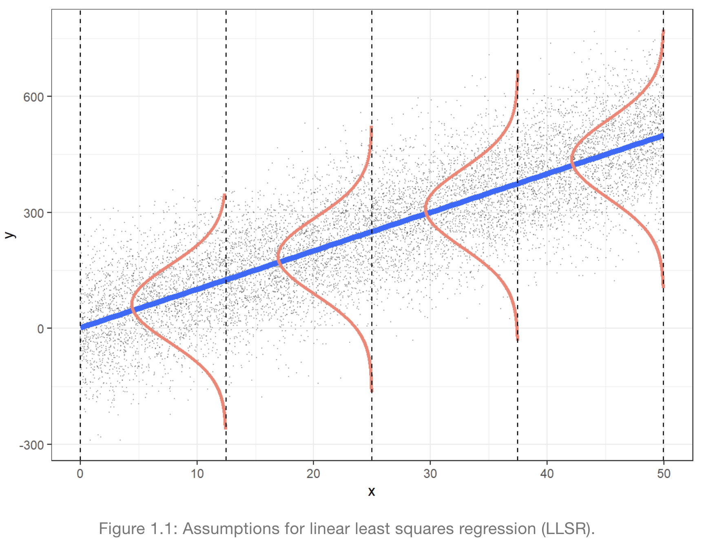
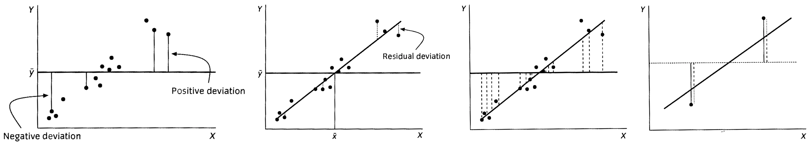
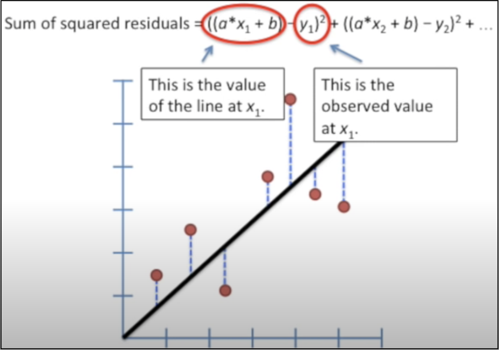
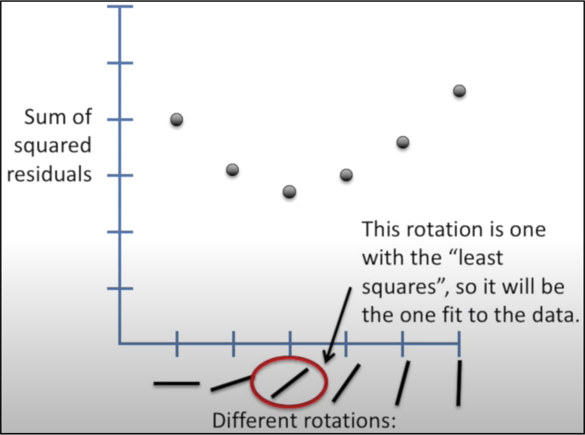
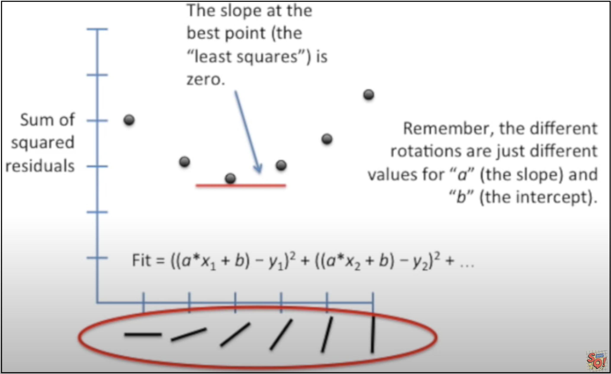
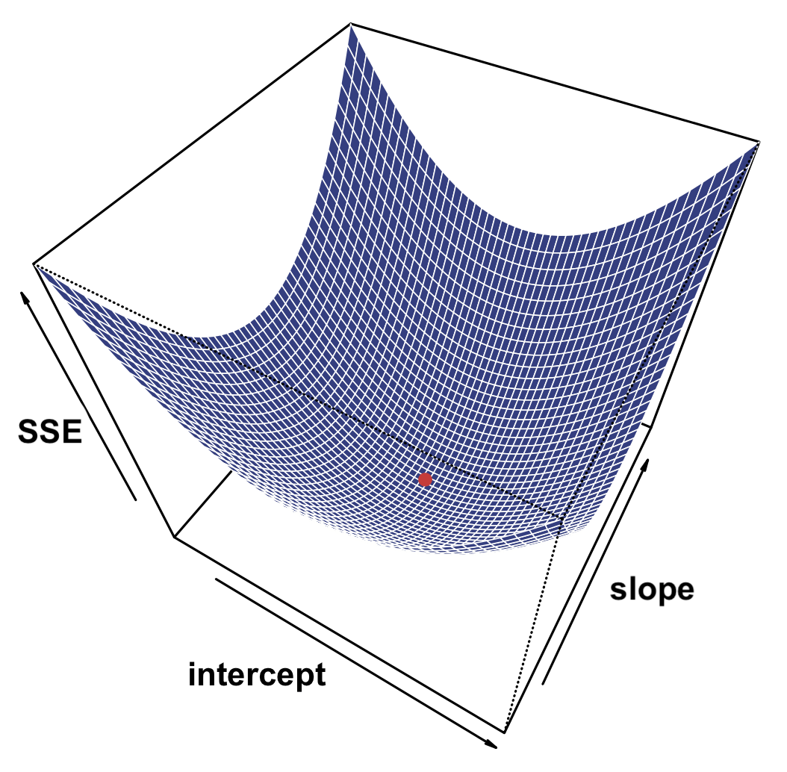

```{r setup, include=FALSE}
knitr::opts_chunk$set(echo = TRUE)
```


# Linear models and linear regression

Linear regression examines the relationship between two quantitative variables, but instead of simply asking whether the data are correlated, it asks the question, _"How much of the variation in Y can be explained by the variation in X?"_ Here we treat X as the independent variable, and we want to discover its relationship with the dependent variable, Y. In other words, is there a  ***linear dependence*** of Y on X? 

Our goal is to find the best fit line for the data: $Y = a + bX$, where $a$ is the intercept on the y-axis and $b$ is the slope of the line.

## Assumptions

Just like with all of the parametric methods we've discussed so far, several assumptions should be met in order to apply linear regression. These are depicted in the following diagram and can be remembered using the acronym ***L.I.N.E.*** [^2]:

<div align="center">
{width="50%"}
</div>

To quote from that book, [^2] these four elements are:

+ ***L***: There is a linear relationship between the mean response (Y) and the explanatory variable (X),
+ ***I***: The errors are independent—there’s no connection between how far any two points lie from the regression line,
+ ***N***: The responses are normally distributed at each level of X, and
+ ***E***: The variance or, equivalently, the standard deviation of the responses is equal for all levels of X.


## Method of Least Squares

### Sums of Squares

The procedure for linear regression uses the same idea of partitioning of variation as is used for ANOVA, but takes it one step further.

First, let us plot the data in Euclidian space and give each point an x-y coordinate. Then, we take the mean of all the y-values and draw a horizontal line at $\bar{Y} = \frac{\sum{y_i}}{n}$. 

If there is no relationship between X and Y, we would expect that the variation about $\bar{Y}$ will not vary with X. To measure the total variation in Y, we just sum up the squared distances of each point to the mean:

$$ SSY = \sum_{i=1}^n(y_i - \bar{Y})^2$$

So, $SSY$ represents the total spread of the data around the mean value for Y.

Next, we can pivot the line about the mean of X, $\bar{X}$, to find the best fit line. For any straight line that is not horizontal (meaning there is no correlation between X and Y), we can split the total variation into 2 parts:

+ $SSE$: the sum of squared differences between all the $y_i$ to the new line (a.k.a. $SS_{error}$, the "residual error")
  + the "residual" deviation not explained by the line
+ $SSR$: the sum of squared differences between the new line and the horizontal line at $\bar{Y}$ (a.k.a. $SS_{regression}$)
  + the deviation in Y that is explained by the best fit line

And just as in ANOVA, we can relate these in a very simple way, as illustrated below:

$$ SSY = SSE + SSR  = \sum_{i=1}^n(y_i - \hat{Y})^2 + \sum_{i=1}^n(\hat{Y} - \bar{Y})^2$$

where $n$ is the total number of points and $\hat{Y}$ is our estimate for Y according to the best fit line.



Here is another illustration I borrowed from the web (where SSY is called SST): [^3]

<div align="center" with="60%">
{width="60%"}
</div>

### F-statistic

How can we determine whether significantly more of the variation in the data is explained by the best fit line than we would expect by chance, if X and Y are completely unrelated?

Just like with ANOVA, we can take the ratio of the mean sums of squares for the two partitions to measure the association between variables:

$$ F = \frac{SSR/df_{SSR}}{SSE/df_{SSE}} = \frac{MSR}{MSE}$$

The degrees of freedom are the number of data points minus the number of parameters used up in computing each SS. Thee are: 

+ $df_{SSY} = n-1$ (since we use up one d.f. with $\bar{Y}$)
+ $df_{SSE} = n-2$ (since both X and Y are needed to fit the line)
+ $df_{SSR} = df_{SSY} - df_{SSE} = (n-1) - (n-2) = 1$.

As before, $F=1$ if there is no association between the variables, and we can get a $p$-value for the $F$-ratio using the $F$-distribution.

### R-squared

Recall that $R^2$, or the coefficient of determination, expresses what proportion of the overall variation between two quantitative random variables can be explained by their ***covariance*** relative to their ***individual variances***.

We can also compute the same $R^2$ as above, but now using the sums of squares:

$$R^2 = \frac{SSR}{SSY} = \frac{SSY - SSE}{SSY} = 1 - \frac{SSE}{SSY}$$

Does this look familiar? It's exactly analagous to the $R^2$ we computed for ANOVA, but instead the numerator represented the ***between-groups SS*** vs. the ***regression SS***.

In terms of linear regression, $R^2$ represents the ***amount of variability in Y that can be explained by the variability in X***.


### ANOVA and linear models

As we've now seen, we can use sums of squares both to compare one quantitative and one categorical variable (ANOVA), or two quantitative variables (regression)!

This means that -- whether we are trying to explain the variation in Y due to the groups or due to the variation in X -- we can construct a linear model and then get an ANOVA table to analyze the variation explained by the model!

In R, this is done by applying the `anova()` function to the output of the `lm()` function for a particular dataset, which will give us the various sums of squares, mean squared errors, the $F$-statistic and its $p$-value, and the $R^2$ for the model.


## Fitting Values

### Finding the best fit line

Recall that for a linear function, we can describe the relationship between X and Y as:

$$y = \alpha + \beta x$$

Beta, the slope of the line, is just the "rise" over the "run", or the derivative of the line, i.e. $\beta = \frac{\Delta y}{\Delta x} = \frac{dy}{dx}$

We can express our ***estimate*** for the best fit line as:

$$ \hat{y} = \hat{\alpha} + \hat{\beta} x = a + bx$$

The way we find the ***regression coefficients*** for the best-fit line is to ***minimize the squared sum of residual errors*** between the data points and the regression line, $SSE$. To illustrate this idea, below I've borrowed several figures from a couple of nice  video tutorials on linear regression. [^4]

Recall that our best estimate for $\hat{Y} = a + bX$. So we want to minimize the following:

$$ SSE = \sum_i(y_i - \hat{Y})^2 = \sum_i(y_i - (a + bx_i))^2$$

But how do we do this?

Let's say the best fit line is a diagonal line where $y = x$, as shown approximately below. First, Let's look at the SSE:

<div align="center">
{width="50%"}
</div>


Now imagine that we start out with our horizontal line, where $y = \bar{Y}$, and then slowly pivot about the point $\textbf{p} = (\bar{X},\bar{Y})$. As the line approaches the optimal slope, SSE will get smaller and smaller, but as we keep rotating past the optimal line, SSE will start growing again. So, we want to find the sweet spot where SSE is minimized:

<div align="center">
{width="50%"}
</div>

Mathematically, we do this by finding the inflection point for a curve passing through all of the SSE values shown above. This happens when the rate of change, or the slope of the curve, is zero:

<div align="center">
{width="50%"}
</div>

### Regression coefficients

Another nice illustration of this is the following diagram from the book *Introduction to Statistical Learning*:

<div align="center">
{width="40%"}
</div>

Rearranging the equation for the ***SSE*** with some calculus gives the optimal values for the slope and intercept of the line:

$$ SSE = \sum_i(y_i - \hat{Y})^2 = \sum_i(y_i - (\hat{\alpha} + \hat{\beta}x_i))^2\ \  \ \ \Rightarrow \ \ \ \ \hat{\beta} = \frac{\sum(x_i-\bar{X})(y_i - \bar{Y})}{\sum(x_i-\bar{X})^2} = \frac{Cov(X,Y)}{s_X^2} $$

This may seem strange, but consider the case where $\bar{X} = \bar{Y} = 0$. then, 

$$\hat{\beta} = \frac{\sum(x_i-\bar{X})(y_i - \bar{Y})}{\sum(x_i-\bar{X})^2} =
\frac{\sum{x_i y_i}}{\sum{x_i^2}} = \frac{XY}{X^2} = \frac{Y}{X} \ \ \Rightarrow \ \ 
\beta = \frac{\Delta Y}{\Delta X} = \frac{dy}{dx}$$

Once the slope is found, it's easy to get the intercept:

$$ \hat{\alpha} = \bar{Y} - \hat{\beta}\bar{X} $$

### Relationship between slope and correlation

The slope and the correlation between X and Y are not exactly the same thing, but they are related. Recall that $r = \frac{Cov(X,Y)}{s_X s_y}$. Then, it is easy to see that:

$$ \hat{\beta} = \frac{s_Y}{s_X} * r = \frac{s_Y}{s_X} * \frac{Cov(X,Y)}{s_X s_Y} = \frac{Cov(X,Y)}{s_X^2} = \hat{\beta} $$

So, 

+ the ***correlation*** $r$ is the amount of variation that is explained by the association between to variables relative to their individual variation, and
+ the ***slope*** $\hat{\beta}$ is the amount of variation in Y that is explained by the variation in X!


## Statistics

Let's take a minute to review the ***measures of association*** that we can get from a linear model. These statistics are all included in the various summary tables we can get in R.

### Strength of association

The Sums of Squares (ANOVA) analysis gives us two important outputs:

+ ***F-ratio***: the amount of variation in Y that is explained by the model, vs. the amount that remains unexplained.
  + We can get a $p$-value for our $F$-statistic, which will tell us if more variance has been explained than we would expect just by chance alone.
+ ***R -squared***: the amount of variation in Y that is explained by the model, relative to the total variation.
  + If $R^2$ is close to 1, then the model explains most of the variation in our data.
  + If $R^2$ is closer to 0, then there may be other factors that could explain the rest of the observed variation, which are missing from our model.

### Magnitude of association

Our estimate for ***slope*** of the line tells us ***how much*** Y changes as a function of X. For this reason, the slope is also called the ***coefficient of variation***.

Since there is always some variation in the data, we can also get an measure for the ***uncertainty*** in our estimate. This gives us an estimate for the ***accuracy** of our model that can be used for hypothesis testing as well.

The coefficients table will give us estimates for both the slope and the intercept (which generally we don't care much about). It will also give us a ***standard error*** for the slope, which is defined in the same way as the SE for the mean: 

$$SE_b = \frac{s_b}{\sqrt{n}}$$

Nowe we can get a $p$-value for the slope using a $t$-statistic for the null hypothesis $H_o: \beta = 0$!

$$ t = \frac{b}{SE_b} = \sqrt{F}$$

Notice that when there is only one degree of freedom for SSR, $df_{SSR} = 1$, the F-statistic is the same as the square of the t-statistic: $F = t^2$. You can verify this for yourself when you examine the output of any linear model with just two variables.

This is thee same thing that we saw above for ANOVA with only two groups! 

One simple way to think about why this might be the case is to recognize that the standard error is the ***SD*** of the sampling distribution of a sample estimate, which is just the mean squared error (***MSE***), adjusted for the sample size. The $F$-statistic is just the ratio of two MSE's (variances), $F=\frac{S_1^2}{S_2^2}$, and the slope is the ratio of two SD's times the correlation coefficient, $\hat{\beta} = \frac{s_Y}{s_X}*r$, where $r$ is the covariance adjusted by the variation in one of the variables: $r = \frac{Cov(X,Y)}{s_X^2}$. So it's not hard to imagine that rearranging all of these leads to simple relationships between them, as we've seen above.

And, again, if you want to read a proof, you can find one online. [^1] 


## Confidence Interval for the slope

Uncertainty in our estimate of the slope arises from the scatter in the data, allowing us to quantify our ***confidence*** in the accuracy of the estimate.

Just like for any other estimate such as the sample mean, the confidence interval for the slope  around true line is calculated using the critical $t$-value for a chosen $\alpha$ (Type I error) with the given degrees of freedom, and the standard error of the estimate. For the slope, this is:

$$ CI_{1-\alpha/2}(y) = \hat{y} \pm t_{crit,df}SE_{\hat{y}}$$

## Prediction Intervals

The uncertainty in our ability to ***predict*** a value for $y$ for any given $x$ has to factor in two main components:

+ The scatter around the regression line if it's the true line (the CI), and
+ our uncertainty that the regression line actually represents the ***true*** line.

Our uncertainty in the regression line, in turn, depends on the ***accuracy*** in our estimates for both:

+ the intercept, $\alpha$
  + determined by the number of data points
+ the slope, $\beta$
  + determined by the range of x, and the number of data points

There are two different kinds of predictions that we can make: 

+ ***95% confidence bands***
  + prediction for the ***mean value of Y*** at any particular value of X.
+ ***95% prediction intervals***
  + prediction for a ***specific value of Y*** at any particular value of X.

Predictions for $\bar{Y}$ will always be more accurate closer to $\bar{X}$, so CI bands are always tightest closer to the center of nass of the data, and wider at the edges, forming an hour glass shape about the estimated line.

Prediction bands are much wider than CI bands, since predicting a specific value has more uncertainty than predicting a mean value.

Note that ***outliers*** may have an outsize influence on predictions, and extrapolating beyond the range of X is very unreliable, since there is no data to inform the predictions!

<!---
Putting all of these three sources of uncertainty together, we can derive a formula for the prediction interval for a given value $X = x'$:

$$ PI = \hat{y} \pm t_{crit,df}SE_{\hat{Y}}\ *\ \sqrt{\frac{1}{m} + \frac{1}{n} + \frac{(x' - \bar{X})^2}{SSX}}\ \ , where \ \ SSX = \sum{(x_i - \bar{X}^2)}$$
-->

<!-- footnotes -->

[^1]: https://canovasjm.netlify.app/2018/10/29/when-does-the-f-test-reduce-to-t-test/
[^2]: *Beyond Multiple Linear Regression, by Paul Roback and Julie Legler (January 26, 2021)* https://bookdown.org/roback/bookdown-BeyondMLR/ch-MLRreview.html#assumptions-for-linear-least-squares-regression
[^3]: https://vitalflux.com/linear-regression-explained-python-sklearn-examples/
[^4]: *Statquest, from UNC Chapel Hill -* (a) *Main ideas of fitting a line to data:* https://www.youtube.com/watch?v=nk2CQITm_eo 
(b) *Linear regression, clearly explained!:* https://www.youtube.com/watch?v=PaFPbb66DxQ
<!-- code used to generate plots above -->

```{r, echo=FALSE, fig.align='center', eval=FALSE}
library(cowplot)

lm_plot = ggdraw() + 
  draw_image("Images/Grafen_Hails_SST_Fig2.2a.png", width = 0.31) + 
  draw_image("Images/Grafen_Hails_SSE_Fig2.2b.png", width = 0.25, x = 0.31) +
  draw_image("Images/Grafen_Hails_SSR_Fig2.2c.png", width = 0.22, x = 0.56) +
  draw_image("Images/Grafen_Hails_lm_summary_Fig2.2d.png", width = 0.22, x = 0.78)

pdf("Grafen_Hails_Fig2.2_lmplot.pdf")
print(lm_plot)
dev.off()
``` 
