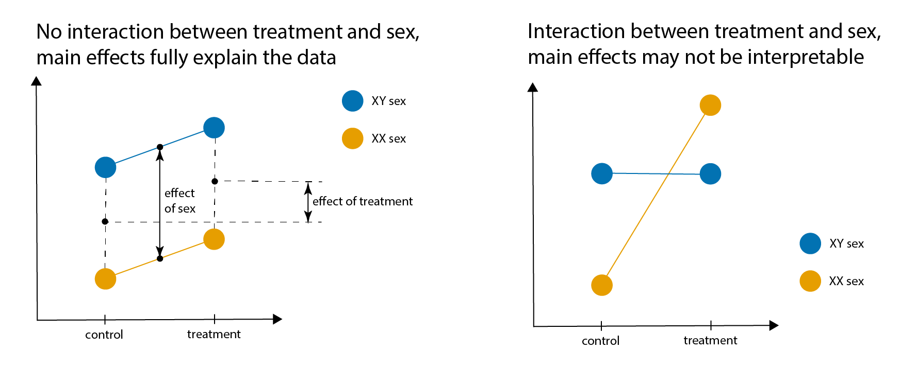

```{r setup, include=FALSE}
knitr::opts_chunk$set(echo = TRUE)
library(ggplot2)
library(car)
library(interactions)
```

## Primer on interactions



## Primer on model formulae in R

Let Y be the dependent (response) variable, and A and B two independent (predictor) variables.

Notation           | Meaning
-------------------|--------------------------------------------------------------
Y ~ 1              | Y is not being predicted by any independent variables.
Y ~ A              | Y is being predicted by A.
Y ~ A + B          | Y is being predicted by A and B independently of each other.
Y ~ A : B          | Y is being predicted by an interaction between A and B.
Y ~ A * B          | The same as Y ~ A + B + A:B.

*Note: this is not an extensive list of notations, please refer [to the R manual](https://stat.ethz.ch/R-manual/R-devel/library/stats/html/formula.html) for additional details.*

## Types of ANOVA

You may remember that in application to a single categorical variable, ANOVA is all about comparing between-group variance to within-group variance. When it comes to multiple variables, things get a little tricky. In such situations, we use ANOVA to compare between-model variance to within-model variance, where models are linear regression models with different sets of independent variables included in them. There are always two models in a comparison. The first one is simpler, i.e. it includes fewer variables or interactions. It is also referred to as reduced model. The second one includes an extra variable or interaction and it is called full model. There are several strategies to formulate these models, which is why we distinguish between **three types** of multivariate ANOVA.

<br>

#### How type I ANOVA [`anova()`] processes Y ~ A*B:

Step | Reduced (simpler) mode | Full (more complex) model | Relevant output
-----|------------------------|---------------------------|----------------
1    | Y ~ 1                  | Y ~ 1 + **A**             | Pr(>F) for A
2    | Y ~ 1 + A              | Y ~ 1 + A + **B**         | Pr(>F) for B
3    | Y ~ 1 + A + B          | Y ~ 1 + A + B + **A:B**   | Pr(>F) for A:B

*Note: type I ANOVA does not compare Y ~ 1 with Y ~ 1 + B. In other words, it does not estimate the main effect of B. So, the order in which you specify independent variables matters, and Y ~ A\*B and Y ~ B\*A may produce different results.* ***In most cases, you do not want to make any assumptions about the relative importance of your variables and you should not use type I ANOVA.***

<br>

#### How type II ANOVA [`car::Anova(...,type="II")`] processes Y ~ A*B:

Step | Reduced (simpler) mode | Full (more complex) model | Relevant output
-----|------------------------|---------------------------|----------------
1    | Y ~ 1 + B              | Y ~ 1 + **A** + B         | Pr(>F) for A
2    | Y ~ 1 + A              | Y ~ 1 + A + **B**         | Pr(>F) for B
3    | Y ~ 1 + A + B          | Y ~ 1 + A + B + **A:B**   | Pr(>F) for A:B

*Note: no interaction is assumed in the first two comparisons. If there is significant interaction, the results may be misleading. But* ***as long as there is no significant interaction, type II ANOVA is usually the most appropriate and powerful type of ANOVA.***

<br>

#### How type III ANOVA [`car::Anova(...,type="III")` and `summary.lm()`] processes Y ~ A*B:

Step | Reduced (simpler) mode | Full (more complex) model | Relevant output
-----|------------------------|---------------------------|----------------
1    | Y ~ 1 + B + A:B        | Y ~ 1 + **A** + B + A:B   | Pr(>F) for A
2    | Y ~ 1 + A + A:B        | Y ~ 1 + A + **B** + A:B   | Pr(>F) for B
3    | Y ~ 1 + A + B          | Y ~ 1 + A + B + **A:B**   | Pr(>F) for A:B

*Note: If there is no significant interaction, type III is less powerful than type II.* ***If there is significant interaction, type III ANOVA is usually the most appropriate and powerful type of ANOVA.***

## The elephants data set

We will work with the [data set](https://www.kaggle.com/mostafaelseidy/elephantsmf) where [researchers](https://doi.org/10.1098/rsbl.2013.0011) measured the height of male and female African elephants of different ages from birth to adulthood.

First, load and plot the data.

```{r}
# load the data
elephants <- read.csv('Data_Elephants.csv')

# look at the data
str(elephants)
head(elephants)

# plot Height as the function of Age, and color the two sexes separately
ggplot(data = elephants,
       mapping = aes(x = Age,
                     y = Height,
                     color = Sex)) +
  geom_point() +
  scale_color_manual(values = c("darkgreen", "cornflowerblue"))
```

The relationship is obviously not linear. Try transforming one or both variables to make the relationship (sort of) linear.

```{r}
# add a new column that contains the square root of Age
elephants$sqrt_Age <- sqrt(elephants$Age)

# plot the data
ggplot(data = elephants,
       mapping = aes(x = sqrt_Age,
                     y = Height,
                     color = Sex)) +
  geom_point() +
  scale_color_manual(values = c("darkgreen", "cornflowerblue"))
```

## Effect of age and sex on height in young elephants

First, let us subset young elephants, defined as 11 years old or younger. Let us examine the combined effect of age and sex on the body height in this age cohort.

```{r}
# subset individuals that are <=11 years old
indices_of_young_individuals <- elephants$Age <= 11
elephants_young <- elephants[indices_of_young_individuals,]

# plot the data
ggplot(data = elephants_young,
       mapping = aes(x = sqrt_Age,
                     y = Height,
                     color = Sex)) +
  geom_point() +
  scale_color_manual(values = c("darkgreen", "cornflowerblue"))

# perform type I ANOVA with Age first and Sex second
anova(lm(formula = Height ~ sqrt_Age * Sex,
         data = elephants_young))

# perform type I ANOVA with Sex first and Age second - note the different p-values!
anova(lm(formula = Height ~ Sex * sqrt_Age,
         data = elephants_young))

# perform type II ANOVA with Age first and Sex second
Anova(lm(formula = Height ~ sqrt_Age * Sex,
         data = elephants_young),
      type = "II")

# perform type II ANOVA with Sex first and Age second - note that the result is the same as above
Anova(lm(formula = Height ~ Sex * sqrt_Age,
         data = elephants_young),
      type = "II")

# perform type III ANOVA with Age first and Sex second - note the higher p-value for Sex than with type II
Anova(lm(formula = Height ~ sqrt_Age * Sex,
         data = elephants_young),
      type = "III")

# again, the order does not matter
Anova(lm(formula = Height ~ Sex * sqrt_Age,
         data = elephants_young),
      type = "III")

# running summary() produces p-values equivalent to type III ANOVA, but it uses t-statistics
summary(lm(formula = Height ~ sqrt_Age * Sex,
         data = elephants_young))

# again, the order does not matter
summary(lm(formula = Height ~ Sex * sqrt_Age,
         data = elephants_young))
```

Summary: the order of factors matters for type I ANOVA - only use type I if you have a **really** good reason to do so (it is also fine if you are testing an interaction between two categorical variables with a fully balanced experimental design). In this case, there is no significant interaction between age and sex, so applying type II ANOVA provided a more sensitive test for the effect of sex than type III.

## Effect of age and sex on height in more mature elephants

Now, let us subset more mature elephants, defined as 12.5 years old or older Let us examine the combined effect of age and sex on the body height in this age cohort.

```{r}
# subset individuals that are >=12.5 years old
indices_of_mature_individuals <- elephants$Age >= 12.5
elephants_mature <- elephants[indices_of_mature_individuals,]

# plot the data
ggplot(data = elephants_mature,
       mapping = aes(x = sqrt_Age,
                     y = Height,
                     color = Sex)) +
  geom_point() +
  scale_color_manual(values = c("darkgreen", "cornflowerblue"))

# perform type I ANOVA with Age first and Sex second
anova(lm(formula = Height ~ sqrt_Age * Sex,
         data = elephants_mature))

# perform type I ANOVA with Sex first and Age second - note the different p-values!
anova(lm(formula = Height ~ Sex * sqrt_Age,
         data = elephants_mature))

# perform type II ANOVA with Age first and Sex second
Anova(lm(formula = Height ~ sqrt_Age * Sex,
         data = elephants_mature),
      type = "II")

# perform type II ANOVA with Sex first and Age second - note that the result is the same as above
Anova(lm(formula = Height ~ Sex * sqrt_Age,
         data = elephants_mature),
      type = "II")

# perform type III ANOVA with Age first and Sex second - note the higher p-value for Sex than with type II
Anova(lm(formula = Height ~ sqrt_Age * Sex,
         data = elephants_mature),
      type = "III")

# again, the order does not matter
Anova(lm(formula = Height ~ Sex * sqrt_Age,
         data = elephants_mature),
      type = "III")

# running summary() produces p-values equivalent to type III ANOVA, but it uses t-statistics
summary(lm(formula = Height ~ sqrt_Age * Sex,
         data = elephants_mature))

# again, the order does not matter
summary(lm(formula = Height ~ Sex * sqrt_Age,
         data = elephants_mature))
```

Summary: the order of factors matters for type I ANOVA - only use type I if you have a **really** good reason to do so (it is also fine if you are testing an interaction between two categorical variables with a fully balanced experimental design). In this case, there is a significant interaction between age and sex, so applying type III ANOVA provides a more appropriate test of main effects than type II.

### Plotting interactions

Library `interactions` provides a handy function `interact_plot()` to plot regression lines that take into account interactions. Importantly, it returns a `ggplot` object, which you can tweak to suit your aesthetic and scientific needs!

```{r}
# specify the linear regression models
elephants_young_model <- lm(formula = Height ~ sqrt_Age * Sex,
                            data = elephants_young)

elephants_mature_model <- lm(formula = Height ~ sqrt_Age * Sex,
                             data = elephants_mature)

# plot
interact_plot(elephants_young_model,
              pred = sqrt_Age,
              modx = Sex,
              plot.points = TRUE)

interact_plot(elephants_mature_model,
              pred = sqrt_Age,
              modx = Sex,
              plot.points = TRUE)

# this is a ggplot object, so you can modify it using the syntax you already know
interact_plot(elephants_mature_model,
              pred = sqrt_Age,
              modx = Sex,
              plot.points = TRUE) +
  scale_color_manual(values = c("darkgreen", "cornflowerblue")) +
  theme_grey()
```

