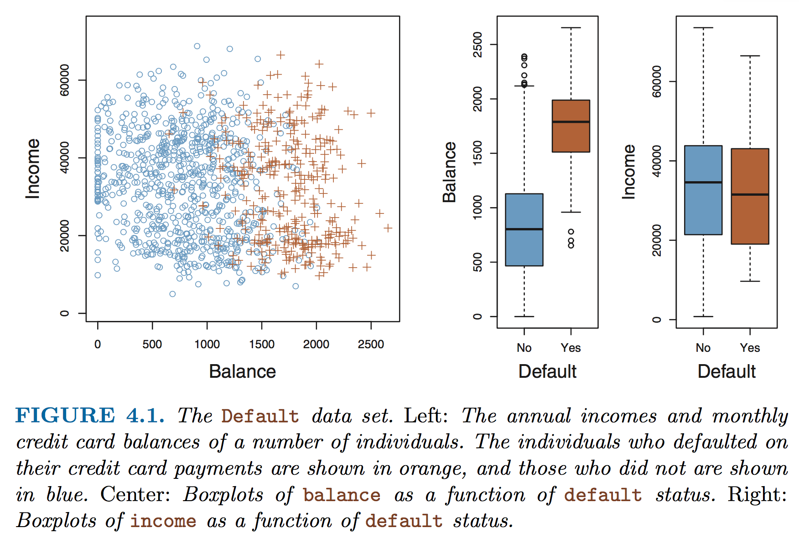
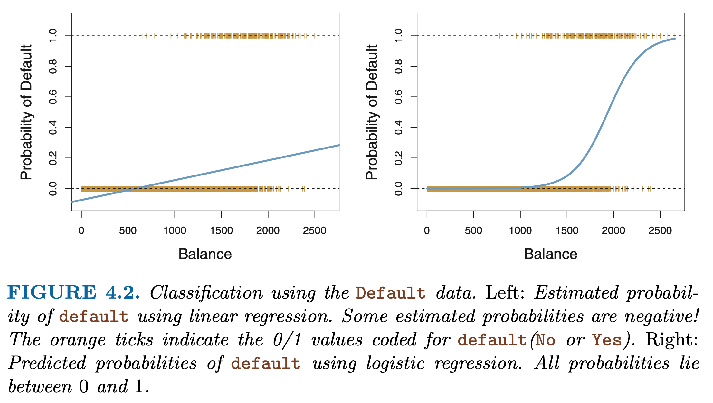
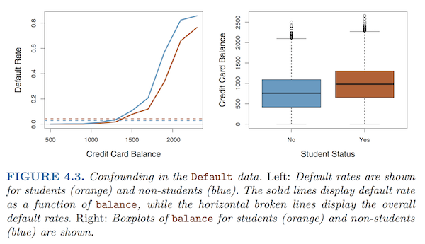
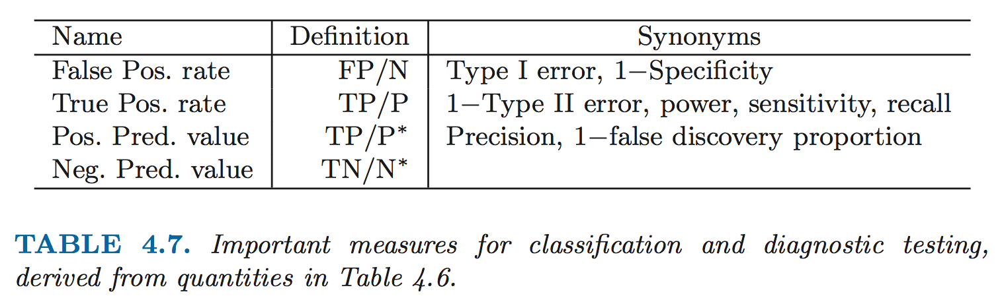
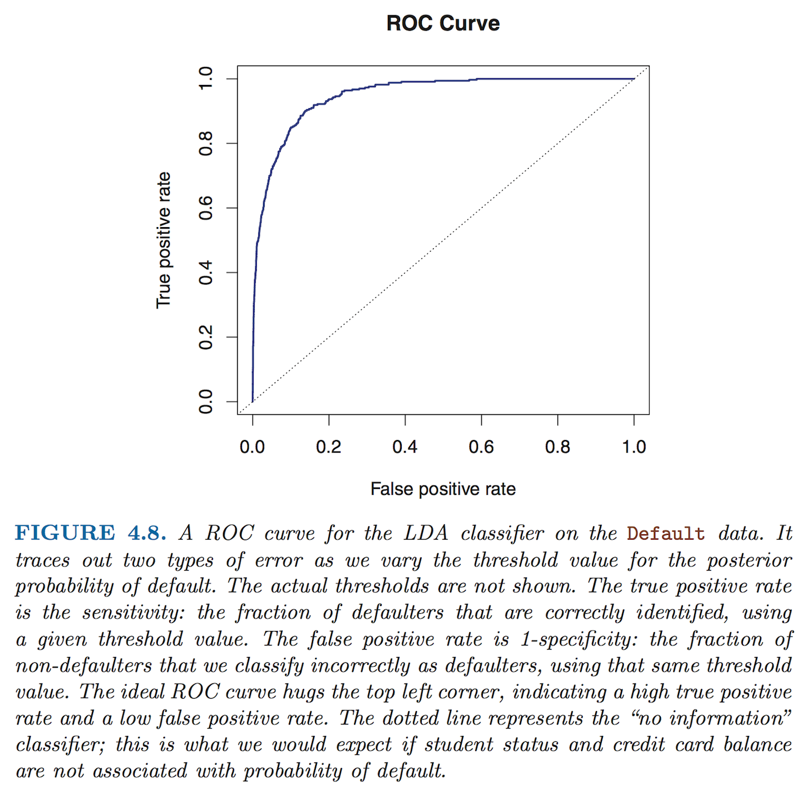

```{r setup, include=FALSE}
knitr::opts_chunk$set(echo = TRUE)
library(dplyr)
```

## Background Reading

+ [Introduction to Statistical Learning, Chapter 4: Classification](ISL_Ch4_LogisticRegression.pdf), through section 4.3.

## Predicting qualitative responses 

So far we have learned about ANOVA and linear models, which we can use to predict ***quantitative*** outcomes using **categorical and quantitative explanatory variables**. Sometimes instead we wish to model ***qualitative outcomes*** using **quantitative predictors**. Examples could be:

+ Probability of credit card default based on income, balance, other factors
+ Probability that a patient has a disease given a particular set of symptoms
+ Disease prognosis given miRNA expression data (e.g. malignant or benign cancer)

These kinds of questions are **classification** problems, where we wish to predict the probability that $Y$ belongs to a particular category given some data.

In cases like these, when we want to **predict simple binary outcomes** (or multiple categorical outcomes), simple linear models are not appropriate. ***Why is this?***

### Example: Defaulting on credit card debt

Consider the following `Default` dataset from *Introduction to Statistical Learning*, which contains credit card data for 10,000 individuals, including their incomes, balances, and student status. 

Our question is: ***What is the overall probability of defaulting on credit card debt, given this dataset?***

**Figure 4.1** shows who defaulted on their debt (orange) vs. who didn't (blue), based on data for their Income and Balance.

{width=80%}

From these graphs we can quickly see that, overall, having a high balance is strongly associated with defaulting on credit card debt, whereas income doesn't seem to be correlated at all. 

Let's take a look at this dataset:

```{r}
#install.packages("ISLR")
library(ISLR)
head(Default)
summary(Default)
str(Default)
print(paste("Average default rate = ",sum(Default$default == "Yes")/nrow(Default)))
```


#### Linear model
A linear model would produce something like this:

$$ \begin{aligned}
Y &= \beta_o + \sum_{i=1}^{n}\beta_iX_i + \epsilon \\
&= \beta_o + \beta_1*income + \beta_2*balance + \epsilon 
\end{aligned} $$

The model may even contain some interaction terms if any of these variables are not independent from each other. 

Say we to ask, ***"Does the chance of a credit card default depend on credit card balance? What is the probability of default given a particular balance?"*** 

To use a linear model we could code the binary outcome with *dummy variables* as either **0 (no default)** or **1 (default)** and model a linear response. In R, we could write this as follows:

```{r}
# linear model for default as a function of income and balance
lm.default = lm(default ~ income + balance, data = Default)
```

Oops! What went wrong? Let's try again:

```{r}
# linear model for default as a function of income and balance
lm.default = lm(as.numeric(default) ~ income + balance, data = Default)
summary(lm.default)
```

But there's still a problem here. **What is it?** 

Let's look at the regression line for a linear model (**Fig. 4.2, left**).

{width=80%}

The plot shows that linear regression will produce some estimates that fall outside of the range $[0,1]$, which doesn't make sense if we are trying to predict the **probability** of a particular binary outcome.

Instead, we want a model that reliably outputs values between zero and one, as a function of the explanatory variables. 

**Logistic regression** provides a natural way for us to do this (**Fig. 4.2, right**). Now we predict a probability close to $0$ for a low balance and close to $1$ for a high balance. The function produces an **S-shaped** curve, and gives the same average probability of default ($0.033$) as the linear model.


## Logistic function

Logistic regression uses the **logistic function** to model the probability of a particular outcome $Y$, given the data $X$ -- for example, the probability of default given a particular credit card balance. If we write this as $Pr(Y=1|X)$ and use $p(X)$ as a short-hand, then the logistic function, *LOGIS(1,0)*, is:

$$ p(X) = Pr(Y=1|X) = \frac{e^{\beta_o + \beta_1X}}{1 + e^{\beta_o + \beta_1X}} = \frac{1}{1 + e^{-(\beta_o + \beta_1X)}}$$
It can be seen that this equation ranges from 0 to 1, as desired. The probability is very close to 1 when the exponent $(\beta_o + \beta_1X)$ is really big, and is close to 0 when it is very small, since one of the terms becomes negligible in either case.

The logistic function is rather complicated to compute, since it is not linear, so it would be great if we can transform this expression into something a little easier to handle. Enter our old friend, **Odds**!

### Odds

Rearranging the terms above gives the **odds** for $p(X)$:

$$ Odds = \frac{p(X)}{1-p(X)} = \frac{\#\ of\ successes}{\#\ of\ failures}= e^{\beta_o + \beta_1X}$$ 

What is the range of the **Odds** function?

When the probability is really small, the Odds are close to 0, whereas when the probability is really high (close to 1), we can see that the Odds will balloon to a very large number. So the Odds can can take on any value between $0$ and $\infty$. 

Odds are commonly used in betting games such as horse racing, where people are interested in the odds of their favorite horse winning (the numerator) vs. losing (the denominator). The *odds of success* are 1 (1 to 1, i.e. 1:1) when $p = 1/2$, meaning that the horse is expected to win one out of every two races. When $p=0.9$, the odds are 9 (9 to 1, or 9:1). For the bank default dataset, Odds = 9 would mean that 9 out of 10 people with a particular balance will default.

Thought question for the bank default example: **What does $p = 0.2$ mean? What are the odds?**


### Log-odds, a.k.a. logit function

With the expression above, we now have something that can easily be transformed into a linear function by taking the log of both sides. This is called the **log-odds** or **logit** function:

$$ Log\ odds = logit(p(X)) = log\bigg( \frac{p(X)}{1 - p(X)} \bigg) = log(p(X)) - log(1 - p(X)) = \beta_o + \beta_1X $$

So now we have transformed a **non-linear** function of $X$ into a **linear** relationship, which greatly simplifies the math required to solve for $p(X)$.

***Note:***

+ In contrast with the linear model, where the coefficient $\beta_1$ gives the change in $Y$ per unit change in $X$, for the logistic model $\beta_1$ gives the *change in the log-odds* for each increment of $X$. Note that is the same as multiplying the odds by $e^{\beta_1}$. 
+ It is important to remember that the change in $p(X)$ itself is **not** linear in $X$; that is, *the rate of change in $p(X)$ will depend on the current value of $X$*. The function is still **monotonic**, meaning that an increase in $X$ will always be reflected by an increase in $p(X)$.

What is the range of the **logit** function?

Since $0 \le p(X) \le 1$, the range is $(-\infty, \infty)$, exclusive (because log(0) is undefined, and 1/0 is also undefined).


## Estimating coefficients

### Maximum likelihood

To estimate the coefficients $\beta_o$ and $\beta_1$, which are unknown, instead of using the method of least squares, a more general method called **maximum likelihood (ML)** is used. In fact, it turns out that the least squares approach used in linear regression is a special case of ML.

The intuition behind ML is that it seeks to find coefficients for the logistic function such that the predicted outcome for each individual, $\hat{p}(x_i)$, most closely matches the observed data. For the credit card default example, this means that the predicted probability of default should be close to 1 for all of the individuals who did default, and it should be close to 0 for all of those who did not.  

Mathematically, we do this by finding the coefficients that maximize the **likelihood function**:

$$ \ell(\beta_o,\beta_1) = \prod_{i:y_i=1}p(x_i) \prod_{i':y_{i'}=0}(1-p(x_{i'}))$$

We want the first term to be big when the actual outcomes are 1 ($y_i=1 | x_i$), and at the same time we want the second term to be big when they are 0 ($y_i=0 | x_i$). Coefficients that maximize this likelihood will provide the best estimates for the model.

Notice that taking the log of the likelihood function will give a linear function in $p(x)$, called the joint **log (conditional) likelihood**:

$$LCL = \log[\ell(\beta_o,\beta_1)] = \sum_{i:y_i=1}{\log p(x_i)} + \sum_{i':y_{i'}=o}{\log (1-p(x_{i'}))}$$
This has the same form as the log-odds above, and is in fact the form that is used to solve for the coefficients $\beta_o$ and $\beta_1$. Maximizing this value for each $x_i$ will give the optimal values for the coefficients in the equation for the logit function.


### Solving for predicted values of $Y$ 

Once the coefficients $\beta_o$ and $\beta_1$ have been found, they can be used to solve for the predicted probability $\hat{Y} = \hat{p}(X)$ of an outcome of interest (here, credit card default) for any value of $X$ by plugging them back into the equation above for $p(X)$:

$$\hat{Y} = \frac{e^{log-odds(\hat{Y})}}{1 + e^{log-odds(\hat{Y})}} = \frac{e^{\hat{\beta_o} + \hat{\beta_1}X}}{1 + e^{\hat{\beta_o} + \hat{\beta_1}X}}$$

This gets us back to a range of 0 to 1 for the predicted probability $p(X) = Pr[Y=1 | X]$.


### Example: Credit card default

Going back to our "Default" dataset, we can see that the probability of default given a balance of \$1,000 is 0.6%, whereas for a balance of \$2,000 the probability is 59% (see **Fig. 4.2**).

We can create a **logistic model** for these data in R using the `glm()` function, which stands for **general linear model**. 

+ The main difference between `glm` and `lm` is that you also need to specify a **link** function.
+ For logistic regression, which has binary outcomes, we use the "binomial" family of functions. 

We can test different models using Income, Balance, or both:

```{r}
# income on its own
summary(glm(default ~ income, data = Default, family = "binomial"))

# balance on its own
summary(glm(default ~ balance, data = Default, family = "binomial"))

# both income and balance
summary(glm(default ~ income + balance, data = Default, family = "binomial"))
```


The models provide a **$z$-statistic**, which is analagous to a $t$-statistic for linear regression. How do these different predictors perform based on the $z$-statistic?


## Using binary predictors

It is also possible to use logistic regression to model a binary response to qualitative (categorical) predictors. For example, if we want to find the probability of default given the status of "student", we can code the status using a dummy variable (1 = student; 0 = non-student) and model the probability of default using logistic regression. 

Let's try this out for the **student** variable. First, what is the default rate for students vs. non-students?

```{r}
# default rate for students
sum(Default$student == "Yes" & Default$default == "Yes" ) / sum(Default$student == "Yes")
sum(Default$student == "No" & Default$default == "Yes" ) / sum(Default$student == "No")
```

OK, so we see that students have a slightly higher default rate overall than non-students, but it's still pretty low.

Now let's see if student status is significantly correlated with defaulting on credit card debt:

```{r}
# model default using student
summary(glm(default ~ as.numeric(student), data = Default, family = "binomial"))

# what if we just use the original data frame with Yes / No?
summary(glm(default ~ student, data = Default, family = "binomial"))

# recode student status as 0/1
head(Default)
my.default = Default
my.default = my.default %>% mutate(student = recode(student, "Yes" = 1, "No" = 0))
head(my.default)

# model default using recoded student as 0/1
summary(glm(default ~ student, data = my.default, family = "binomial"))
```

Based on this model, we see that the $z$-score = 3.52 and $p$-value = 0.0004 (also shown in ISL Table 4.2). Is *student* status significantly associated with "default = Yes"?

Yes it is! And, the **coefficient is positive**, indicating that *students generally have a higher rate of credit card default than do non-students* (though as we found above, the overall rate is still low, around 4.3% vs. 2.9% for non-students).

*Note: Extending the model to qualitative predictors with more than two states is problematic for **categorical** data, which have no intrinsic quantitative relationship. If **ordinal** data can be represented using constant intervals, these can be used as pseudo-quantitative variables.*


## Multiple logistic regression

Just like wtih linear regression, logistic regression can be extended to model a binary outcome using any number of predictors $X = (X_1, X_2, ... X_p)$:

$$ log\bigg( \frac{p(X)}{1 - p(X)} \bigg) = \beta_o + \beta_1X + ... + \beta_pX_p$$
The coefficients for the model are estimated using maximum likelihood, as above.


### Example: Credit card default

Let's use multiple regression to model the contributions of all the variables in the Default dataset at the same time:

```{r}
summary(glm(default ~ income + balance + student, data = Default, family = "binomial"))
```

Now what do we see in comparison to the previous models?

Clearly, "balance" and "student" are both significant predictors for "default": $p(balance) = < 2e-16$ and $p(student) = 0.0062$ (ISL Table 4.3).


### Confounding

However, looking at these results we also notice that a strange thing has happened: instead of the coefficient for student being positive, it is now negative! **How can this be?** 

As it turns out, "balance" and "student" are ***correlated*** (**Fig. 4.3**, right panel). 

{width=80%}

In the left-hand panel, we see that students have a higher overall rate of default (dashed lines) -- hence the positive $z$-score in the simple regression model. However, ***for the same amount of debt***, students are **less likely** to default than non-students (solid lines) -- hence the negative $z$-statistic in the multiple regression model. 

Thus, students tend to have higher debt overall, which is associated with higher default rates, but for any given level of debt, they are less likely to default than their non-student peers. 

### Interactions

Is there an ***interaction*** between balance and student? In other words, does balance have a big effect on whether students default or not? Let's see:

```{r}
summary(glm(default ~ income + balance*student, data = Default, family = "binomial"))
```

Now the student factor doesn't look that significant, but we also see that there is no significant interaction between student and balance, so we should use the simpler model that does not include the interaction term.


### Prediction

***What do we predict as the default rate for people with $40k income and different rates of debt, given student status?***

```{r}
# full model
glm.default = glm(default ~ income + balance + student, data = Default, family = "binomial")
summary(glm.default)

# shortcut for "use all predictors"
# glm.default = glm(default ~  , data = Default, family = "binomial")
# summary(glm.default)

# make new predictions for income = $40k
new.data = data.frame(student = c("Yes", "Yes", "Yes", "No", "No", "No"),
                      income = c(rep(40000,6)),
                      balance = c(1000, 1500, 2000, 1000, 1500, 2000),
                      stringsAsFactors = TRUE)

# estimated default rate (% predicted to default)
glm.predict = predict(glm.default, newdata = new.data, type = "response")
round(glm.predict*100,2)
```

From this we can see that for a debt of \$1500 (and income being equal), we would predict that non-students will default at a rate of around 10.5%, whereas students would default only around 5.8% of the time. Go students! ;-)

Since income doesn't seem to be a big contributing factor, we could also do the analysis without just the other two terms alone:

```{r}
# ignore income for now -- not that useful
glm.default2 = glm(default ~ balance + student, data = Default, family = "binomial")

# make new predictions for default given student status and balance
# new.data = data.frame(student = c("Yes", "Yes", "Yes", "No", "No", "No"),
#                       balance = c(1000, 1500, 2000, 1000, 1500, 2000),
#                       stringsAsFactors = TRUE)

# estimated default rate (% predicted to default)
glm.predict2 = predict(glm.default2, newdata = new.data, type = "response")
round(glm.predict2*100,2)
```

The results are very similar.


## Generalized linear models

GLMs provide a framework for formulating a variety of linear and non-linear relationships between response variables $Y$ and predictors $X$. Both linear models and logistic models may be considered special cases of GLMs.

+ Linear models are appropriate for continuous or interval data when there is a linear relationship variables.
+ GLMs can incorporate categorical data as both predictors (like ANOVA) and response variables.
+ GLMs can accommodate *bounded* response variables, which linear models cannot.

Linear models make two assumptions that GLMs do not: a *linear association* between $X$ and $Y$, and *normal* error distributions. GLMs handle cases where these assumptions do not apply. The two components of GLMs that distinguish them from simpler linear models are:

+ A **link function** that transforms the response variable to allow expression of the mean function in linear terms of the predictors.
+ A user-defined **error distribution** that provides ML optimization criteria and allows inferences about model parameters.


### GLM Families

Does the likelihood function above look familiar? Remember the **binomial distribution**? Logistic regression belongs to a family of **binomial** GLMs where the outcomes are dichotomous (i.e. binomial). Logistic regression has a *binomial response distribution* provided by the *logit function*, $p=log[p/(1-p)]$. 

In R, **logistic regression is performed using the `glm` function**, specifying `family=binomial("logit")`, or simply `family="binomial"` (which defaults to the logit function).

GLMs allow a variety of error term distributions to be specified. The three most common are *normal*, *binomial*, and *Poisson*. Poisson GLMs are often applied when the response variable is count data. The Poisson link function is $log \lambda$, where $\lambda$ is the Poisson mean. Common family specifications are:

+ Binomial: `family=binomial(link="logit")`
+ Poisson: `family=poisson(link="log")`
+ Linear: `family=Gaussian(link="identity")` -- However, these are handled more efficiently by `lm`, which is preferred for linear models.


## Confusion Matrix

"**Success**" in prediction is typically referred to as a "**positive**" outcome, and vice versa. There is always a trade-off between 

+ **True positive rate (sensitivity)** and 
+ **False-positive rate (1-specificity)**.

**Sensitivity** is same as **power**, or the proportion of predicted positives that are actually  positive, $TPR = TP/P = 1 - FN/P = 1 - Type\ II\ error$. In other words, the ability to detect a positive when one exists.

**Specificity** gives a measure of how **selective** the process is, i.e. the ability to identify a negative when there actually is one. It the same as the **True Negative Rate**: $Specificity = TNR = \frac{TN}{N}$ (and hence, $FPR = 1 - Specificity = 1 - TPR$, since $TN + FP = N$). 

The different combinations of possible outcomes can get confusing. **Table 4.7** from *ISLR* lists various synonyms you will see for terms related to classification. 

<div align="center">
{width=80%}
</div>

Another common relationship you will hear about is the tradeoff between **precision** and **recall**. Precision represents the proportion of true positives among **predicted** positives, whereas recall is the actual proportion of true positives that exist. Other useful measures include **Accuracy**, defined as $\frac{TP + TN}{P + N} = \frac{TP + TN}{(TP + FP) + (TN + FN)}$. 

An expanded set of common terms is summarized in the colorful **confusion matrix** below[^1]. We will talk more about the *False Discovery Rate (FDR)* when we get to multiple hypothesis testing.


## ROC and AUC

A diagram called the **Receiver Operating Characteristic (ROC)** curve can be used to assess the efficacy of a GLM (**Figure 4.8**). The ROC plots the **True positive rate (sensitivity)** vs. **False-positive rate (1-specificity)** for all possible values. 

The **AUC**, or area under the curve, will be a diagonal on this plot if the classification is no better than random. A model where the explanatory variables are very good at predicting outcomes will push the curve toward the top left-hand corner.

```{r fig.width=4,fig.height=4, fig.align='center'}
#install.packages{"AUC"}
library(AUC)

# predict the data using the model
pred.default = predict(glm.default, newdata = Default, type="response")

# make the ROC model
roc.default = roc(pred.default, Default$default)

#plot ROC
plot(roc.default)

# what is the area under the curve?
auc(roc.default)


# compare with reduced model
pred.default2 = predict(glm.default2, newdata = Default, type="response")
roc.default2 = roc(pred.default2, Default$default)
plot(roc.default2)
auc(roc.default2)
```


There are additional tests to evaluate and compare models that we will use in the exercise and homework.

## Linear Discriminant Analysis

We can also make predictions for the Default example using another method called **Linear Discriminant Analysis**.

<div align="center">
{width=70%}
</div>

In contrast to logistic regression, which models $Pr(Y=k|X=x)$ directly, LDA first models the distribution of predictors $X$ in each response class $Y$, and then flips these around using Bayes' theorem to obtain estimates for $Pr(Y=k|X=x)$.

LDA is a better choice than logistic regression under some conditions. However, LDA assumes that independent variables are normally distributed, whereas logistic regression does not. It is similar to **Principal Components Analysis**, which we will discuss later. 


### What if I have more than two response classes?

Logistic regression may be extended to multiple classes, but other methods like LDA are preferred for multiple-class classification. LDA has better statistical properties (more stable estimators) when classes are well separated, or if $n$ is small and the distribution of predictors is approximately normal in each class.


## In-class Exercise

We will see how all these concepts fit together using a variety of factors to predict the probability of surviving breast cancer.

<!-- footnote -->
[^1]: [Wikipedia](https://en.wikipedia.org/wiki/Precision_and_recall) 

