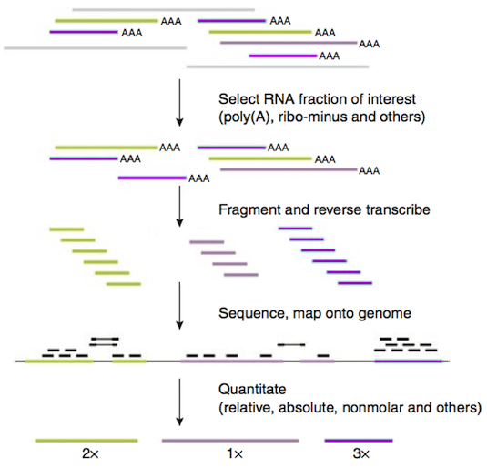

```{r setup, include=FALSE}
knitr::opts_chunk$set(echo = TRUE)
```

# RNA-seq workflow

RNA-seq has become the standard method for measure gene expression. Figure 1 gives an overview of the **bulk** RNA-seq pipeline. **Single-cell** pipelines look similar except that the cDNA synthesis step is designed for each cell to incorporate a different set of sequence barcodes.



To measure the expression of each gene, examining the raw number of reads that map to it (raw counts) may be insufficient. We need to take into account several factors, such as:

+ **Length of each mRNA** -- longer cDNAs will have more reads for the same level of expression as shorter cDNAs.
+ **Amount of data from each library or cell** -- libraries or cells that differ in the total number of reads will show a different number of reads for the same gene, even if the gene is expressed at the same level.

The importance of these factors depends on the application. For example, when we want to compare *relative* gene expression between genes *within a sample or cell*, we don't care so much about the library size, but we do need to account for the differing lengths of mRNAs. On the other hand, when we want to compare gene expression *between samples or cells*, we care more about the size of the libraries (total number of reads).

We can account for these considerations by *normalizing* the data. Different methods of normalization are introduced below.


# Basic normalization techniques


### Bulk RNA-seq: CPM, RPKM, FPKM, TPM

Bulk RNA-seq analysis has a relatively long history, so the community had time to develop and extensively test several normalization techniques that are now considered "classical".

Name     |Meaning                                                 |Calculation                                            
---------|--------------------------------------------------------|----------------------------------------
**CPM**  |**C**ounts **P**er **M**illion reads                    |(10^6^ * gene reads) / total reads                            
**RPKM** |**R**eads **P**er **K**ilobase per **M**illion reads    |(10^9^ * gene reads) / (total reads * gene length)             
**FPKM** |**F**ragments **P**er **K**ilobase per **M**illion reads|(10^9^ * gene read pairs) / (total read pairs * gene length)
**TPM**  |**T**ranscripts **P**er **M**illion reads               |(10^6^ * gene **R\|FPK**) / total **R\|FPK**                  

As CPM does not normalize by gene length, its practical application is limited. As for RPKM and FPKM, they used to be popular in older literature. These two methods are essentially the same - RPKM is used for single-end-sequenced libraries and FPKM is used for paired-end-sequenced libraries (read pair = "fragment"). TPM and R|FPKM give similar results, but TPMs in different samples summed across all genes add up to the same value. Thus, interpretation is more straightforward for TPM, as it is simply a proportion of normalized reads in the sample that map to a certain gene. For this reason, recent literature tends to use TPM more.

**Assumptions and caveats:**

* CPM and R|FPKM assume that the *total number of nucleotides* expressed is constant.
* TPM assumes that the *total molar quantity of transcripts* is constant.

While the above assumptions are reasonable for comparing replicates or highly similar samples, they may not hold across samples. For example, in yeast it has been shown -- perhaps not surprisingly -- that the total amount of RNA in a cell changes based on environmental conditions and growth state.

In addition, these measures can only indicate *relative* differences in expression. If the difference between two sets of genes increases, it's not easy to tell if one set went up or the other went down, based on these measures alone. This often referred to as the *real estate* problem. 


### Single-cell RNA-seq: CPM, TPM, downsampling

Single-cell technologies are much newer and the analysis practices are much less established. In fact, most techniques are inspired by bulk RNA-seq approaches with occasional modifications introduced to account for higher variability and sparsity of the data.

The market is currently dominated by technologies that rely on 3' end-enrichment (e.g. Chromium
Next GEM Single Cell 3ʹ Kit by 10X), where a small region located several hundred base pairs away from the polyA tail of each transcript is sequenced. The absolute majority of transcripts are longer than that, so the length of the transcript has little effect on its representation in the sequenced library. This allows to use the simplest normalization technique possible -- **CP10K** (**C**ounts **P**er **10 thousand** reads). This is exactly the same as **CPM** (see above), only a different coefficient is used for convenience (single-cell data are shallower sequenced than bulk data). Note that the terms CPM or CP10K are often not even used, and one needs to read the [description of the R functions used for normalization](https://satijalab.org/seurat/reference/normalizedata) to figure out how the data are actually normalized.

Another alternative is to downsample reads in all cells to the same total number of reads. Single-cell data are plagued with so-called "dropouts", i.e. absence of any reads mapping to a specific gene in a specific cell for technical, rather than biological, reasons. Downsampling can approximate this artifact, painting a more realistic representation of what gene expression profiles would look like at similar count depths.

Finally, there are some low-throughput single-cell methods that do involve sequencing the entire transcripts (e.g. SMART-Seq). In such cases, it is more appropriate to use normalization methods that take into account transcript length, e.g. **TPM**.


**Assumptions and caveats:**

* CPM and R|FPKM assume that the *total number of nucleotides* expressed is constant.
* TPM assumes that the *total molar quantity of transcripts* is constant.
* Downsampling discards data.

While the first two assumptions are reasonable for comparing cells of the same type in the same experimental condition, they may not hold otherwise. Cells of different types, different size and at different stages of the cell cycle may produce vastly different amount of RNA.

As for downsampling , it is limited to specific applications because data are often a limiting factor (deep sequencing of many cells is expensive), and discarding them may not be desired. 


# Normalization techniques tolerant of compositional differences

As mentioned above, different samples or cells rarely express exactly the same number of nucleotides or the same molar amount of transcripts. Consider the following example, where gene C is strongly activated in response to treatment, but the expression of other genes remains unchanged, even though the treated sample is sequenced much deeper.

```{r, echo=F}
my_data <- matrix(data = c(1, 100, 4, 50, 10, 1000, 40000, 500),
                  ncol = 2)
rownames(my_data) <- c("Gene A", "Gene B", "Gene C", "Gene D")
colnames(my_data) <- c("Control", "Treated")

my_data
```

Even if we assume that the transcript length is the same for genes A, B, C, D and only normalize by the total number of counts, the resulting counts will be heavily distorted.

```{r, echo=F}
my_data_depth_norm <- apply(X = my_data,
                            MARGIN = 2,
                            FUN = function(column) { column / sum(column) } )

round(my_data_depth_norm, 2)
```

Normalized counts for genes A, B, D are considerably lower in the treated sample, although they clearly should not be! This is because **the assumption that each sample or cell produces exactly the same number of nucleotides / molar amount of transcripts is violated**. The statistical term for this is that the transcriptomes of different samples or cells have **different composition**. As a result, we need a more sophisticated normalization strategy that is able to deal with this.


### Bulk RNA-seq: `DESeq2`, `edgeR`

`DESeq2` and `edgeR` are popular RNA-seq analyses packages in R. Each of them has a unique strategy to account for different composition of the data. Let us apply the `DESeq2` workflow to a toy data set similar to the one above (the only difference is that it has more noise for illustrative purposes). **It is not important for you to memorize the steps**, but going through them helps understand the logic.

Let us imagine that these are the original data:

```{r, echo=F}
my_data <- matrix(data = c(0, 100, 4, 50, 7, 1123, 40000, 517),
                  ncol = 2)
rownames(my_data) <- c("Gene A", "Gene B", "Gene C", "Gene D")
colnames(my_data) <- c("Control", "Treated")

my_data_original <- my_data

my_data
```

##### Step 1: log-transform all expression values

```{r, echo=F}
my_data <- log(my_data)
my_data
```

##### Step 2: average log-transformed expression values for each gene **across samples**

```{r, echo=F}
cbind(rowMeans(my_data))
```

##### Step 3: filter out genes with infinite values of average log expression from both matrices

```{r, echo=F}
my_data <- my_data[abs(rowMeans(my_data)) != Inf,]
my_data
cbind(rowMeans(my_data))
```

##### Step 4: subtract cross-sample log average from the log of each sample

```{r, echo=F}
my_data <- apply(X = my_data,
                 MARGIN = 2,
                 FUN = function(column) { column - rowMeans(my_data) } )
my_data
```

##### Step 5: calculate median resulting value for each sample **across genes**

```{r, echo=F}
my_data <- apply(X = my_data,
                 MARGIN = 2,
                 FUN = function(column) { median(column) } )
my_data
```

##### Step 6: exponentiate the medians above to convert them from "log numbers" to "normal numbers"

```{r, echo=F}
exp(my_data)
```

##### Step 7: divide the original read counts by the "scaling factors" from step 6 et voilà!

```{r, echo=F}
round(my_data_original / rbind(exp(my_data),
                               exp(my_data),
                               exp(my_data),
                               exp(my_data)),
      0)
```

##### Compare to the original:

```{r, echo=F}
my_data_original
```

Transformed data correctly reflect the difference in the expression level of gene C without distorting the expression values of genes A, B, and D. Once again, **it is not important for you to memorize the steps**. Instead, the take-home message is the following: `DESeq2` uses **logs** to smooth over outlier counts and eliminate genes that are not transcribed in all samples. Using **median** further downplays the role of genes with crazy high counts and emphasizes moderately expressed genes. `edgeR` uses a totally different strategy, but its main goal is also to normalize the entire samples by **relying on genes whose expression level is moderate and uniform across samples**.


### Single-cell RNA-seq: `sctransform`

We would only like to highlight one normalization method implemented in the package `sctransform`. It is commonly used together with a popular single-cell analysis package `Seurat`. Of course, there are more methods being developed, but `sctransform` performs remarkably well, and the logic behind it is very simple and elegant. The high number of cells (= samples) in single-cell sequencing data allows building a **counts ~ read depth regression** model for each gene (specifically, the method uses regularized negative binomial regression). Then, deviation-standardized **residuals are taken as normalized expression values**. Positive residuals for a given gene in a given cell indicate that more counts than expected are observed given the gene’s average expression in the population and cellular sequencing depth, while negative residuals indicate the opposite.


# Additional Reading

#### [Best practices for bulk RNA-seq analyses](https://pubmed.ncbi.nlm.nih.gov/26813401/)

#### [Best practices for single-cell RNA-seq analyses](https://pubmed.ncbi.nlm.nih.gov/31217225/)
