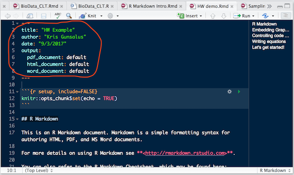
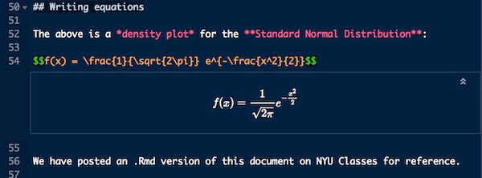
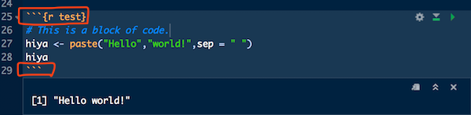
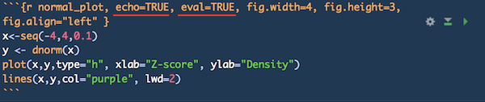
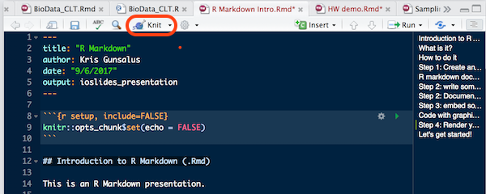

```{r setup, include=FALSE}
knitr::opts_chunk$set(echo = FALSE)
```

## Introduction to R Markdown (.Rmd)

This is an R Markdown presentation. 

Markdown is a simple formatting syntax for authoring HTML, PDF, and MS Word documents. 

For more details on using R Markdown see <http://rmarkdown.rstudio.com>.

## What is it?

Rmd is a convenient way to present your R scripts that allows you to:

- Embed R code
- Run R code chunks
- Display R graphics output
- Annotate and explain your code
- Display mathematical equations (LaTeX)

You will be handing in all of your homework as R markdown documents.

## How to do it

From within RStudio, you need to do four things:

1. Create an rmd document
2. Write some text
3. Write some code
4. Render the document

## Step 1: Create an .Rmd document

In the RStudio menu, select **File => New File => R Markdown ...**

- Give your document a title.
- Add your name.
- Add the date.
- Select **HTML** or **PDF** (you can change this later).

## R markdown document sections

**YAML header**

* "YAML ain't markup!"
* Encodes some metadata about the document
    
**Text**

* R markdown formatted text
* LaTeX-formatted text (mainly for equations)

**Embedded chunks of R code**

* Code blocks
* Code output (text or graphics)

## Step 2: Write something!

**YAML header**

* Always include a title, your name, and the date
* Output format: HTML and/or PDF
    

    
## Step 2: Document text

* Use R Markdown tags to format the document (it's simple!)
* Headers, paragraphs, lists, etc. each use special symbols
* Use hash tags for section headers (# for H1, ## for H2, etc.)
* Enclose text with \* for *italics* and \*\* for **bold**
* Use $ and escape char \\ for special symbols like Greek letters



## Step 3: Embed some R code

* Insert blocks of code using the RStudio menu: Insert => R
* Code blocks will be highlighted
* Code blocks always start with **\`\`\`\{r\}** and end with **\`\`\`** 
```{r test, echo = FALSE, eval = FALSE}
# This is a block of code
hiya <- paste("Hello","world!",sep = " ")
hiya
```


* Code blocks can be named.
* By default, both code chunks and output are rendered.
* Special directives can hide code blocks or skip running them.

## Step 3: Including graphics


```{r normal_plot, echo=FALSE, eval=TRUE, fig.width=6, fig.height=4 }
x<-seq(-4,4,0.1)
y <- dnorm(x)
plot(x,y,type="h", xlab="Z-score", ylab="Density")
lines(x,y,col="purple", lwd=2)
```

## Step 4: Render your document

Convert your document to **HTML** or **PDF** using the **Knit** button.
You can also render as a **Word** document.



When you click the **Knit** button a document will be generated that includes both content as well as the output of any embedded R code chunks within the document.

### **Let's get started!**
