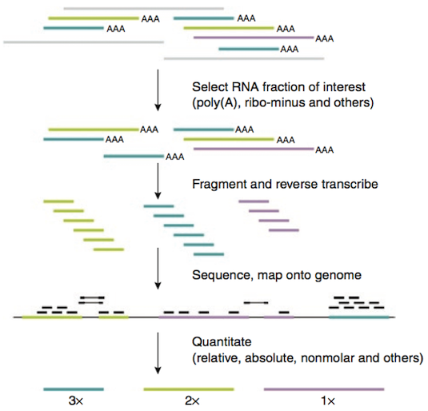

```{r setup, include=FALSE}
knitr::opts_chunk$set(echo = TRUE)
```

# Measuring gene expression by RNA-seq

## RNA-seq workflow

RNA-seq has become the standard method for measure gene expression. Figure 1 gives an overview of the RNA-seq pipeline.



A recent review on RNA-seq analysis may be found here:
https://www.ncbi.nlm.nih.gov/pmc/articles/PMC4728800/


## Characteristics of RNA-seq data

#### Extremely high dimensionality
* Experiment = (gene_1, gene_2, …, gene_N)
* Gene = (experiment_1, experiment_2, …, experiment_M)
* N is often on the order of 10^4
* M is often on the order of 10^1

#### Noisy or missing data

* Very lowly expressed genes are detected less reproducibly
* Especially relevant to limited sample sizes, e.g. single cell analysis


**It is generally agreed that increasing the number of biological replicates in your experimental design will improve your results more than increasing sequencing depth.**


## RPKM, FPKM, or TPM?

You will find several measures used to quantify gene expression based on RNA-seq read counts. These are:

* CPM -- (raw) read counts per million
* RPKM -- reads per kilobase million (Mortazavi, for single-end reads)
* FPKM -- fragments per kilobase million (for paired-end reads)
* TPM -- transcripts per million (gives more consistent proportional values)

These days, you will often see expression measured as TPM, but many older studies used RPKM or FPKM. These are all calculated in a vary similar way, but with some subtle differences. They all do the following:

* normalize for total read depth in each sample (in millions of reads)
* normalize for the length of each gene (in kilobases)

The main difference between TPM and RPKM/FPKM is the order in which normalization occurs. TPM is calculated very simply as follows:

* Count the total reads per gene, and divide by the length of the gene (in kb). This gives the number of reads per kilobase (RPK).
* Sum all the RPK values in a sample and divide by one million (10^6) to get the "per million" scaling factor.
* Now, divide each RPK by the "per million" number.

TPM and FPKM give a similar result, but by reversing the order of operations, TPM gives a more consistent measure of the *proportion* of normalize reads in the entire sample that was measured for each gene. This is because *for TPM the sum of all reads in each sample is the same*. For FPKM, values for gene expression can be compared within samples, but not as well between samples. TPM also makes it easier to compare gene expression when transcript length differs between samples due to alternative splicing.

There is a decent video you can watch that illustrates the difference between RPKM/FPKM and TPM here:
http://www.rna-seqblog.com/rpkm-fpkm-and-tpm-clearly-explained/

### Assumptions and caveats

* RPKM/FPKM assumes that the *total number of nucleotides* expressed is constant.
* TPM assumes that the *total molar quantity of transcripts* is constant.

While the above assumptions are certainly reasonable for comparing replicates, they may not hold across samples. For example, in yeast it has been shown -- perhaps not surprisingly -- that the total amount of RNA in a cell changes based on environmental conditions and growth state.

In addition, these measures can only indicate *relative* differences in expression. If the difference between two sets of genes increases, it's not easy to tell if one set went up or the other went down, based on these measures alone.

### Normalization for DGE analysis

*Because of these shortcomings, none of these methods are adequate to evaluate differential gene expression (DGE or DE) without further **between-sample normalization** to make expression levels comparable among different samples.*

**The main point is this: you should be aware that different methods can make a big difference in the outcome of your analysis, and that different software packages such as limma and DESeq2 implement different normalization methods.** 

Currently, not everyone agrees on the best normalization methods. A lot of different statistical models have been proposed to deal with normalization for DGE analysis. Other approaches are based on the idea that most genes are not differentially expressed. These include the **median ratio method** (Anders and Huber, 2010) and **TMM (trimmed mean of M values)** (Robinson and Oshlack, 2010). A number of methods use the *negative binomial* distribution to model read count data. We will discuss the negative binomail distribution later.

To faciliate comparisons between samples, it is a good idea to use an independent way to assess changes in expression, such as spike-ins of known transcripts of known sequence, size, and molar concentration. A good external standard for RNA-seq was introduced a few years ago by the External RNA Controls Consortium (ERCC) hosted by the National Institutes of Standards (NIST), and these are now sold commerically. The **ERCC spike-in set** includes 92 transcripts ranging from 250nt - 2000nt in length whose concentrations span several orders of magnitude. The sequences of the transcripts have been chosed such that they should be easily distinguishable from any endogenous transcripts in most common applications.


# Finding patterns in data

We are often interested in identifying large-scale patterns in our data as a first step to develop more specific questions.

## Common applications

* Developmental time course
* Time course after exposure to some environmental stimulus (chemical, light/dark, etc.)
* Different tissues
* Normal vs. diseased tissue

## Common analysis tasks and questions

* Identify up- and down-regulated genes.
    + *Example:* Genes that change in expression in diseased vs. normal cells, or in response to an experimental treatment.

* Find groups of genes with similar expression profiles.
    + *Example:* How many genes respond to circadian rhythms? (~6% in *Arabidopsis*)
    + *Example:* Group yeast genes based on their response to a heat shock, to look for regulatory elements shared by genes with similar response patterns

* Find groups of experiments / conditions with similar expression profiles.
    + *Example:* Group cancer patients based on their gene expression profiles, to refine diagnosis and/or treatment choices.

* Find genes that explain observed differences among conditions (feature selection).
    + *Example:* Identify sentinel genes for different cell types.

To begin analyzing our data, we need some way to **group** genes and conditions based on **similarities** in gene expression profiles. The first step is to find a way to **measure distances** between genes and groups.


# Distance measures

There are many ways to measure distance. Two of the most common is **Euclidean**, which measures absolute Cartesian distance, and **Correlation**, which measures relative distance with respect to total variation.

## Metrics versus measures

We are all familiar with Euclidean distance, i.e. the shortest path between two points. It's probably a good time to note that Euclidean distance qualifies as a bona fide distance *metric*. A **metric** satisfies four conditions:

1. **Non-negativity** -- It is always equal to or greater than zero: $d(p,q) \ge 0$.
2. **Identity** -- If $d(p,q) = 0$, then $p$ and $q$ are identical: $d(p,q) = 0 \Leftrightarrow p = q$
3. **Symmetry** -- It is symmetric, i.e. the distance from $p$ to $q$ always equals the distance from $q$ to $p$: $d(p,q) = d(q,p)$.
3. **Triangle inequality** -- For three points, $d(x,z) \le d(x,y) + d(y,z)$. 

Not all distance measures satisfy these criteria. Such measures may be called *semi-metric* or *quasi-metric*, or simply *measures*. You should keep this in mind for future reference.

## Euclidean distance
* The most common and familiar distance metric
* Gives the *root mean squared error* (RMSE)
* also called the *l2 norm*

### Euclidean distance in two dimensions

Euclidean distance is simply the geometric distance between the two points. Recall the basic Pythagorean formula:
$$a^2 + b^2 = c^2$$

where $a$ and $b$ are sides of a right triangle and $c$ is the hypotenuse. Specifically, $a^2$ is the difference between the two points in the first dimension squared, and $b^2$ is the difference in the second dimension squared. To get the Euclidean distance $c$ we take the $\sqrt{c^2}$, or simply $\sqrt{a^2 + b^2}$.

More generally, let's call our data points $\mathbf{p}$ and $\mathbf{q}$, and let's say we have two measurements for each of them, in dimensions $x$ and $y$ (for example, weight and height, which gives body mass index). Then, $\mathbf{p} = (p_x,p_y)$ and $\mathbf{q} = (q_x,q_y)$, and we can write the distance between them, $d_{pq}$, as:

$$d_{pq} = d_{qp} = \sqrt{ (q_x - p_x) ^2 + (q_y - p_y) ^2 } = \sqrt{ (p_x - q_x) ^2 + (p_y - q_y) ^2 }$$

Simple, right?

To make this statement more general, instead of calling our dimensions $x$ and $y$, we can call them $D_1$ and $D_2$. Now, we can write $\mathbf{p} = (p_1, p_2)$ and $\mathbf{q} = (q_1, q_2)$, and express the Euclidean distance as follows:

$$ d_{pq} = \sqrt{\sum\limits_{i=1}^{n}{(q_i - p_i)} ^2} $$

where $n = 2$, so $i = (1,2)$. 

### Euclidean distance in multiple dimensions

The Euclidean distance is easily generalized to multiple dimensions using the above formula. Now $i$ takes on values $1$ to $n$, where $n$ is the number of dimensions: $i = (1 ... n)$. 

Moreover, since we are no longer using $x$ and $y$ to denote dimensions, we can use them as random variables, and denote our two data points as $\mathbf{x} = (x_1, ... , x_n)$ and $\mathbf{y} = (y_1, ... , y_n)$ (instead of $\mathbf{p}$ and $\mathbf{q}$). Now we can write:

$$ d(x,y) = \sqrt{\sum\limits_{i=1}^{n}{(y_i - x_i)} ^2} $$

Most of the time we will omit writing out the limits of the summation explicitly, and instead just write $\sum$.

It will eventually become natural for you to think of these as *vectors* in $n$ dimensions, or *n-dimensional vectors*. Vector and matrix algebra are the workhorses of *linear algebra*, which is foundational for *big data* analytics. This has become so popular a field of study that it now has its own name: *data science*.


## Manhattan distance
* Gives the *mean absolute error* (MAE)
* a.k.a. *taxicab metric* or *l1 norm*

The Manhattan distance gets its name because it uses a "city block" approach to measuring distance. It is calculated using absolute distances in orthogonal dimensions (rather than squared distances):

$$d(x,y) = \sum\limits_{i=1}^{n}|x_i - y_i|$$


## Minkowski distance

The above two distance measures belong to the Minkowski family of distance measures. The Minkowski distance is defined, for vectors $\mathbf{a}$ and $\mathbf{b}$ of length $p$ in vector space $R^p$, as:

$$d_{Minkowski}(\mathbf{a},\mathbf{b}) = \Bigg[ \sum_{i=1}^{p}{ |a_i - b_i| ^r } \Bigg] ^{1/r}$$
The Euclidean distance corresponds to the special case of $r = 2$ and the Manhattan distance to $r = 1$. 

#### Euclidean or Manhattan?

Most of the time you will want to use Euclidean distance. It turns out that Manhattan distance is preferable when *dimensions are not comparable*, particularly for high-dimensional data. It is also less sensitive to *outliers* because distances are measured in absolute magnitude rather than squared magnitude. In fact, reducing the exponent to $r < 1$ can even be an improvement over Manhattan distance when working in high dimensions. However if data are distributed approximately normally, so that extreme values are uncommon, then Euclidean distance usually works well.


## Covariance and Correlation

For some applications, in order to make comparisons between datasets, it's helpful to get them all on the same scale. We can do this by standardizing, or normalizing, the data.

### Covariance

In order to look at how much two variables change in tandem, we can calculate the **covariance**. Just as the *variance* of a single variable represents its dispersion, the *covariance* measures how much two values vary *together*:

 $$cov_{x,y} = \frac{\sum\limits_{i=1}^{n}{(x_i-\overline{x})(y_i-\overline{y})} }{n-1}$$

Note that instead of taking the square of a single variable to measure its deviation from the mean, we now multiply the difference between two variables and their respective means.

We still divide by $n-1$ because for $n$ observations, we still have $n-1$ degrees of freedom (and not, for example, $(n-1)^2$). *It may help you to think of the degrees of freedom as belonging to the dimensions of the system, not as belonging to each variable within it.*

### Linear correlation [^1]

The linear correlation coefficient measures the strength and the direction of a linear relationship between two variables. This is sometimes referred to as the *Pearson product moment correlation coefficient*, or more simply the **Pearson correlation coefficient**, in honor of its developer Karl Pearson.

For a population, the correlation is defined as the *covariance* of two variables divided by the product of their *standard deviations*:

$$\rho = \frac{Cov(X,Y)}{\sigma_{x}\sigma_{y}}$$

Thus, the correlation coefficient is just the covariance, normalized using the variance of the individual variables. For samples, $r$ becomes:

$$r = \frac{\sum(x_i - \bar{x})(y_i - \bar{y})} {n-1\sqrt{Var(X)Var(Y)}}
    = \frac{\sum(x_i - \bar{x})(y_i - \bar{y})} {(n-1){s_Xs_Y}}
    = \frac{\sum(x_i - \bar{x})(y_i - \bar{y})}
           {\sqrt{\sum(x_i - \bar{x}) ^2} \sqrt{\sum(y_i - \bar{y}) ^2}} $$

#### Properties of $r$

The value of r is such that $-1 < r < +1$.  The + and – signs signify positive and negative linear correlations, respectively.  

* **Positive correlation:** If x and y have a strong positive linear correlation, r is close to +1.  An r value of exactly +1 indicates a perfect positive fit.   Positive values indicate a relationship between x and y variables such that as x increases, y also increases. 
* **Negative correlation:** If x and y have a strong negative linear correlation, r is close to -1. An r value of exactly -1 indicates a perfect negative fit. Negative values indicate a relationship between x and y such that as values for x increase, values for y decrease. 
* **No correlation:**  If there is no linear correlation or a weak linear correlation, r is close to 0.  A value near zero means that there no relationship between the two variables.
* Note that r is a dimensionless quantity; that is, it does not depend on the units employed.
* A perfect correlation of ± 1 occurs only when the data points all lie exactly on a straight line.  If r = +1, the slope of this line is positive.  If r = -1, the slope of this line is negative.
* A correlation greater than 0.8 is generally described as strong, whereas a correlation less than 0.5 is generally described as weak.These values can vary based upon the "type" of data being examined. A study utilizing scientific data may require a stronger correlation than a study using social science data.  

## Coefficient of determination[^1]

The coefficient of determination (denoted as $r^2$ or $R^2$) is useful because it gives the proportion of the variance (fluctuation) of one variable that is predictable from the other variable. It is a measure that allows us to determine how certain one can be in making predictions using a particular model.

Notice that the graph above, showing the RPKM for two replicate samples, gives their $R^2$ value.

#### Properties of $r^2$

* $r^2$ is the ratio of the explained variation to the total variation.
* $r^2$ is such that **0 < $r^2$ < 1**,  and denotes the strength of the linear association between $\mathbf{x}$ and $\mathbf{y}$.
* $r^2$ represents the percent of the data that is explained by the line of best fit.  For example, if $r$ = 0.922, then $r^2$ = 0.850, which means that  85% of the total variation in y can be explained by the linear relationship between $\mathbf{x}$ and $\mathbf{y}$ (as described by the regression equation, which we will discuss later). The other 15% of the total variation in $\mathbf{y}$ remains unexplained.
* $r^2$ is a measure of how well the regression line represents the data. If the regression line passes exactly through every point on the scatter plot, it would be able to explain all of the variation. The further the line is away from the points, the less it is able to explain.


# Clustering

There are a variety of methods to group data by similarity. **Clustering** methods are **unsupervised** learning methods. Clustering can be approached using either top-down (**divisive**) or bottom-up (**agglomerative**) methods. Common methods for clustering include:

* **Hierarchical**
* **K-means**
* **Graph-based**
* **Expectation maximization (EM)**

Different clustering approaches have certain advantages and disadvantages that you will become familiar with over time. For now, we will just discuss *hierarchical* and *k-means*, since they are among the most common bottom-up and top-down methods you are likely to encounter.

Both methods require us to decide on a *distance* measure, and a *linkage* measure. We discussed distance above. **Linkage** refers to the criterion used to measure the distance *between* clusters, and is usually based on the minimum, maximum, or average distance between clusters. These are referred to as *single*, *complete*, and *average* linking, respectively.

Below is a very brief overview of these. *Please refer to the slide pack from class and the chapter on clustering (both posted to NYU Classes) for more detail. We will also give you an exercise that illustrates the procedures used for these methods.*

## Hierarchical clustering

An aggomerative (bottom-up) clustering method computed as follows:

* Create a distance matrix
* Find the two closest points (shortest pairwise distance)
* Merge these
* Recalculate distance
* Iteratively continue until all datapoints have been merged

Hierarchical clustering for gene expression is often performed using Pearson distance (1 - $r$), but it can be done with a variety of different distance metrics (e.g. Euclidean or Mantattan).

#### Caveats

* Sometimes points that are not that distant will get into different clusters.
* It's hard to know what to call a "group", i.e. to choose an appropriate cutoff.

## K-means clustering

A divisive (top-down) clustering method. The procedure is:

* Select number of clusters k
* Arbitrarily distribute k points (centroids)
* Calculate distance of each data point to each centroid (using sum of squares)
* Reassign data points to the closest centroid
* Recalculate new centroids more representative of each cluster
* Shampoo, rinse, repeat until convergence

K-means clustering uses Euclidean distance. A common variant on k-means clustering is called *k-medioids* clustering, which uses Manhattan distance instead. It is somewhat less sensitive to outliers.

#### Caveats

* Difficult to know how to choose k
* Can end up with different clusters depending on starting k (these are random)
* Doesn't work well if true clusters have funny shapes

## How can we judge the quality of clusters?

In general, we want to *maximize the between-cluster distance* and *minimize the within-cluster distance*. 

### Silhouette width

To compare these two features,we define **silhouette width** as:

$$Sil_i = (b_i - a_i)/max(a_i,b_i)$$
where:
    
$a_i$ = average within-cluster distance with respect to gene $i$

$b_i$ = minimum between-cluster distance with respect to gene $i$

The silhouette width varies between -1 and 1: $-1 < Sil_i < 1$. Ideally, we would like to minimize $a_i$ while maximizing $b_i$. A good clustering partition will result in a value of $Sil_i$ closer to 1 ($a_i$ small, $b_i$ big), whereas a poor partition will give $Sil_i$ closer to -1.

A more detailed explanation is given here: https://en.wikipedia.org/wiki/Silhouette_(clustering)

### Silhouette plots

Cluster silhouettes can be readily visualized to enable a quick assessment of cluster quality. A nice example of using silhouette plots to determine the right number of clusters from k-means clustering is given here: http://scikit-learn.org/stable/auto_examples/cluster/plot_kmeans_silhouette_analysis.html


# Additional Resources

## RPKM/FPKM vs TPM
http://www.rna-seqblog.com/rpkm-fpkm-and-tpm-clearly-explained/

## Review of RNA-seq analysis, including normalization
https://www.ncbi.nlm.nih.gov/pmc/articles/PMC4728800/

## Clustering
The following will be found on NYU Classes:

* Slide pack on clustering from class
* Book chapter on clustering
* Exercise on clustering (next homework)

Silhouette plots:

* https://en.wikipedia.org/wiki/Silhouette_(clustering)
* http://scikit-learn.org/stable/auto_examples/cluster/plot_kmeans_silhouette_analysis.html

Wikipedia also has pretty decent articles on various clustering methods. I also came across this little blog post that seemed kind of nice (though unrelated to biology): https://clevertap.com/blog/how-to-detect-outliers-using-parametric-and-non-parametric-methods-part-ii/

[^1]: Based in part on https://mathbits.com/MathBits/TISection/Statistics2/correlation.htm
[^1]: From https://mathbits.com/MathBits/TISection/Statistics2/correlation.htm
