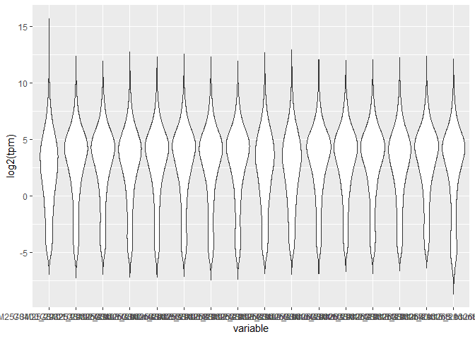

-   [RNA-seq](#rna-seq)
    -   [GEOquery & Bioconductor](#geoquery-bioconductor)
    -   [Loading the data](#loading-the-data)
    -   [Distribution of the size of
        libraries](#distribution-of-the-size-of-libraries)
-   [Normalization](#normalization)
    -   [Calculating gene size](#calculating-gene-size)
    -   [FPKM](#fpkm)
    -   [TPM](#tpm)

RNA-seq
-------

RNA-seq is one of the most popular application to study RNA expression.
The goal for majority of the projects is to quantify the abundance of
all RNA transcripts and determine is there is any patter or any change
in the expression due to a certain factor.

For this exercise we will download a publicly available dataset from
NCBI and load the results that were provided by the author. The
experiment was performed in Gloria Coruzzi’s lab and project was to look
at the response of Nitrogen in Arabidopsis at several time points.

The description of the project can be found
[here](https://www.ncbi.nlm.nih.gov/geo/query/acc.cgi?acc=GSE97500)

And we can download the dataset
[here](https://www.ncbi.nlm.nih.gov/geo/download/?acc=GSE97500&format=file)

The NCBI GEO is a great place to find published datasets. You can browse
the different species that are represented and also search project based
on the platform that was used to perform the quantification.

### GEOquery & Bioconductor

[Bioconductor](http://bioconductor.org) is an excellent place to find R
packages designed for analyzing genomic data. It is a curated set of
packages and there are great tutorials and common workflows. In this
case we will simply use a function in the package that will allow us to
uncompress the files that we need.

``` r
if (!requireNamespace("BiocManager", quietly = TRUE))
    install.packages("BiocManager")

BiocManager::install("GEOquery")
```

    ## Bioconductor version 3.9 (BiocManager 1.30.10), R 3.6.1 (2019-07-05)

    ## Installing package(s) 'GEOquery'

    ## package 'GEOquery' successfully unpacked and MD5 sums checked
    ## 
    ## The downloaded binary packages are in
    ##  C:\Users\mkata\AppData\Local\Temp\Rtmpymssu3\downloaded_packages

    ## Installation path not writeable, unable to update packages: boot, foreign,
    ##   KernSmooth, Matrix, mgcv, nlme, survival

    ## Old packages: 'caTools', 'curl', 'digest', 'gganimate', 'rlang', 'rmarkdown',
    ##   'RSQLite', 'scales', 'selectr', 'tidyverse', 'webshot'

``` r
library(GEOquery)
```

    ## Loading required package: Biobase

    ## Loading required package: BiocGenerics

    ## Loading required package: parallel

    ## 
    ## Attaching package: 'BiocGenerics'

    ## The following objects are masked from 'package:parallel':
    ## 
    ##     clusterApply, clusterApplyLB, clusterCall, clusterEvalQ,
    ##     clusterExport, clusterMap, parApply, parCapply, parLapply,
    ##     parLapplyLB, parRapply, parSapply, parSapplyLB

    ## The following objects are masked from 'package:stats':
    ## 
    ##     IQR, mad, sd, var, xtabs

    ## The following objects are masked from 'package:base':
    ## 
    ##     anyDuplicated, append, as.data.frame, basename, cbind, colnames,
    ##     dirname, do.call, duplicated, eval, evalq, Filter, Find, get, grep,
    ##     grepl, intersect, is.unsorted, lapply, Map, mapply, match, mget,
    ##     order, paste, pmax, pmax.int, pmin, pmin.int, Position, rank,
    ##     rbind, Reduce, rownames, sapply, setdiff, sort, table, tapply,
    ##     union, unique, unsplit, which, which.max, which.min

    ## Welcome to Bioconductor
    ## 
    ##     Vignettes contain introductory material; view with
    ##     'browseVignettes()'. To cite Bioconductor, see
    ##     'citation("Biobase")', and for packages 'citation("pkgname")'.

    ## Setting options('download.file.method.GEOquery'='auto')

    ## Setting options('GEOquery.inmemory.gpl'=FALSE)

### Loading the data

Once you have the file downloaded, put it in your working directory (
where ever you have created your project). If you have a mac or linux
machine, you should be able to simply `untar` the file by double
clicking on it. This may work on windows machines, but if it does not, R
has an `untar()` function.

As long as you see the `GSE97500_RAW.tar` file simply type:

``` r
download.file("https://www.ncbi.nlm.nih.gov/geo/download/?acc=GSE97500&format=file", destfile = "GSE97500_RAW.tar", mode = "wb" )

untar("GSE97500_RAW.tar")
```

Now we will use the `dir()` function to get a full listing of our files
in the directory and then use one of the `apply` functions to gunzip
them all.

``` r
#install.packages("R.utils")
library(R.utils)
```

    ## Loading required package: R.oo

    ## Loading required package: R.methodsS3

    ## R.methodsS3 v1.7.1 (2016-02-15) successfully loaded. See ?R.methodsS3 for help.

    ## R.oo v1.23.0 successfully loaded. See ?R.oo for help.

    ## 
    ## Attaching package: 'R.oo'

    ## The following object is masked from 'package:R.methodsS3':
    ## 
    ##     throw

    ## The following objects are masked from 'package:methods':
    ## 
    ##     getClasses, getMethods

    ## The following objects are masked from 'package:base':
    ## 
    ##     attach, detach, load, save

    ## R.utils v2.9.0 successfully loaded. See ?R.utils for help.

    ## 
    ## Attaching package: 'R.utils'

    ## The following object is masked from 'package:GEOquery':
    ## 
    ##     gunzip

    ## The following object is masked from 'package:utils':
    ## 
    ##     timestamp

    ## The following objects are masked from 'package:base':
    ## 
    ##     cat, commandArgs, getOption, inherits, isOpen, nullfile, parse,
    ##     warnings

``` r
allfiles = dir(pattern = "txt.gz")

sapply(allfiles, gunzip)
```

    ## GSM2570302_LID115124_1.counts.txt.gz GSM2570303_LID115124_2.counts.txt.gz 
    ##  "GSM2570302_LID115124_1.counts.txt"  "GSM2570303_LID115124_2.counts.txt" 
    ## GSM2570304_LID115124_3.counts.txt.gz GSM2570305_LID115125_1.counts.txt.gz 
    ##  "GSM2570304_LID115124_3.counts.txt"  "GSM2570305_LID115125_1.counts.txt" 
    ## GSM2570306_LID115125_2.counts.txt.gz GSM2570307_LID115125_3.counts.txt.gz 
    ##  "GSM2570306_LID115125_2.counts.txt"  "GSM2570307_LID115125_3.counts.txt" 
    ## GSM2570308_LID115125_4.counts.txt.gz GSM2570309_LID115125_5.counts.txt.gz 
    ##  "GSM2570308_LID115125_4.counts.txt"  "GSM2570309_LID115125_5.counts.txt" 
    ## GSM2570310_LID115125_6.counts.txt.gz GSM2570311_LID115125_7.counts.txt.gz 
    ##  "GSM2570310_LID115125_6.counts.txt"  "GSM2570311_LID115125_7.counts.txt" 
    ## GSM2570312_LID115125_8.counts.txt.gz GSM2570313_LID115125_9.counts.txt.gz 
    ##  "GSM2570312_LID115125_8.counts.txt"  "GSM2570313_LID115125_9.counts.txt" 
    ## GSM2570314_LID115126_1.counts.txt.gz GSM2570315_LID115126_2.counts.txt.gz 
    ##  "GSM2570314_LID115126_1.counts.txt"  "GSM2570315_LID115126_2.counts.txt" 
    ## GSM2570316_LID115126_3.counts.txt.gz GSM2570317_LID115126_4.counts.txt.gz 
    ##  "GSM2570316_LID115126_3.counts.txt"  "GSM2570317_LID115126_4.counts.txt" 
    ## GSM2570318_LID115126_5.counts.txt.gz GSM2570319_LID115126_6.counts.txt.gz 
    ##  "GSM2570318_LID115126_5.counts.txt"  "GSM2570319_LID115126_6.counts.txt" 
    ## GSM2570320_LID115126_7.counts.txt.gz GSM2570321_LID115126_8.counts.txt.gz 
    ##  "GSM2570320_LID115126_7.counts.txt"  "GSM2570321_LID115126_8.counts.txt" 
    ## GSM2570322_LID115126_9.counts.txt.gz GSM2570323_LID115127_1.counts.txt.gz 
    ##  "GSM2570322_LID115126_9.counts.txt"  "GSM2570323_LID115127_1.counts.txt" 
    ## GSM2570324_LID115127_2.counts.txt.gz GSM2570325_LID115127_3.counts.txt.gz 
    ##  "GSM2570324_LID115127_2.counts.txt"  "GSM2570325_LID115127_3.counts.txt" 
    ## GSM2570326_LID115127_4.counts.txt.gz GSM2570327_LID115127_5.counts.txt.gz 
    ##  "GSM2570326_LID115127_4.counts.txt"  "GSM2570327_LID115127_5.counts.txt" 
    ## GSM2570328_LID115127_6.counts.txt.gz GSM2570329_LID115127_7.counts.txt.gz 
    ##  "GSM2570328_LID115127_6.counts.txt"  "GSM2570329_LID115127_7.counts.txt" 
    ## GSM2570330_LID115127_8.counts.txt.gz GSM2570331_LID115127_9.counts.txt.gz 
    ##  "GSM2570330_LID115127_8.counts.txt"  "GSM2570331_LID115127_9.counts.txt" 
    ## GSM2570332_LID115128_1.counts.txt.gz GSM2570333_LID115128_2.counts.txt.gz 
    ##  "GSM2570332_LID115128_1.counts.txt"  "GSM2570333_LID115128_2.counts.txt" 
    ## GSM2570334_LID115128_3.counts.txt.gz GSM2570335_LID115128_4.counts.txt.gz 
    ##  "GSM2570334_LID115128_3.counts.txt"  "GSM2570335_LID115128_4.counts.txt" 
    ## GSM2570336_LID115128_5.counts.txt.gz GSM2570337_LID115128_6.counts.txt.gz 
    ##  "GSM2570336_LID115128_5.counts.txt"  "GSM2570337_LID115128_6.counts.txt" 
    ## GSM2570338_LID115128_7.counts.txt.gz GSM2570339_LID115128_8.counts.txt.gz 
    ##  "GSM2570338_LID115128_7.counts.txt"  "GSM2570339_LID115128_8.counts.txt" 
    ## GSM2570340_LID115128_9.counts.txt.gz GSM2570341_LID115129_1.counts.txt.gz 
    ##  "GSM2570340_LID115128_9.counts.txt"  "GSM2570341_LID115129_1.counts.txt" 
    ## GSM2570342_LID115129_2.counts.txt.gz GSM2570343_LID115129_3.counts.txt.gz 
    ##  "GSM2570342_LID115129_2.counts.txt"  "GSM2570343_LID115129_3.counts.txt" 
    ## GSM2570344_LID115129_4.counts.txt.gz GSM2570345_LID115129_5.counts.txt.gz 
    ##  "GSM2570344_LID115129_4.counts.txt"  "GSM2570345_LID115129_5.counts.txt" 
    ## GSM2570346_LID115129_6.counts.txt.gz GSM2570347_LID115129_7.counts.txt.gz 
    ##  "GSM2570346_LID115129_6.counts.txt"  "GSM2570347_LID115129_7.counts.txt" 
    ## GSM2570348_LID115129_8.counts.txt.gz GSM2570349_LID115129_9.counts.txt.gz 
    ##  "GSM2570348_LID115129_8.counts.txt"  "GSM2570349_LID115129_9.counts.txt" 
    ## GSM2570350_LID115130_1.counts.txt.gz GSM2570351_LID115130_2.counts.txt.gz 
    ##  "GSM2570350_LID115130_1.counts.txt"  "GSM2570351_LID115130_2.counts.txt" 
    ## GSM2570352_LID115130_3.counts.txt.gz GSM2570353_LID115130_4.counts.txt.gz 
    ##  "GSM2570352_LID115130_3.counts.txt"  "GSM2570353_LID115130_4.counts.txt" 
    ## GSM2570354_LID115130_5.counts.txt.gz GSM2570355_LID115130_6.counts.txt.gz 
    ##  "GSM2570354_LID115130_5.counts.txt"  "GSM2570355_LID115130_6.counts.txt" 
    ## GSM2570356_LID115130_7.counts.txt.gz GSM2570357_LID115130_8.counts.txt.gz 
    ##  "GSM2570356_LID115130_7.counts.txt"  "GSM2570357_LID115130_8.counts.txt" 
    ## GSM2570358_LID115130_9.counts.txt.gz      GSM2570359_293210.counts.txt.gz 
    ##  "GSM2570358_LID115130_9.counts.txt"       "GSM2570359_293210.counts.txt" 
    ##      GSM2570360_293211.counts.txt.gz      GSM2570361_293212.counts.txt.gz 
    ##       "GSM2570360_293211.counts.txt"       "GSM2570361_293212.counts.txt" 
    ##      GSM2570362_293213.counts.txt.gz      GSM2570363_293214.counts.txt.gz 
    ##       "GSM2570362_293213.counts.txt"       "GSM2570363_293214.counts.txt" 
    ##      GSM2570364_293215.counts.txt.gz      GSM2570365_293216.counts.txt.gz 
    ##       "GSM2570364_293215.counts.txt"       "GSM2570365_293216.counts.txt" 
    ##      GSM2570366_293217.counts.txt.gz      GSM2570367_293218.counts.txt.gz 
    ##       "GSM2570366_293217.counts.txt"       "GSM2570367_293218.counts.txt" 
    ##      GSM2570368_293219.counts.txt.gz      GSM2570369_293220.counts.txt.gz 
    ##       "GSM2570368_293219.counts.txt"       "GSM2570369_293220.counts.txt" 
    ##      GSM2570370_293221.counts.txt.gz      GSM2570371_293222.counts.txt.gz 
    ##       "GSM2570370_293221.counts.txt"       "GSM2570371_293222.counts.txt" 
    ##      GSM2570372_293223.counts.txt.gz      GSM2570373_293224.counts.txt.gz 
    ##       "GSM2570372_293223.counts.txt"       "GSM2570373_293224.counts.txt" 
    ##      GSM2570374_293225.counts.txt.gz      GSM2570375_293226.counts.txt.gz 
    ##       "GSM2570374_293225.counts.txt"       "GSM2570375_293226.counts.txt" 
    ##      GSM2570376_293227.counts.txt.gz      GSM2570377_293228.counts.txt.gz 
    ##       "GSM2570376_293227.counts.txt"       "GSM2570377_293228.counts.txt" 
    ##      GSM2570378_293229.counts.txt.gz      GSM2570379_293230.counts.txt.gz 
    ##       "GSM2570378_293229.counts.txt"       "GSM2570379_293230.counts.txt" 
    ##      GSM2570380_293231.counts.txt.gz      GSM2570381_293232.counts.txt.gz 
    ##       "GSM2570380_293231.counts.txt"       "GSM2570381_293232.counts.txt" 
    ##      GSM2570382_293233.counts.txt.gz      GSM2570383_293234.counts.txt.gz 
    ##       "GSM2570382_293233.counts.txt"       "GSM2570383_293234.counts.txt" 
    ##      GSM2570384_293235.counts.txt.gz      GSM2570385_293236.counts.txt.gz 
    ##       "GSM2570384_293235.counts.txt"       "GSM2570385_293236.counts.txt" 
    ##      GSM2570386_293237.counts.txt.gz      GSM2570387_293238.counts.txt.gz 
    ##       "GSM2570386_293237.counts.txt"       "GSM2570387_293238.counts.txt" 
    ##      GSM2570388_293239.counts.txt.gz      GSM2570389_293240.counts.txt.gz 
    ##       "GSM2570388_293239.counts.txt"       "GSM2570389_293240.counts.txt" 
    ##      GSM2570390_293241.counts.txt.gz      GSM2570391_293242.counts.txt.gz 
    ##       "GSM2570390_293241.counts.txt"       "GSM2570391_293242.counts.txt" 
    ##      GSM2570392_293243.counts.txt.gz      GSM2570393_293244.counts.txt.gz 
    ##       "GSM2570392_293243.counts.txt"       "GSM2570393_293244.counts.txt" 
    ##      GSM2570394_293245.counts.txt.gz      GSM2570395_293246.counts.txt.gz 
    ##       "GSM2570394_293245.counts.txt"       "GSM2570395_293246.counts.txt" 
    ##      GSM2570396_293247.counts.txt.gz      GSM2570397_293248.counts.txt.gz 
    ##       "GSM2570396_293247.counts.txt"       "GSM2570397_293248.counts.txt" 
    ##      GSM2570398_293249.counts.txt.gz      GSM2570399_293250.counts.txt.gz 
    ##       "GSM2570398_293249.counts.txt"       "GSM2570399_293250.counts.txt" 
    ##      GSM2570400_293251.counts.txt.gz      GSM2570401_293252.counts.txt.gz 
    ##       "GSM2570400_293251.counts.txt"       "GSM2570401_293252.counts.txt" 
    ##      GSM2570402_293253.counts.txt.gz      GSM2570403_293254.counts.txt.gz 
    ##       "GSM2570402_293253.counts.txt"       "GSM2570403_293254.counts.txt" 
    ##      GSM2570404_293255.counts.txt.gz      GSM2570405_293256.counts.txt.gz 
    ##       "GSM2570404_293255.counts.txt"       "GSM2570405_293256.counts.txt" 
    ##      GSM2570406_293257.counts.txt.gz      GSM2570407_293258.counts.txt.gz 
    ##       "GSM2570406_293257.counts.txt"       "GSM2570407_293258.counts.txt" 
    ##      GSM2570408_293259.counts.txt.gz      GSM2570409_293260.counts.txt.gz 
    ##       "GSM2570408_293259.counts.txt"       "GSM2570409_293260.counts.txt" 
    ##      GSM2570410_293261.counts.txt.gz      GSM2570411_293262.counts.txt.gz 
    ##       "GSM2570410_293261.counts.txt"       "GSM2570411_293262.counts.txt" 
    ##      GSM2570412_293263.counts.txt.gz      GSM2570413_293264.counts.txt.gz 
    ##       "GSM2570412_293263.counts.txt"       "GSM2570413_293264.counts.txt" 
    ##      GSM2570414_293265.counts.txt.gz      GSM2570415_293266.counts.txt.gz 
    ##       "GSM2570414_293265.counts.txt"       "GSM2570415_293266.counts.txt"

Now we can get a full list of all the new files and use another `apply`
function to load all the files in a list. Luckily all the elements in
the list are the same size so I can easily convert it into a dataframe.

``` r
allfiles2 = dir(pattern = "counts.txt")
lapply(allfiles2, read.table, row.names=1) -> allreads

allreads.df = as.data.frame(allreads)
colnames(allreads.df) = allfiles2
```

### Distribution of the size of libraries

Let’s create a simple data frame so we can use the `ggplot` function to
view the distribution of the library sizes.

``` r
library(tidyverse)
```

    ## -- Attaching packages ------------------------------------------ tidyverse 1.2.1 --

    ## v ggplot2 3.2.1     v purrr   0.3.3
    ## v tibble  2.1.3     v dplyr   0.8.3
    ## v tidyr   1.0.0     v stringr 1.4.0
    ## v readr   1.3.1     v forcats 0.4.0

    ## -- Conflicts --------------------------------------------- tidyverse_conflicts() --
    ## x dplyr::combine()    masks Biobase::combine(), BiocGenerics::combine()
    ## x tidyr::extract()    masks R.utils::extract()
    ## x dplyr::filter()     masks stats::filter()
    ## x dplyr::lag()        masks stats::lag()
    ## x ggplot2::Position() masks BiocGenerics::Position(), base::Position()

``` r
library(reshape2)
```

    ## 
    ## Attaching package: 'reshape2'

    ## The following object is masked from 'package:tidyr':
    ## 
    ##     smiths

``` r
totalReads = data.frame(sample=c("sample"),
                        numReads=colSums(allreads.df))
ggplot(totalReads) + geom_violin(mapping = aes(y=numReads,x=sample))
```


Anything strange?

Let’s look closely at a subset of the data to see the difference in
total reads and the range of values. Because we have lots of samples,
let’s pick the values from column 99:115.

``` r
allreads.df$GeneName = rownames(allreads.df)
allreads.df.melt = melt(allreads.df[,99:115])
```

    ## Using GeneName as id variables

``` r
ggplot(allreads.df.melt) +
  geom_violin(mapping = aes(y=log2(value),
                            x=variable))
```

    ## Warning: Removed 71825 rows containing non-finite values (stat_ydensity).


Normalization
-------------

### Calculating gene size

A GFF file is a common format in which gene annotations are provided. It
contains information about the coordinates of all features such as
exons, genes, 5’UTR, etc. For the purpose of this exercise, we will
consider the size of the gene as if it was the size of the locus.
Normally you should calculate the size of each exon in the gene locus
and add them up because what you really need is the size of the
transcript not the locus.

Download the GFF file [here](Athaliana.sorted.gff)

``` r
# We will use the Genomic Features package to load the GFF annotation
# package in R and use it to retrieve the gene size from the
# GFF file

#BiocManager::install("GenomicFeatures")
library(GenomicFeatures)
```

    ## Loading required package: S4Vectors

    ## Loading required package: stats4

    ## 
    ## Attaching package: 'S4Vectors'

    ## The following objects are masked from 'package:dplyr':
    ## 
    ##     first, rename

    ## The following object is masked from 'package:tidyr':
    ## 
    ##     expand

    ## The following object is masked from 'package:base':
    ## 
    ##     expand.grid

    ## Loading required package: IRanges

    ## 
    ## Attaching package: 'IRanges'

    ## The following objects are masked from 'package:dplyr':
    ## 
    ##     collapse, desc, slice

    ## The following object is masked from 'package:purrr':
    ## 
    ##     reduce

    ## The following object is masked from 'package:R.oo':
    ## 
    ##     trim

    ## The following object is masked from 'package:grDevices':
    ## 
    ##     windows

    ## Loading required package: GenomeInfoDb

    ## Loading required package: GenomicRanges

    ## Loading required package: AnnotationDbi

    ## 
    ## Attaching package: 'AnnotationDbi'

    ## The following object is masked from 'package:dplyr':
    ## 
    ##     select

``` r
genes = makeTxDbFromGFF("Athaliana.sorted.gff")
```

    ## Import genomic features from the file as a GRanges object ...

    ## OK

    ## Prepare the 'metadata' data frame ... OK
    ## Make the TxDb object ...

    ## Warning in .extract_exons_from_GRanges(exon_IDX, gr, mcols0, tx_IDX, feature = "exon", : 6277 exons couldn't be linked to a transcript so were dropped (showing
    ##   only the first 6):
    ##   seqid   start     end strand   ID Name      Parent Parent_type
    ## 1  Chr1  433031  433819      - <NA> <NA> AT1G02228.1        <NA>
    ## 2  Chr1  846664  847739      + <NA> <NA> AT1G03420.1        <NA>
    ## 3  Chr1 2070737 2070893      + <NA> <NA> AT1G06740.1        <NA>
    ## 4  Chr1 2071102 2073535      + <NA> <NA> AT1G06740.1        <NA>
    ## 5  Chr1 2415041 2415970      + <NA> <NA> AT1G07800.1        <NA>
    ## 6  Chr1 2531695 2534786      - <NA> <NA> AT1G08105.1        <NA>

    ## Warning in .extract_exons_from_GRanges(cds_IDX, gr, mcols0, tx_IDX, feature = "cds", : 197160 CDS couldn't be linked to a transcript so were dropped (showing
    ##   only the first 6):
    ##   seqid start  end strand   ID Name              Parent Parent_type
    ## 1  Chr1  3760 3913      + <NA> <NA> AT1G01010.1-Protein        <NA>
    ## 2  Chr1  3996 4276      + <NA> <NA> AT1G01010.1-Protein        <NA>
    ## 3  Chr1  4486 4605      + <NA> <NA> AT1G01010.1-Protein        <NA>
    ## 4  Chr1  4706 5095      + <NA> <NA> AT1G01010.1-Protein        <NA>
    ## 5  Chr1  5174 5326      + <NA> <NA> AT1G01010.1-Protein        <NA>
    ## 6  Chr1  5439 5630      + <NA> <NA> AT1G01010.1-Protein        <NA>

    ## OK

``` r
genesize = transcriptLengths(genes)
head(genesize)
```

    ##   tx_id     tx_name   gene_id nexon tx_len
    ## 1     1 AT1G01010.1 AT1G01010     6   1688
    ## 2     2 AT1G01040.1 AT1G01040    20   6251
    ## 3     3 AT1G01040.2 AT1G01040    20   5877
    ## 4     4 AT1G01046.1 AT1G01046     1    207
    ## 5     5 AT1G01073.1 AT1G01073     1    111
    ## 6     6 AT1G01110.2 AT1G01110     5   1782

Notice that for some genes thare is more than one transcipt isoform.
This is because of the alternate splicing. This is always a challenge
when you don’t know which transcript you would like to use since the
data that was provided to us is related to the locus and not the
transcript.

One solution is to take the .1 version of each gene.

``` r
mainTranscriptindex = grep(".1$", genesize$tx_name)

genesizetranscript = genesize[mainTranscriptindex,]

rownames(genesizetranscript) = genesizetranscript$gene_id
head(genesizetranscript)
```

    ##           tx_id     tx_name   gene_id nexon tx_len
    ## AT1G01010     1 AT1G01010.1 AT1G01010     6   1688
    ## AT1G01040     2 AT1G01040.1 AT1G01040    20   6251
    ## AT1G01046     4 AT1G01046.1 AT1G01046     1    207
    ## AT1G01073     5 AT1G01073.1 AT1G01073     1    111
    ## AT1G01110     7 AT1G01110.1 AT1G01110     3   1439
    ## AT1G01115     8 AT1G01115.1 AT1G01115     1    117

Add the genesize to the dataframe and then melt again.

``` r
allreads.df$GeneSize = genesizetranscript[rownames(allreads.df),"tx_len"]
allreads.df.melt = melt(allreads.df[,99:116],
                        id.vars=c("GeneName","GeneSize"))

head(allreads.df.melt)
```

    ##    GeneName GeneSize                     variable value
    ## 1 AT1G01010     1688 GSM2570400_293251.counts.txt   621
    ## 2 AT1G01020     1623 GSM2570400_293251.counts.txt   131
    ## 3 AT1G01030     1905 GSM2570400_293251.counts.txt    84
    ## 4 AT1G01040     6251 GSM2570400_293251.counts.txt  2429
    ## 5 AT1G01046      207 GSM2570400_293251.counts.txt     0
    ## 6 AT1G01050      976 GSM2570400_293251.counts.txt   170

Now add the total reads as another column.

``` r
allreads.df.melt$LibSize = totalReads[allreads.df.melt$variable,2]
```

### FPKM

Now that we have all the calculations we need, we can add another column
to the dataframe using `mutate()`, a function from tidyverse. It simply
adds columns.

``` r
# FPKM = fragments per kb per million reads
#      = num_gene_reads / ( (GeneSize / 1000) * (LibSize / 1000000) )
#      = num_gene_reads / ((GeneSize * Libsize)) * 1,000,000,000
allreads.fpkm = mutate(allreads.df.melt,
       fpkm = (value/(GeneSize*LibSize))*1000000000
)
head(allreads.fpkm)
```

    ##    GeneName GeneSize                     variable value  LibSize      fpkm
    ## 1 AT1G01010     1688 GSM2570400_293251.counts.txt   621 22955511 16.026260
    ## 2 AT1G01020     1623 GSM2570400_293251.counts.txt   131 22955511  3.516137
    ## 3 AT1G01030     1905 GSM2570400_293251.counts.txt    84 22955511  1.920867
    ## 4 AT1G01040     6251 GSM2570400_293251.counts.txt  2429 22955511 16.927431
    ## 5 AT1G01046      207 GSM2570400_293251.counts.txt     0 22955511  0.000000
    ## 6 AT1G01050      976 GSM2570400_293251.counts.txt   170 22955511  7.587735

``` r
ggplot(allreads.fpkm) + geom_violin(mapping = aes(y=log2(fpkm),x=variable))
```

    ## Warning: Removed 72353 rows containing non-finite values (stat_ydensity).


### TPM

First we need to divide the number of reads by the size of transcript.
We then divide by the sum of all the RPT for each sample and then
multiply by 1000000.

``` r
allreads.fpkm.rpt = mutate(allreads.fpkm,
                           rpt=value/GeneSize)
```

Tidyverse contains a function which works similar to the `apply`
function. The `group_by` function allows you to specify how group your
data. One nice feature is that it can group by multiple columns. Then
you can use the `summarize` function to perform the mathematics.

``` r
# group RPT by sample
group_by_variable = group_by(allreads.fpkm.rpt, variable)

# sum up the RPT per sample (remove NAs) and assign to a new column
summarize(group_by_variable,
          rpt_sum=sum(rpt, na.rm=T)) -> sum_rpt

allreads.fpkm.rpt$sum_rpt = sum_rpt$rpt_sum[allreads.fpkm.rpt$variable]
allreads.fpkm.rpt = mutate(allreads.fpkm.rpt, tpm = (rpt/sum_rpt)*1000000)
```

``` r
ggplot(allreads.fpkm.rpt) +
  geom_violin(mapping = aes(y=log2(tpm),x=variable))
```

    ## Warning: Removed 72353 rows containing non-finite values (stat_ydensity).



Let’s check what the totals are for each column. Note that below I’m
using tidyverse’s method of \``pipeing` one command to the other.

``` r
group_by(allreads.fpkm.rpt, variable) %>% summarize(sum(fpkm, na.rm = T)  )
```

    ## # A tibble: 16 x 2
    ##    variable                     `sum(fpkm, na.rm = T)`
    ##    <fct>                                         <dbl>
    ##  1 GSM2570400_293251.counts.txt                974972.
    ##  2 GSM2570401_293252.counts.txt                658578.
    ##  3 GSM2570402_293253.counts.txt                571022.
    ##  4 GSM2570403_293254.counts.txt               1951018.
    ##  5 GSM2570404_293255.counts.txt               1786134.
    ##  6 GSM2570405_293256.counts.txt               4362285.
    ##  7 GSM2570406_293257.counts.txt               1946590.
    ##  8 GSM2570407_293258.counts.txt               2305102.
    ##  9 GSM2570408_293259.counts.txt               1502156.
    ## 10 GSM2570409_293260.counts.txt               1202461.
    ## 11 GSM2570410_293261.counts.txt               1126262.
    ## 12 GSM2570411_293262.counts.txt               1079381.
    ## 13 GSM2570412_293263.counts.txt               1455750.
    ## 14 GSM2570413_293264.counts.txt               1384852.
    ## 15 GSM2570414_293265.counts.txt               1421170.
    ## 16 GSM2570415_293266.counts.txt               3897999.

``` r
group_by(allreads.fpkm.rpt, variable) %>% summarize(sum(tpm, na.rm = T)  )
```

    ## # A tibble: 16 x 2
    ##    variable                     `sum(tpm, na.rm = T)`
    ##    <fct>                                        <dbl>
    ##  1 GSM2570400_293251.counts.txt              1000000 
    ##  2 GSM2570401_293252.counts.txt              1000000 
    ##  3 GSM2570402_293253.counts.txt              1000000 
    ##  4 GSM2570403_293254.counts.txt              1000000.
    ##  5 GSM2570404_293255.counts.txt              1000000 
    ##  6 GSM2570405_293256.counts.txt              1000000.
    ##  7 GSM2570406_293257.counts.txt              1000000 
    ##  8 GSM2570407_293258.counts.txt              1000000 
    ##  9 GSM2570408_293259.counts.txt              1000000.
    ## 10 GSM2570409_293260.counts.txt              1000000.
    ## 11 GSM2570410_293261.counts.txt              1000000 
    ## 12 GSM2570411_293262.counts.txt              1000000 
    ## 13 GSM2570412_293263.counts.txt              1000000 
    ## 14 GSM2570413_293264.counts.txt              1000000 
    ## 15 GSM2570414_293265.counts.txt              1000000 
    ## 16 GSM2570415_293266.counts.txt              1000000
