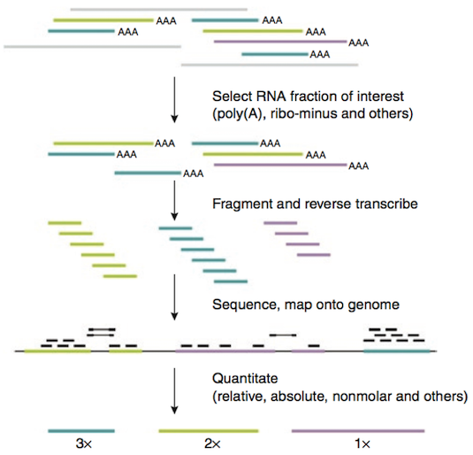

```{r setup, include=FALSE}
knitr::opts_chunk$set(echo = TRUE)
```

# Measuring gene expression by RNA-seq

## RNA-seq workflow

RNA-seq has become the standard method for measure gene expression. Figure 1 gives an overview of the RNA-seq pipeline.



A recent review on RNA-seq analysis may be found here:
https://www.ncbi.nlm.nih.gov/pmc/articles/PMC4728800/

To measure the expression of each gene, we need to take into account several factors, such as:

+ **Length of each mRNA** -- longer cDNAs will have more reads for the same level of expression as shorter cDNAs
+ **Amount of data from the sequencing run** -- libraries that differ in the total number of reads will show a different number of reads for the same gene, even if the gene is expressed at the same level

The importance of these factors depends on the application. For example, when we want to compare *relative* gene expression between genes *within a sample*, we don't care so much about the library size, but we do need to account for the differing lengths of mRNAs. On the other hand, when we want to compare gene expression *between samples*, we care more about the size of the libraries (total number of reads).

We can account for these considerations by *normalizing* the data. Different methods of normalization are introduced below.

## Characteristics of RNA-seq data

#### Extremely high dimensionality
* Experiment = (gene_1, gene_2, …, gene_N)
* Gene = (experiment_1, experiment_2, …, experiment_M)
* N is often on the order of 10^4
* M is often on the order of 10^1

#### Noisy or missing data

* Very lowly expressed genes are detected less reproducibly
* Especially relevant to limited sample sizes, e.g. single cell analysis


**It is generally agreed that increasing the number of biological replicates in your experimental design will improve your results more than increasing sequencing depth.**


## RPKM, FPKM, or TPM?

You will find several measures used to quantify gene expression based on RNA-seq read counts. These are:

* CPM -- (raw) read counts per million
* RPKM -- reads per kilobase million (Mortazavi, for single-end reads)
* FPKM -- fragments per kilobase million (for paired-end reads)
* TPM -- transcripts per million (gives more consistent proportional values)

These days, you will often see expression measured as TPM, but many older studies used RPKM or FPKM. These are all calculated in a vary similar way, but with some subtle differences. They all do the following:

* normalize for total read depth in each sample (in millions of reads)
* normalize for the length of each gene (in kilobases)

The main difference between TPM and RPKM/FPKM is the order in which normalization occurs. TPM is calculated very simply as follows:

* Count the total reads per gene, and divide by the length of the gene (in kb). This gives the number of reads per kilobase (RPK).
* Sum all the RPK values in a sample to get the total RPK and divide by one million (10^6) to get the "per million" scaling factor.
* Now, divide each RPK by the "per million" number.

TPM and FPKM give a similar result, but by reversing the order of operations, TPM gives a more consistent measure of the *proportion* of normalize reads in the entire sample that was measured for each gene. This is because *for TPM the sum of all reads in each sample is the same*. For FPKM, values for gene expression can be compared within samples, but not as well between samples. TPM also makes it easier to compare gene expression when transcript length differs between samples due to alternative splicing.

There is a decent video you can watch that illustrates the difference between RPKM/FPKM and TPM here:
http://www.rna-seqblog.com/rpkm-fpkm-and-tpm-clearly-explained/

### Assumptions and caveats

* RPKM/FPKM assumes that the *total number of nucleotides* expressed is constant.
* TPM assumes that the *total molar quantity of transcripts* is constant.

While the above assumptions are certainly reasonable for comparing replicates, they may not hold across samples. For example, in yeast it has been shown -- perhaps not surprisingly -- that the total amount of RNA in a cell changes based on environmental conditions and growth state.

In addition, these measures can only indicate *relative* differences in expression. If the difference between two sets of genes increases, it's not easy to tell if one set went up or the other went down, based on these measures alone.

### Normalization for DGE analysis

*Because of these shortcomings, none of these methods are adequate to evaluate differential gene expression (DGE or DE) without further **between-sample normalization** to make expression levels comparable among different samples.*

**The main point is this: you should be aware that different methods can make a big difference in the outcome of your analysis, and that different software packages such as limma and DESeq2 implement different normalization methods.**

To facilitate comparisons between samples, it is possible to use an independent way to assess changes in expression, such as spike-ins of known transcripts of known sequence, size, and molar concentration. An external standard for RNA-seq was introduced a few years ago by the External RNA Controls Consortium (ERCC) hosted by the National Institutes of Standards (NIST), and these are now sold commerically. The **ERCC spike-in set** includes 92 transcripts ranging from 250nt - 2000nt in length whose concentrations span several orders of magnitude. The sequences of the transcripts have been chosen such that they should be easily distinguishable from any endogenous transcripts in most common applications.

Currently, not everyone agrees on the best normalization methods. A lot of different statistical models have been proposed to deal with normalization for DGE analysis. Other approaches are based on the idea that most genes are not differentially expressed. These include the **median ratio method** (Anders and Huber, 2010) and **TMM (trimmed mean of M values)** (Robinson and Oshlack, 2010). A number of methods use the *negative binomial* distribution to model read count data.


# Additional Resources

## Review of RNA-seq analysis, including normalization
https://www.ncbi.nlm.nih.gov/pmc/articles/PMC4728800/

## RPKM/FPKM vs TPM
http://www.rna-seqblog.com/rpkm-fpkm-and-tpm-clearly-explained/
